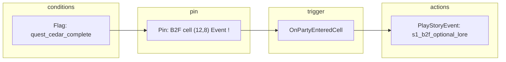

# ADR 031 — Floor Event & Pin Condition Graph (Graph Toolkit)

**Status:** Proposed (idea — does not block MVP1)  
**Date:** 2026-05-28  
**Follows:** [ADR 002](002-mapping-model.md) (floor painter / `ExplorationFloor`) · [ADR 028](028-story-visual-novel-events.md) · [ADR 030](030-story-event-graph-authoring.md)  
**Tracks:** [game #109](https://github.com/miramocha/griddungeon-game/issues/109) (Event cells `!` + `storyEventId` on floor assets)

## Context

Exploration content is authored as **grid pins** — story **Event** cells (`!`), role markers (`E` / `M` / `^` / `v`), gather (`G`), chests (`C`), FOE spawns, and similar features on `ExplorationFloor` ([floor level painter](../docs/02-systems/floor-level-painter.md)). **When** a pin exists on the map, **whether** the player can interact with it, and **what** runs on trigger should often depend on **campaign progress** — for example:

- A lore `!` cell does not appear (or does not fire) until a hub quest is turned in.
- A shortcut door stays blocked until a key item flag is set.
- A repeat gather node stays depleted after first use (idempotent flag).

**MVP1 today:** triggers are wired in C# phase controllers (`ExplorationPhaseController` → `StoryEventRunner.Play(storyEventId)` on hard-coded cells) while floor layout lives in assets ([#109](https://github.com/miramocha/griddungeon-game/issues/109) will move Event metadata onto `ExplorationFloor`).

**Design need:** designers and narrative should express **“this pin / event only when …”** without a programmer edit per beat, and without fragile duplicated flag checks scattered across controllers.

[ADR 030](030-story-event-graph-authoring.md) covers **inside** a single `storyEventId` (VN lines, choices, `gotoStep`). This ADR covers **floor-level placement and gating** — which cell, which save state, which handler fires — not dialogue step order.

## Candidate tooling — Unity Graph Toolkit

[Unity Graph Toolkit](https://docs.unity3d.com/Packages/com.unity.graphtoolkit@0.4/manual/introduction.html) (`com.unity.graphtoolkit`, **0.4 experimental**) is an **Editor** framework for node-based tools (UI Toolkit canvas, wires, blackboard, subgraphs, compile hooks). It explicitly does **not** ship a player runtime graph executor or in-game graph UI — which matches our existing rule: **graphs are authoring-only; builds consume compiled data** ([ADR 028](028-story-visual-novel-events.md), [ADR 030](030-story-event-graph-authoring.md)).

Relevant Graph Toolkit properties for Grid Dungeon:

| Graph Toolkit provides | How we would use it |
|------------------------|---------------------|
| Editor graph UI + standard manipulators | **Floor event graph** per floor or stratum — designers place logic without custom GraphView boilerplate |
| Blackboard variables | Bind **campaign flag ids** / quest ids for condition nodes (authoring labels, not live save mutation in Editor) |
| Compile to runtime model | Editor pipeline → `ExplorationFloor` event rows + Core `FloorEventRule` DTOs |
| Subgraphs | Reuse “quest complete?” / “Act 3?” condition clusters across floors |

Unity’s **Visual Novel Director** sample (bundled with Graph Toolkit) demonstrates **graph → compiled runtime model** — analogous to our `StoryEventRunner` consuming compiled steps, not the graph asset.

**ADR 030 note:** that ADR names a custom **GraphView** window as the v1 story-event editor target. If we adopt Graph Toolkit for floor events, we should **evaluate one shared Graph Toolkit shell** for both floor gating graphs and story step graphs before building two separate graph UIs.

##### Warning

Graph Toolkit is **experimental** — not verified for production. Treat package pin and API churn as risk; MVP1 shipping path stays **hand-authored assets + C# triggers** ([#109](https://github.com/miramocha/griddungeon-game/issues/109), [#87](https://github.com/miramocha/griddungeon-game/issues/87)).

## Decision (proposed)

### 1. Two layers: placement vs orchestration

| Layer | Question | Authoring | Runtime owner |
|-------|----------|-----------|----------------|
| **Layout** | Where on the grid? | Floor painter grid char / pin (`!`, `G`, …) → `ExplorationFloor` tiles & coords ([#107](https://github.com/miramocha/griddungeon-game/issues/107)) | `DungeonExplorer` walkability; map auto-reveal |
| **Rules** | When visible / interactable / what fires? | **Floor event graph** (Graph Toolkit) → **compiled** rules on floor asset | **Core** `FloorEventEvaluator` + Runtime `ExplorationPhaseController` dispatch |

**Rule:** No graph interpreter in player builds. Compiled output is versioned in `Assets/Content/Floors/` (and tests use the same DTOs).

### 2. Example graph semantics (target)



| Node kind (draft) | Role |
|-------------------|------|
| **Pin** | Binds `(floorId, x, y, level)` + feature kind (`Event`, `Gather`, …) |
| **Condition** | `campaign_flag`, `quest_state`, `all` / `any` — evaluates against `CampaignSaveData` |
| **Visibility** | `hidden` / `visible` / `interactable` — controls map marker + collision override if needed |
| **Trigger** | `OnPartyEnteredCell`, `OnInteract`, `OnFOEContact` (delegate to existing systems) |
| **Action** | `PlayStoryEvent`, `StartCombat`, `SetCampaignFlag`, `OpenDoor`, `GrantItem` (thin wrappers over existing effect APIs) |

**Default edge:** condition must pass for downstream pin/trigger to run. Unconditional pins omit the Condition node.

**Compile validation:** unreachable nodes, pins with no trigger, actions without required ids (`storyEventId`, `encounterGroupId`), missing default branch on multi-way conditions.

### 3. Runtime evaluation (proposed)

```
ExplorationPhaseController (party moved / interact)
  → FloorEventEvaluator.Evaluate(floorId, cell, triggerKind, CampaignSaveData)
  → 0..N compiled rules match
  → dispatch Action (StoryEventRunner, GameState.RequestCombat, …)
```

| Concern | Owner |
|---------|--------|
| Flag / quest truth | **Core** — testable, no `UnityEngine` |
| “Should this pin show on map?” | **Core** — same evaluator or shared predicate helper |
| Presentation lock | **Runtime** — unchanged [ADR 028](028-story-visual-novel-events.md) story lock |

**Rejected**

| Option | Why |
|--------|-----|
| Graph Toolkit (or UVS) **runtime** graph execution | Untestable, hard to diff, conflicts with [ADR 017](017-game-phase-controller.md) C# authority |
| **Parallel pin store** outside grid | Already rejected ([#107](https://github.com/miramocha/griddungeon-game/issues/107)) — grid + `ExplorationFloor` remain source of truth for *where* |
| Quest logic only in Exploration C# | Does not scale; duplicates [story-events](../docs/02-systems/story-events.md) flag patterns |

### 4. Relationship to story VN graphs ([ADR 030](030-story-event-graph-authoring.md))

| | **ADR 030 — Story event graph** | **ADR 031 — Floor event graph** | **ADR 040 — Exit topology graph** |
|--|--------------------------------|----------------------------------|-----------------------------------|
| **Scope** | Steps inside one `storyEventId` | Which floor cell + when + which handler | Which cells are exits + destination floor / hub |
| **Runtime consumer** | `StoryEventRunner` (step list) | `FloorEventEvaluator` + phase controllers | `FloorExitResolver` + `ExplorationPhaseController` |
| **Typical branch** | Player choice, line order | Quest / flag gating, pin visibility | Up/down pairing, hub return, side-dungeon exit |
| **Editor** | Graph Toolkit or GraphView (TBD) | Graph Toolkit (ADR 031) | Graph Toolkit stratum topology (ADR 040) |
| **Gating on compiled row** | N/A (story steps) | Yes — conditions on rules | **No** — routing only |

A single **PlayStoryEvent** action node links the two: floor graph decides *when*; story graph (or linear YAML) decides *what lines play*.

### 5. Milestones

| Phase | Deliverable |
|-------|-------------|
| **MVP1 ([#109](https://github.com/miramocha/griddungeon-game/issues/109))** | Event cells + `storyEventId` on `ExplorationFloor`; **static** pins; C# triggers for S1 beats |
| **Post-MVP1 — data** | `FloorEventRule` schema + `FloorEventEvaluator` in Core; hand-authored rules on floor assets (no graph UI yet) |
| **Post-MVP1 — editor** | Graph Toolkit project + compile to floor rules; migrate S1 optional / gated beats off hard-coded cells |
| **Later** | Shared Graph Toolkit shell with [ADR 030](030-story-event-graph-authoring.md); subgraph library for common S1/S2 conditions |

## Consequences

- **Floor painter:** continues to own **where** pins sit on the grid; graph owns **when/what** unless a simple rule is inlined on the pin row for trivial cases (e.g. one flag) — avoid two authoring truths for the same condition.
- **Content pipeline:** CI can validate compiled rules + `layout_grid_check.py` walkability independently.
- **Tests:** Edit Mode fixtures feed **compiled** `FloorEventRule` lists, not graph assets ([ticket-test-documentation](../.cursor/rules/ticket-test-documentation.mdc)).
- **Tech stack:** when Graph Toolkit graduates from experimental, add package pin to [ADR 012](012-unity-6-stack.md) — until then, optional dev dependency only.

## Open questions

1. **Graph granularity** — one graph asset per `ExplorationFloor` vs one campaign graph with floor subgraphs.
2. **Visibility vs removal** — gated pins: omit from map entirely vs show “?” / blocked icon (EO-style unreached content).
3. **Quest model** — reuse `CampaignSaveData` flags only vs introduce `QuestState` rows referenced by condition nodes.
4. **Editor unification** — single Graph Toolkit app with two node palettes (floor vs story) vs two packages/windows.
5. **Package maturity** — minimum Graph Toolkit version and fallback if API breaks mid-arc.

## Related

- [Unity Graph Toolkit — Introduction](https://docs.unity3d.com/Packages/com.unity.graphtoolkit@0.4/manual/introduction.html)
- [ADR 030 — Story event graph authoring](030-story-event-graph-authoring.md)
- [ADR 040 — Floor exit topology graph](040-floor-exit-topology-graph.md) (exit routing — orthogonal)
- [ADR 028 — Story events (VN)](028-story-visual-novel-events.md)
- [Floor level painter](../docs/02-systems/floor-level-painter.md)
- [Story events](../docs/02-systems/story-events.md)
- [Game #109 — Floor event cells epic](https://github.com/miramocha/griddungeon-game/issues/109)
