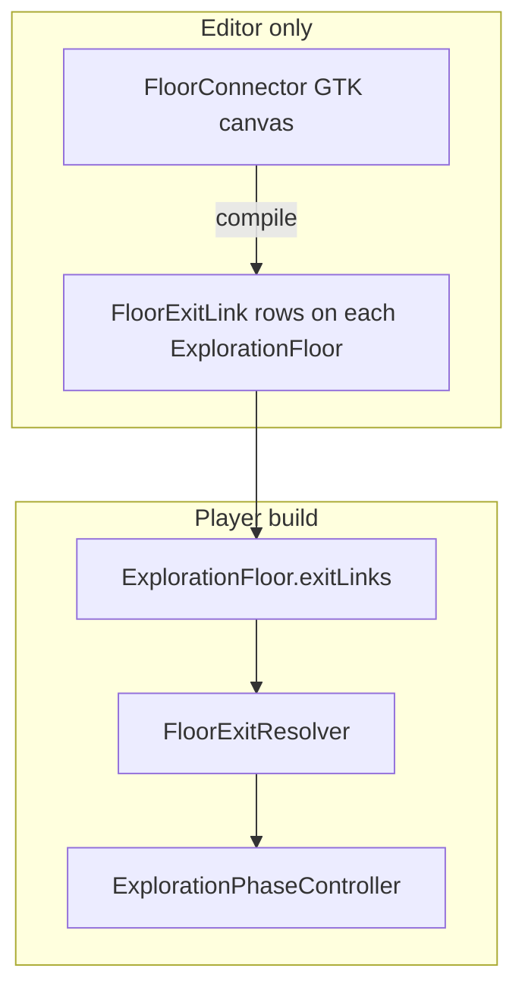

# ADR 040 — Floor exit topology graph (multi-exit floors)

**Status:** Proposed  
**Date:** 2026-06-13  
**Tracks:** [design-docs #35](https://github.com/miramocha/griddungeon-design-docs/issues/35) · [game #249](https://github.com/miramocha/griddungeon-game/issues/249) (epic) · [#250](https://github.com/miramocha/griddungeon-game/issues/250) (data model) · [#252](https://github.com/miramocha/griddungeon-game/issues/252) (painter) · [#253](https://github.com/miramocha/griddungeon-game/issues/253) (Graph Toolkit editor)  
**Follows:** [ADR 002](002-mapping-model.md) (floor painter / `ExplorationFloor`) · [ADR 025](025-campaign-exploration-target.md) (campaign policy) · [ADR 022](022-side-dungeons-mvp3.md) (side dungeons)  
**Orthogonal:** [ADR 031](031-floor-event-pin-condition-graph.md) (floor event / pin **gating** — not exit routing)

> **Numbering note:** Issue #35 originally scoped “ADR 038” before [ADR 038 — Centralized UI presentation lifecycle](038-centralized-ui-presentation-lifecycle.md) shipped. Floor exit topology is **ADR 040**.

## Context

at launch `ExplorationFloor` stores **scalar** `stairsUp` / `stairsDown` plus a small `StairsUpLink[]` sketch for gate vs same-stratum up targets ([05 — Class design](../docs/05-class-design.md#content-definitions-runtime-scriptableobjects)). Runtime stair routing is split between **serialized coords** and **`S1CampaignResolver`** switches (`TargetForStairsUp`, `TargetForStairsDown`, `CanDescendStairs`, `CanAscendToHub`).

**Problems:**

| Issue | Why it blocks scale |
|-------|---------------------|
| One down / many up links as separate fields | Side branches, optional returns, multi-gate floors need **N exits per floor** |
| Destinations in campaign resolver | S2+ strata and side dungeons duplicate pairing logic; tests entangle story policy with topology |
| Painter scans one `^` / one `v` | Cannot author multiple exits on one grid without ad-hoc fields |
| Tutorial stair blocks in resolver | Gating belongs in campaign / floor-event layers — not in “where does this cell go?” |

**Design need:** one **compiled exit table** per floor — **where** each interactable exit goes — with optional **Graph Toolkit** stratum topology authoring (editor-only; **no runtime graph**).

[ADR 031](031-floor-event-pin-condition-graph.md) covers **when** pins and events fire (quest / flag gating). This ADR covers **which cell is an exit** and **which floor or hub it loads** — no gating fields on links.

## Decision (proposed)

### 1. Replace scalar stairs with `FloorExitLink[]`

Remove from `ExplorationFloor`:

- `stairsUp` / `stairsDown` scalars
- `StairsUpLink[]` / `StairsUpTargetKind`

Add:

```csharp
FloorExitLink[] exitLinks;   // 0..N per floor; authoritative routing
```

| Field | Type | Role |
|-------|------|------|
| `exitId` | `string` | Stable authoring id (graph node / painter row); unique within floor asset |
| `cell` | `GridPosition` | Interact cell (`^` / `v` marker or authored exit tile) |
| `direction` | `FloorExitDirection` | `Up` (`^`) or `Down` (`v`) — map icon + interact filter |
| `targetKind` | `FloorExitTargetKind` | `Hub` or `Floor` |
| `targetFloorKey` | `string` | Composite key when `Floor` — e.g. `s1_B2F`, `sd01_F1`; empty when `Hub` |
| `targetSpawnCell` | `GridPosition` | Party spawn on destination floor after transition |
| `targetFacing` | `FacingDirection` | Spawn facing on destination |

**Rule:** **No gating fields** on `FloorExitLink`. Visibility, tutorial blocks, and quest locks stay in campaign policy ([ADR 025](025-campaign-exploration-target.md)), floor-event rules ([ADR 031](031-floor-event-pin-condition-graph.md)), or walkability / blocker tiles — not on the link row.

**Launch parity:** S1 B1F/B2F/B3F compile to the same behaviour as today — typically one `Down` and one or more `Up` links per floor — but data is **`exitLinks[]`** ([#250](https://github.com/miramocha/griddungeon-game/issues/250)).

### 2. Runtime resolution (Core + Runtime)

| Piece | Owner | Role |
|-------|-------|------|
| `FloorExitResolver` | **Core** | `TryGetExitAt(floorKey, cell, direction?, …)` → link; `ToExplorationTarget(link)` → neutral spawn DTO |
| `ExplorationPhaseController` | **Runtime** | On interact at party cell: lookup link → `TryChangeFloor` / `TryReturnToHub` |
| Map stairs markers | **Runtime** | Iterate `exitLinks` — not scalar `stairsUp` / `stairsDown` |
| Campaign resolver | **Core** | **Hub entry** spawn, walkability overrides, encounter policy — **not** per-stair destination tables |

**Rejected:** keeping `TargetForStairsUp` / `TargetForStairsDown` in `S1CampaignResolver` once links ship — destinations live on compiled links; resolver shrinks to policy only ([ADR 025](025-campaign-exploration-target.md)).

### 3. Floor Connector (Graph Toolkit — editor-only)

Author **inter-floor connectivity** in a **Floor Connector** per `locationId` (Unity Graph Toolkit, experimental — same package evaluation as [ADR 031](031-floor-event-pin-condition-graph.md)). **GTK node wiring, ports, and S1 canvas layout:** [ADR 041](041-floor-connector-toolkit-wiring.md).



| Graph Toolkit provides | How we use it |
|------------------------|---------------|
| Floor nodes (`s1_B1F`, `s1_B2F`, …) | One node per `ExplorationFloor` in a stratum (or side `locationId`) |
| Exit edge (`^` / `v`, `exitId`) | Binds source cell + direction → target floor key + spawn cell + facing |
| Compile hook | Writes / validates `exitLinks[]` on floor assets; CI diff-friendly |
| Subgraphs | Reuse “hub return gate” pattern across strata |

**Rule:** **No graph interpreter in player builds.** Compiled `exitLinks[]` on `Assets/Content/Floors/` (and side-dungeon assets) is the runtime authority — same pattern as [ADR 031](031-floor-event-pin-condition-graph.md) floor-event compile and [ADR 030](030-story-event-graph-authoring.md) story steps.

**launch path:** hand migration + floor painter multi-marker export ([#250](https://github.com/miramocha/griddungeon-game/issues/250), [#252](https://github.com/miramocha/griddungeon-game/issues/252)) **without** requiring the graph UI. Graph editor ([#253](https://github.com/miramocha/griddungeon-game/issues/253)) follows once the link schema is stable.

### 4. Floor painter integration

| Layer | Authority |
|-------|-----------|
| **Grid `^` / `v`** | One marker char per exit cell; **multiple** per floor allowed |
| **Painter Apply** | Scan markers → provisional `FloorExitLink` rows (`exitId` from cell + direction or graph id) |
| **Topology graph compile** | May **fill targets** (`targetFloorKey`, spawn) when painter only placed cells — avoids duplicating pairing in C# |
| **Anti-pattern** | Parallel exit coord store outside grid + links — grid marker or graph node must match serialized `cell` |

When gate and hub stairs share a cell (canonical S1 B1F), one `^` at `(10, 11)` → one `Up` link with `targetKind = Hub`.

See [floor level painter](../docs/02-systems/floor-level-painter.md#multi-exit-markers-and-topology-graph).

### 5. Campaign policy vs exit links ([ADR 025](025-campaign-exploration-target.md))

| Concern | Owner |
|---------|--------|
| Hub → exploration spawn (intro vs gate vs warp) | Per-stratum **campaign policy** (`S1CampaignResolver`, future `S2+`) |
| Stairs / exit **destination** | **`FloorExitLink`** on source floor |
| Within-stratum pairing (B2F `v` → B3F, B3F `^` → B2F) | Compiled links (graph or painter), not resolver `switch (floorId)` |
| B1F gate `^` → hub | Link with `targetKind = Hub` |
| Tutorial “cannot descend yet” | **Remove** from stair resolver ([#251](https://github.com/miramocha/griddungeon-game/issues/251)); optional future **floor-event** or walkability gate — **not** a field on `FloorExitLink` |

### 6. Side dungeons ([ADR 022](022-side-dungeons-mvp3.md))

Side locations (`sd01_F1`, …) use the **same** `FloorExitLink[]` shape on floor assets tagged via `ExplorationMapKind.SideDungeon`:

| Rule | Value |
|------|--------|
| `Up` exits to surface | `targetKind = Hub` only — no inter-stratum targets |
| Within location | `Down` / `Up` links reference `targetFloorKey` with same `locationId` prefix |
| `stratumId` on asset | Empty or sentinel; `locationId` authoritative |

See [side dungeons](../docs/02-systems/side-dungeons.md#authoring-mvp3).

## Milestones

| Phase | Deliverable |
|-------|-------------|
| **This ADR + class design** | Locked link schema; docs cross-links ([#35](https://github.com/miramocha/griddungeon-design-docs/issues/35)) |
| **A — Data + runtime** ([#250](https://github.com/miramocha/griddungeon-game/issues/250)) | `FloorExitLink`, `FloorExitResolver`, migrate S1 assets, gut resolver stair routing |
| **B — Ungate** ([#251](https://github.com/miramocha/griddungeon-game/issues/251)) | Remove S1 stair / Protocol tutorial blocks (orthogonal to link shape) |
| **C — Painter** ([#252](https://github.com/miramocha/griddungeon-game/issues/252)) | Multi `^` / `v` markers → `exitLinks[]` on Apply |
| **D — Graph editor** ([#253](https://github.com/miramocha/griddungeon-game/issues/253)) | Graph Toolkit Floor Connector → compile / validate links ([ADR 041](041-floor-connector-toolkit-wiring.md)) |

## Consequences

- **Tests:** Edit Mode uses compiled `FloorExitLink[]` fixtures — not graph assets ([ticket-test-documentation](../.cursor/rules/ticket-test-documentation.mdc)).
- **Content pipeline:** `layout_grid_check.py` / painter validate walkability to exit cells; topology compile validates **paired** spawn cells exist on targets.
- **Floor transition:** [`TryChangeFloor` / `TryReturnToHub`](../docs/02-systems/floor-transition.md) unchanged triggers — only lookup path changes.
- **Map HUD:** stairs + hub-entrance markers iterate links ([mapping](../docs/02-systems/mapping.md)).
- **Save / resume:** `ExplorationTarget` still neutral DTO ([ADR 025](025-campaign-exploration-target.md)); active floor + cell from save, not link id.

## Rejected

| Option | Why |
|--------|-----|
| Runtime Graph Toolkit / graph executor | Untestable; conflicts with C# authority ([ADR 017](017-game-phase-controller.md)) |
| Gating fields on `FloorExitLink` | Duplicates [ADR 031](031-floor-event-pin-condition-graph.md); couples routing to quest state |
| Keep scalar `stairsDown` alongside links | Two truths; blocks multi-down floors |
| Resolver-owned stair destination tables | Does not scale to S2+ / side dungeons |

## Open questions

1. ~~Bidirectional compile~~ — resolved in [ADR 041](041-floor-connector-toolkit-wiring.md) (optional toggle).
2. ~~exitId convention~~ — resolved in [ADR 041](041-floor-connector-toolkit-wiring.md) (`ExitEdge` string id).
3. ~~Graph granularity~~ — resolved in [ADR 041](041-floor-connector-toolkit-wiring.md) (one `FloorConnector` per `locationId`).
4. ~~Painter vs graph authority~~ — resolved in [ADR 041](041-floor-connector-toolkit-wiring.md) (Compile replaces full `exitLinks[]`).
5. **Package maturity** — minimum Graph Toolkit pin `0.4.0-exp.2`; fallback hand-authored links ([#253](https://github.com/miramocha/griddungeon-game/issues/253) optional).

## Related

- [ADR 025 — Campaign exploration target](025-campaign-exploration-target.md)
- [ADR 031 — Floor event & pin condition graph](031-floor-event-pin-condition-graph.md)
- [ADR 022 — Side dungeons MVP3](022-side-dungeons-mvp3.md)
- [Floor level painter](../docs/02-systems/floor-level-painter.md)
- [Side dungeons](../docs/02-systems/side-dungeons.md)
- [05 — Class design — Floors & stratum](../docs/05-class-design.md#content-definitions-runtime-scriptableobjects)
- [ADR 041 — Floor Connector (Graph Toolkit wiring)](041-floor-connector-toolkit-wiring.md)
- [Unity Graph Toolkit — Introduction](https://docs.unity3d.com/Packages/com.unity.graphtoolkit@0.4/manual/introduction.html)
