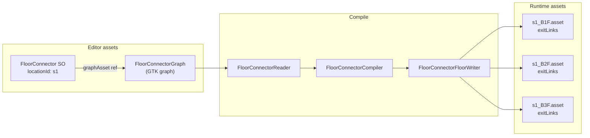
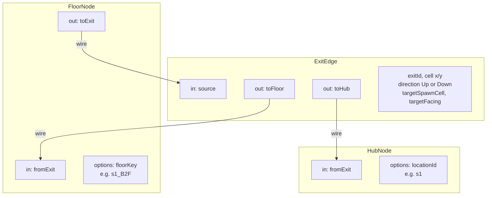
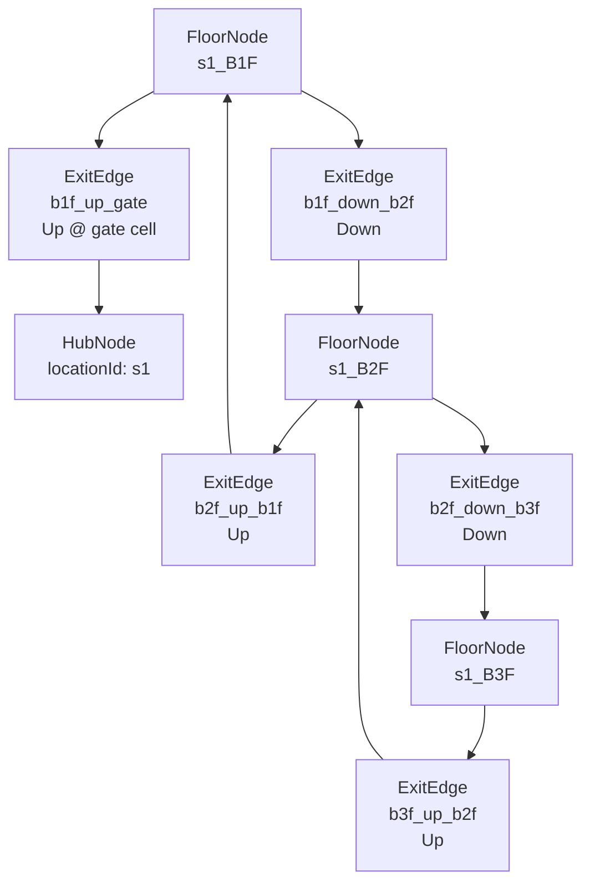
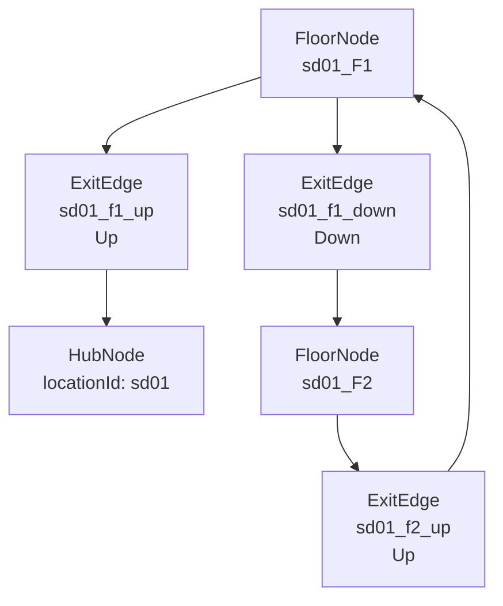
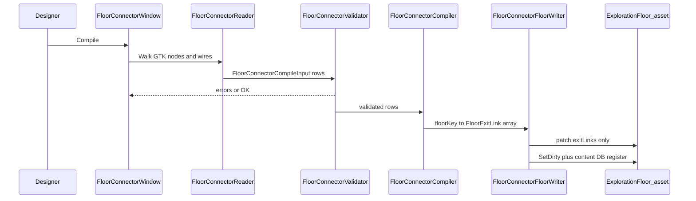
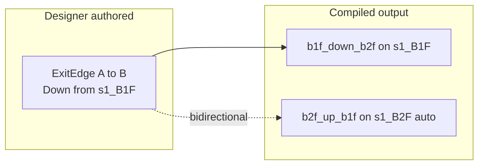

# ADR 041 — Floor Connector (Graph Toolkit wiring)

**Status:** Proposed  
**Date:** 2026-06-14  
**Tracks:** [game #253](https://github.com/miramocha/griddungeon-game/issues/253) (Graph Toolkit editor)  
**Follows:** [ADR 040](040-floor-exit-topology-graph.md) (`FloorExitLink[]` schema, compile-to-assets rule) · [ADR 022](022-side-dungeons-mvp3.md) (side `locationId` floors)  
**Package pin:** `com.unity.graphtoolkit@0.4.0-exp.2` (experimental — editor-only assembly `GridDungeon.GraphToolkit.Editor`)

> **Naming:** Issue #253 originally used `StratumTopologyGraph`. Implementation uses **`FloorConnector`** scoped by **`locationId`** (`s1`, `sd01`, …) — not stratum-only. “Topology” stays in [ADR 040](040-floor-exit-topology-graph.md) title as the data-model decision; this ADR is the **GTK canvas wiring** spec.

## Context

[ADR 040](040-floor-exit-topology-graph.md) locks **`FloorExitLink[]`** as runtime authority and defers the Graph Toolkit editor to [#253](https://github.com/miramocha/griddungeon-game/issues/253). Designers need a visual map of **how floor nodes, exit edges, and hub nodes connect** on the GTK canvas and what **Compile** emits.

**Rule (unchanged):** no graph interpreter in player builds. GTK assets are authoring-only; `ExplorationFloor.exitLinks[]` on `Assets/Content/Floors/` is what ships.

## Decision (proposed)

### 1. Two assets per location

| Asset | Type | Role |
|-------|------|------|
| **`FloorConnector`** | `ScriptableObject` wrapper | `locationId`, reference to GTK graph, compile options (e.g. bidirectional) |
| **`FloorConnectorGraph`** | Graph Toolkit `[Graph]` asset | Canvas: `FloorNode`, `ExitEdge`, `HubNode` + wires |

**Content layout:**

```
Assets/Content/FloorConnectors/s1.asset          ← FloorConnector (locationId = s1)
Assets/Content/FloorConnectors/s1.graph.asset    ← FloorConnectorGraph (GTK sub-asset or linked file)
```

One **`FloorConnector` per `locationId`** — stratum (`s1`), side dungeon (`sd01`), future locations. Not one graph per floor.



**Menu:** `GridDungeon → Content → Floor Connector → Open Graph Canvas` opens the wrapper + GTK canvas.

---

### 2. Node palette and ports

Three node kinds. **Data-bearing exit** lives on **`ExitEdge`** — not on bare wires between floors.



| Node | GTK ports | Serialized options | Compile role |
|------|-----------|-------------------|----------------|
| **`FloorNode`** | `in` (from exit), `out` (to exit) | `floorKey` (`s1_B1F`, `sd01_F1`, …) | Groups exits for one `ExplorationFloor` asset |
| **`ExitEdge`** | `in` (from floor), `out:toFloor`, `out:toHub` | `exitId`, `cell`, `direction`, `targetSpawnCell`, `targetFacing` | Emits **one** `FloorExitLink` on **source** floor |
| **`HubNode`** | `in` (from exit) | `locationId` (must match wrapper) | Target kind `Hub`; empty `targetFloorKey` |

**Wiring rules:**

1. **Always** `FloorNode` → `ExitEdge` → (`FloorNode` **or** `HubNode`). Do not wire floor-to-floor directly — exit payload must live on `ExitEdge`.
2. One `ExitEdge` = one `FloorExitLink` row on the **source** `floorKey` (the floor whose `out` port feeds the edge).
3. `direction = Up` (`^`) for hub returns and ascending to a higher floor; `direction = Down` (`v`) for descending.
4. `targetSpawnCell` / `targetFacing` are where the party lands **on the destination** (target floor cell, or ignored for Hub policy spawn).
5. Multiple `ExitEdge` nodes may leave one `FloorNode` (multi-exit floors).

**Rejected:** embedding `cell` / `exitId` only on `FloorNode` with implicit targets — duplicates painter rows and hides destination on the canvas.

---

### 3. S1 reference graph (MVP acceptance)

Canonical launch wiring for `locationId = s1` ([#253](https://github.com/miramocha/griddungeon-game/issues/253) acceptance):



| Source floor | `exitId` | Direction | Target | Notes |
|--------------|----------|-----------|--------|-------|
| `s1_B1F` | `b1f_up_gate` | Up | Hub | Gate / hub stairs share cell in layout |
| `s1_B1F` | `b1f_down_b2f` | Down | `s1_B2F` | |
| `s1_B2F` | `b2f_up_b1f` | Up | `s1_B1F` | |
| `s1_B2F` | `b2f_down_b3f` | Down | `s1_B3F` | |
| `s1_B3F` | `b3f_up_b2f` | Up | `s1_B2F` | B3F has no down at launch |

Compile writes all five links across three floor assets. F2 play reads `exitLinks[]` only.

---

### 4. Side dungeon pattern (`sd01`)

Same node kinds; **`locationId`** on wrapper and `HubNode` is `sd01`. Validator rejects `targetFloorKey` outside the graph’s location (e.g. `s1_B2F` from `sd01` graph).



| Rule | Value |
|------|--------|
| Surface `Up` | **Hub only** ([ADR 022](022-side-dungeons-mvp3.md)) |
| Within location | `targetFloorKey` shares `sd01_` prefix |
| Cross-location edges | **Compile error** |

---

### 5. Compile pipeline



**Per-floor write:** preserve tiles, spawns, encounters — replace **`exitLinks[]` entirely** (graph is full authority for exit table per [#253](https://github.com/miramocha/griddungeon-game/issues/253) scope).

**Validation (minimum):**

- Unique `exitId` per source floor
- `targetFloorKey` set when edge wires to `FloorNode`; empty when wired to `HubNode`
- Source `cell` and `targetSpawnCell` inside grid bounds of respective floors
- `HubNode.locationId` matches `FloorConnector.locationId`
- No cross-`locationId` floor targets

---

### 6. Bidirectional compile (optional toolbar toggle)

When **enabled**, compiler auto-emits the **reverse** `FloorExitLink` for each `FloorNode` ↔ `FloorNode` pair:



| Case | Reverse emitted? |
|------|----------------|
| `FloorNode` → `ExitEdge` → `FloorNode` | Yes — opposite `direction`, swapped spawn cells |
| `FloorNode` → `ExitEdge` → `HubNode` | **No** — hub return is not symmetric |
| Designer already authored both directions | Dedupe by `exitId` or fail validation (implementation choice; prefer fail on duplicate) |

S1 can be authored **fully explicit** (bidirectional off) to match hand-migrated links exactly.

---

### 7. Relationship to floor painter

| Layer | Authority |
|-------|-----------|
| **Floor painter** | Grid layout, `^` / `v` **cells**, tiles, FOE pins |
| **Floor Connector** | Full **`exitLinks[]`** after Compile (cells + targets) |
| **Runtime** | `exitLinks[]` on floor asset only |

Recommended workflow: paint floor grid → author / adjust exit graph → **Compile** → verify cells match markers.

Painter **Apply** without compile may leave provisional links; graph Compile is the exit-routing source of truth for shipped content.

---

### 8. Implementation map (game repo)

| Piece | Assembly |
|-------|----------|
| `FloorConnectorCompiler`, `Validator`, `FloorWriter`, DTOs | `GridDungeon.Editor` |
| `FloorConnectorGraph`, nodes, `Reader`, window | `GridDungeon.GraphToolkit.Editor` → `FloorConnector/` |
| Edit Mode compiler tests | `GridDungeon.Editor.Tests` (no GTK reference) |

---

## Consequences

- Designers read **floor connectivity** on one canvas per location instead of C# tables (`S1FloorExitLinks`).
- GTK experimental churn is isolated; compiler rules stay testable without graph assets.
- ADR 040 open questions **partially resolved** here — see below.

## Resolved (from ADR 040 open questions)

| # | ADR 040 question | Resolution in this ADR |
|---|------------------|------------------------|
| 1 | Bidirectional compile | Optional toolbar toggle; hub edges excluded |
| 2 | `exitId` convention | Stable string on `ExitEdge` (e.g. `b1f_up_gate`); unique per floor |
| 3 | Graph granularity | **One `FloorConnector` per `locationId`** |
| 4 | Painter vs graph authority | **Graph Compile replaces full `exitLinks[]`** for shipped content |

## Related

- [ADR 040 — Floor exit topology graph](040-floor-exit-topology-graph.md)
- [ADR 031 — Floor event pin condition graph](031-floor-event-pin-condition-graph.md) (orthogonal gating)
- [Floor level painter — multi-exit markers](../docs/02-systems/floor-level-painter.md#multi-exit-markers-and-topology-graph)
- [Side dungeons](../docs/02-systems/side-dungeons.md)
- [game #253](https://github.com/miramocha/griddungeon-game/issues/253)
- [Unity Graph Toolkit — Implement nodes](https://docs.unity3d.com/Manual/gtk/implement-nodes.html)
