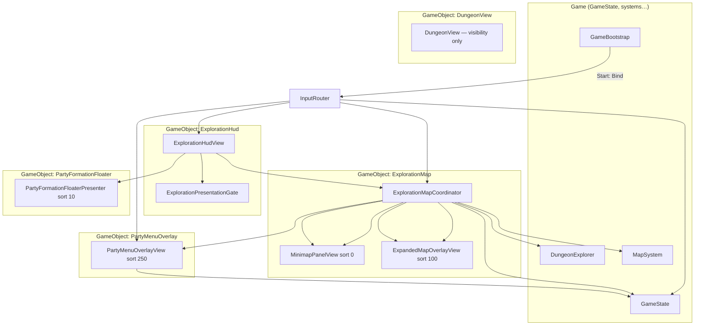
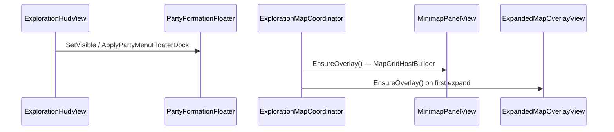
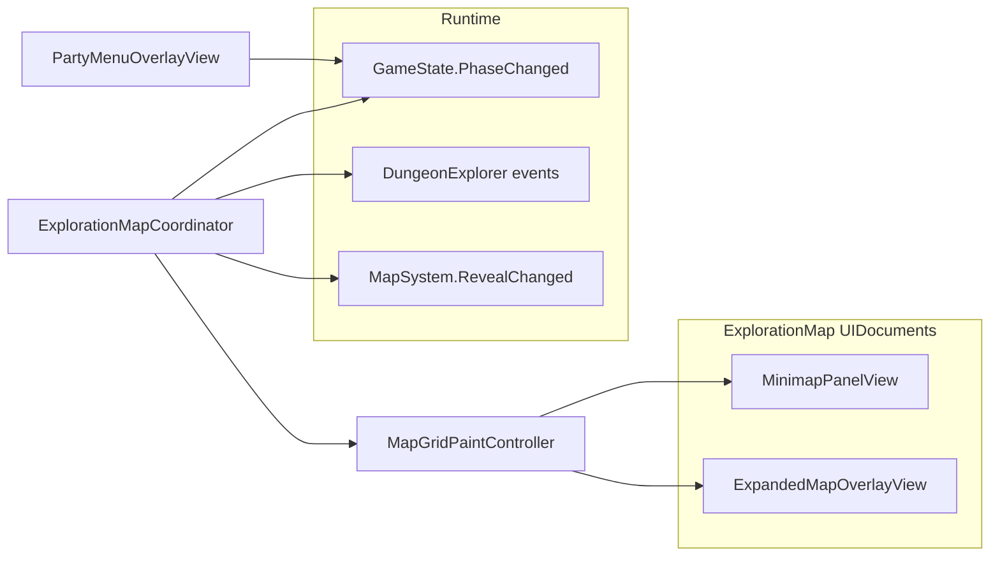
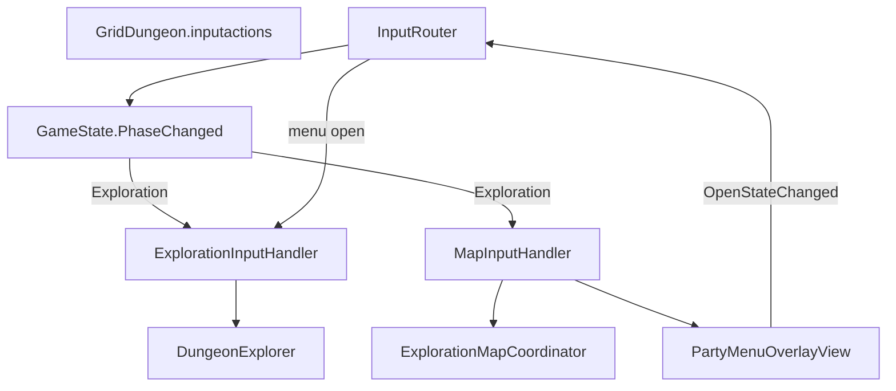
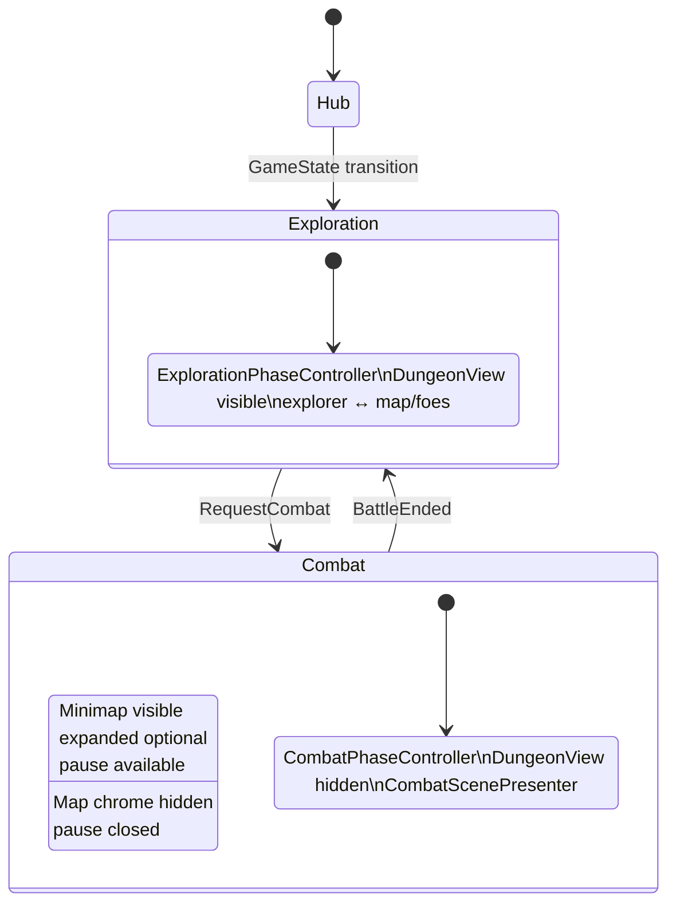

# Exploration UI (UI Toolkit)

How the **exploration HUD** is composed, bound, and wired to runtime systems in **griddungeon-game**. Use this when replacing or extending exploration chrome (map panel, party menu / pause overlay, party strip floater) without re-tracing the scene graph.

**Related:** [mapping — Map UI](mapping.md#map-ui) (player-facing behavior), [game phase](game-phase.md) (macro phases + input maps), [input bindings](input-bindings.md), [map cell art](map-cell-art.md), [ADR 014 — MVP1 exploration map](../../decisions/014-mvp1-exploration-map.md). **Integrator:** [UI event contract](../04-dev/ui-event-contract.md), [custom party UI](../04-dev/custom-party-ui.md).

**Game repo entry points:**

| Piece | Path |
|-------|------|
| Orchestrator (no UXML) | `Assets/Scripts/UI/Views/ExplorationHudView.cs` + `ExplorationPresentationGate` on same `GameObject` |
| Party strip | `PartyFormationFloaterPresenter` / `PartyFormationFloater` facade ([centralized UI services](../04-dev/centralized-ui-services.md#party-formation-floater--partyformationfloaterpresenter--partyformationfloater)) |
| Map coordinator | `Assets/Scripts/UI/Views/ExplorationMapCoordinator.cs` |
| Map surfaces | `MinimapPanelView` (sort **0**), `ExpandedMapOverlayView` (sort **100**) — own `UIDocument` each |
| Map styles | `MapView.uss`, `MinimapPanel.uss`, `ExpandedMapPanel.uss` |
| Shared paint | `Assets/Scripts/UI/MapGridPaintController.cs`, `MapGridHostBuilder.cs` |
| Map marker overlays | `MapPartyMarkerPresenter`, `MapFoeMarkersPresenter`, `MapGatherMarkersPresenter`, `MapHubEntranceMarkersPresenter`, `MapHubEntranceMarkerRules`, `MapGatherMarkerRules`, `MapGridMarkerAnimator` |
| Party / pause menu | `Assets/Scripts/UI/Views/PartyMenuOverlayView.cs` (shared `PartyMenu.uxml`; Quit on hub + exploration) |
| Global input hints | `InputHintPresenter` / `InputHints` facade (sort **300**) |
| Grid paint helpers | `Assets/Scripts/UI/MapGridPainter.cs`, `MapGridStyleClasses.cs` |
| Legacy shim | `MapView.cs` — obsolete delegate to coordinator; remove after scene migration |
| Map overlay art catalog | `Assets/Scripts/UI/MapCellArtCatalog.cs`, `Assets/UI/Map/MapCellArtCatalog.asset`, `MapCellArtPsdSpriteSync` (Editor) |
| Input | `Assets/Scripts/UI/Input/InputRouter.cs`, `ExplorationInputHandler.cs`, `MapInputHandler.cs` |
| Scene wiring (Editor) | `DevBootstrapSceneCreator.cs`, `DevSceneComposition.WireExplorationHud` / `WireExplorationMap` |

**Removed (post [#244](https://github.com/miramocha/griddungeon-game/pull/244)):** `ExplorationHud.uxml` / `ExplorationHud.uss` — there is **no** phase HUD `UIDocument`; map, party strip, pause, and hints each use their own `UIDocument` or facade.

## Design note: partial map presenters (shipped)

Combat HUD uses **reactive presenters** + `CombatPresentationGate` ([#35](https://github.com/miramocha/griddungeon-game/pull/35)). Exploration map is **split across documents** ([#244](https://github.com/miramocha/griddungeon-game/pull/244), autopilot [#248](https://github.com/miramocha/griddungeon-game/pull/248)): `ExplorationMapCoordinator` + shared `MapGridPaintController` paint minimap and expanded surfaces built by `MapGridHostBuilder`; **party / FOE / gather / hub-gate** use overlay presenters + `MapGridMarkerAnimator` ([#90](https://github.com/miramocha/griddungeon-game/pull/90), [#94](https://github.com/miramocha/griddungeon-game/pull/94)); **party strip** + `ExplorationPresentationGate` + `ExplorationHudReactivePresenter` ([#36](https://github.com/miramocha/griddungeon-game/issues/36)); **pause** shares the hub **party menu** shell (`PartyMenuOverlayView` — Inventory / Equipment / Quit on exploration). **Runtime event index:** [UI event contract](../04-dev/ui-event-contract.md). A custom HUD can reuse the same hooks without changing phase authority.

**Future map refactor (optional):** [Appendix — future map read-model refactor](#appendix--future-map-read-model-refactor) — same runtime hooks, shared `MapGridPainter`; not required for a custom skin.

---

## Scene composition

Dev bootstrap creates **`ExplorationHud`** (C# orchestrator only — **no** `UIDocument`), sibling **`ExplorationMap`** (coordinator + two map `UIDocument` children), and centralized **`PartyFormationFloater`** / **`PartyMenuOverlay`** / **`InputHint`** services:

| Component | Serialized / wired to |
|-----------|------------------------|
| `ExplorationHudView` | `GameState`, `ExplorationMapCoordinator`, `PartyFormationFloater` facade — **no** `VisualTreeAsset` |
| `ExplorationPresentationGate` | Movement / floor-transition presentation lock for reactive HUD sync |
| `ExplorationMapCoordinator` | `GameState`, `DungeonExplorer`, `MapSystem`, `MapCellArtCatalog`, `MinimapPanelView`, `ExpandedMapOverlayView`, `PartyMenuOverlayView` |
| `MinimapPanelView` | Own `UIDocument`, `MinimapPanel.uss` + shared `MapView.uss`, `SlideTransition` (`map-minimap--retracted`) |
| `ExpandedMapOverlayView` | Own `UIDocument`, `ExpandedMapPanel.uss` + shared `MapView.uss`, `UniformScaleTransition` (`map-expanded--hidden`) |
| `PartyMenuOverlayView` | `PartyMenu.uxml`, bag/equipment panes, `GameState`, exploration/hub HUD refs |
| `InputRouter` | `GridDungeon.inputactions`, `DungeonExplorer`, `CombatController`, `ExplorationHudView`, `ExplorationMapCoordinator`, `PartyMenuOverlayView` |

Regenerate scene refs: **GridDungeon → Scenes → Create Dev Bootstrap** (game repo).

---

## Orchestrator lifecycle (no phase HUD UXML)

`ExplorationHudView` is a **MonoBehaviour orchestrator** — it does not clone UXML. On enable it wires `ExplorationHudReactivePresenter`, toggles **`PartyFormationFloater`** visibility (expanded map, floor transition, pause menu dock), and forwards refs to `InputRouter`. Map trees are built per surface under **`ExplorationMap`**:

Pause / party menu lives on sibling **`PartyMenuOverlay`** (`UIDocument` sort **250**). Party strip uses **`PartyFormationFloater`** (`sortingOrder` **10**).

### Document / presenter map (no `ExplorationHud` tree)

| Surface | UXML / build | Owner |
|---------|----------------|-------|
| Minimap + expanded map | C# `MapGridHostBuilder` + `MapView.uss` per `UIDocument` | `ExplorationMapCoordinator` + `MinimapPanelView` / `ExpandedMapOverlayView` |
| Party strip (2×4) | `PartyFormationFloater.uxml` (`Shared/`) | `PartyFormationFloaterPresenter`; `ExplorationHudView` + `ExplorationHudReactivePresenter` sync HP/MP |
| Pause / party menu | `PartyMenu.uxml` | `PartyMenuOverlayView` |
| Input hints | `InputHint.uxml` | `InputHintPresenter` via `InputHints` facade |

**Map trees:** built in C# per surface (`MapGridHostBuilder` → `map-view` grid + marker hosts). USS: shared `MapView.uss` + per-surface `MinimapPanel.uss` / `ExpandedMapPanel.uss`. Pause / quit UI is in shared **`PartyMenu.uxml`** (`party-menu-section-quit`, `party-menu-pane-quit`).

## View responsibilities and data sources

### ExplorationMapCoordinator (push updates)

| Subscription | UI effect |
|--------------|-----------|
| `GameState.PhaseChanged` | Show minimap only in `GamePhase.Exploration`; hide on Hub/Combat; close expanded overlay |
| `MapSystem.RevealChanged` | `MapGridPaintController` repaints fog / walls / stairs on dirty cells; marker presenters sync visibility |
| `DungeonExplorer.OnPartyEnteredCell` / `OnPartyFacingChanged` | `MapPartyMarkerPresenter` slide / snap (not a cell glyph) |
| `FoeSystem.OnFoePatrolMoved` | `MapFoeMarkersPresenter` slide; paint controller repaints patrol endpoint **cells** after overlay motion |
| `GameState.ExplorationBindingsWired` | Re-subscribe party/FOE markers **after** `MapSystem` visit handler so reveal runs before marker handlers ([#90](https://github.com/miramocha/griddungeon-game/pull/90)) |
| `GameState.PhaseChanged` → Exploration | Restore party marker after combat ([#94](https://github.com/miramocha/griddungeon-game/pull/94)) |
| Floor layout | `GameState.Content.GetFloor` + `MapSystem` visit/wall/feature state |
| `ExplorationPresentationGate` / `FloorTransition` | `SyncMapChromeVisibility` — minimap slide retract; expanded closes immediately when chrome suppressed |
| `PartyMenuOverlayView.OpenStateChanged` | Minimap retract while pause menu open (same chrome gate as floater dock) |
| `ExpandedChanged` | `ExplorationHudView` hides party strip while expanded map open |

Cell paint priority: [map-cell-art](map-cell-art.md), [mapping § Map cell art](mapping.md#map-cell-art-2d-schematic). Overlay layers: [§ Map marker overlays](#map-marker-overlays).

**M-toggle:** expanded `UniformScaleTransition` / `ScaleInPresentationDriver`; minimap `SlideTransition.Hide()` → `map-minimap--retracted` on slide shell (MSK-style — not opacity fade). See [centralized UI services § Exploration map](../04-dev/centralized-ui-services.md#exploration-map--explorationmapcoordinator).

### Map marker overlays

Built under `map-view-grid-host` (siblings above `map-view-grid`):

| Layer (bottom → top) | Presenter | Visibility / rules |
|----------------------|-----------|-------------------|
| `map-view-gather-markers` | `MapGatherMarkersPresenter` | `HasGatherNode` + visited (or dev reveal-all); `map-view__marker--gather` |
| `map-view-hub-entrance-markers` | `MapHubEntranceMarkersPresenter` | B1F `stairsUp` gate when visited — `MapHubEntranceMarkerRules` |
| `map-view-stairs-markers` | `MapStairsMarkersPresenter` | Stairs cells (down/up); `map-view__marker--stairs` |
| `map-view-story-event-markers` | `MapStoryEventMarkersPresenter` | Active story event cells; `map-view__marker--story-event` |
| `map-view-foe-markers` | `MapFoeMarkersPresenter` | FOE in LOS / last known; patrol slide via `MapGridMarkerAnimator` |
| `map-view-party-markers` | `MapPartyMarkerPresenter` | Party cell + facing; lerp with step; resync on return from combat |

`MapGatherMarkersPresenter`, `MapStairsMarkersPresenter`, `MapStoryEventMarkersPresenter`, and `MapFoeMarkersPresenter` implement `IMapMarkerLayerPresenter` ([#233](https://github.com/miramocha/griddungeon-game/issues/233)), enabling `MapGridPaintController` to manage the layer collection polymorphically (`BindMetrics`, `BindCellGrid`, `BindFloor`, `KillAnimations`, `SyncImmediate`, `SyncForCell`).

`MapGridMarkerAnimator` — shared fade/slide tweens; FOE patrol is **ambient** (does not block exploration input). Dev **Tools → Dev Tools Map** can pass `revealAllMarkers` for preview.

Expanded map is a separate `UIDocument` at sort **100**; `M` / `Esc` behavior is in [input bindings](input-bindings.md) and `MapInputHandler` → `ExplorationMapCoordinator`.

### Party / pause menu (`PartyMenuOverlayView`)

**`Tab`** or **`Esc`** (when expanded map not open) opens the same overlay when safe ([ADR 034](../../decisions/034-skill-point-allocation-outside-combat.md)) — vertical section rail (**W/S**; **Z** reveals pane):

| Section | Hub | Exploration |
|---------|-----|-------------|
| **Inventory** | Category-tabbed bag | Same |
| **Equipment** | Member tabs + worn slots + picker | Same |
| **Formation** | Bottom floater 2×4 swap (`PartyFormationFloaterView`) | Same |
| **Quit to title** | Confirm pane → `GameState.RequestQuitToTitle()` (no inn save) | Same |

Closing the menu after equipment changes refreshes the exploration **party strip** (HP/MP) without requiring a dungeon step.

**Formation:** core slot swap via shared `PartyFormationFloaterView` — bottom 2×4 grid floater (exploration strip + formation menu; slides off-screen when irrelevant). Bind copy on global `InputHints`. **Deferred:** **Skills** (ADR 034), **Tutorial codex** ([ADR 029](../../decisions/029-guided-tutorial.md)).

Spec: [items & inventory](items-and-inventory.md) · [ADR 036](../../decisions/036-party-inventory-model.md) · [shared menu & picker UI](../04-dev/shared-menu-picker-ui.md) · [input bindings](input-bindings.md).

When the menu is open, `InputRouter` unbinds exploration movement. Quit confirm copy stays on the pane body (not the global hint strip).

---

## Input routing

`GameBootstrap` calls `InputRouter.Bind(GameState)` at play start. The router listens to `GameState.PhaseChanged` and enables action maps per phase ([game phase — Input maps](game-phase.md#input-maps-per-phase)).

| Input (Exploration) | Handler | Target |
|---------------------|---------|--------|
| W/S/A/D, Q/E, Interact | `ExplorationInputHandler` | `DungeonExplorer` step / turn / interact |
| `M` | `MapInputHandler` | `ExplorationMapCoordinator.ToggleExpandedFromInput()` |
| `Esc` | `MapInputHandler` | Cancel autopilot / exit expanded map first; **close** pause menu when open, else **open** pause menu |
| `Tab` | `PartyMenuInputHandler` | Toggle same menu |
| `Esc` (expanded map focused) | `ExpandedMapOverlayView` key callback | `ExitRequested` → coordinator closes expanded |

When the menu is open, exploration movement actions are **disabled** (`SetPartyMenuActive`); **`Pause` stays enabled** so **Esc** dismisses the shell via `MapInputHandler`. Minimap **slide retracts** with the party floater (`ExplorationMapCoordinator` + `PartyMenuOverlayView.OpenStateChanged`).

---

## Phase system vs UI visibility

**Two parallel “exploration” layers:**

| Layer | Type | Phase behavior |
|-------|------|----------------|
| `DungeonView` / `FloorArtPresenter` | World / FPV (`SetVisible`; authored art load [#102](https://github.com/miramocha/griddungeon-game/issues/102)) | `ExplorationPhaseController` shows; `CombatPhaseController` hides |
| `ExplorationHud` + `ExplorationMap` | UI Toolkit | Minimap gated on `GamePhase.Exploration`; expanded overlay sort **100**; party/pause menu on overlay `UIDocument` |
| `DungeonExplorer` + `MapSystem` | Simulation | `ExplorationPhaseController` wires on enter, unwires on exit |

The **`ExplorationHud` GameObject is not disabled** on Hub or Combat. Map visibility is **per-surface** (`ExplorationMapCoordinator.SyncMapChromeVisibility` → minimap `SlideTransition` + `map-minimap--retracted` when expanded, floor transition, or pause menu open; expanded `UniformScaleTransition`; pause overlay BEM classes), not by destroying `ExplorationHudView`. Floor transitions hide map chrome in sync with `ScreenFadePresenter` — [gotchas § Map chrome vs floor transition](../04-dev/centralized-ui-gotchas.md#map-chrome-vs-floor-transition-screen-fade-explorationmapcoordinator).

Phase **logic** stays in `ExplorationPhaseController` ([game phase](game-phase.md)); it does **not** reference UI Toolkit types.

---

## Replacing exploration UI (checklist)

1. **Orchestrator:** Extend `ExplorationHudView` / `ExplorationHudReactivePresenter` — do **not** add a phase HUD `UIDocument` for map or party strip; keep surfaces on `ExplorationMap` + centralized services.
2. **Map:** Reuse `ExplorationMapCoordinator` + `MapGridPaintController`, or subscribe per [UI event contract § Exploration](../04-dev/ui-event-contract.md#exploration-phase) (see [§ ExplorationMapCoordinator](#explorationmapcoordinator-push-updates) for per-presenter effects).
3. **Pause:** Extend `PartyMenu.uxml` sections or `PartyMenuOverlayView`; keep `MapInputHandler` + `InputRouter` party-menu wiring.
4. **Input:** Keep `ExplorationInputHandler` / `MapInputHandler` contracts, or extend `InputRouter.EnableMapsForPhase` for new maps.
5. **Do not** move floor load, reveal rules, or combat entry into UI — keep `ExplorationPhaseController` + `GameState` as authority ([architecture principles](../../.cursor/rules/architecture-design-principles.mdc)).

**Party strip:** scene `PartyFormationFloaterPresenter` — `PartyFormationFloater` facade from `ExplorationHudView` ([#36](https://github.com/miramocha/griddungeon-game/issues/36)); event sources in [UI event contract](../04-dev/ui-event-contract.md#exploration-phase). Integrator guide: [custom party UI](../04-dev/custom-party-ui.md#exploration-party-strip).

For a **clean replacement** (not a fork of coordinator surfaces), see [Appendix — future map read-model refactor](#appendix--future-map-read-model-refactor) below.

**Not wired (MVP1):** exploration **combat log** panel — no exploration HUD mount; only combat uses `CombatHudLogView` ([#34](https://github.com/miramocha/griddungeon-game/issues/34)). Class-design `ExplorationHUD.Log` is target-only.

---

## Appendix — future map read-model refactor

**Status:** Design sketch (not locked ADR). **Not a blocker** for custom HUD skins — subscribe per [UI event contract](../04-dev/ui-event-contract.md) and reuse shipped `ExplorationMapCoordinator` today.

| Shipped (use as-is) | Future extract ([#26](https://github.com/miramocha/griddungeon-game/issues/26)) |
|---------------------|----------------------------------------------------------------------------------|
| `ExplorationMapCoordinator`, `MapGridPaintController`, `MapGridPainter`, marker presenters ([#90](https://github.com/miramocha/griddungeon-game/pull/90), [#244](https://github.com/miramocha/griddungeon-game/pull/244)) | `ExplorationMapReadModel` — cell glyph + USS from floor + `MapSystem` |
| `ExplorationHudView`, pause, party strip, reactive presenter + gate ([#36](https://github.com/miramocha/griddungeon-game/issues/36)) | `ExplorationMapPresenter` — event wiring only; `MapGridRenderer` — paint read model |
| [Mapping § Map UI motion](mapping.md#map-ui-motion) + [UI event contract](../04-dev/ui-event-contract.md) | Same events; optional stricter gate on `RevealChanged` beats |

**Why:** `MapGridPaintController` still mixes subscribe + floor resolve + paint priority + multi-surface sync. Refactor splits **read model** (testable) from **renderer** (`MapGridPainter`) without moving reveal rules out of Runtime.

**Migration (ordered):**

1. Extract `ExplorationMapReadModel` from paint cell logic (golden cell tests).
2. Add `MapGridRenderer` + thin surface shells; Dev Tools Map shares renderer.
3. `ExplorationMapPresenter` — same subscriptions as [§ ExplorationMapCoordinator](#explorationmapcoordinator-push-updates).
4. Slim coordinator to surface lifecycle only; keep `MapGridPainter` and marker presenters.

**Rules unchanged:** `ExplorationPhaseController`, `MapSystem`, `InputRouter` handlers; presenters never call `TryStepForward` or reveal calculators. Map input still goes through `ExplorationMapCoordinator` (`ToggleExpandedFromInput`, hint publish).

**Gate policy:** MVP1 — movement lerp blocks steps; map tweens often parallel. Stricter EO lock (gate blocks next step after reveal stamp) is incremental — see [tech notes § UI reactivity](../04-tech-notes.md#ui-reactivity).

Type names and combat mirror table: [05 — Class design § UI layer](../05-class-design.md#ui-layer).

---

## Related docs

- [UI event contract](../04-dev/ui-event-contract.md) — integrator / external HUD (runtime events + examples)
- [Game phase](game-phase.md) — `GamePhaseController`, dev bootstrap, input maps
- [Mapping](mapping.md) — map UX, motion table, combat map toggle
- [Input bindings](input-bindings.md) — `M` / `Esc` / exploration moves
- [Map cell art](map-cell-art.md) — glyphs, USS, sprite target
- [04 — Tech notes § Exploration HUD](../04-tech-notes.md#exploration-hud-ui-toolkit) — short index
- [05 — Class design MVP1 § UI layer](../05-class-design.md#ui-layer) — target types vs shipped names
- [ADR 014 — MVP1 exploration map](../../decisions/014-mvp1-exploration-map.md)
