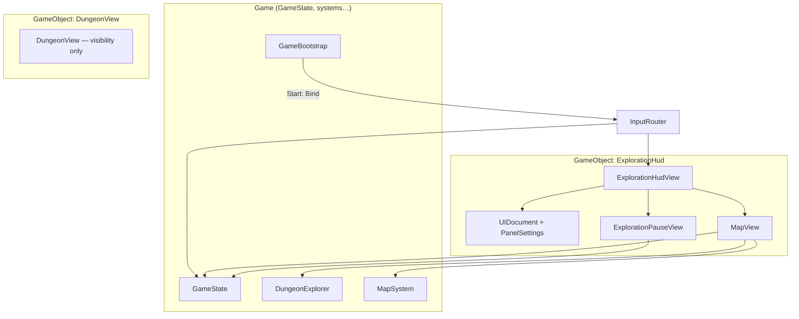
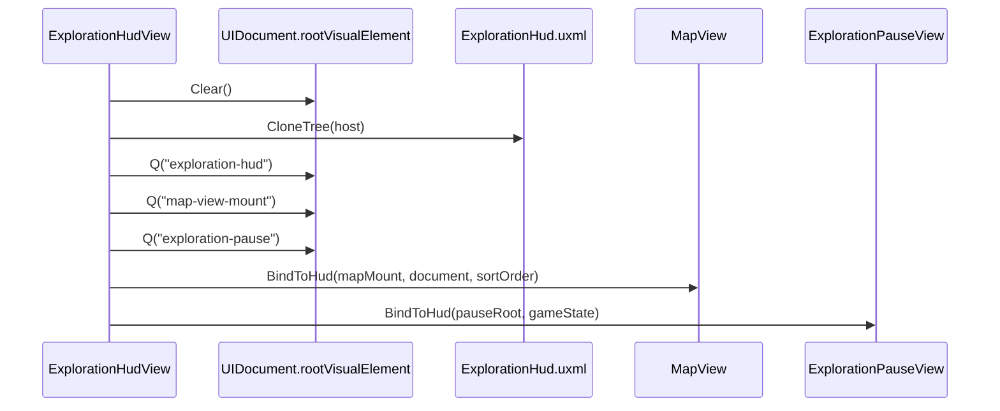
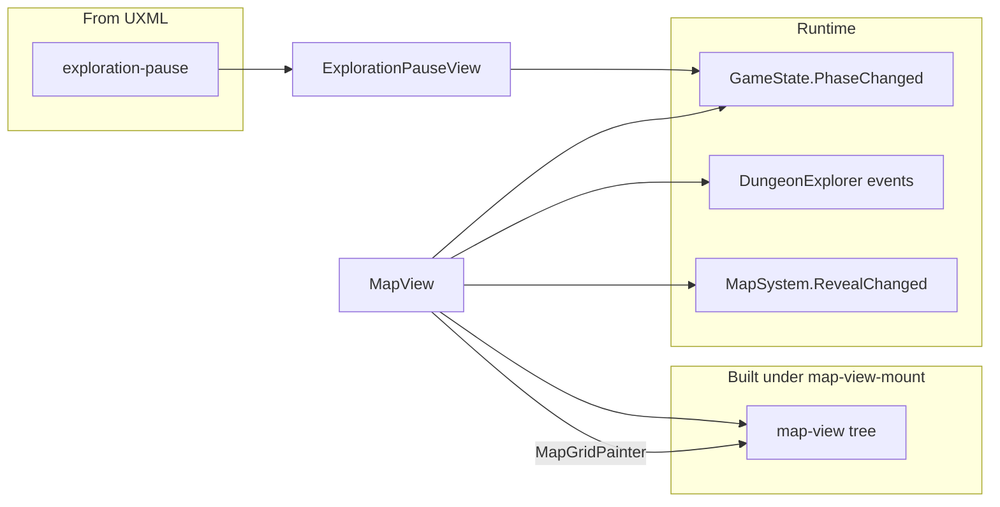
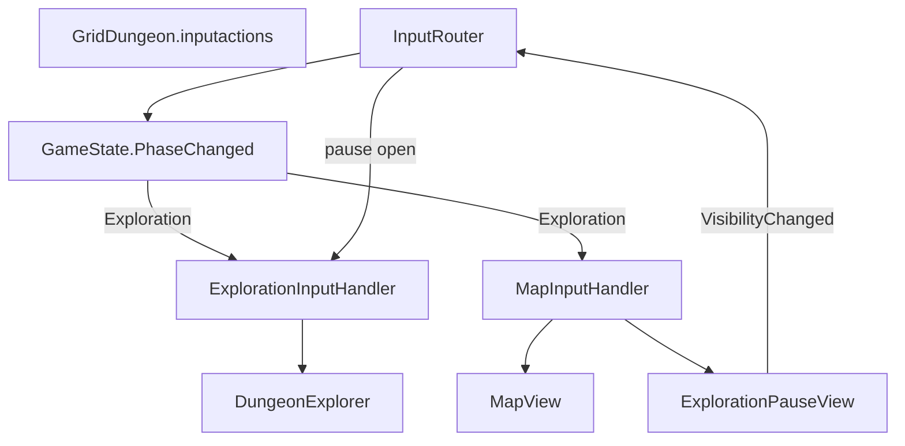
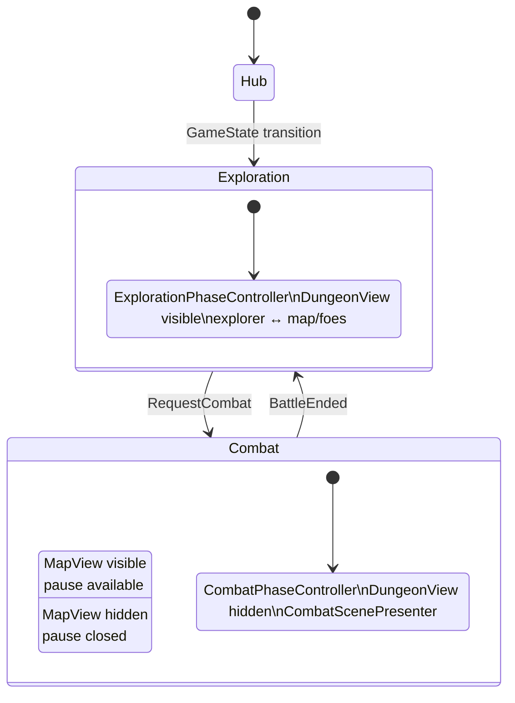
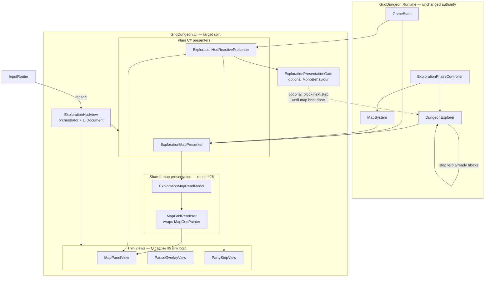
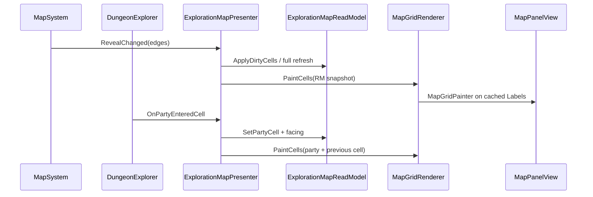
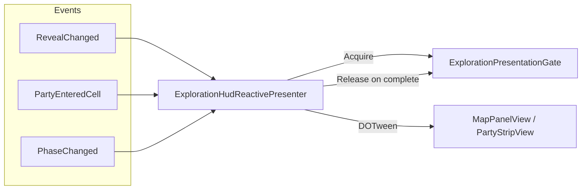
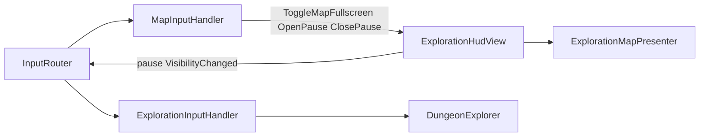
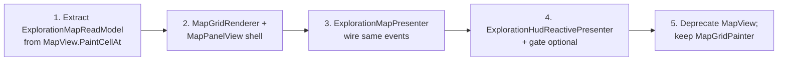

# Exploration UI (UI Toolkit)

How the **exploration HUD** is composed, bound, and wired to runtime systems in **griddungeon-game**. Use this when replacing or extending exploration chrome (map panel, pause overlay, future party strip) without re-tracing the scene graph.

**Related:** [mapping — Map UI](mapping.md#map-ui) (player-facing behavior), [game phase](game-phase.md) (macro phases + input maps), [input bindings](input-bindings.md), [map cell art](map-cell-art.md), [ADR 014 — MVP1 exploration map](../../decisions/014-mvp1-exploration-map.md).

**Game repo entry points:**

| Piece | Path |
|-------|------|
| Shell UXML | `Assets/UI/Screens/Exploration/ExplorationHud.uxml` |
| Styles | `ExplorationHud.uss`, `MapView.uss`, `Shared/HudOverlay.uss` |
| Orchestrator | `Assets/Scripts/UI/Views/ExplorationHudView.cs` |
| Map panel | `Assets/Scripts/UI/Views/MapView.cs` |
| Map marker overlays | `MapPartyMarkerPresenter`, `MapFoeMarkersPresenter`, `MapGatherMarkersPresenter`, `MapHubEntranceMarkersPresenter`, `MapHubEntranceMarkerRules`, `MapGatherMarkerRules`, `MapGridMarkerAnimator` |
| Pause overlay | `Assets/Scripts/UI/Views/ExplorationPauseView.cs` |
| Grid paint helpers | `Assets/Scripts/UI/MapGridPainter.cs`, `MapGridStyleClasses.cs` |
| Input | `Assets/Scripts/UI/Input/InputRouter.cs`, `ExplorationInputHandler.cs`, `MapInputHandler.cs` |
| Scene wiring (Editor) | `DevBootstrapSceneCreator.cs`, `DevSceneComposition.WireExplorationHud` / `WireMapView` |

---

## Design note: partial map presenters (shipped)

Combat HUD uses **reactive presenters** + `CombatPresentationGate` ([#35](https://github.com/miramocha/griddungeon-game/pull/35)). Exploration is **split**: cell grid is imperative (`MapView` + `MapGridPainter`); **party / FOE / gather / hub-mouth** use overlay presenters + `MapGridMarkerAnimator` ([#90](https://github.com/miramocha/griddungeon-game/pull/90), [#94](https://github.com/miramocha/griddungeon-game/pull/94)); pause stays imperative (`ExplorationPauseView`). A custom HUD can reuse the same event sources without changing phase authority.

**Target layout (full read-model refactor):** [§ Target — presenter-based exploration HUD](#target--presenter-based-exploration-hud) below — same runtime hooks, shared `MapGridPainter`, no copy-paste of `MapView` paint loops.

---

## Scene composition

Dev bootstrap creates one GameObject **`ExplorationHud`** under the game root:



| Component | Serialized / wired to |
|-----------|------------------------|
| `ExplorationHudView` | `VisualTreeAsset` → `ExplorationHud.uxml`, `GameState`, `MapView`, `ExplorationPauseView` |
| `MapView` | `GameState`, `DungeonExplorer`, `MapSystem`, `MapView.uss` |
| `ExplorationPauseView` | `GameState` |
| `InputRouter` | `GridDungeon.inputactions`, `DungeonExplorer`, `CombatController`, `ExplorationHudView` |

Regenerate scene refs: **GridDungeon → Scenes → Create Dev Bootstrap** (game repo).

---

## UXML load and mount lifecycle

`ExplorationHudView` is the **only** type that clones exploration HUD UXML. On `OnEnable` it clears `UIDocument.rootVisualElement`, clones the tree, queries named roots, and delegates:



On `OnDisable`, `MapView.ReleaseFromHud()` and `ExplorationPauseView.ReleaseFromHud()` run before the document is torn down.

### UXML element map

| `name` (UXML) | Bound by | Notes |
|---------------|----------|--------|
| `exploration-hud` | `ExplorationHudView` | Root container |
| `map-view-mount` | `MapView.BindToHud` | **Empty mount** — map UI built in C# |
| `party-strip` | *(none)* | Placeholder; USS `--hidden`; not wired in MVP1 |
| `exploration-pause` | `ExplorationPauseView` | Pause + quit confirm panels |
| `exploration-pause-*` buttons | `ExplorationPauseView` | `Q<Button>` + `clicked` handlers |

**Hybrid layout:** pause chrome is **authored in UXML**; the **map grid** is **programmatic** (`MapView.BuildMapTree` adds `map-view`, title, hint, `map-view-grid` under the mount).

---

## View responsibilities and data sources



### MapView (push updates)

| Subscription | UI effect |
|--------------|-----------|
| `GameState.PhaseChanged` | Show map only in `GamePhase.Exploration`; hide on Hub/Combat; reset fullscreen |
| `MapSystem.RevealChanged` | Repaint fog / walls / stairs on dirty cells; marker presenters sync visibility |
| `DungeonExplorer.OnPartyEnteredCell` / `OnPartyFacingChanged` | `MapPartyMarkerPresenter` slide / snap (not a cell glyph) |
| `FoeSystem.OnFoePatrolMoved` | `MapFoeMarkersPresenter` slide; `MapView` repaints patrol endpoint **cells** after overlay motion |
| `GameState.ExplorationBindingsWired` | Re-subscribe party/FOE markers **after** `MapSystem` visit handler so reveal runs before marker handlers ([#90](https://github.com/miramocha/griddungeon-game/pull/90)) |
| `GameState.PhaseChanged` → Exploration | Restore party marker after combat ([#94](https://github.com/miramocha/griddungeon-game/pull/94)) |
| Floor layout | `GameState.Content.GetFloor` + `MapSystem` visit/wall/feature state |

Cell paint priority: [map-cell-art](map-cell-art.md), [mapping § Map cell art](mapping.md#map-cell-art-2d-schematic). Overlay layers: [§ Map marker overlays](#map-marker-overlays).

### Map marker overlays

Built under `map-view-grid-host` (siblings above `map-view-grid`):

| Layer (bottom → top) | Presenter | Visibility / rules |
|----------------------|-----------|-------------------|
| `map-view-gather-markers` | `MapGatherMarkersPresenter` | `HasGatherNode` + visited (or dev reveal-all); `map-view__marker--gather` |
| `map-view-hub-entrance-markers` | `MapHubEntranceMarkersPresenter` | B1F `stairsUp` mouth when visited — `MapHubEntranceMarkerRules` |
| `map-view-foe-markers` | `MapFoeMarkersPresenter` | FOE in LOS / last known; patrol slide via `MapGridMarkerAnimator` |
| `map-view-party-markers` | `MapPartyMarkerPresenter` | Party cell + facing; lerp with step; resync on return from combat |

`MapGridMarkerAnimator` — shared fade/slide tweens; FOE patrol is **ambient** (does not block exploration input). Dev **Tools → Dev Tools Map** can pass `revealAllMarkers` for preview.

Fullscreen map raises `UIDocument.sortingOrder` so the panel draws above the side layout; `M` / `Esc` behavior is in [input bindings](input-bindings.md) and `MapInputHandler`.

### ExplorationPauseView

| Action | Behavior |
|--------|----------|
| Open (`Esc` when map not fullscreen) | `MapInputHandler` → `Open()`; toggles `hud-overlay--hidden` on `exploration-pause` |
| Resume | Close overlay |
| Quit | Confirm panel → `GameState.RequestQuitToTitle()` (no inn save; [ADR 014](../../decisions/014-mvp1-exploration-map.md)) |
| Phase leave | `PhaseChanged` → force close |

`VisibilityChanged` is raised when open state changes so `InputRouter` can unbind exploration movement while paused.

---

## Input routing

`GameBootstrap` calls `InputRouter.Bind(GameState)` at play start. The router listens to `GameState.PhaseChanged` and enables action maps per phase ([game phase — Input maps](game-phase.md#input-maps-per-phase)).



| Input (Exploration) | Handler | Target |
|---------------------|---------|--------|
| W/S/A/D, Q/E, Interact | `ExplorationInputHandler` | `DungeonExplorer` step / turn / interact |
| `M` | `MapInputHandler` | `MapView.ToggleFullscreenFromInput()` |
| `Esc` | `MapInputHandler` | Exit map fullscreen, or open/close pause |
| `Esc` (map focused, backup) | `MapView` key callback | Exit fullscreen if UI Toolkit has focus |

When pause is open, exploration movement actions are **unbound** so the party cannot walk under the overlay.

---

## Phase system vs UI visibility

**Two parallel “exploration” layers:**

| Layer | Type | Phase behavior |
|-------|------|----------------|
| `DungeonView` | World / FPV stub (`SetVisible`) | `ExplorationPhaseController` shows; `CombatPhaseController` hides |
| `ExplorationHud` + `MapView` | UI Toolkit | Map/pause gated on `GamePhase.Exploration` inside views |
| `DungeonExplorer` + `MapSystem` | Simulation | `ExplorationPhaseController` wires on enter, unwires on exit |

The **`ExplorationHud` GameObject is not disabled** on Hub or Combat. Visibility is **per-widget** (`MapView` display / pause overlay classes), not by destroying `ExplorationHudView`.



Phase **logic** stays in `ExplorationPhaseController` ([game phase](game-phase.md)); it does **not** reference UI Toolkit types.

---

## Replacing exploration UI (checklist)

1. **Shell:** Replace or extend `ExplorationHud.uxml` / `ExplorationHudView` (keep `UIDocument` + mount pattern, or split documents if needed).
2. **Map:** Either reuse `MapView` + `MapGridPainter`, or subscribe to the same events (`MapSystem`, `DungeonExplorer`, `GameState.PhaseChanged`) from a new view.
3. **Pause:** Reuse `ExplorationPauseView` names or update `MapInputHandler` + `InputRouter` pause wiring.
4. **Input:** Keep `ExplorationInputHandler` / `MapInputHandler` contracts, or extend `InputRouter.EnableMapsForPhase` for new maps.
5. **Do not** move floor load, reveal rules, or combat entry into UI — keep `ExplorationPhaseController` + `GameState` as authority ([architecture principles](../../.cursor/rules/architecture-design-principles.mdc)).

**Unwired placeholder:** `party-strip` in UXML — future HP/status strip; no C# binding yet.

For a **clean replacement** (not a fork of `MapView`), follow the target section below.

---

## Target — presenter-based exploration HUD

**Status:** Design sketch (not locked ADR). **Shipped subset ([#90](https://github.com/miramocha/griddungeon-game/pull/90)):** overlay marker presenters + `MapGridMarkerAnimator` (see [§ Map marker overlays](#map-marker-overlays)). **Still target:** `ExplorationMapReadModel`, unified `ExplorationMapPresenter`, optional `ExplorationPresentationGate` for cell reveal beats.

Use when building production exploration chrome or a full HUD swap. **Does not change** `ExplorationPhaseController`, `MapSystem` reveal rules, or `GameState` phase authority.

**Goals:**

| Goal | How |
|------|-----|
| Reuse runtime hooks | Same subscriptions as today: `GameState.PhaseChanged`, `MapSystem.RevealChanged`, `DungeonExplorer` step/cell/facing, pause → `RequestQuitToTitle` |
| Avoid duplicating map paint | **Read model** builds cell descriptors; **one** renderer calls existing `MapGridPainter` (or sprites later per [map-cell-art](map-cell-art.md)) |
| Match combat UI pattern | Orchestrator `MonoBehaviour` + plain C# `*Presenter` + optional **presentation lock** for EO-style beats ([tech notes — UI reactivity](../04-tech-notes.md#ui-reactivity)) |
| Keep input stable | `InputRouter` + `ExplorationInputHandler` / `MapInputHandler` call **facades** on the orchestrator (toggle map, open pause), not `VisualElement` queries from handlers |

### Layer diagram (target)



**Responsibility split (mirror combat):**

| Type | Role | Combat analogue |
|------|------|-----------------|
| `ExplorationHudView` | Clone UXML, cache `Q<>`, wire presenters, expose `ToggleMapFullscreen()` / `OpenPause()` for input | `CombatHudView` |
| `MapPanelView` | Owns `map-view-mount` children; applies layout classes (`map-view--fullscreen`); no `MapSystem` calls | `TurnOrderStripView`, roster strips |
| `ExplorationMapPresenter` | Subscribes to map-related events; updates `ExplorationMapReadModel`; triggers full/dirty repaint | *(combat has paint on roster views + reactive presenter)* |
| `ExplorationMapReadModel` | Pure C#: for each cell, glyph + USS class list from floor + `MapSystem` + party cell | *(no direct combat equivalent — extract from `MapView`)* |
| `MapGridRenderer` | `BuildGrid` / `PaintCell` via `MapGridPainter` + `MapGridStyleClasses.MapView` | Shared with dev map preview ([#26](https://github.com/miramocha/griddungeon-game/issues/26)) |
| `ExplorationHudReactivePresenter` | DOTween beats: reveal stamp, party slide, FOE slide, fullscreen open — acquire/release gate | `CombatHudReactivePresenter` |
| `ExplorationPresentationGate` | Ref-count lock; optional hook for “next step ignored while HUD beat plays” | `CombatPresentationGate` |
| `PauseOverlayView` | Button `clicked` → commands only; presenter or view calls `GameState` | Pause stays thin (no DOTween required) |

Simulation stays in Runtime; **presenters never call** `TryStepForward`, `LoadFloor`, or reveal calculators.

### Data flow — map (avoid copying `MapView` loops)

Today `MapView` mixes **event wiring**, **floor resolve**, **paint priority**, and **Toolkit tree build**. Target extraction:



**`ExplorationMapReadModel` (sketch):**

```csharp
// GridDungeon.UI — no UnityEngine in read model if kept testable
readonly struct MapCellVisual
{
    public string Glyph;
    public string PrimaryClass;  // map-view__cell--floor, --party, …
}

sealed class ExplorationMapReadModel
{
    public void RebuildFloor(StratumFloor floor, MapSystem map, GridPosition party, FacingDirection facing);
    public bool TryGetCell(int x, int y, out MapCellVisual cell);
    public IEnumerable<GridPosition> GetDirtyCells(IReadOnlyList<CellEdge> edges);
}
```

Paint priority logic moves **once** into `RebuildFloor` / `PaintCellAt` helpers (ported from `MapView.PaintCellAt`, not duplicated in a second view). `MapGridRenderer` only maps `MapCellVisual` → `MapGridPainter.PaintCell`.

**Custom HUD swap:** Replace `MapPanelView` UXML/CSS and how labels are created; keep `ExplorationMapPresenter` + read model + `MapGridPainter` until you move to sprite layers ([map-cell-art](map-cell-art.md)).

### Data flow — reactive beats (mapping motion table)

[event → UI reaction table](mapping.md#map-ui-motion) becomes presenter methods:

| Event (source) | Presenter handler | Blocks input? |
|----------------|-------------------|---------------|
| `MapSystem.RevealChanged` (step-sized) | `PlayRevealStamp(cells)` | Optional via gate — align with [ADR 001](../../decisions/001-grid-movement.md) step lerp |
| `DungeonExplorer.OnPartyEnteredCell` | `PlayPartySlide(from, to)` | Movement already blocked during lerp |
| FOE patrol tick | `PlayFoeSlide` | **No** — ambient ([mapping](mapping.md#map-ui-motion)) |
| Fullscreen toggle (`M`) | `PlayMapFullscreenOpen/Close` | **No** — overlay only |
| `GameState.PhaseChanged` → not Exploration | `ResetAllTweens`, hide panels | — |



**Gate policy (pick one per beat, document in code):**

1. **Movement-only block (MVP1 default):** `DungeonExplorer` lerp is the lock; map tweens run in parallel (current behavior, minimal gate).
2. **EO-style HUD lock (target):** `ExplorationPresentationGate` + `DungeonExplorer` checks `!gate.IsLocked` before accepting the next step — map reveal stamp must finish before next cell ([tech notes](../04-tech-notes.md#ui-reactivity)).

Combat uses (2) for command resolution; exploration can adopt (2) incrementally per row in the motion table.

### Input facade (unchanged maps)

`MapInputHandler` and `ExplorationInputHandler` stay; only **targets** change:



Do **not** move `Input System` callbacks into presenters.

### Pause and party strip

| Surface | Target owner | Notes |
|---------|--------------|--------|
| Pause overlay | `PauseOverlayView` + small `PausePresenter` *(optional)* | Same UXML names or new layout; still `RequestQuitToTitle` only |
| `party-strip` | `PartyStripView` + `ExplorationHudReactivePresenter` | Subscribe `PartyRuntime` / save HP when wired; motion per [mapping](mapping.md#map-ui-motion) |

### Migration path (from shipped `MapView`)



| Step | Risk | Test |
|------|------|------|
| 1 — Read model | Paint priority drift | Edit Mode: golden cells for fog/wall/party/FOE ([game #26](https://github.com/miramocha/griddungeon-game/issues/26) shared fixtures) |
| 2 — Renderer | Grid size / label cache | Dev Tools Map preview uses same renderer |
| 3 — Presenter | Missed dirty cells | Play Mode: step, bump wall, stairs, floor change |
| 4 — Reactive | Input feel | F2 exploration: step cadence vs reveal tween |
| 5 — Remove `MapView` | Scene refs | Regenerate Dev Bootstrap |

**YAGNI:** Skip `ExplorationPresentationGate` until a motion row requires blocking the *next* step after lerp ends; ship read model + thin views first.

### Custom HUD without forking game code

If your UXML is entirely new but you stay in this repo:

1. Replace `ExplorationHud.uxml` / USS; keep `name=` mounts (`map-view-mount`, pause root) or update `ExplorationHudView` queries once.
2. Implement `MapPanelView` + your styling; inject `ExplorationMapPresenter` + `MapGridRenderer`.
3. Leave `ExplorationPhaseController`, `MapSystem`, `DungeonExplorer`, `InputRouter` handlers untouched.
4. Optional: host presenters on your orchestrator type instead of `ExplorationHudView` — same interfaces.

---

## Related docs

- [Game phase](game-phase.md) — `GamePhaseController`, dev bootstrap, input maps
- [Mapping](mapping.md) — map UX, motion table, combat map toggle
- [Input bindings](input-bindings.md) — `M` / `Esc` / exploration moves
- [Map cell art](map-cell-art.md) — glyphs, USS, sprite target
- [04 — Tech notes § Exploration HUD](../04-tech-notes.md#exploration-hud-ui-toolkit) — short index
- [05 — Class design MVP1 § UI layer](../05-class-design-mvp1.md#ui-layer) — target types vs shipped names
- [ADR 014 — MVP1 exploration map](../../decisions/014-mvp1-exploration-map.md)
