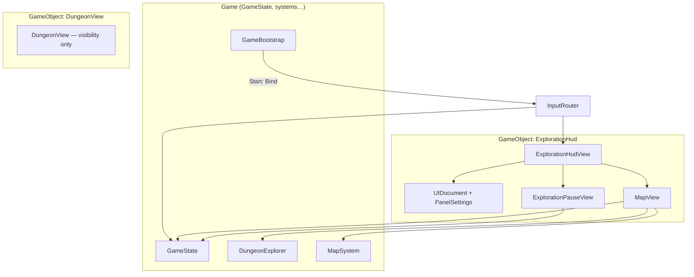
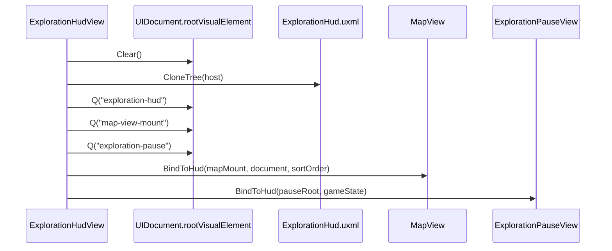
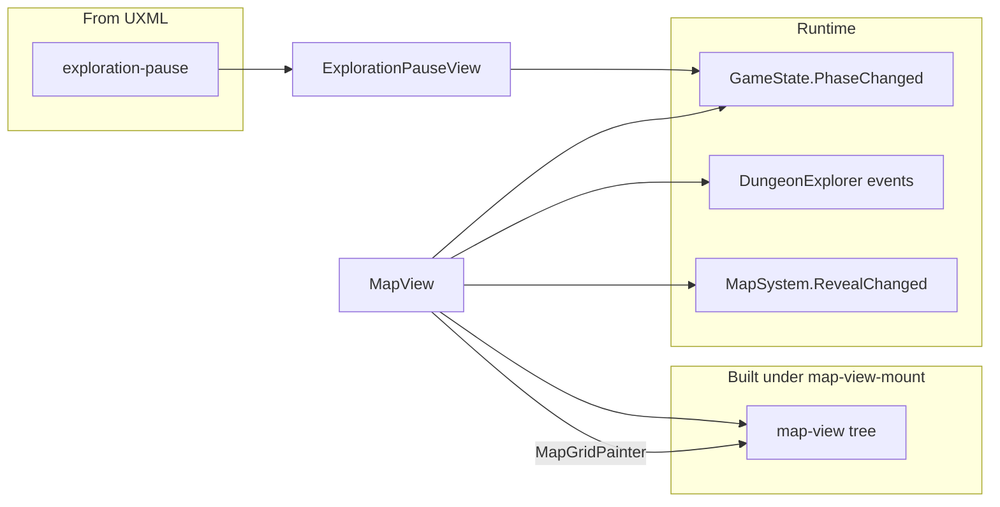
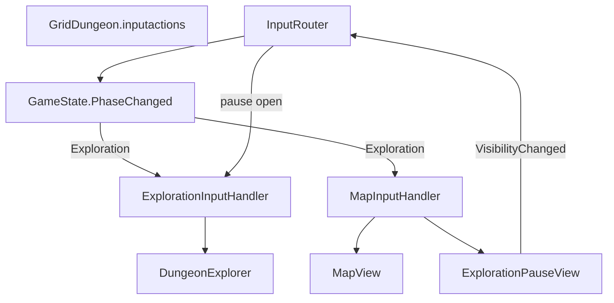
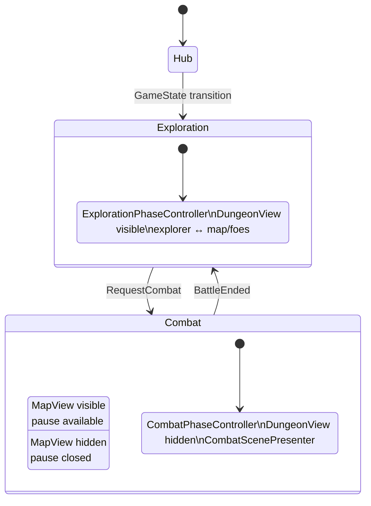

# Exploration UI (UI Toolkit)

How the **exploration HUD** is composed, bound, and wired to runtime systems in **griddungeon-game**. Use this when replacing or extending exploration chrome (map panel, pause overlay, future party strip) without re-tracing the scene graph.

**Related:** [mapping — Map UI](mapping.md#map-ui) (player-facing behavior), [game phase](game-phase.md) (macro phases + input maps), [input bindings](input-bindings.md), [map cell art](map-cell-art.md), [ADR 014 — MVP1 exploration map](../../decisions/014-mvp1-exploration-map.md). **Integrator event list:** [UI event contract](../04-dev/ui-event-contract.md).

**Game repo entry points:**

| Piece | Path |
|-------|------|
| Shell UXML | `Assets/UI/Screens/Exploration/ExplorationHud.uxml` |
| Styles | `ExplorationHud.uss`, `MapView.uss`, `Shared/HudOverlay.uss` |
| Orchestrator | `Assets/Scripts/UI/Views/ExplorationHudView.cs` |
| Map panel | `Assets/Scripts/UI/Views/MapView.cs` |
| Map marker overlays | `MapPartyMarkerPresenter`, `MapFoeMarkersPresenter`, `MapGatherMarkersPresenter`, `MapHubEntranceMarkersPresenter`, `MapHubEntranceMarkerRules`, `MapGatherMarkerRules`, `MapGridMarkerAnimator` |
| Pause overlay | `Assets/Scripts/UI/Views/ExplorationPauseView.cs` |
| Grid paint helpers | `Assets/Scripts/UI/MapGridPainter.cs`, `MapGridStyleClasses.cs` |
| Input | `Assets/Scripts/UI/Input/InputRouter.cs`, `ExplorationInputHandler.cs`, `MapInputHandler.cs` |
| Scene wiring (Editor) | `DevBootstrapSceneCreator.cs`, `DevSceneComposition.WireExplorationHud` / `WireMapView` |

---

## Design note: partial map presenters (shipped)

Combat HUD uses **reactive presenters** + `CombatPresentationGate` ([#35](https://github.com/miramocha/griddungeon-game/pull/35)). Exploration is **split**: cell grid is imperative (`MapView` + `MapGridPainter`); **party / FOE / gather / hub-gate** use overlay presenters + `MapGridMarkerAnimator` ([#90](https://github.com/miramocha/griddungeon-game/pull/90), [#94](https://github.com/miramocha/griddungeon-game/pull/94)); **party strip** + `ExplorationPresentationGate` + `ExplorationHudReactivePresenter` ([#36](https://github.com/miramocha/griddungeon-game/issues/36)); pause stays imperative (`ExplorationPauseView`). **Runtime event index:** [UI event contract](../04-dev/ui-event-contract.md). A custom HUD can reuse the same hooks without changing phase authority.

**Future map refactor (optional):** [Appendix — future map read-model refactor](#appendix--future-map-read-model-refactor) — same runtime hooks, shared `MapGridPainter`; not required for a custom skin.

---

## Scene composition

Dev bootstrap creates one GameObject **`ExplorationHud`** under the game root:

| Component | Serialized / wired to |
|-----------|------------------------|
| `ExplorationHudView` | `VisualTreeAsset` → `ExplorationHud.uxml`, `GameState`, `MapView`, `ExplorationPauseView` |
| `MapView` | `GameState`, `DungeonExplorer`, `MapSystem`, `MapView.uss` |
| `ExplorationPauseView` | `GameState` |
| `InputRouter` | `GridDungeon.inputactions`, `DungeonExplorer`, `CombatController`, `ExplorationHudView` |

Regenerate scene refs: **GridDungeon → Scenes → Create Dev Bootstrap** (game repo).

---

## UXML load and mount lifecycle

`ExplorationHudView` is the **only** type that clones exploration HUD UXML. On `OnEnable` it clears `UIDocument.rootVisualElement`, clones the tree, queries named roots, and delegates:

On `OnDisable`, `MapView.ReleaseFromHud()` and `ExplorationPauseView.ReleaseFromHud()` run before the document is torn down.

### UXML element map

| `name` (UXML) | Bound by | Notes |
|---------------|----------|--------|
| `exploration-hud` | `ExplorationHudView` | Root container |
| `map-view-mount` | `MapView.BindToHud` | **Empty mount** — map UI built in C# |
| `party-strip` | `ExplorationPartyStripView` | Core HP/MP strip; `ExplorationHudReactivePresenter` syncs on step/cell/phase |
| `exploration-pause` | `ExplorationPauseView` | Pause + quit confirm panels |
| `exploration-pause-*` buttons | `ExplorationPauseView` | `Q<Button>` + `clicked` handlers |

**Hybrid layout:** pause chrome is **authored in UXML**; the **map grid** is **programmatic** (`MapView.BuildMapTree` adds `map-view`, title, hint, `map-view-grid` under the mount).

---

## View responsibilities and data sources

### MapView (push updates)

| Subscription | UI effect |
|--------------|-----------|
| `GameState.PhaseChanged` | Show map only in `GamePhase.Exploration`; hide on Hub/Combat; reset fullscreen |
| `MapSystem.RevealChanged` | Repaint fog / walls / stairs on dirty cells; marker presenters sync visibility |
| `DungeonExplorer.OnPartyEnteredCell` / `OnPartyFacingChanged` | `MapPartyMarkerPresenter` slide / snap (not a cell glyph) |
| `FoeSystem.OnFoePatrolMoved` | `MapFoeMarkersPresenter` slide; `MapView` repaints patrol endpoint **cells** after overlay motion |
| `GameState.ExplorationBindingsWired` | Re-subscribe party/FOE markers **after** `MapSystem` visit handler so reveal runs before marker handlers ([#90](https://github.com/miramocha/griddungeon-game/pull/90)) |
| `GameState.PhaseChanged` → Exploration | Restore party marker after combat ([#94](https://github.com/miramocha/griddungeon-game/pull/94)) |
| Floor layout | `GameState.Content.GetFloor` + `MapSystem` visit/wall/feature state |

Cell paint priority: [map-cell-art](map-cell-art.md), [mapping § Map cell art](mapping.md#map-cell-art-2d-schematic). Overlay layers: [§ Map marker overlays](#map-marker-overlays).

### Map marker overlays

Built under `map-view-grid-host` (siblings above `map-view-grid`):

| Layer (bottom → top) | Presenter | Visibility / rules |
|----------------------|-----------|-------------------|
| `map-view-gather-markers` | `MapGatherMarkersPresenter` | `HasGatherNode` + visited (or dev reveal-all); `map-view__marker--gather` |
| `map-view-hub-entrance-markers` | `MapHubEntranceMarkersPresenter` | B1F `stairsUp` gate when visited — `MapHubEntranceMarkerRules` |
| `map-view-foe-markers` | `MapFoeMarkersPresenter` | FOE in LOS / last known; patrol slide via `MapGridMarkerAnimator` |
| `map-view-party-markers` | `MapPartyMarkerPresenter` | Party cell + facing; lerp with step; resync on return from combat |

`MapGridMarkerAnimator` — shared fade/slide tweens; FOE patrol is **ambient** (does not block exploration input). Dev **Tools → Dev Tools Map** can pass `revealAllMarkers` for preview.

Fullscreen map raises `UIDocument.sortingOrder` so the panel draws above the side layout; `M` / `Esc` behavior is in [input bindings](input-bindings.md) and `MapInputHandler`.

### ExplorationPauseView

**Skills (spec):** when allowed ([ADR 034](../../decisions/034-skill-point-allocation-outside-combat.md)), pause or `Tab` party menu opens the same class skill tree as hub Guild.

| Action | Behavior |
|--------|----------|
| Open (`Esc` when map not fullscreen) | `MapInputHandler` → `Open()`; toggles `hud-overlay--hidden` on `exploration-pause` |
| Resume | Close overlay |
| Quit | Confirm panel → `GameState.RequestQuitToTitle()` (no inn save; [ADR 014](../../decisions/014-mvp1-exploration-map.md)) |
| Phase leave | `PhaseChanged` → force close |

`VisibilityChanged` is raised when open state changes so `InputRouter` can unbind exploration movement while paused.

---

## Input routing

`GameBootstrap` calls `InputRouter.Bind(GameState)` at play start. The router listens to `GameState.PhaseChanged` and enables action maps per phase ([game phase — Input maps](game-phase.md#input-maps-per-phase)).

| Input (Exploration) | Handler | Target |
|---------------------|---------|--------|
| W/S/A/D, Q/E, Interact | `ExplorationInputHandler` | `DungeonExplorer` step / turn / interact |
| `M` | `MapInputHandler` | `MapView.ToggleFullscreenFromInput()` |
| `Esc` | `MapInputHandler` | Exit map fullscreen, or open/close pause |
| `Esc` (map focused, backup) | `MapView` key callback | Exit fullscreen if UI Toolkit has focus |

When pause is open, exploration movement actions are **unbound** so the party cannot walk under the overlay.

---

## Phase system vs UI visibility

**Two parallel “exploration” layers:**

| Layer | Type | Phase behavior |
|-------|------|----------------|
| `DungeonView` / `FloorArtPresenter` | World / FPV (`SetVisible`; authored art load [#102](https://github.com/miramocha/griddungeon-game/issues/102)) | `ExplorationPhaseController` shows; `CombatPhaseController` hides |
| `ExplorationHud` + `MapView` | UI Toolkit | Map/pause gated on `GamePhase.Exploration` inside views |
| `DungeonExplorer` + `MapSystem` | Simulation | `ExplorationPhaseController` wires on enter, unwires on exit |

The **`ExplorationHud` GameObject is not disabled** on Hub or Combat. Visibility is **per-widget** (`MapView` display / pause overlay classes), not by destroying `ExplorationHudView`.

Phase **logic** stays in `ExplorationPhaseController` ([game phase](game-phase.md)); it does **not** reference UI Toolkit types.

---

## Replacing exploration UI (checklist)

1. **Shell:** Replace or extend `ExplorationHud.uxml` / `ExplorationHudView` (keep `UIDocument` + mount pattern, or split documents if needed).
2. **Map:** Either reuse `MapView` + `MapGridPainter`, or subscribe per [UI event contract § Exploration](../04-dev/ui-event-contract.md#exploration-phase) (see also [§ MapView](#mapview-push-updates) for per-presenter effects).
3. **Pause:** Reuse `ExplorationPauseView` names or update `MapInputHandler` + `InputRouter` pause wiring.
4. **Input:** Keep `ExplorationInputHandler` / `MapInputHandler` contracts, or extend `InputRouter.EnableMapsForPhase` for new maps.
5. **Do not** move floor load, reveal rules, or combat entry into UI — keep `ExplorationPhaseController` + `GameState` as authority ([architecture principles](../../.cursor/rules/architecture-design-principles.mdc)).

**Party strip:** `party-strip` in UXML — wired via `ExplorationPartyStripView` ([#36](https://github.com/miramocha/griddungeon-game/issues/36)); event sources in [UI event contract](../04-dev/ui-event-contract.md#exploration-phase). Integrator guide: [custom party UI](../04-dev/custom-party-ui.md#exploration-party-strip).

For a **clean replacement** (not a fork of `MapView`), see [Appendix — future map read-model refactor](#appendix--future-map-read-model-refactor) below.

**Not wired (MVP1):** exploration **combat log** panel — `ExplorationHud.uxml` has no log mount; only combat uses `CombatHudLogView` ([#34](https://github.com/miramocha/griddungeon-game/issues/34)). Class-design `ExplorationHUD.Log` is target-only.

---

## Appendix — future map read-model refactor

**Status:** Design sketch (not locked ADR). **Not a blocker** for custom HUD skins — subscribe per [UI event contract](../04-dev/ui-event-contract.md) and reuse shipped `MapView` today.

| Shipped (use as-is) | Future extract ([#26](https://github.com/miramocha/griddungeon-game/issues/26)) |
|---------------------|----------------------------------------------------------------------------------|
| `MapView`, `MapGridPainter`, marker presenters ([#90](https://github.com/miramocha/griddungeon-game/pull/90)) | `ExplorationMapReadModel` — cell glyph + USS from floor + `MapSystem` |
| `ExplorationHudView`, pause, party strip, reactive presenter + gate ([#36](https://github.com/miramocha/griddungeon-game/issues/36)) | `ExplorationMapPresenter` — event wiring only; `MapGridRenderer` — paint read model |
| [Mapping § Map UI motion](mapping.md#map-ui-motion) + [UI event contract](../04-dev/ui-event-contract.md) | Same events; optional stricter gate on `RevealChanged` beats |

**Why:** `MapView` today mixes subscribe + floor resolve + paint priority + Toolkit build. Refactor splits **read model** (testable) from **renderer** (`MapGridPainter`) without moving reveal rules out of Runtime.

**Migration (ordered):**

1. Extract `ExplorationMapReadModel` from `MapView.PaintCellAt` (golden cell tests).
2. Add `MapGridRenderer` + thin `MapPanelView` shell; Dev Tools Map shares renderer.
3. `ExplorationMapPresenter` — same subscriptions as [§ MapView](#mapview-push-updates).
4. Deprecate monolithic `MapView`; keep `MapGridPainter` and marker presenters.

**Rules unchanged:** `ExplorationPhaseController`, `MapSystem`, `InputRouter` handlers; presenters never call `TryStepForward` or reveal calculators. Input still goes through `ExplorationHudView` facades (`ToggleMapFullscreen`, `OpenPause`), not presenter types.

**Gate policy:** MVP1 — movement lerp blocks steps; map tweens often parallel. Stricter EO lock (gate blocks next step after reveal stamp) is incremental — see [tech notes § UI reactivity](../04-tech-notes.md#ui-reactivity).

Type names and combat mirror table: [05 — Class design § UI layer](../05-class-design-mvp1.md#ui-layer).

---

## Related docs

- [UI event contract](../04-dev/ui-event-contract.md) — integrator / external HUD (runtime events + examples)
- [Game phase](game-phase.md) — `GamePhaseController`, dev bootstrap, input maps
- [Mapping](mapping.md) — map UX, motion table, combat map toggle
- [Input bindings](input-bindings.md) — `M` / `Esc` / exploration moves
- [Map cell art](map-cell-art.md) — glyphs, USS, sprite target
- [04 — Tech notes § Exploration HUD](../04-tech-notes.md#exploration-hud-ui-toolkit) — short index
- [05 — Class design MVP1 § UI layer](../05-class-design-mvp1.md#ui-layer) — target types vs shipped names
- [ADR 014 — MVP1 exploration map](../../decisions/014-mvp1-exploration-map.md)
