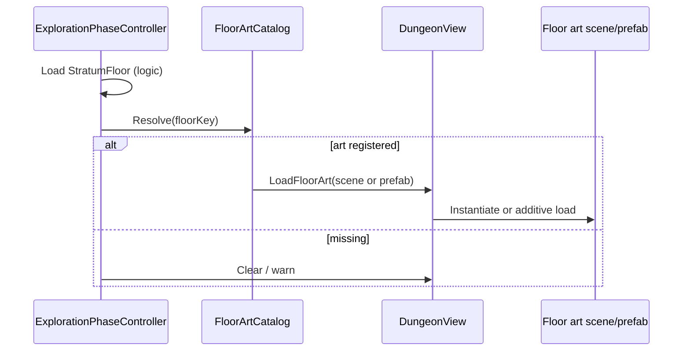

# Floor art — FPV corridor props

**Status:** Draft  
**Implementation:** [#102](https://github.com/miramocha/griddungeon-game/issues/102)  
**Follows:** [Editor floor art grid rig #92](https://github.com/miramocha/griddungeon-game/issues/92)  
**Not:** [Map cell art](map-cell-art.md) (2D HUD `MapView`) or [floor level painter](floor-level-painter.md) (logic tiles / FOE / export)

## Summary

Artists author **3D corridor props** on the same **20×20** grid as exploration logic (`StratumFloor`). **`FloorArtGrid`** (Editor) aligns overlays and snap to `ExplorationWorldSpace.CellCornerToWorld` (10 u/cell). This spec adds:

1. **Populate** — inspector list of wall/block prefabs + button to place one random full-cell prop on each **non-walkable** logic cell (with skips).
2. **Runtime presentation** — load the authored floor art scene (or prefab) during exploration so Play Mode shows the same meshes artists built (not per-cell spawn from `StratumFloor` in v1).

Logic, collision, map reveal, and encounters remain **`StratumFloor` + Core** only ([ADR 002](../../decisions/002-mapping-model.md)).

## Context

| Layer | Authority | Presentation |
|-------|-----------|----------------|
| Grid rules | `StratumFloor` SO, layout builders | — |
| 2D map HUD | `MapSystem` + `MapView` | Sprites / composite walls ([#38](https://github.com/miramocha/griddungeon-game/issues/38)) |
| FPV dungeon | Same walkability as SO | `Assets/Scenes/Floors/{floorKey}.unity` under `FloorArtRoot/Props` |

**Grid model:** `cell.X` → world **X**, `cell.Y` → world **Z**, north **+Z**; anchor = **cell corner** `(x, 0, z)` ([02 — Dungeon navigation](../02-dungeon-navigation.md)).

**World scale (MVP1 FPV):** Logic grid stays **20×20** cells; each cell is **`10` Unity world units** on XZ (`ExplorationGridMetrics.WorldUnitsPerCell` in game `GridDungeon.Core`). Corner `(0,0)` → world `(0, 0, 0)`; cell `(3, 4)` → `(30, 0, 40)`. FPV eye height default **3** units (`0.3 × cell size`). Floor art scenes use **`FloorArtGrid.Cell Size = 10`**; legacy scenes authored at **1** unit/cell get prop positions expanded at runtime via `FloorArtLayoutSpacing.Apply` (populate + hand-placed generated props only).

**Prior art:** [#92](https://github.com/miramocha/griddungeon-game/issues/92) shipped `FloorArtGrid`, template scene, walkability/pin gizmos, **Snap Selected To Grid**. `DungeonView.RenderCell` remains a stub — runtime FPV is **scene load**, not blobber cell rendering.

## Locked decisions (Populate v1)

| Topic | Decision |
|-------|----------|
| Target cells | `IsWalkable == false` on assigned `StratumFloor` |
| Skip | Layout symbol **`X`** (story / tutorial blocker cells) — hand-place art later |
| Prefab model | **One full-cell** block per targeted cell |
| Position | **Cell center** — `FloorArtGrid.GridToCellCenterWorld(x, y)` (center-pivoted prefab) |
| Rotation | **Prefab default** only (random Y spin planned; requires center pivot) |
| Prefab list | Serialized `GameObject[]` (prefab references); **uniform** random |
| Re-run Populate | Destroy only objects marked **auto-generated**, then fill again |
| Auto-generated marker | `FloorArtGeneratedProp` component (or equivalent) on instantiated instances |
| Undo | `Undo.RegisterCreatedObjectUndo` / destroy via Undo on clear |
| Parent | All spawned instances under **`Props`** child of `FloorArtRoot` |
| Lighting / volumes | Under **`FloorArtRoot`** (`Lighting/`, `Volumes/`) — not scene root; mounts with art at runtime ([game README](https://github.com/miramocha/griddungeon-game/blob/main/Assets/Scenes/Floors/README.md#lighting-and-volumes)) |
| Later | Gather (`C`/`G`), stairs/entry pins, key markers, modular edge walls, seeded/weighted picks |

## Locked decisions (Runtime v1)

| Topic | Decision |
|-------|----------|
| Source | **Authored floor art** the artist built in Editor (scene or exported prefab) |
| Not in v1 | `DungeonView` spawning wall prefabs per cell from `StratumFloor` at runtime |
| Load trigger | When `ExplorationPhaseController` activates a floor matching `floorKey` |
| Unload | Previous floor art instance unloaded/hidden on floor change or leaving exploration |
| Catalog | `FloorArtCatalog` (or similar) SO: `floorKey` → scene asset **or** `FloorArtRoot` prefab |
| Missing art | Log warning; exploration continues (map + movement); FPV may be empty |
| Alignment | Art root at world origin; corner math matches `ExplorationWorldSpace` / `FloorArtGrid.GridToWorld` |
| Cell size | **`10`** world units per logic cell on new floors; `FloorArtLayoutSpacing` expands legacy **1** u/cell **generated** props at load |
| Stale load | Cancel in-flight additive scene load when floor changes before load completes |
| Build | Shipped floors’ art scenes/prefabs must be **included in player build** (see game README — differs from #92 template-only note) |

## Editor — Populate workflow

1. Open floor art scene (e.g. `Assets/Scenes/Floors/s1_B1F.unity`).
2. Assign `StratumFloor` on **Floor Art Grid**; enable **Show Blocked Overlay** to verify alignment.
3. Assign **Wall Block Prefabs** list on `FloorArtGrid`.
4. Click **Populate Wall Blocks** (name TBD).
5. Tool iterates `x ∈ [0, width)`, `y ∈ [0, height)`; for each cell:
   - If not walkable **and** not a populate skip → pick random prefab, `Instantiate` under `Props` at cell center, add `FloorArtGeneratedProp`.
6. Hand-edit: move/delete individual props; use **Snap Selected To Grid** for tweaks.
7. Re-run Populate → only removes objects with `FloorArtGeneratedProp`, then regenerates.

### Populate skip rules (v1)

| Rule | Rationale |
|------|-----------|
| `IsWalkable == true` | Walkable floor — walls only for v1 |
| Layout symbol **`X`** | Story/tutorial blocker (e.g. B1F `(10,13)`); impassable but not a generic wall mesh |
| (Future) `FloorArtKeyCellMarker` | Scripted pins — manual art |
| (Future) Gather / stairs pins | Separate auto-fill passes |

**Implementation note:** Skip for `X` can use campaign constants where they exist (e.g. `S1CampaignResolver.B1FTutorialBlockerCell`) **and** treat any authored tile that maps from symbol `X` in layout builders as skipped when a symbol lookup is available; otherwise maintain a small static skip list per floor until painter [#75](https://github.com/miramocha/griddungeon-game/issues/75) stores symbol on `FloorTileData`.

## Runtime — Load authored art

- **Additive scene** or **prefab instance** under `DungeonView` transform — pick one in implementation; prefab avoids duplicating lighting per scene if desired.
- **Combat:** `CombatPhaseController` hides `DungeonView` (existing); floor art root hides with it.
- **Alignment:** Art root at world origin `(0,0,0)`; same as Editor floor scenes.

## Floor transitions — MVP1 vs planned transition scene

**MVP1 (shipped):** Stairs and campaign floor changes stay in **Exploration**. `ExplorationPhaseController.TryLoadTargetFloor` calls `FloorArtPresenter.LoadFloorArt` once per floor key after map/foe data are ready. Each call begins with `UnloadFloorArt()` (cancel in-flight additive load, destroy mounted root, unload prior additive scene path). Manual QA (rapid stair use with **Z**) is the primary check; this path is **sequential**, not same-frame B1F→B2F.

**Deferred hardening ([game #102](https://github.com/miramocha/griddungeon-game/issues/102) follow-up):** Play Mode tests that rapid-fire `LoadFloorArt` without a transition beat exposed edge cases (stale coroutine after back-to-back calls, cancel mid additive load at 90% progress, flaky `sceneLoaded` vs in-flight flags). **Not treated as a release blocker** while stairs behave in Play Mode; follow-up PR was reverted after test hangs.

**Planned transition scene (post-MVP1):** When a dedicated **floor transition** beat exists (fade / full-screen / short additive scene), floor art should load **only during that beat**, in order:

1. Transition starts (input gated, exploration hidden or masked).
2. `UnloadFloorArt()` for the leaving floor — wait until unload completes if additive.
3. `LoadFloorArt(floorKey, catalog)` for the entering floor — wait until mount or fail before ending transition.
4. Transition ends — show exploration on the new floor.

**Design rules (lock when implementing transition):**

| Rule | Why |
|------|-----|
| **Single owner** for committing floor art per floor change | Avoid `LoadFloorArt` from both transition and `ExplorationPhaseController` on the same frame. |
| **No overlapping additive loads** | Prevents stale `s1_B*n*F` scenes and wrong mounted `FloorArtRoot`. |
| **Revisit cancel / `sceneLoaded` unsubscribe** when transition can abort or skip | Only needed if load can be interrupted mid-beat; happy-path transition makes this rare. |
| **Replace or rewrite** `FloorArtPresenterPlayModeTests` | Tests should drive transition enter → load → exit, not raw double `LoadFloorArt` on one frame. |

If transition is **visual only** (fade on top, same synchronous `TryLoadTargetFloor` underneath), runtime behavior stays close to MVP1; the win is when transition **serializes** unload before load.

## Out of scope (this feature)

| Item | Track separately |
|------|------------------|
| Modular N/E/S/W wall pieces from `WallMask` | FPV v2 or shared with map art rules |
| Auto-place gather, doors, stairs meshes | Follow-up populate modes |
| `DungeonView.RenderCell` blobber / per-cell swaps | Optional later |
| Replacing `StratumFloor` collision from meshes | Never — logic SO only |

## Implementation checklist (game repo)

### Phase A — Editor Populate

- [x] `FloorArtGrid`: serialize `GameObject[] m_wallBlockPrefabs`
- [x] `FloorArtGeneratedProp` marker type
- [x] `FloorArtPopulate` static/editor service: enumerate cells, skip rules, instantiate, Undo
- [x] `FloorArtGridEditor`: **Populate Wall Blocks** + **Clear Generated Props** buttons; validation (floor assigned, list non-empty)
- [x] Update `Assets/Scenes/Floors/README.md`

### Phase B — Runtime load

- [x] `FloorArtCatalog` SO under `Assets/Content/FloorArt/`
- [x] `FloorArtPresenter`: load/unload by `floorKey` under `DungeonView`
- [x] `ExplorationPhaseController`: load after floor SO ready; cancel in-flight additive loads on floor change
- [x] Register `s1_B1F` / `B2F` / `B3F` in catalog + **Build Settings**
- [ ] DevBootstrap F2 manual: visible walls match blocked overlay

## Acceptance criteria

1. With `s1_B1F.asset` assigned, **Populate** fills every `#` wall cell with a prefab from the list at the cell center; cell `(10,13)` (**X**) has **no** generated prop.
2. Second **Populate** removes only generated props, not hand-placed props without the marker.
3. Play Mode on B1F after art is registered: player sees authored wall meshes; movement/collision unchanged from SO.
4. Switching floors unloads prior art; no duplicate roots.
5. No new logic in player assemblies that mutates `StratumFloor` tiles.

## Test plan

### Automated

- [x] Edit Mode: `FloorArtPopulateTests` — mock 3×3 floor, skip list, corner math parity (`ExplorationWorldSpace` vs planner), `FloorArtLayoutSpacing.Apply`
- N/A Play Mode batch (Editor open policy)

### Manual (Editor)

1. `s1_B1F.unity` + blocked overlay → **Populate** → compare outer ring to red gizmo cells; confirm no prop at tutorial **X**.
2. Hand-place extra prop under `Props` → **Populate** again → hand prop remains.

### Manual (Play Mode)

- **Scene:** `DevBootstrap.unity` — **F2** exploration on `s1_B1F`
- **Expected:** FPV shows populated corridor art; map still 2D schematic; combat **F3** hides FPV

### Spec / ADRs

- [ADR 002](../../decisions/002-mapping-model.md), [ADR 001](../../decisions/001-grid-movement.md), [02 — Dungeon navigation](../02-dungeon-navigation.md)

## Related

- [04-tech-notes — Map authoring](../04-tech-notes.md#map-authoring--hud-adr-002)
- [Exploration UI — DungeonView](exploration-ui.md#phase-system-vs-ui-visibility)
- Game: `Assets/Scenes/Floors/README.md`, [#92](https://github.com/miramocha/griddungeon-game/issues/92), [#102](https://github.com/miramocha/griddungeon-game/issues/102)
