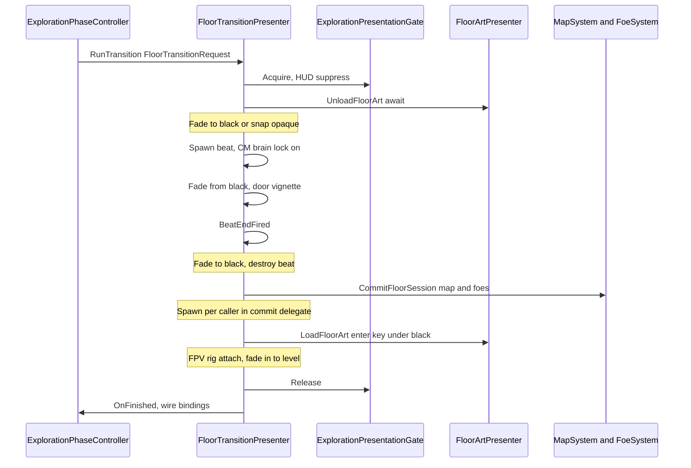
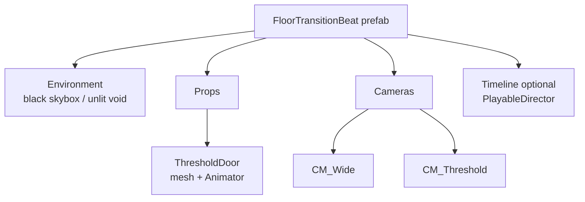

---
tags:
  - path/docs/02-systems
  - type/system
  - scope/required
  - status/accepted
  - domain/exploration
  - domain/phase
---
# Floor transition vignette

**Scope:** [Required](../00-release-scope.md#required-first-playable)

**Shipped:** Locked ([ADR 032](../../decisions/032-floor-transition-vignette-mvp1.md))
**Implementation:** [game epic #114](https://github.com/miramocha/griddungeon-game/issues/114) ([#115](https://github.com/miramocha/griddungeon-game/issues/115)–[#118](https://github.com/miramocha/griddungeon-game/issues/118)); builds on [#102](https://github.com/miramocha/griddungeon-game/issues/102)  
**Related:** [floor art FPV](floor-art-fpv.md), [game phase](game-phase.md), [hub and services](hub-and-services.md), [uvs phase presentation](uvs-phase-presentation.md)

## Summary

When the party **changes exploration floor** (stairs, hub re-entry, campaign target) or **returns to hub** from exploration (gate `stairsUp`), the game plays a short **loading-room style** beat: **black background**, **3D threshold prop** (door, hatch, closet), **Cinemachine** camera move, then reveals the destination. Floor **map/foe commit** runs **after** the door vignette ends (`NotifyBeatEnd` or catalog `DurationMaxSeconds` timeout), on the **second fade to black** — then destination floor art loads under black before the final fade-in. Macro phase stays **Exploration** for floor-to-floor moves and switches to **Hub** when leaving the stratum.

References: Resident Evil door transitions; *Labyrinth of Galleria* closet step-in on black.

**Not in scope:** walkable transition rooms; per-cell procedural doors; combat skill cinematics ([ADR 027](../../decisions/027-combat-cinematic-timeline-events.md)).

---

## Triggers

| Trigger | Caller | Default beat |
|---------|--------|----------------|
| Stairs up / down (exploration floors) | `ExplorationPhaseController.TryChangeFloor` | `stairs_default` |
| Exploration → **Hub** (gate `stairsUp`) | `ExplorationPhaseController.TryReturnToHub` | `hub_return_from_exploration` or fade fallback |
| Hub → Enter Stratum | `HubController.TryLeaveHub` → `ExplorationPhaseController.BeginHubEnterTransition` on exploration enter from Hub | `hub_enter_stratum` or fade fallback |
| Campaign floor jump (same API) | `TryChangeFloor` | catalog resolve |

Hub enter/leave use catalog destination key **`hub`** (no floor art load). Other scripted hub returns (story, wipe) may stay instant until wired to the same presenter.

---

## Architecture

| Type | Responsibility |
|------|----------------|
| **`FloorTransitionPresenter`** | Only owner of transition coroutine; beat lifecycle; calls commit delegate |
| **`ExplorationPhaseController`** | Campaign validation; builds `S1ExplorationTarget`; does **not** call `LoadFloorArt` directly when presenter is active |
| **`FloorTransitionCatalog`** | `beatId` or `(leaveKey, enterKey)` → prefab / Timeline |
| **`ExplorationPresentationGate`** | Blocks explore input + HUD interaction |
| **`ExplorationCameraRig`** | Off during beat; FPV re-attached **under black** before final fade-in |
| **`ExplorationCameraSession`** | Cinemachine brain lock during beat; manual FPV parenting when brain off |
| **`ScreenFadePresenter`** | UITK full-screen fade; lerps from **current** alpha (no flash when already black) |
| **Beat prefab** | Prop + `CinemachineCamera`(s) + `PlayableDirector` optional; runtime spawn at **`y = -100`** by default |

**Authority:** [ADR 017](../../decisions/017-game-phase-controller.md) — no new `GamePhase`.

---

## Beat content (authoring)

**Step-by-step prefab + catalog guide:** [Authoring floor transition beats](../04-dev/authoring-floor-transition-beats.md) (game menu paths, `stairs_default` hierarchy, QA).

### Prefab layout

### ScriptableObject catalog row

| Field | Purpose |
|-------|---------|
| `beatId` | e.g. `stairs_default` |
| `BeatPrefab` | Vignette root |
| `DurationMaxSeconds` | Safety timeout if `BeatEndFired` never fires |
| `leaveFloorKey` / `enterFloorKey` | Optional filter; empty = wildcard |

### Beat signals (`FloorTransitionBeat`)

| Signal | Presenter use |
|--------|----------------|
| **`NotifyBeatEnd()`** | **Required** — ends door vignette; commit + floor art load run **after** this (or `DurationMaxSeconds` timeout) |
| **`NotifyThreshold()`** | Optional mid-beat (SFX, door open); does **not** commit floor |
| **`FloorTransitionBeatTimelineEnd`** | Optional — `PlayableDirector.stopped` → `NotifyBeatEnd()`; skips auto beat-end timer on `FloorTransitionBeat` |

Auto-timed signals: `FloorTransitionBeat` `m_thresholdSeconds` / `m_beatEndSeconds`, or Timeline via the helper above.

---

## Visibility during beat

| Element | Behavior |
|---------|----------|
| `DungeonView` / floor art | Screen fade covers the leave-floor slice; **`DungeonView` stays active** during unload/load so `FloorArtPresenter` coroutines are not stopped. Hub destination hides `DungeonView` after a successful handoff. |
| `ExplorationMapCoordinator` | Minimap slide retract on leave; slide in with screen on reveal — [gotchas § Map chrome vs floor transition](../04-dev/centralized-ui-gotchas.md#map-chrome-vs-floor-transition-screen-fade-explorationmapcoordinator) |
| Exploration HUD | Gated |
| Input | Off (`ExplorationPresentationGate` + `InputRouter` explore map) |
| Combat | N/A — transitions only from exploration |

---

## Cinemachine

- Package: `com.unity.cinemachine` **3.x** (see game `Packages/manifest.json`).
- **One** `CinemachineBrain` on main camera in bootstrap.
- Transition vcams use **priority** over exploration follow (`ExplorationCameraRig` may stay off Cinemachine until a later migration).
- **`ExplorationCameraSession.SetTransitionBrainLock`** keeps the brain enabled for the whole beat; do not disable mid-vignette from rig detach or bootstrap hooks.
- Main camera stays on the scene root during beats (not parented to `PartyPose`) so hiding party visuals does not trigger “no cameras rendering”.

---

## Fallback

If catalog has no beat for the pair:

1. Full-screen **fade to black** (~**0.4** s half-duration default in `FloorTransitionPresenter`).
2. Same unload → commit → load sequence **without** 3D vignette.
3. Fade up.

Exploration must never soft-lock if art is missing.

---

## Acceptance criteria

1. B1F↔B2F stairs: player sees **black + 3D threshold** beat; movement blocked until complete.
2. Floor logic and FPV art match destination after beat; no duplicate `FloorArtRoot`.
3. Rapid stair use (spam **Z**) does not leave stale additive floor scenes.
4. Hub → B1F gate entry uses transition or documented fade fallback.
5. Missing beat asset: fade-only path still changes floor correctly.

---

## Test plan

### Automated

- Edit Mode: `FloorTransitionCatalogResolveTests`, `FloorTransitionBeatSignalTests`, commit guard.
- Play Mode: `FloorTransitionPlayModeTests` — fade-only unload/commit/load, hub destination, overlapping request reject ([#117](https://github.com/miramocha/griddungeon-game/issues/117)).

### Manual

- **Scene:** `DevBootstrap.unity` — **F2** exploration
- **Steps:** Stairs B1F→B2F→B3F and back; hub enter stratum; spam stairs during beat
- **Expected:** Vignette plays; spawn correct; no input during beat; FPV shows new floor art after

---

## Implementation checklist (game repo)

- [x] `CinemachineBrain` on main camera (DevBootstrap)
- [x] `FloorTransitionPresenter` + `FloorTransitionCatalog` + `ScreenFadePresenter` (UITK)
- [x] `TryChangeFloor` / hub enter via presenter; hub commit spawns party before final fade-in
- [x] Presenter-owned `LoadFloorArt` / unload (no duplicate load on same transition)
- [x] Content: `Assets/Scenes/Transitions/Prefabs/stairs_default.prefab` + catalog sync menu
- [x] `NotifyBeatEnd` ends door vignette; commit + load after second fade (see [authoring guide](../04-dev/authoring-floor-transition-beats.md))
- [x] Play Mode smoke tests (`FloorTransitionPlayModeTests`, fade-only path)
- [ ] Play Mode automated test with live beat prefab + Cinemachine ([#102](https://github.com/miramocha/griddungeon-game/issues/102)); manual QA per acceptance criteria above

---

## Related docs
- [Authoring floor transition beats](../04-dev/authoring-floor-transition-beats.md)
- [Floor art FPV — transitions](floor-art-fpv.md#floor-transitions)
- [ADR 032](../../decisions/032-floor-transition-vignette-mvp1.md)
