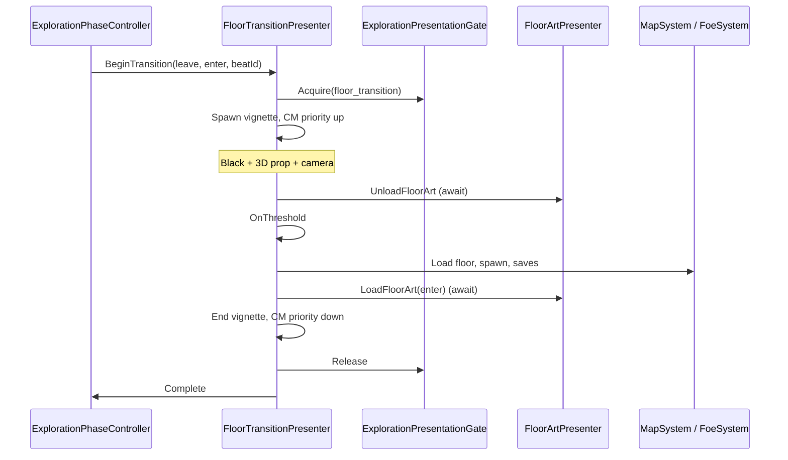

# Floor transition vignette

**Status:** Locked for MVP1 ([ADR 032](../../decisions/032-floor-transition-vignette-mvp1.md))  
**Implementation:** [game epic #114](https://github.com/miramocha/griddungeon-game/issues/114) ([#115](https://github.com/miramocha/griddungeon-game/issues/115)–[#118](https://github.com/miramocha/griddungeon-game/issues/118)); builds on [#102](https://github.com/miramocha/griddungeon-game/issues/102)  
**Related:** [floor art FPV](floor-art-fpv.md), [game phase](game-phase.md), [hub and services](hub-and-services.md), [uvs phase presentation](uvs-phase-presentation.md)

## Summary

When the party **changes exploration floor** (stairs, hub re-entry, campaign target) or **returns to hub** from exploration (gate `stairsUp`), MVP1 plays a short **loading-room style** beat: **black background**, **3D threshold prop** (door, hatch, closet), **Cinemachine** camera move, then reveals the destination. Floor data commits **during** the beat; macro phase stays **Exploration** for floor-to-floor moves and switches to **Hub** when leaving the stratum.

References: Resident Evil door transitions; *Labyrinth of Galleria* closet step-in on black.

**Not in scope:** walkable transition rooms; per-cell procedural doors; combat skill cinematics ([ADR 027](../../decisions/027-combat-cinematic-timeline-events.md)).

---

## Triggers (MVP1)

| Trigger | Caller | Default beat |
|---------|--------|----------------|
| Stairs up / down (exploration floors) | `ExplorationPhaseController.TryChangeFloor` | `stairs_default` |
| Exploration → **Hub** (gate `stairsUp`) | `ExplorationPhaseController.TryReturnToHub` | `hub_return_from_exploration` or fade fallback |
| Hub → Enter Stratum | `HubController.TryLeaveHub` → exploration load | `hub_enter_stratum` or fade fallback |
| Campaign floor jump (same API) | `TryChangeFloor` | catalog resolve |

Hub enter/leave use catalog destination key **`hub`** (no floor art load). Other scripted hub returns (story, wipe) may stay instant until wired to the same presenter.

---

## Architecture



| Type | Responsibility |
|------|----------------|
| **`FloorTransitionPresenter`** | Only owner of transition coroutine; beat lifecycle; calls commit delegate |
| **`ExplorationPhaseController`** | Campaign validation; builds `S1ExplorationTarget`; does **not** call `LoadFloorArt` directly when presenter is active |
| **`FloorTransitionCatalog`** | `beatId` or `(leaveKey, enterKey)` → prefab / Timeline |
| **`ExplorationPresentationGate`** | Blocks explore input + HUD interaction |
| **`ExplorationCameraRig`** | Unchanged for FPV; deactivated or lower priority while transition vcams live |
| **Beat prefab** | Prop + `CinemachineCamera`(s) + `PlayableDirector` optional |

**Authority:** [ADR 017](../../decisions/017-game-phase-controller.md) — no new `GamePhase`.

---

## Beat content (authoring)

**Step-by-step prefab + catalog guide:** [Authoring floor transition beats](../04-dev/authoring-floor-transition-beats.md) (game menu paths, `stairs_default` hierarchy, QA).

### Prefab layout

```text
FloorTransitionBeat (prefab)
├── Environment (black skybox / unlit void)
├── Props/
│   └── ThresholdDoor (mesh + Animator)
├── Cameras/
│   ├── CM_Wide
│   └── CM_Threshold
└── Timeline (optional PlayableDirector)
```

### ScriptableObject catalog row

| Field | Purpose |
|-------|---------|
| `beatId` | e.g. `stairs_default` |
| `prefab` | Vignette root |
| `durationMax` | Safety timeout if `BeatEndFired` never fires |
| `leaveFloorKey` / `enterFloorKey` | Optional filter; empty = wildcard |

### Beat signals (`FloorTransitionBeat`)

| Signal | MVP1 presenter use |
|--------|-------------------|
| **`NotifyBeatEnd()`** | **Required** — ends door vignette; commit + floor art load run **after** this (or `durationMax` timeout) |
| **`NotifyThreshold()`** | Optional mid-beat (SFX, door open); does **not** commit floor in current presenter |
| **`FloorTransitionBeatTimelineEnd`** | Optional — `PlayableDirector.stopped` → `NotifyBeatEnd()`; skips auto beat-end timer on `FloorTransitionBeat` |

Auto-timed signals: `FloorTransitionBeat` `m_thresholdSeconds` / `m_beatEndSeconds`, or Timeline via the helper above.

---

## Visibility during beat

| Element | Behavior |
|---------|----------|
| `DungeonView` / floor art | Hidden before unload; new art loaded before reveal |
| `MapView` | Hidden or frozen |
| Exploration HUD | Gated |
| Input | Off (`ExplorationPresentationGate` + `InputRouter` explore map) |
| Combat | N/A — transitions only from exploration |

---

## Cinemachine (MVP1)

- Package: `com.unity.cinemachine` **3.x** (see game `Packages/manifest.json`).
- **One** `CinemachineBrain` on main camera in bootstrap.
- Transition vcams use **priority** over exploration follow (exploration may keep `ExplorationCameraRig` without CM migration in MVP1).

---

## Fallback

If catalog has no beat for the pair:

1. Full-screen **fade to black** (~0.25 s).
2. Same unload → commit → load sequence **without** 3D vignette.
3. Fade up.

Exploration must never soft-lock if art is missing.

---

## MVP1 acceptance criteria

1. B1F↔B2F stairs: player sees **black + 3D threshold** beat; movement blocked until complete.
2. Floor logic and FPV art match destination after beat; no duplicate `FloorArtRoot`.
3. Rapid stair use (spam **Z**) does not leave stale additive floor scenes.
4. Hub → B1F gate entry uses transition or documented fade fallback.
5. Missing beat asset: fade-only path still changes floor correctly.

---

## Test plan

### Automated

- Edit Mode: catalog resolve, single-commit guard, threshold vs end-only policy.
- Play Mode (when Editor closed or user runs): transition coroutine — enter → unload → load → exit ([#102](https://github.com/miramocha/griddungeon-game/issues/102) rewrite).

### Manual

- **Scene:** `DevBootstrap.unity` — **F2** exploration
- **Steps:** Stairs B1F→B2F→B3F and back; hub enter stratum; spam stairs during beat
- **Expected:** Vignette plays; spawn correct; no input during beat; FPV shows new floor art after

---

## Implementation checklist (game repo)

- [ ] `CinemachineBrain` on main camera (DevBootstrap)
- [ ] `FloorTransitionPresenter` + `FloorTransitionCatalog`
- [ ] Refactor `TryChangeFloor` / hub enter to use presenter
- [ ] Remove duplicate `LoadFloorArt` from direct `TryLoadTargetFloor` path when presenter runs
- [ ] Content: `Assets/Scenes/Transitions/stairs_default` prefab
- [ ] `FloorTransitionBeat.NotifyBeatEnd` ends vignette; commit after second fade (see [authoring guide](../04-dev/authoring-floor-transition-beats.md))
- [ ] Play Mode / manual QA per acceptance criteria above

---

## Related

- [Authoring floor transition beats](../04-dev/authoring-floor-transition-beats.md)
- [Floor art FPV — transitions](floor-art-fpv.md#floor-transitions--mvp1-locked)
- [ADR 032](../../decisions/032-floor-transition-vignette-mvp1.md)
- [mvp1-spec](../mvp1-spec.md)
