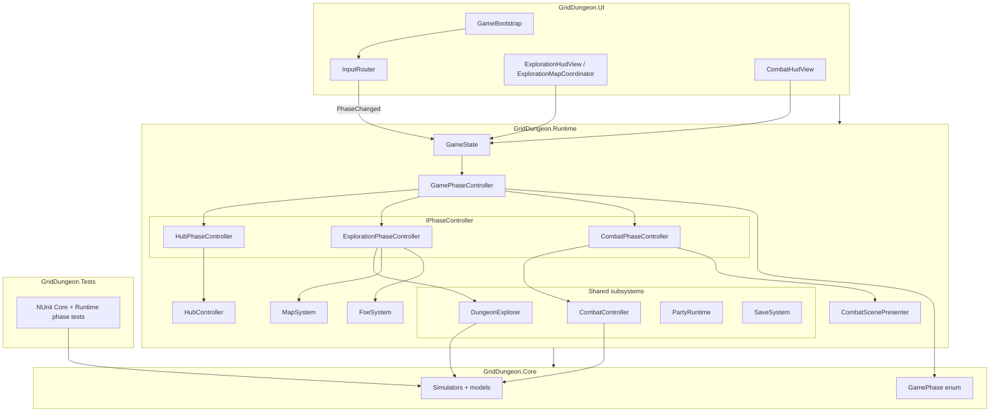
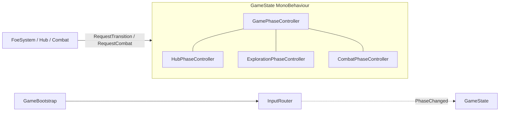
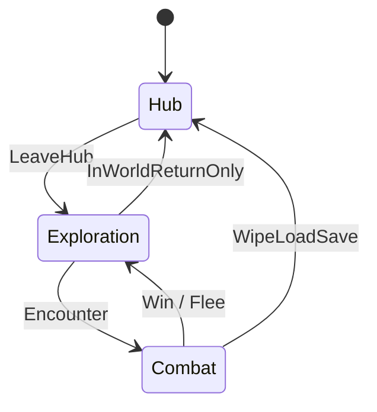
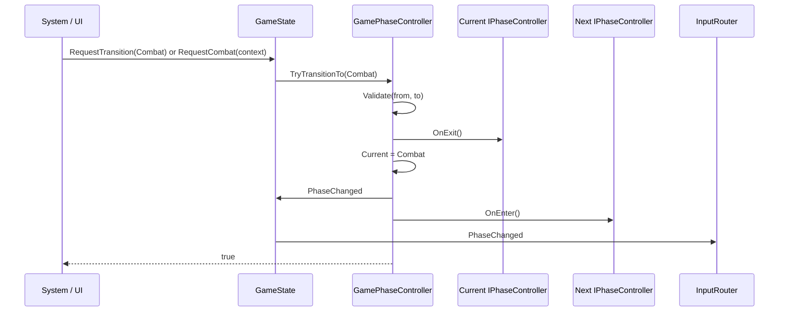
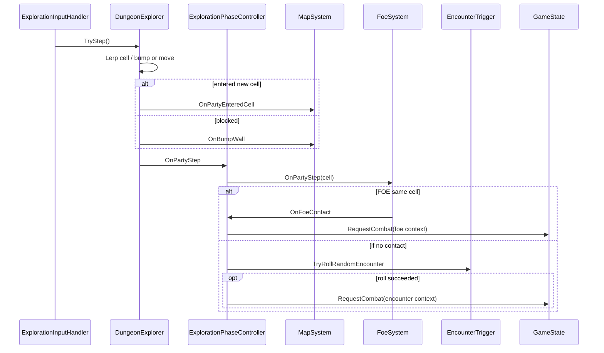
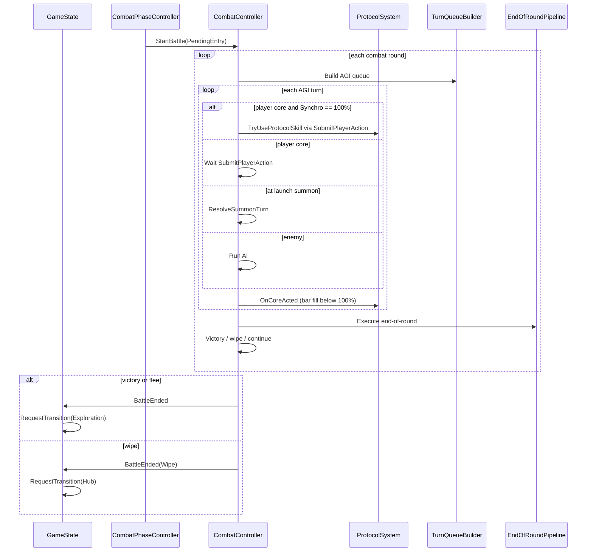

---
tags:
  - path/docs/02-systems
  - type/system
  - scope/required
  - status/accepted
  - domain/phase
---
# Game Phase (Hub / Exploration / Combat)

Macro runtime modes at launch. **Locked:** pure C# orchestration ([ADR 017](../../decisions/017-game-phase-controller.md)). Unity Visual Scripting state graphs are **not** used for phase authority at launch.

## Design goals at launch

These goals drive the split between **macro phases** (this doc), **assemblies** ([class design](../05-class-design.md)), and **combat rounds** ([combat](combat.md)).

| Goal | How the architecture supports it |
|------|-----------------------------------|
| **Test damage + AGI without Unity** | Rules live in `GridDungeon.Core` (`DamageCalculator`, `TurnQueueBuilder`, �); `GridDungeon.Tests` references Core (and Runtime for `GamePhaseController` phase tests) |
| **Hub ? explore ? combat loop** | `GamePhase` enum + `GamePhaseController.TryTransitionTo` + three `IPhaseController` Enter/Exit hooks |
| **Spec-locked combat flow** | Protocol (core turn) ? AGI queue ? end-of-round stays on `CombatController`; not duplicated in phase controllers |
| **Content in data, not code** | ScriptableObjects in Runtime; Core uses DTOs at boundaries (no `SkillDefinition` in simulators) |
| **FOE + map + flee rules** | `ExplorationPhaseController` wires `DungeonExplorer` events ? `MapSystem`, `FoeSystem`; combat entry via `GameState.RequestCombat` |
| **Clear input per mode** | `InputRouter` reacts to `GameState.PhaseChanged`; one authoritative phase enum for UI and action maps |
| **Inspectable, reviewable flow** | Phase transitions in C# (grep, diff, PR review); optional UVS later for presentation only |
| **Single responsibility** | `GameState` = composition root; `GamePhaseController` = transitions; phase controllers = lifecycle; subsystems = domain rules |

## Layer stack

Macro phases sit in **Runtime**; they orchestrate subsystems but do not implement combat math or grid rules.



**Authority rule:** only `GamePhaseController` changes `GamePhase`. UI and gameplay code call `GameState.RequestTransition` or `GameState.RequestCombat`; they do not toggle scenes or input maps directly.

**Exploration HUD** (`ExplorationHudView`, `ExplorationMapCoordinator`, pause overlay) and **Combat HUD** (`CombatHudView`) ship in the game repo; wiring and bind lifecycle are documented in [exploration UI](exploration-ui.md) and [combat](combat.md). **Dev-only** `GamePhaseDevHudView` remains for macro-phase smoke tests (see [Dev bootstrap HUD](#dev-bootstrap-hud-ui-toolkit)).

## Terminology

| Term | Scope | Owner |
|------|--------|--------|
| **Game phase** | Hub, Exploration, Combat | `GamePhaseController` |
| **Combat round** | One full AGI cycle + end-of-round ticks | `CombatController` |
| **Combat sub-phase** | AGI turn (incl. Protocol on core turn) ? end-of-round within one battle | `CombatController` (`CombatPhase` enum) |

Do not conflate **game phase** with **combat sub-phase**.

## Architecture (composition)



ASCII equivalent:

```
GameState (MonoBehaviour, composition root)
+-- GamePhaseController          ? authoritative GamePhase + transitions
+-- HubPhaseController           ? IPhaseController
+-- ExplorationPhaseController ? IPhaseController
+-- CombatPhaseController        ? IPhaseController
+-- PartyRuntime, SaveSystem, ContentDatabase, �
+-- (shared subsystems referenced by phase controllers)

GameBootstrap (UI)               ? InputRouter.Bind(GameState) on Start
InputRouter                      ? enables action maps from GameState.PhaseChanged
```

### Responsibilities

| Type | Role |
|------|------|
| **`GamePhase`** (`Core` enum) | `Hub`, `Exploration`, `Combat` |
| **`GamePhaseController`** | `BeginAt`, `TryTransitionTo`, `PhaseChanged`, transition validation |
| **`GameState`** | Scene lifetime, serialized refs; forwards `PhaseChanged`; `RequestTransition` / `RequestCombat`; subscribes to `CombatController.BattleEnded` for post-battle phase changes |
| **`HubPhaseController`** | Enter hub UI/services; exit clears exploration-only listeners |
| **`ExplorationPhaseController`** | Wire `DungeonExplorer` events ? `MapSystem`, `FoeSystem`, `EncounterTrigger`; step handler requests combat via `RequestCombat` |
| **`CombatPhaseController`** | Battle presentation enter/exit (view, aura, scene); calls `CombatController.StartBattle` � does **not** request macro phase transitions when battle ends |
| **`CombatController`** | Synchro Charge + Protocol, AGI queue, flee, victory � **unchanged by this doc** |

## Phase diagram



## Transition flow (sequence)



## Who requests transitions

| Trigger | Requested phase | Caller | Game repo at launch |
|---------|-----------------|--------|------------------|
| **New game** (S1 Act 1) | Exploration | Bootstrap ? `s1_B1F` intro spawn ([campaign S1 intro](../03-content/campaign/s1-intro.md)) | Planned � dev boot uses `BeginAt(Hub)` |
| Player leaves inn / enters stratum | Exploration | `HubController.LeaveHub` � S1: **B1F gate**; S2+: warp gate if `UnlockedWarpGateStrata` | `LeaveHub` ? `RequestTransition(Exploration)`; hub UI stub |
| Hub **Side expedition** (optional) | Exploration | `HubController.EnterSideDungeon` � spawn at side floor entry ([side dungeons](side-dungeons.md)) | optional |
| First-floor **stairs up** (gate) ? camp | Hub | `DungeonExplorer` interact ? `GameState` | Planned |
| Side dungeon **exit** `stairsUp` (optional) | Hub | `DungeonExplorer` interact � **hub only** ([ADR 022](../../decisions/022-side-dungeons-mvp3.md)) | optional |
| FOE same cell as party | Combat | `ExplorationPhaseController` ? `GameState.RequestCombat` | Wired |
| Random encounter on step | Combat | `ExplorationPhaseController` ? `GameState.RequestCombat` | Wired |
| Battle won or flee success | Exploration | `GameState` on `CombatController.BattleEnded` | Wired |
| Return to surface / hub | Hub | **In-world only:** gate **stairs up**, **Return thread** item, **exit / gate** (warp, side-dungeon exit), scripted **event** � not exploration pause | Gate stairs wired; items/events/gates per content |
| Party wipe (**defeat**) | Hub | `GameState` on `BattleEnded(Wipe)` | Wired |
| Exploration **pause** ? title | *(out of macro phase)* | `Esc` ? confirm **Quit to title** (title scene / app exit); **no save write**; does **not** enter Hub | Wired when title flow exists; dev: stop Play / `Application.Quit` |

Combat **never** transitions directly to Hub on flee � only Exploration (FOE remains on map).

**Exception (S1 tutorial):** after `foe_alley_stalker` Protocol finisher, `s1_tutorial_hub_return` scripts **`Combat ? Hub`** ([story events � S1 flow](story-events.md#s1-tutorial-flow-foe_alley_stalker)) � not victory-on-B2F exploration.

### Return to hub (exploration only)

Hub is reached from exploration only through **events**, **items**, **exits/gates**, **stairs** (gate), or **defeat** ([ADR 014](../../decisions/014-mvp1-exploration-map.md) �7). Exploration pause does **not** offer �return to hub.�

### Encounter priority (same step)

1. **FOE contact** � if party cell equals FOE cell after step, `RequestCombat` immediately; **no random encounter roll**.
2. **Random encounter** � `EncounterTrigger` rolls only when step completed and no FOE contact fired.

`ExplorationPhaseController.HandlePartyStep` orchestrates both checks (not separate subscribers on `EncounterTrigger`).

## Exploration step flow

While `Current == Exploration`, `ExplorationPhaseController` owns event subscriptions. A single step can end in map reveal, FOE contact combat, or a random encounter.

**FOE patrol advance** after each step is spec�d but **not implemented** in `FoeSystem` yet (contact-only `OnPartyStep` today).



## Combat round flow (within Combat phase)

When `Current == Combat`, **game phase does not change** until the battle ends. Round logic is entirely inside `CombatController`. Macro phase exit is **`GameState.HandleBattleEnded`**, not `CombatPhaseController`.



See [combat](combat.md) for command tables and damage pipeline.

## Phase Enter / Exit checklist

Target behaviour at launch. **Game repo status** (aligned with `griddungeon-game` on 2026-05-21):

| Phase | Checklist item | Status |
|-------|----------------|--------|
| Hub | Show hub UI | Stub (`HubController.EnterHub` empty) |
| Hub | FOE reset when `from == Exploration` | Wired (`ResetActiveExplorationFloors`, `ClearExplorationState`) |
| Exploration | Floor from save/context | Partial � dev hardcodes `s1_B1F`; `TODO(campaign)` |
| Exploration | `FoeSystem.LoadFloor` | Stub |
| Exploration | Event subscriptions + `RequestCombat` on contact/roll | Wired |
| Combat | Presentation enter (view, aura, scene, `StartBattle`) | Wired |
| Combat | Presentation exit (scene hide, aura remove) | Wired |
| Combat | `CombatController` cleanup on macro exit | In `EndBattle` during battle, not `CombatPhaseController.OnExit` |
| Input | Maps per phase via `InputRouter` | Wired via `GameBootstrap.Bind` + `GameState.PhaseChanged` |

### Hub `OnEnter`

- Show hub UI (menu tree at launch)
- `InputRouter` ? `UI` only (via `PhaseChanged`, not called from phase controller)
- `SaveSystem` ready for inn save
- **If `from == Exploration`** (return from labyrinth, ADR 008): `FoeSystem.ResetActiveExplorationFloors`; `SaveSystem.ClearExplorationState`
- **If `from == Hub` or boot** � no FOE reset (inn menu reopen only)

### Hub `OnExit`

- Hide hub UI

### Exploration `OnEnter`

- Load floor from `ContentDatabase` + save snapshot
- `DungeonView.SetVisible(true)`
- `MapSystem.LoadFloor`
- `FoeSystem.LoadFloor`
- Subscribe: `DungeonExplorer.OnPartyStep`, `OnPartyEnteredCell`, `OnBumpWall`
- Subscribe: `FoeSystem.OnFoeContact` ? `RequestCombat`
- `InputRouter` ? `UI`, `Exploration`, `Map` (via `PhaseChanged`)

### Exploration `OnExit`

- Unsubscribe all exploration listeners (avoid leaks)
- Commit map snapshot; clear floor; `DungeonExplorer.StopMovement`
- Optional: pause `DungeonExplorer` input

### Combat `OnEnter`

- `DungeonView.SetVisible(false)` (or dimmed)
- `CombatPhaseController` uses `CombatController.PendingEntry`, calls `StartBattle`
- `CombatScenePresenter` show backdrop + enemy slots
- `AuraSystem.ApplyPassives` for active Navigator
- `InputRouter` ? `UI`, `Combat` (via `PhaseChanged`)

### Combat `OnExit`

- `CombatScenePresenter` teardown
- `AuraSystem.RemovePassives`
- Battle state cleanup remains in `CombatController.EndBattle` when the battle resolves

## API sketch (Runtime)

```csharp
// Core/Enums/GamePhase.cs
enum GamePhase { Hub, Exploration, Combat }

// Runtime/Game/GamePhaseController.cs � plain C#, not MonoBehaviour
sealed class GamePhaseController
{
    public GamePhase Current { get; private set; }
    public event Action<GamePhase, GamePhase> PhaseChanged;

    public void BeginAt(GamePhase phase, IReadOnlyDictionary<GamePhase, IPhaseController> controllers);
    public bool TryTransitionTo(GamePhase next, IReadOnlyDictionary<GamePhase, IPhaseController> controllers);
}

// Runtime/Game/IPhaseController.cs
interface IPhaseController
{
    void OnEnter(GamePhase from);
    void OnExit(GamePhase to);
}

// Runtime/Game/GameState.cs
sealed class GameState : MonoBehaviour
{
    public GamePhase Current => _phaseController.Current;
    public event Action<GamePhase, GamePhase> PhaseChanged;

    public bool RequestTransition(GamePhase phase);
    public bool RequestCombat(CombatEntryContext entry); // SetPendingEntry + Transition(Combat)
}
```

`TryTransitionTo` calls `OnExit` on the old controller, updates `Current`, raises `PhaseChanged` (forwarded by `GameState`), then calls `OnEnter` on the new controller. Presentation subscribers (camera detach/attach, HUD visibility, `InputRouter`) run on `PhaseChanged` **before** phase `OnEnter` so the main camera is unparented from exploration FPV before combat enables the battle vcam. `BeginAt` uses the same order when the phase changes; same-phase `BeginAt` re-enters with `OnEnter` only (no `PhaseChanged`).

## Skill point allocation (UI gate)

**Locked:** [ADR 034](../../decisions/034-skill-point-allocation-outside-combat.md). Class skill trees are editable only when **not** in combat, an active story/VN event, or a cutscene / presentation lock ([character progression � Skill points](character-progression.md#skill-points)).

| Macro phase | Skill trees |
|-------------|-------------|
| **Hub** | Yes � Explorers Guild and party menu paths |
| **Exploration** | Yes � `Tab` party menu / pause **Skills** when no story runner or vignette lock |
| **Combat** | **No** � including post-battle reward UI until back to Exploration or Hub |

Implementation: gate `GuildService` / party skill UI on `GamePhase` + `StoryEventRunner` + presentation gates � not �hub only.�

## Input maps per phase

| Game phase | Input System maps (enabled) |
|------------|---------------------------|
| Hub | `UI` (+ hub-specific if split later) |
| Exploration | `UI`, `Exploration`, `Map` (map overlay pass-through per ADR 014) |
| Combat | `UI`, `Combat` |

Implemented in **`GridDungeon.UI`**: `GameBootstrap` calls `InputRouter.Bind(GameState)`; router subscribes to `GameState.PhaseChanged` (see [class design](../05-class-design.md)). HUD integrators: full runtime event list in [UI event contract](../04-dev/ui-event-contract.md).

## Cold start (`CampaignStartConfig`)

When no inn save exists on disk, `SaveSystem` builds an empty shell via `NewGameBootstrap` + `ContentDatabase.NewGameDefaults`, then `GameBootstrapPhase.ResolveStartPhase` picks the first macro phase from `ContentDatabase.CampaignStart`:

| `CampaignStartType` | First phase | Exploration enter |
|---------------------|-------------|-------------------|
| **Hub** | Hub | N/A until player uses services |
| **Spawn** | Exploration | `PartyEntrySpawnKind.SpawnStart` at floor `partyEntryPoint` |

Hub re-entry from exploration uses `PartyEntrySpawnKind.HubReturn` — spawn/facing from `H` exit link (`FloorExitResolver` + `FloorPartyEntryBuilder`), not the cold-start spawn cell. `HubExitId` on `CampaignStartConfig` selects which hub-return link when multiple `H` markers exist.

Dev **F1/F2** shortcuts bypass this table; production new-game follows the asset on `ContentDatabase`.

## Dev bootstrap HUD (UI Toolkit)

at launch acceptance for macro phases is exercised in **`Assets/Scenes/DevBootstrap.unity`** (local only; menu: **GridDungeon ? Scenes ? Create Dev Bootstrap** in the game repo � run after clone).

| Piece | Location | Role |
|-------|----------|------|
| `GamePhaseDevHud.uxml` / `.uss` | `Assets/UI/Screens/Dev/` | BEM layout: current phase label, transition buttons, flee (combat only) |
| `GamePanelSettings.asset` | `Assets/UI/Settings/` | Shared UI Toolkit **Panel Settings** � wired on `UIDocument` (created by dev bootstrap menu if missing) |
| `GamePhaseDevHudView` | `GridDungeon.UI` / `Dev/` | `UIDocument` presenter; button `clicked` ? `GameState.RequestTransition` / `RequestCombat`; subscribes to `GameState.PhaseChanged` |
| Keyboard | F1�F4 | Hub / Exploration / Combat / flee (same as buttons; Input System `Keyboard`) |
| Keyboard (save / campaign) | F5 / F6 / F8 | Inn save / `S1_PARTY_READY` / reset new game � mirrored in **Save Editor** ([#84](https://github.com/miramocha/griddungeon-game/pull/84)) |
| Keyboard (combat) | U / M | Dev Protocol strike / mend when Synchro ready |
| Editor — **Dev Tools** | `GridDungeon → Tools → Dev Tools` | Phase/combat/party shortcuts (`GridDungeonDevWindow`) — Play Mode actions; not top-menu duplicates |
| Editor — **Save Editor** | `GridDungeon → Tools → Save Editor` | Inn save, delete/reset, Edit Mode JSON write, campaign flag toggles (`CampaignFlagRegistry` ids + `CampaignFlagAccessor` in Core) — [#84](https://github.com/miramocha/griddungeon-game/pull/84), [#325](https://github.com/miramocha/griddungeon-game/pull/325) |
| Editor — **Campaign flags** | `GridDungeon → Content → Ensure Campaign Flag Registry` | Creates/ensures `Assets/Content/Campaign/CampaignFlagRegistry.asset` — authoritative flag id list + Save Editor descriptions ([#325](https://github.com/miramocha/griddungeon-game/pull/325)) |
| Editor — **Dev Tools Map** | `GridDungeon → Tools → Dev Tools Map` | Reveal-all floor preview in Exploration |
| Editor menu policy | [unity-editor-grid-dungeon-menu.mdc](../../.cursor/rules/unity-editor-grid-dungeon-menu.mdc) | Edit Mode authoring on `GridDungeon/` menu; Play Mode dev actions in Dev Tools + F-keys only |

**Play-mode loop:** F1 Hub ? F2 Exploration ? F3 Combat ? F4 flee (? Exploration) ? F1 Hub.

**Save / campaign QA:** Use **Save Editor** for `S1_*` campaign flags and drift vs on-disk save; **B2F complete + inn save** sets `S1_FIRST_FOE_TUTORIAL_COMPLETE` and writes the inn snapshot (B3F stairs). **GridDungeon → Tools → Log MVP1 Save Path** logs the JSON path.

**F3 dev combat roster** (game repo `DevCombatDefaults`, when `PartyRuntime` has no cores): `dev_hero` (AGI 14) + `dev_medic` (AGI 9, **Skill** = ally heal `dev_field_patch`) + `dev_slime` (AGI 5) � for turn-order strip and ally-target keyboard QA until Guild (#13) fills a real party. Production **Combat HUD** (`CombatHudView`, issue #34) binds the same queue; **player command** turns highlight the acting core on the **party roster**, not the AGI strip ([combat.md](combat.md#turn-order-strip-agi-queue-ui)).

Dev UI is **not** authoritative � it only calls `GameState` APIs. Production exploration/combat HUDs are separate `UIDocument` roots; see [exploration UI](exploration-ui.md), [combat](combat.md), and [class design](../05-class-design.md#ui-layer).

## Visual Scripting (later optional)

Full API tables, setup, and **copy-paste examples** (phase change, hub leave, combat entry, `DungeonExplorer` move/spawn, presentation gates): **[UVS � phase & presentation hooks](uvs-phase-presentation.md)**.

Summary:

- Graph **listens** to `GameState.PhaseChanged` for fades, audio, Timeline
- Graph **must not** own transition rules or Input System maps
- Scripted writes go through `GameState.RequestTransition` / `RequestCombat` or `HubController.TryLeaveHub` � not raw `GamePhaseController`
- C# remains authoritative ([ADR 017](../../decisions/017-game-phase-controller.md))

## Related docs

- [ADR 017 � Game phase controller](../../decisions/017-game-phase-controller.md)
- [05 � class design](../05-class-design.md)
- [04 � Tech notes](../04-tech-notes.md)
- [release scope](../00-release-scope.md)
- [Exploration UI](exploration-ui.md) � UXML mounts, exploration map coordinator / pause binding, input
- [Combat](combat.md)
- [Hub & services](hub-and-services.md)
- [Side dungeons (optional)](side-dungeons.md)
- [ADR 022 � Side dungeons](../../decisions/022-side-dungeons-mvp3.md)
- [Input bindings](input-bindings.md)
- [UVS � phase & presentation hooks](uvs-phase-presentation.md)
