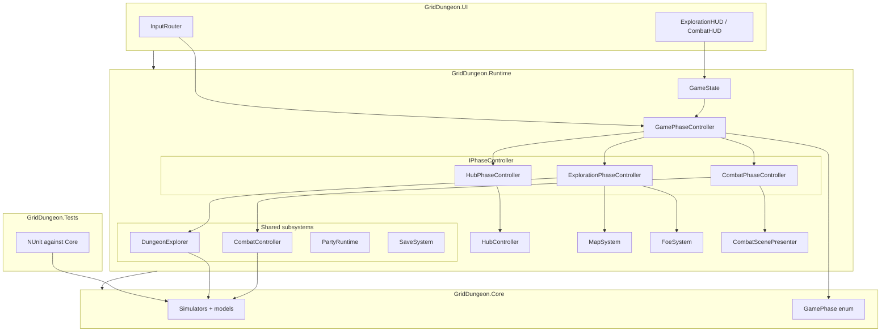
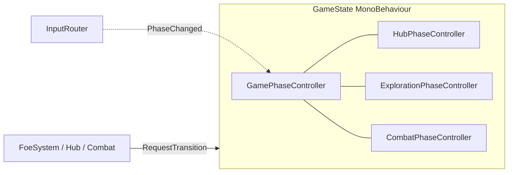
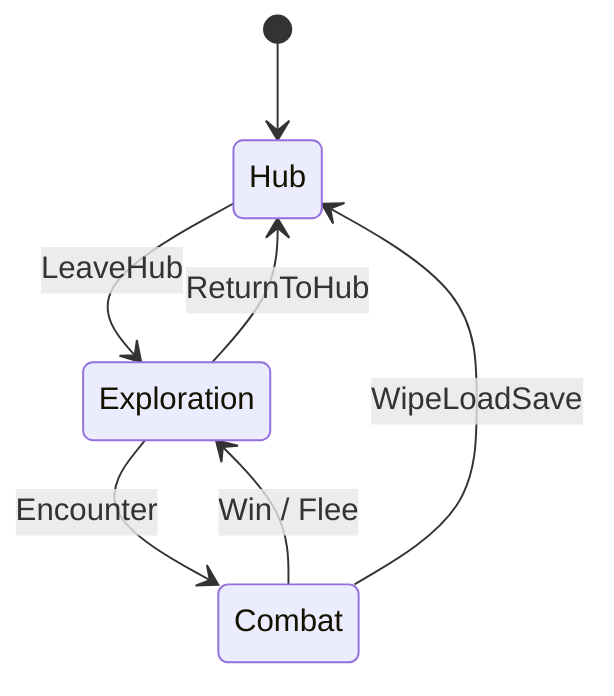
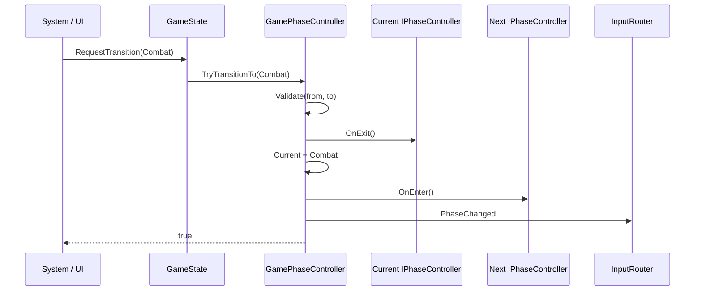
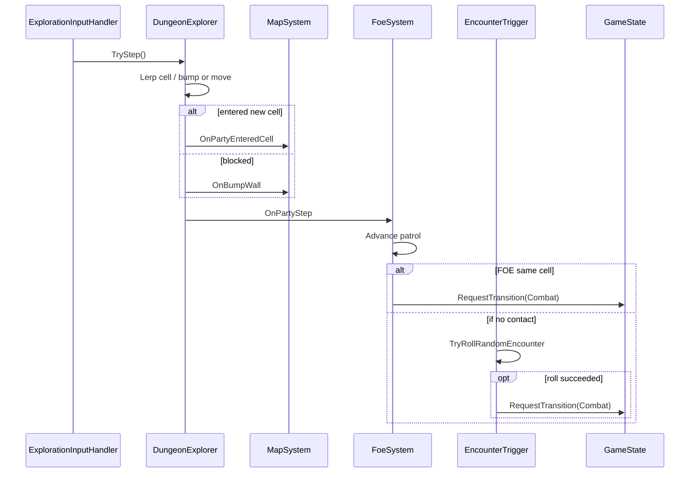
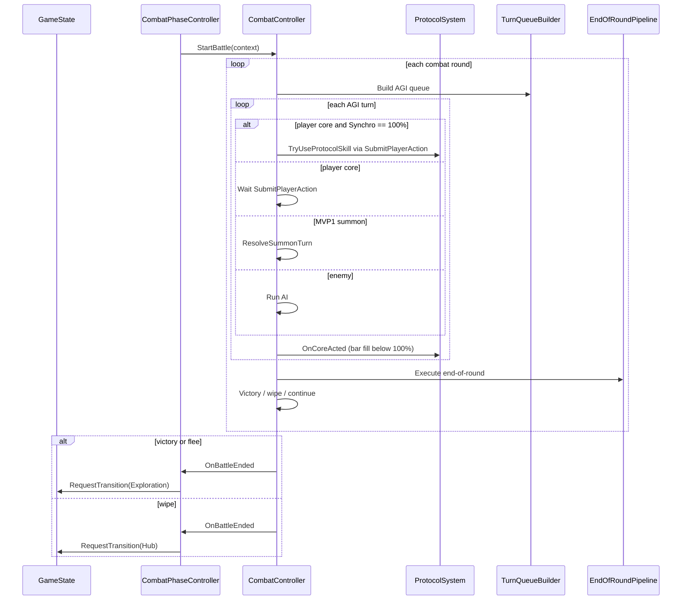

# Game Phase (Hub / Exploration / Combat)

Macro runtime modes for MVP1. **Locked:** pure C# orchestration ([ADR 017](../../decisions/017-game-phase-controller.md)). Unity Visual Scripting state graphs are **not** used for phase authority in MVP1.

## Design goals (MVP1)

These goals drive the split between **macro phases** (this doc), **assemblies** ([class design MVP1](../05-class-design-mvp1.md)), and **combat rounds** ([combat](combat.md)).

| Goal | How the architecture supports it |
|------|-----------------------------------|
| **Test damage + AGI without Unity** | Rules live in `GridDungeon.Core` (`DamageCalculator`, `TurnQueueBuilder`, …); `GridDungeon.Tests` references Core (and Runtime for `GamePhaseController` phase tests) |
| **Hub ↔ explore ↔ combat loop** | `GamePhase` enum + `GamePhaseController.TryTransitionTo` + three `IPhaseController` Enter/Exit hooks |
| **Spec-locked combat flow** | Protocol (core turn) → AGI queue → end-of-round stays on `CombatController`; not duplicated in phase controllers |
| **Content in data, not code** | ScriptableObjects in Runtime; Core uses DTOs at boundaries (no `SkillDefinition` in simulators) |
| **FOE + map + flee rules** | `ExplorationPhaseController` wires `DungeonExplorer` events → `MapSystem`, `FoeSystem`; combat entry via `GameState.RequestTransition` |
| **Clear input per mode** | `InputRouter` reacts to `PhaseChanged`; one authoritative phase enum for UI and action maps |
| **Inspectable, reviewable flow** | Phase transitions in C# (grep, diff, PR review); optional UVS later for presentation only |
| **Single responsibility** | `GameState` = composition root; `GamePhaseController` = transitions; phase controllers = lifecycle; subsystems = domain rules |

## Layer stack

Macro phases sit in **Runtime**; they orchestrate subsystems but do not implement combat math or grid rules.



**Authority rule:** only `GamePhaseController` changes `GamePhase`. UI and gameplay code call `GameState.RequestTransition`; they do not toggle scenes or input maps directly.

## Terminology

| Term | Scope | Owner |
|------|--------|--------|
| **Game phase** | Hub, Exploration, Combat | `GamePhaseController` |
| **Combat round** | One full AGI cycle + end-of-round ticks | `CombatController` |
| **Combat sub-phase** | AGI turn (incl. Protocol on core turn) → end-of-round within one battle | `CombatController` (`CombatPhase` enum) |

Do not conflate **game phase** with **combat sub-phase**.

## Architecture (composition)



ASCII equivalent:

```
GameState (MonoBehaviour, composition root)
├── GamePhaseController          ← authoritative GamePhase + transitions
├── HubPhaseController           ← IPhaseController
├── ExplorationPhaseController ← IPhaseController
├── CombatPhaseController        ← IPhaseController
├── PartyRuntime, SaveSystem, ContentDatabase, …
└── (shared subsystems referenced by phase controllers)

InputRouter                      ← enables action maps from PhaseChanged
```

### Responsibilities

| Type | Role |
|------|------|
| **`GamePhase`** (`Core` enum) | `Hub`, `Exploration`, `Combat` |
| **`GamePhaseController`** | `TryTransitionTo`, `PhaseChanged`, transition validation |
| **`GameState`** | Scene lifetime, serialized refs, public API for UI/systems to request transitions |
| **`HubPhaseController`** | Enter hub UI/services; exit clears exploration-only listeners |
| **`ExplorationPhaseController`** | Wire `DungeonExplorer` events → `MapSystem`, `FoeSystem`, `EncounterTrigger`; show FPV |
| **`CombatPhaseController`** | Start/end battle presentation; disable exploration input; call `CombatController` |
| **`CombatController`** | Synchro bar + Protocol, AGI queue, flee, victory — **unchanged by this doc** |

## Phase diagram



## Transition flow (sequence)



## Who requests transitions

| Trigger | Requested phase | Caller |
|---------|-----------------|--------|
| **New game** (S1 Act 1) | Exploration | Bootstrap → `s1_B1F` intro spawn ([dungeons § S1 intro](../03-content/dungeons-and-encounters.md#stratum-1-intro--three-acts-same-s1_b1f-map)) |
| Player leaves inn / enters stratum | Exploration | `HubController.LeaveHub` — S1: **B1F mouth** (no warp); S2+: warp gate |
| First-floor **stairs up** (mouth) → camp | Hub | `DungeonExplorer` interact → `GamePhaseController` |
| FOE same cell as party | Combat | `FoeSystem` → `GameState` |
| Random encounter on step | Combat | `EncounterTrigger` → `GameState` |
| Battle won or flee success | Exploration | `CombatController` |
| Return to surface / hub menu | Hub | Mouth **stairs up**, Return thread, or hub UI |
| Party wipe | Hub | Wipe flow → load save → Hub |

Combat **never** transitions directly to Hub on flee — only Exploration (FOE remains on map).

### Encounter priority (same step)

1. **FOE contact** — if party cell equals FOE cell after step, request Combat immediately; **no random encounter roll**.
2. **Random encounter** — `EncounterTrigger` rolls only when step completed and no FOE contact fired.

## Exploration step flow

While `Current == Exploration`, `ExplorationPhaseController` owns event subscriptions. A single step can end in map reveal, FOE patrol, contact combat, or a random encounter.



## Combat round flow (within Combat phase)

When `Current == Combat`, **game phase does not change** until the battle ends. Round logic is entirely inside `CombatController`.



See [combat](combat.md) for command tables and damage pipeline.

## Phase Enter / Exit checklist

### Hub `OnEnter`

- Show hub UI (menu tree MVP1)
- `InputRouter` → UI / hub map only
- `SaveSystem` ready for inn save
- **If `from == Exploration`** (return from labyrinth, ADR 008): `FoeSystem.ResetFloor` for active stratum floors; `SaveSystem.ClearExplorationState`
- **If `from == Hub` or boot** — no FOE reset (inn menu reopen only)

### Hub `OnExit`

- Hide hub UI

### Exploration `OnEnter`

- Load floor from `ContentDatabase` + save snapshot
- `DungeonView.SetVisible(true)`
- `MapSystem.LoadFloor`
- `FoeSystem.LoadFloor`
- Subscribe: `DungeonExplorer.OnPartyStep`, `OnPartyEnteredCell`, `OnBumpWall`
- Subscribe: `FoeSystem.OnFoeContact` → request Combat
- `InputRouter` → Exploration + Map maps

### Exploration `OnExit`

- Unsubscribe all exploration listeners (avoid leaks)
- Optional: pause `DungeonExplorer` input

### Combat `OnEnter`

- `DungeonView.SetVisible(false)` (or dimmed)
- `CombatPhaseController` builds `CombatEntryContext`, calls `CombatController.StartBattle`
- `CombatScenePresenter` spawn backdrop + enemy slots
- `AuraSystem.ApplyPassives` for active Navigator
- `InputRouter` → Combat map

### Combat `OnExit`

- `CombatController` cleanup, dismiss aux summons
- `CombatScenePresenter` teardown
- `AuraSystem.RemovePassives`

## API sketch (Runtime)

```csharp
// Core/Enums/GamePhase.cs
enum GamePhase { Hub, Exploration, Combat }

// Runtime/Game/GamePhaseController.cs — plain C#, not MonoBehaviour
sealed class GamePhaseController
{
    public GamePhase Current { get; private set; }
    public event Action<GamePhase, GamePhase> PhaseChanged;

    public bool TryTransitionTo(GamePhase next, IReadOnlyDictionary<GamePhase, IPhaseController> controllers);
}

// Runtime/Game/IPhaseController.cs
interface IPhaseController
{
    void OnEnter(GamePhase from);
    void OnExit(GamePhase to);
}

// Runtime/Game/GameState.cs
sealed class GameState : MonoBehaviour
{
    public GamePhase Current => _phaseController.Current;
    public bool RequestTransition(GamePhase phase) => …;
}
```

`TryTransitionTo` calls `OnExit` on the old controller, updates `Current`, calls `OnEnter` on the new controller, then raises `PhaseChanged`.

## Input maps per phase

| Game phase | Input System maps (enabled) |
|------------|---------------------------|
| Hub | `UI` (+ hub-specific if split later) |
| Exploration | `Exploration`, `Map` (map overlay pass-through per ADR 014) |
| Combat | `Combat`, `UI` |

Implemented in **`GridDungeon.UI`**: `InputRouter` subscribes to `GameState.PhaseChanged` (see [class design MVP1](../05-class-design-mvp1.md)).

## Dev bootstrap HUD (UI Toolkit)

MVP1 acceptance for macro phases is exercised in **`Assets/Scenes/DevBootstrap.unity`** (local only; menu: **GridDungeon → Scenes → Create Dev Bootstrap** in the game repo — run after clone).

| Piece | Location | Role |
|-------|----------|------|
| `GamePhaseDevHud.uxml` / `.uss` | `Assets/UI/Screens/Dev/` | BEM layout: current phase label, transition buttons, flee (combat only) |
| `GamePanelSettings.asset` | `Assets/UI/Settings/` | Shared UI Toolkit **Panel Settings** — wired on `UIDocument` (created by dev bootstrap menu if missing) |
| `GamePhaseDevHudView` | `GridDungeon.UI` / `Dev/` | `UIDocument` presenter; button `clicked` → `GameState.RequestTransition` / `RequestCombat`; subscribes to `PhaseChanged` |
| Keyboard | F1–F4 | Same actions as buttons (Input System `Keyboard`, not legacy `Input`) |

**Play-mode loop:** F1 Hub → F2 Exploration → F3 Combat → F4 flee (→ Exploration) → F1 Hub.

Dev UI is **not** authoritative — it only calls `GameState` APIs. Production hub/explore/combat HUDs replace this panel later; see [class design MVP1](../05-class-design-mvp1.md#ui-layer).

## Visual Scripting (post-MVP1 optional)

If a UVS state graph is added later:

- Graph **listens** to `PhaseChanged` only
- Graph runs presentation (fade, audio sting)
- Graph **must not** call `TryTransitionTo` except via debug menu
- C# remains authoritative

## Related docs

- [ADR 017 — Game phase controller](../../decisions/017-game-phase-controller.md)
- [05 — Class design MVP1](../05-class-design-mvp1.md)
- [04 — Tech notes](../04-tech-notes.md)
- [MVP1 spec](../mvp1-spec.md)
- [Combat](combat.md)
- [Hub & services](hub-and-services.md)
- [Input bindings](input-bindings.md)
