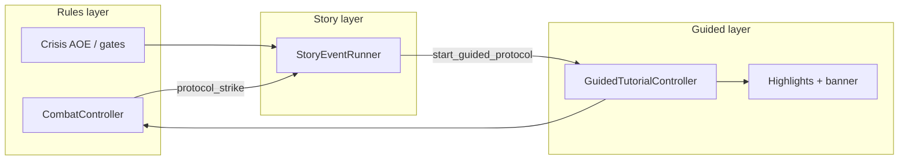

# Guided Tutorial (player coaching)

**Status:** Locked — **ADR:** [029](../../decisions/029-guided-tutorial.md) (Accepted). **Shipped (partial):** S1 tutorial combat HUD gating — `CombatTutorialHudRules` + `CombatHudView` ([#35](https://github.com/miramocha/griddungeon-game/pull/35)). **Still target:** Act 1 coach, `GuidedTutorialController`, story `StoryEventRunner` ([#88](https://github.com/miramocha/griddungeon-game/issues/88), [#87](https://github.com/miramocha/griddungeon-game/issues/87)).

**Authority for S1 beats:** [S1 guided tutorials](../03-content/campaign/s1-guided-tutorials.md)  
**Campaign flags & acts:** [s1-intro](../03-content/campaign/s1-intro.md)  
**VN dialogue layer:** [story-events](story-events.md) · [ADR 028](../../decisions/028-story-visual-novel-events.md) · **This layer:** [ADR 029](../../decisions/029-guided-tutorial.md)  
**Combat rules (tutorial FOE):** [synchro § S1 gating](synchro-protocol.md#s1-tutorial-gating-first-foe) · [foe-encounters § tutorial FOE](foe-encounters.md#tutorial-foe-s1--foe_alley_stalker)  
**Implementation tracking:** [game #88](https://github.com/miramocha/griddungeon-game/issues/88) (guided coach) · [game #87](https://github.com/miramocha/griddungeon-game/issues/87) (story VN — handoff only) · [#35](https://github.com/miramocha/griddungeon-game/issues/35) (Synchro HUD + Protocol-only — done) · [#20](https://github.com/miramocha/griddungeon-game/issues/20) (S1 wiring)

---

## What this is (and is not)

| Layer | Job | S1 examples |
|-------|-----|-------------|
| **Guided tutorial** (this doc) | **Coach the player** — callouts, highlights, optional input gates; short **impersonal** copy (no character `speakerId`); arena or map stays readable | Act 1: “move north”; combat: pulse **Protocol** after unlock |
| **Story event (VN)** | **Narrative beat** — multi-line dialogue, portraits later; may set flags and hand off to guided phase; **blank-state** — no mechanic spoilers before the beat’s job | `s1_b1f_gate_briefing`, `s1_b2f_stalker_briefing`, `s1_synchro_protocol_unlock`, `s1_tutorial_hub_return` |
| **Campaign / combat rules** | **Truth** — walk blockers, unbeatable FOE, crisis AOE, allowed commands | `CombatTutorialHudRules`, `EncounterGroupId` / `TutorialFirstFoe` on spawn, `NoFlee`, campaign save flags |

A single S1 moment often uses **two layers**: crisis AOE (rules) → unlock VN (story) → guided Protocol (this doc) → finisher (rules).

**Not the same as:** skill **cinematics** ([combat presentation](combat-presentation.md), [ADR 027](../../decisions/027-combat-cinematic-timeline-events.md)).

---

## Goals (MVP1)

| Goal | Approach |
|------|----------|
| Teach without autoplay | Player still moves and confirms commands; guidance **highlights** the right control |
| One pipeline | Reuse `guidedHintId` content for exploration + combat; avoid one-off strings in views |
| Phase-safe | Exploration hints do not run in combat; combat gates do not leak to hub |
| DRY with rules | Gates and flags stay in Core / `CombatController`; presenter only reflects allowed actions |
| EO-readable pacing | Short lines; dismiss or auto-clear; no skip on **mandatory** S1 steps |

---

## Modes

| Mode | Active `GamePhase` | In-world presentation | Input |
|------|-------------------|----------------------|-------|
| **Exploration** | `Exploration` | **Paginated screen block** — text + image/video per page | **Blocking** until last page dismissed |
| **Combat** | `Combat` | Page block and/or HUD pulse on Protocol | **Blocking** for mandatory coach |
| **Hub** | `Hub` | Page block when used | **Blocking** while open |
| **Codex** | **Pause menu** (`Esc` — exploration / combat / hub) | Read-only replay of unlocked entries | Non-blocking navigation inside codex UI |

MVP1 **ships** Act 1 exploration entries + B2F Protocol coach + **codex replay**. Hub Act 2 guild hints **cut** unless playtest fails ([ADR 029 § stakeholder](../../decisions/029-guided-tutorial.md#stakeholder-decisions-2026-05-23)).

Early MVP: one simple **tutorial panel** layout (screen block + optional still / short clip) — not separate toast vs VN chrome stacks.

---

## Runtime shape (proposed)

```
Trigger (campaign flag, cell script, combat tutorial phase)
  → GuidedTutorialController.Start(hintId)   // or StartSequence(sequenceId)
  → GuidedTutorialView: banner + highlight targets
  → Optional: InputRouter / CombatController apply gate
  → Player satisfies completion rule (dismiss, correct command, cell reached)
  → Complete → set once-flag / advance tutorial phase / fire story event
```

| Type | Assembly | Role |
|------|----------|------|
| `GuidedTutorialDefinition` | Content | `hintId`, copy keys, highlight targets, completion rule |
| `GuidedTutorialSequence` | Content | Ordered hints for one beat (e.g. Act 1 gate approach) |
| `GuidedTutorialController` | Runtime | Active hint, completion, delegates to phase owners |
| `GuidedTutorialView` | UI | Paginated panel, media slot, HUD pulses ([#88](https://github.com/miramocha/griddungeon-game/issues/88)) |
| `TutorialCodexView` | UI | Pause menu → **Tutorial codex**; index of unlocked `tutorialEntryId`s — read-only |

**Ownership (architecture):** do not embed S1 flag logic inside the view. `ExplorationPhaseController` / `CombatController` / campaign service decide **when** to start; controller applies **effects** (`set_campaign_flag`, `combat_tutorial_phase`, `start_guided_protocol`) via the same dispatch table as [story-events § effects](story-events.md#effects-draft).

---

## Entry definition (draft schema)

| Field | Required | Notes |
|-------|----------|-------|
| `tutorialEntryId` | yes | Stable id (codex row); may match trigger `hintId` |
| `pages[]` | yes | `{ textKey, imageId? }` per page — MVP1 **stills only** (`videoId` reserved post-MVP1) |
| `speakerId` | **no** | Omit for MVP1 — **no** Navigator, core, or NPC speaker; UI shows body text only (no portrait) |
| `mode` | yes | `exploration` \| `combat` \| `hub` |
| `codexCategory` | no | Menu grouping (`basics`, `combat`, `synchro`, …) |
| `once` | yes | In-world trigger once; codex unlock persists |
| `prerequisiteFlags` | no | All must be set to show in-world |
| `suppressIfFlags` | no | Any set → skip in-world |
| `highlight` | no | Combat HUD targets — see table below |
| `completion` | yes | How the in-world block clears |

**Advance:** **Z** or click per page ([ADR 029](../../decisions/029-guided-tutorial.md)).

## Codex

| Rule | Detail |
|------|--------|
| **What it is** | UI to **re-read** tutorial pages the player already saw — not a second rules engine |
| **Unlock** | On in-world complete (or last page), add `tutorialEntryId` to `unlockedCodexTutorialIds` (save) |
| **Replay** | No flags, no combat gates, no `start_guided_protocol` |
| **vs story** | S1 Navigator **story** scenes ([ADR 028](../../decisions/028-story-visual-novel-events.md)) stay story events; codex MVP1 = **guided entries** only |

**Still called guided tutorial** — codex is the archive surface for that content.

### Highlight targets (MVP1)

| `highlight` id | UI |
|----------------|-----|
| `explore.move` | Movement hint (generic) |
| `explore.interact` | Interact / stairs affordance |
| `explore.map` | Map toggle (**post-MVP1** if not wired) |
| `combat.command.attack` | Attack button |
| `combat.command.guard` | Guard |
| `combat.command.skill` | Skill |
| `combat.command.protocol` | Protocol |
| `combat.command.flee` | Flee |
| `combat.synchro_meter` | Synchro bar |
| `hub.guild` | Guild menu row |
| `hub.enter_stratum` | Enter Stratum row |

### Completion kinds

| `completion` | When hint ends |
|--------------|----------------|
| `dismiss` | Player presses confirm / clicks banner |
| `move` | Party enters target cell |
| `bump_wall` | First wall bump registered |
| `interact` | Interact used on feature cell |
| `combat_command` | Allowed command queued (`protocol_strike` for S1) |
| `story_event_done` | Linked `storyEventId` finished (handoff from VN) |

---

## Combat guided tutorial (S1 — Protocol)

**When:** after `s1_synchro_protocol_unlock` completes — between unlock VN and Protocol resolve.

**Locked behavior** ([story events § S1 flow](story-events.md#s1-tutorial-flow-foe_alley_stalker) — combat column defers HUD detail here):

| Rule | Detail |
|------|--------|
| **Synchro meter** | Visible at **100%** (may have been hidden until unlock) |
| **Command bar** | **Pulse / outline** on **Protocol**; Attack / Guard / Skill / Flee **disabled** or greyed |
| **Allowed command** | Only **Protocol → `protocol_strike`** ([synchro § phase D](synchro-protocol.md#s1-tutorial-gating-first-foe)) |
| **Player agency** | Player still opens Protocol and confirms target — **not** a full auto-cutscene |
| **Skip** | **Disabled** until Protocol resolves |
| **VN vs coach** | Navigator **lines** = story event only; **“use Protocol now”** = impersonal guided hint `s1_combat_guided_protocol` |

**Effect bridge (target):** story step `start_guided_protocol` → set `s1_synchro_unlocked` / protocol-tutorial flags → `CombatTutorialHudRules.RequiresProtocolOnlyCommands` (shipped via campaign + `grp_alley_stalker_tutorial`) + `GuidedTutorialController.Start("s1_combat_guided_protocol")` ([#88](https://github.com/miramocha/griddungeon-game/issues/88) — coach UI not yet wired).

**End:** `protocol_strike` resolves and kills FOE → clear guided state → `s1_tutorial_hub_return` story event.

---

## Exploration guided tutorial (S1 — Act 1 movement)

**Map:** `s1_B1F` Act 1 — no enemies, blockers funnel **E** → gate **^** ([dungeons § B1F](../03-content/dungeons-and-encounters.md#s1_b1f--outskirts-gate-intro--gate)).

| Principle | Detail |
|-----------|--------|
| **Teach movement** | WASD / QE — link [input bindings](input-bindings.md), [ADR 001](../../decisions/001-grid-movement.md) |
| **Teach map literacy** | Optional **G** signage, **C** gather node on route (interact once; no combat) |
| **Teach exit** | Gate **^** → hub sets `s1_intro_movement_complete` |
| **No combat coach** | `baseEncounterRate: 0`; no FOE |

Beat list and copy drafts: [s1-guided-tutorials.md](../03-content/campaign/s1-guided-tutorials.md#act-1--movement-b1f).

---

## Relationship to story events



| Moment | Story? | Guided? |
|--------|--------|---------|
| Act 1 first step | — | yes — move / face north |
| Act 1 wall bump | — | yes — optional one-liner |
| Crisis AOE | — | rules + combat log |
| Synchro unlock | yes — `s1_synchro_protocol_unlock` | handoff after VN |
| Protocol coach | — | yes — `s1_combat_guided_protocol` |
| Hub warp outro | yes — `s1_tutorial_hub_return` | — |

---

## Save / replay

| Topic | Rule |
|-------|------|
| **In-world once** | Do not re-trigger Act 1 blocks if `s1_intro_movement_complete` (etc.) |
| **Codex** | Unlocked entries remain readable from **pause menu → Tutorial codex** |
| **Mid-fight reload** | Out of scope — inn save at hub only |
| **Re-fight tutorial FOE** | Blocked — B3F gate requires `s1_first_foe_tutorial_complete` |

---

## Content layout

| Location | Contents |
|----------|----------|
| [campaign/s1-guided-tutorials.md](../03-content/campaign/s1-guided-tutorials.md) | S1 hint table, triggers, draft copy |
| Game: `Assets/Content/GuidedTutorials/` | Imported definitions (when implementation starts) |

---

## Open design questions

Deferred: map (`M`) coach, shared panel UXML with story layer, authoring format — [ADR 029 § Open questions](../../decisions/029-guided-tutorial.md#open-questions-deferred).

---

## Related

- [ADR 029 — Guided tutorial](../../decisions/029-guided-tutorial.md)
- [S1 guided tutorials (content)](../03-content/campaign/s1-guided-tutorials.md)
- [S1 campaign intro](../03-content/campaign/s1-intro.md)
- [Story events](story-events.md)
- [mvp1-spec §1](../mvp1-spec.md#1-player-facing-loop-mvp1)
- [05 — class design § CombatEntryContext](../05-class-design-mvp1.md) — `EncounterGroupId`, `NoFlee`; tutorial detect via `CombatTutorialHudRules`
