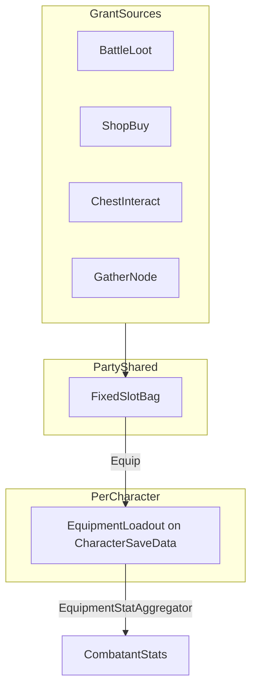

---
tags:
  - path/docs/02-systems
  - type/system
  - scope/required
  - status/draft
  - domain/hub
  - domain/combat
---
# Items & inventory

Party **bag** (shared, fixed slots) and **worn equipment** (per core member). **Credits** (hub wallet) stay on save — not a bag slot.

**Authority:** [ADR 036](../../decisions/036-party-inventory-model.md) · locked content IDs [05 — Class design § content IDs](../05-class-design.md#content-ids-locked) · equipment stats table [character progression § launch equipment](character-progression.md#launch-equipment-locked)

**Implementation tracker:** [design-docs #22](https://github.com/miramocha/griddungeon-design-docs/issues/22) · [game epic #151](https://github.com/miramocha/griddungeon-game/issues/151) (#152–#157, loot [#31](https://github.com/miramocha/griddungeon-game/issues/31))

---

## Overview

Etrian Odyssey–style loop: one **party bag** for consumables and unequipped gear; each core wears up to five pieces. Hub shop, battle loot, chests, and gather nodes grant into the bag; guild / party menu moves gear between bag and characters.



| Concern | Owner |
|---------|--------|
| Bag slots, stack rules, tab filter | **Core** — `InventoryRules`, `InventoryBagCatalog` |
| Content defs, shop, coordinators | **Runtime** — `ItemDefinition`, `EquipmentDefinition`, `ShopService` |
| Tabbed bag panel, party menu | **UI** — `ItemListInventory` + `PartyInventoryBagView` on shared `ItemListPickerView` ([centralized UI services](../04-dev/centralized-ui-services.md)) |
| Persist | **`SaveGame`** — source of truth; `PartyRuntime` mirrors on load |

---

## Hub currency (Credits)

| Layer | Name | Notes |
|-------|------|--------|
| **Code / save** | `HubSaveData.Credits` (`int`) | Authoritative balance — use **`Credits`** in new backend code, not `Gold` |
| **Player-facing label** | Content or localization | Default display **"Credits"**; swappable per act/region/settings **without** renaming save fields |
| **Loot / rewards** | `LootEntry` / reward DTO | May grant **credits** alongside bag items ([#31](https://github.com/miramocha/griddungeon-game/issues/31)) |

**Wire (save JSON):** `Hub.Credits` (Unity `JsonUtility` PascalCase). Pre-release builds do not load legacy `Gold` ([#158](https://github.com/miramocha/griddungeon-game/issues/158)).

Shop/hospital/identify copy uses the **display label** via `Mvp1HubConstants.CurrencyDisplayName` / `FormatAmount` ("Not enough Credits" or future "Funds"); HUD uses `FormatWalletLabel`.

---

## Bag model

- **Fixed slot count** (EO-style) — default **`partyBagSlotCount = 30`** ([release scope § Tuning](../00-release-scope.md#tuning-locked-structure)); tune in data, not code forks.
- Each slot holds **at most one** of:
  - **Empty**
  - **Consumable stack** — one `itemId`, quantity ≤ `ItemDefinition.maxStack`
  - **Equipment instance** — unequipped gear (`equipId` + identify flag)
  - **Material stack** (optional) — same stack shape as consumables; `InventorySlotKind.Material`
- **No stacking across slots** — a full stack occupies one slot; overflow needs another empty slot or fails (bag-full).
- **Equipped gear does not occupy bag slots** — worn on `CharacterSaveData.Equipment` / runtime `Combatant.Equipment`.

### Slot DTOs (Core)

```csharp
sealed class ItemStack { string ItemId; int Quantity; }
sealed class EquipmentInstance { string InstanceId; string EquipId; bool IsIdentified; }

enum InventorySlotKind { Empty, Consumable, Equipment, Material }

sealed class InventorySlot
{
    InventorySlotKind Kind;
    ItemStack? Stack;
    EquipmentInstance? Equipment;
}

sealed class PartyInventory
{
    InventorySlot[] Slots; // length = partyBagSlotCount
}
```

**Migration:** replace `PartyRuntime.GatheredItemIds` (`List<string>` stub) with `SaveGame.PartyInventory` ([#152](https://github.com/miramocha/griddungeon-game/issues/152)).

---

## Worn equipment (per character)

Five slots per core — `EquipSlot`: Weapon, Head, Body, Legs, Accessory ([05 — Class design](../05-class-design.md)).

```csharp
sealed class EquipmentLoadout
{
    string WeaponId;
    string HeadId;
    string BodyId;
    string LegsId;
    string AccessoryId;
}
```

**Launch equip reference model:**

| Source | On loadout |
|--------|----------------|
| Shop purchase (identified) | **`equipId`** string per slot — sufficient when one copy per piece |
| Chest / loot (may be unidentified) | **`instanceId`** on bag row until equipped; loadout stores **`equipId`** after equip; identify flag on **instance** while in bag |

**Duplicate gear:** multiple instances of the same `equipId` may sit in different bag slots; only one worn per `EquipSlot` per character.

**Class gates:** `EquipmentDefinition.allowedClassIds` + `weaponType` — validate in `InventoryRules.TryEquip` (Core).

Stat and resist bonuses: full table in [character progression § launch equipment](character-progression.md#launch-equipment-locked). Applied via **`EquipmentStatAggregator`** when building combatants ([combat status & buffs](combat-status-and-buffs.md)).

---

## Equipment instances & identify

| State | Bag display | Shop |
|-------|-------------|------|
| **Identified** | `EquipmentDefinition.displayName` | Buy/sell as normal |
| **Unidentified** | `???` (optional slot hint: Weapon / Head / … from `EquipSlot` only) | **Identify** service — Credits sink; sets `IsIdentified = true` |

**Launch content:** optional B1F tutorial chest grants `scout_charm` as **unidentified** instance ([character progression § loot](character-progression.md#launch-equipment-locked)). Shop purchases are **identified** on buy.

**Codex / analyze skills:** later; Identify at launch at shop only.

---

## Consumables

Locked `itemId` strings — [05 § content IDs](../05-class-design.md#content-ids-locked):

| `itemId` | Launch use context |
|----------|------------------|
| `patch_kit` | Combat + field — `HealHp` |
| `stim_draft` | Combat + field — `HealMp` |
| `trauma_kit` | Combat + field — full HP (`HealHp` high power) |
| `return_thread` | **Field only** — retreat to hub ([dungeon navigation](../02-dungeon-navigation.md)) |
| `analysis_glass` | Combat — weakness reveal (optional at launch ship) |

`ItemDefinition` (Runtime SO): `itemId`, `displayName`, `ItemEffectType`, `power`, `maxStack`, **`useContexts`** (Combat / Field flags — mirror skill pattern).

---

## Ownership & save

| Data | Location |
|------|----------|
| `PartyInventory` | `SaveGame` (new field) |
| `EquipmentLoadout` per member | `CharacterSaveData` (guild roster + active party rows) |
| Credits | `HubSaveData.Credits` |

**Load flow:** inn / bootstrap → hydrate `PartyRuntime` from save → `Mvp1GuildCombatantBuilder` applies `Equipment` + aggregated stats.

**Exploration dive:** bag and worn gear persist on save; no labyrinth autosave — same as roster vitals ([ADR 014](../../decisions/014-mvp1-exploration-map.md)).

---

## Operations (who calls what)

| Operation | Core | Runtime service / phase |
|-----------|------|-------------------------|
| Add stack / instance | `InventoryRules.TryAdd` | Shop, chest, loot, gather |
| Remove / sell | `InventoryRules.TryRemove` | `ShopService.TrySell` |
| Bag full check | `InventoryRules.HasEmptySlot` | Grant UIs show message |
| Equip / unequip | `InventoryRules.TryEquip` / `TryUnequip` | Party menu **Equipment** pane (hub + exploration) |
| Identify instance | `InventoryRules.Identify` | `ShopService.TryIdentify` |
| Loot roll | `LootResolver` (from `LootTable`) | Post-battle [#31](https://github.com/miramocha/griddungeon-game/issues/31) |
| Tabbed bag view model | `InventoryBagCatalog.BuildTabs` | `InventoryBagCoordinator` → UI |

Reject putting stack math or equip validation in UITK views ([architecture principles](../../.cursor/rules/architecture-design-principles.mdc)).

---

## Party menu shell

**`Tab`** opens the party menu when safe ([ADR 034](../../decisions/034-skill-point-allocation-outside-combat.md), [ADR 036](../../decisions/036-party-inventory-model.md) §5).

| Section | Pane | v1 |
|---------|------|-----|
| **Inventory** | Shared bag (category tabs below) | Yes |
| **Equipment** | Active party — one member, five worn slots, slot-first bag sub-picker | Yes |
| **Skills** | Class skill trees | Deferred ([ADR 034](../../decisions/034-skill-point-allocation-outside-combat.md)) |
| **Formation** | Row assignment | Deferred |

**Navigation:** vertical section list — **W/S** changes section (shell or when pane is open but disengaged); **pane swaps immediately** when section changes. **Z** opens the active section body; **X** backs out (pane → shell → close). **Q/E** are **not** used at shell level.

**Exploration:** closing the party menu after equip/unequip refreshes the bottom **party strip** HP/MP labels immediately (`PartyMenuOverlayView` → `ExplorationHudView.SyncPartyStripAfterPartyMenuClosed()`; overlay already wires `m_explorationHud` in Dev Bootstrap).

**Explorers Guild (hub):** assign six cores + roster summary only — **no** equip/unequip actions ([hub-and-services](hub-and-services.md)).

**Game:** [#166](https://github.com/miramocha/griddungeon-game/issues/166) (shell + Inventory hosting) · [#167](https://github.com/miramocha/griddungeon-game/issues/167) (Equipment pane).

---

## Bag UI — Inventory pane category tabs at launch

Party menu section **Inventory** uses **horizontal category tabs**, same interaction model as the skill use picker ([ADR 035](../../decisions/035-skill-use-picker.md)).

| Tab id | Label | Contents |
|--------|-------|----------|
| **`all`** | **All** | **Default.** Every occupied slot, **slot index ascending** |
| `consumables` | Consumables | `InventorySlotKind.Consumable` |
| `equipment` | Equipment | `InventorySlotKind.Equipment` |
| `materials` | Materials | MVP2 — tab visible only when ≥1 material slot occupied |

**Rules:**

- Show **`All`** when bag has ≥1 occupied slot.
- Show a category tab only if ≥1 slot matches (no empty tabs).
- Tab switch **filters the slot grid**; focus/confirm on visible slots.
- **Keyboard:** `Q` / `E` cycle category tabs **only while Inventory pane is active**; arrows / `WASD` move slot focus; `Z` / `X` confirm / cancel row ([ADR 026](../../decisions/026-combat-menu-focus-navigation.md)).
- **Z** on equipment in bag: **no equip** in v1 — use **Equipment** pane.
- **`InputRouter`** enables inventory tab actions **only** while Inventory pane is open — do not steal exploration **turn** `Q`/`E` ([input bindings § Party menu](input-bindings.md#party-menu-tab)).
- **LMB** on tab headers optional.

**Architecture:**

| Layer | Type |
|-------|------|
| Core | `InventoryBagCatalog` → `InventoryBagPresentationModel` with `Tabs[]` / slot rows |
| Runtime | `IInventoryBagView`, `InventoryBagCoordinator` |
| UI | `PartyInventoryBagView` → shared **`ItemListPickerView`** on **`ItemListInventoryPresenter`** (sort **251** when opened from party menu) — [shared menu & picker UI](../04-dev/shared-menu-picker-ui.md) · [centralized UI services](../04-dev/centralized-ui-services.md) |

Tab membership from **`InventorySlotKind`** — no `ItemCategory` on `ItemDefinition` at launch.

**Entry points:** `Tab` — party menu shell in **hub** and **exploration** when safe ([ADR 034](../../decisions/034-skill-point-allocation-outside-combat.md)); not combat command bar. See [exploration UI](exploration-ui.md#party-menu).

---

## Equipment pane

**Scope:** active party cores only (filled core slots). **Member select** uses the shared **party formation floater** (2×4 grid, sort **260**) — not inline member tabs. Center panel is shared **`CharacterDetailView`** (`PartyEquipDisplay`): stats + five worn rows. **Q/E** / **W/S** move floater focus when slots are not engaged; **Z** engages worn-slot focus; **W/S** moves slot focus while engaged. **Z** on a focused slot is currently a **no-op** (inline bag picker removed; separate picker window + `PartyEquipmentApply` path is follow-up). Equip from **Inventory** pane still works. Stat preview: `PartyEquipmentStatPreviewFormatter` on `CharacterDetail`.

| Layer | Type |
|-------|------|
| Core | `PartyEquipmentCatalog`, `PartyEquipmentStatPreview`, bag-row filter for slot + class |
| Runtime | `PartyEquipmentCoordinator`, `PartyEquipmentOperations`, `PartyEquipmentApply` |
| UI | **`CharacterDetail`** facade / `CharacterDetailView` (sort **251**); floater member bridge `PartyEquipmentFloaterToolkitView` — [custom party UI](../04-dev/custom-party-ui.md) |

Stats on combatants: `EquipmentStatAggregator` when building from save ([#155](https://github.com/miramocha/griddungeon-game/issues/155)).

---

## Combat & field item UI (narrower than bag)

| Context | UI |
|---------|-----|
| **Combat `Item` command** | **Consumable row list** only — combat-usable items from bag; **no category tab strip** ([ADR 026](../../decisions/026-combat-menu-focus-navigation.md) sub-menu) |
| **Field** | Use from party menu **Consumables** tab, or filtered field-usable rows (`return_thread`, heals) |

Combat picker uses the shared tabbed shell with **Immediate** row focus + `Z`/`X` ([ADR 026](../../decisions/026-combat-menu-focus-navigation.md), [shared menu & picker UI](../04-dev/shared-menu-picker-ui.md)); catalog filters by `ItemEffectType` + `useContexts`, not `InventoryBagCatalog` tabs.

---

## Launch vs optional

| Launch | Optional+ |
|------|-------|
| Fixed bag, tabs (All / Consumables / Equipment) | **Materials** tab + stacks |
| Shop buy/sell, identify | **Synthesis** ([gathering & fishing](gathering-and-fishing.md)) |
| Party menu equip, stat aggregation | Quest “bring N material” checks bag |
| Loot [#31](https://github.com/miramocha/griddungeon-game/issues/31), chest [#105](https://github.com/miramocha/griddungeon-game/issues/105) | Expanded item effects |

---

## Integration table

| Source | Grants | Save touch |
|--------|--------|------------|
| Shop buy | Stack or identified equipment instance | `PartyInventory`, `Hub.Credits` |
| Shop sell | Removes from bag | `PartyInventory`, `Hub.Credits` |
| Shop identify | Flips instance flag | `PartyInventory`, `Hub.Credits` |
| Battle victory | `LootTable` → stacks / instances / credits | `PartyInventory`, `Hub.Credits`, XP on roster [#31](https://github.com/miramocha/griddungeon-game/issues/31) |
| Chest interact | `ChestItemId` | `PartyInventory` |
| Gather node | Material or consumable at launch stub: consumable) | `PartyInventory` |
| Party menu equip | Bag ↔ `CharacterSaveData.Equipment` | Both |

**Tutorial FOE:** `grp_alley_stalker_tutorial` — no standard farmable loot/XP per [#31](https://github.com/miramocha/griddungeon-game/issues/31).

---

## Implementation waves (game repo)

| Wave | Issue | Scope |
|------|-------|--------|
| 0 | [design-docs #22](https://github.com/miramocha/griddungeon-design-docs/issues/22) | This doc + ADR 036 |
| 1 | [#152](https://github.com/miramocha/griddungeon-game/issues/152) | Core + save + `InventoryBagCatalog` |
| 2 | [#31](https://github.com/miramocha/griddungeon-game/issues/31) | Post-battle loot |
| 3 | [#153](https://github.com/miramocha/griddungeon-game/issues/153) | `ItemDefinition` + shop |
| 4 | [#154](https://github.com/miramocha/griddungeon-game/issues/154) | Tabbed bag UI (closed — superseded by shell) |
| 4b | [#166](https://github.com/miramocha/griddungeon-game/issues/166) | Party menu shell + Inventory pane |
| 5 | [#155](https://github.com/miramocha/griddungeon-game/issues/155) | `EquipmentStatAggregator` + save/combatant stats |
| 5b | [#167](https://github.com/miramocha/griddungeon-game/issues/167) | Equipment pane + slot-first equip (hub + exploration) |
| 6 | [#156](https://github.com/miramocha/griddungeon-game/issues/156) | Chest + identify |
| 7 | [#157](https://github.com/miramocha/griddungeon-game/issues/157) | Combat consumable picker |

Coordinate equipment SOs with [#12](https://github.com/miramocha/griddungeon-game/issues/12) ContentDB.

---

## Test plan (stub)

### Automated (Edit Mode)

- `Tests` → *(future)* `InventoryRulesTests`, `InventoryBagCatalogTests` — stack, bag-full, tab visibility, equip validation, save round-trip ([#152](https://github.com/miramocha/griddungeon-game/issues/152))

### Manual (Play Mode)

- **Scene:** `DevBootstrap.unity` — **F1** hub / **F2** exploration / **F3** combat
- **Steps:** Buy `patch_kit` + `guild_shortsword` at shop → **Tab** → **Inventory** → equip sword from bag row → **Tab** → **Equipment** → floater member focus → **Z** engage slots → **W/S** worn rows → **Z** on slot (no picker) → **Tab** → **Formation** → read-only detail on floater focus
- **Expected:** Shell sections switch on W/S; bag `Q`/`E` only on Inventory pane; equipment floater drives member (no inline tabs); slot **Z** does not open bag list; formation shows `CharacterDetail` mirror; equip via Inventory still works on F1/F2

### Regressions

- [ ] `GatheredItemIds` migration does not break hub sell stub tests
- [ ] Skill picker `Q`/`E` unchanged in combat ([#138](https://github.com/miramocha/griddungeon-game/issues/138))

---

## Related docs

- [Character progression](character-progression.md) — equipment table, economy
- [Hub & services](hub-and-services.md) — shop motion, guild
- [Gathering & fishing](gathering-and-fishing.md) — MVP2 materials
- [Input bindings](input-bindings.md) — `Tab`, inventory modal
- [Combat](combat.md) — Item command
- [05 — Class design](../05-class-design.md) — type catalog, save types
- [UI event contract](../04-dev/ui-event-contract.md) — phase events
