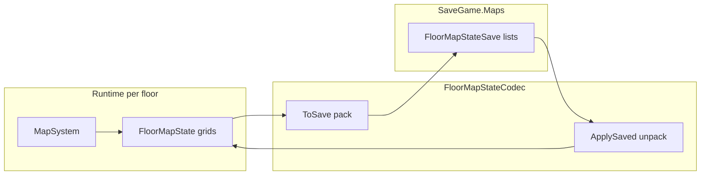

# Map reveal save format (floor packing)

How **exploration map reveal** is stored in the save file: runtime grids in memory, **sparse packed lists** on disk. Implementation: `FloorMapStateCodec` in the game repo (`GridDungeon.Runtime.Map`).

## Why pack and unpack?

| Layer | Shape | Used for |
|-------|--------|----------|
| **Runtime** | `FloorMapState` — dense `bool[,] Visited`, `WallMask[,] Walls`, plus dictionaries | Fast lookup: `IsVisited`, `GetWalls`, `MapView` paint |
| **Save** | `FloorMapStateSave` — sparse `List<int>` + small structs | Only **non-default** cells are stored; JSON/binary stays small |

**Packing** (`ToSave`): walk the runtime grids → append one packed `int` (or struct) per revealed cell / wall / feature / FOE icon.

**Unpacking** (`ApplySaved`): clear runtime grids → replay each saved entry into `Visited`, `Walls`, `Features`, `FoeIcons`.

`MapSystem` owns runtime state and calls the codec on explore exit (`Snapshot`) and enter (`LoadFloor`). See [game phase](game-phase.md), [ADR 014](../../decisions/014-mvp1-exploration-map.md) (persist on hub return).



## What gets saved (authority)

From [04 — Tech notes § Map system](../04-tech-notes.md#map-system) and [ADR 002](../../decisions/002-mapping-model.md):

| Field | Runtime | Save list | Notes |
|-------|---------|-----------|--------|
| Floor tiles visited | `Visited[x,y]` | `Visited` (`List<int>`) | Party entered cell |
| Revealed wall edges | `Walls[x,y]` bitmask | `Walls` (`List<int>`) | Per-cell **N/E/S/W** segments shown on map |
| Features | `Features` dict | `Features` (`List<FeatureStateSave>`) | Stairs, doors, chests, etc. |
| FOE last known | `FoeIcons` dict | `FoeIcons` (`List<FoeIconSave>`) | Sparse; not full FOE sim state |

**Not saved here:** full floor layout (that's `StratumFloor` content). **FOE patrol state** lives under `SaveGame.FoeState`, separate from map icons.

Save key: floor id string, e.g. `s1_B1F` → one `FloorMapStateSave` in `SaveGame.Maps`.

## WallMask (per cell)

Each **visited** cell can expose zero or more **wall segments** on its four sides. Flags are combined on that cell:

| Flag | Value | Edge |
|------|-------|------|
| `North` | 1 | Toward +Y (map north up) |
| `East` | 2 | Toward +X |
| `South` | 4 | Toward −Y |
| `West` | 8 | Toward −X |

Example: bump north into a solid tile → `North` set on the party's current cell. Enter a cell → perimeter reveal sets every side that borders a non-walkable neighbor ([ADR 014](../../decisions/014-mvp1-exploration-map.md)).

`MapView` only draws wall glyphs for **visited** cells (`GetWalls` returns `None` if fogged).

## Packed `int` formats

Two encodings share one `List<int>` type for visited vs walls. **Walls must be distinguishable from visited-only packs** — wall entries set **bit 31** (tag).

### Visited-only pack

One record per visited floor cell. No tag bit.

```
Bit layout (32-bit int):
  31..16 : x  (16 bits)
  15..0  : y  (16 bits)

pack   = (x << 16) | (y & 0xFFFF)
unpack = x from high 16, y from low 16; reject if bit 31 set
```

Supports grid coordinates up to **65535** per axis (far beyond MVP1 floor sizes).

### Wall pack

One record per cell that has **any** revealed wall segment. Includes cell coordinates + full `WallMask` byte.

```
Bit layout (32-bit int):
  31     : 1 = wall entry (tag)
  30..24 : reserved (0)
  23..16 : x  (8 bits, 0–255)
  15..8  : y  (8 bits, 0–255)
  7..0   : WallMask (8 bits, flags enum)

pack   = tag | ((x & 0xFF) << 16) | ((y & 0xFF) << 8) | ((int)mask & 0xFF)
unpack = require tag; x,y from bytes; mask from low byte
```

**MVP1 limit:** wall packs assume **x,y ≤ 255** per floor (`FloorMapStateCodec.MaxWallPackExtent`; `IsGridPackable` / `LoadFloor` log error if exceeded). MVP1 floors are 20×20 — safe. Visited-only packs still use 16-bit y for headroom.

**Why the tag?** An earlier layout OR'd `mask << 24` into the same word as `x << 16`, which corrupted coordinates on unpack. Tag + fixed byte lanes avoids overlap.

### Features and FOE icons (not packed ints)

Sparse dicts use explicit structs (clearer, no bit math):

```csharp
FeatureStateSave { int X, Y, Type, IsInteracted }
FoeIconSave      { int X, Y, string FoeId }
```

## Codec operations

### `ToSave(FloorMapState state)`

1. For each cell `(x,y)` in grid bounds:
   - If `Visited[x,y]` → `Visited.Add(Pack(x,y))`
   - If `Walls[x,y] != None` → `Walls.Add(PackWall(x,y, mask))`
2. Copy every `Features` / `FoeIcons` entry into the matching lists.

Empty floors produce empty lists (valid).

### `ApplySaved(FloorMapState state, width, height, saved)`

1. Allocate fresh `Visited[width,height]`, `Walls[width,height]` (defaults false / `None`).
2. For each packed visited int → `TryUnpack` → `Visited[x,y] = true` (skip wall-tagged ints).
3. For each packed wall int → `TryUnpackWall` → `Walls[x,y] = mask` (bounds check).
4. Replay features and FOE icons into dictionaries.

Invalid or out-of-bounds entries are **skipped** (no throw) so corrupt saves degrade gracefully.

## Who calls the codec

| Call site | When |
|-----------|------|
| `MapSystem.LoadFloor` | Exploration enter; restore `SaveGame.Maps[floorKey]` if present |
| `MapSystem.Snapshot` | Exploration exit; `CommitMapState` into save |
| `FloorMapStateCodecTests` / `MapSystemRevealTests` | Edit Mode regression |

Reveal **rules** (when to set visited/walls) live in `MapRevealCalculator` + `MapSystem` — not in the codec. The codec only serializes state.

## Tests (game repo)

| Test class | What it guards |
|------------|----------------|
| `FloorMapStateCodecTests` | Round-trip visited, walls, features, FOE |
| `MapSystemRevealTests` | Enter/bump reveal, `SyncPartyCell`, load/snapshot via `MapSystem` |

Category: **Map** (see [Assets/Tests/README.md](https://github.com/miramocha/griddungeon-game/blob/main/Assets/Tests/README.md)).

## Related docs

- [Mapping](mapping.md) — player-facing reveal rules and UI
- [ADR 002 — Mapping model](../../decisions/002-mapping-model.md) — auto-reveal, no drawing
- [ADR 014 — MVP1 exploration map](../../decisions/014-mvp1-exploration-map.md) — bump, perimeter, persist
- [05 — Class design MVP1 § Map data](../05-class-design.md#map-data-model) — type sketches
- [04 — Tech notes § Map system](../04-tech-notes.md#map-system) — module overview
