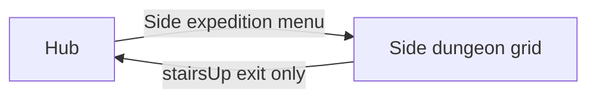

# Side dungeons (non-strata)

**Optional** � optional grid zones outside the main **stratum** ladder. Same exploration and combat subsystems as the labyrinth; different hub entry, save keys, and progression rules.

**Locked:** [ADR 022](../../decisions/022-side-dungeons-mvp3.md)

## Purpose

| Stratum labyrinth | Side dungeon |
|-------------------|--------------|
| Main campaign vertical slice (`s1`, `s2`, �) | Optional combat / loot / story beats |
| Hub **Enter Stratum** + warp gates (S2+) | Hub **Side expedition** menu only |
| `UnlockedWarpGateStrata` (strata only) | Unlock via quest / flag / milestone � not warp gates |
| Gate `stairsUp` ? hub only (strata) | Exit ? **hub only** |

Side dungeons are **instanced grids reached from the hub menu**, not a free-roam town overworld ([hub & services](hub-and-services.md)).

## Hub menu (optional)

New top-level hub option alongside inn, guild, and **Enter Stratum**:

| UI label (draft) | Action |
|------------------|--------|
| **Side expedition** | Opens list of **unlocked** side `locationId`s |

| Sub-action | Detail |
|------------|--------|
| Pick location | e.g. `sd01` � Salvage annex |
| Pick floor (if multi-floor) | Default: last visited floor for that location, or authored entry floor |
| Confirm | `HubController.EnterSideDungeon(locationId, floorId)` ? `GamePhase.Exploration` |

**Not** entered via stratum warp gates or `LeaveHub(stratumId, �)`.

### Unlock

| Source | Example |
|--------|---------|
| Story flag | `sd01_unlocked` after Stratum 1 boss |
| Quest complete | `quest_salvage_permit` |
| Optional milestone | 100% map on `s1_B2F` |

Locked entries may show as **silhouette + hint** (same pattern as Navigator Office).

## Entry and exit

| Direction | Rule |
|-----------|------|
| **Hub ? side** | Menu ? `EnterSideDungeon` ? spawn at authored **entry cell** for that floor |
| **Side ? hub** | `stairsUp` / exit interactable with target **Hub only** � no `PreviousStratumDeepest` |
| **Within location** | `stairsDown` / `stairsUp` link floors in the **same** `locationId` only |
| **Return thread** | Usable in side dungeons ? hub (same consumable as labyrinth) |

Combat flee still returns to **Exploration** on the same side floor ([game phase](game-phase.md)).

## Content IDs

| Kind | `locationId` | Floor ID | Save / map key |
|------|--------------|----------|----------------|
| Stratum | `s1` | `B1F` | `s1_B1F` |
| Side dungeon | `sd01` | `F1` | `sd01_F1` |

- Side locations use prefix **`sd`** + two digits (e.g. `sd01`, `sd02`).
- Floor IDs use **`F1`, `F2`, �** (not `B1F`) to avoid collision with stratum floor labels.
- **Do not** add side locations to `HubSaveData.UnlockedWarpGateStrata` (stratum warp gates only).

## Exploration rules

Same as labyrinth unless noted:

| System | Side dungeon |
|--------|----------------|
| Grid FPV + auto-map | Yes ([mapping](mapping.md), [ADR 002](../../decisions/002-mapping-model.md)) |
| FOE step patrol + contact | Yes ([ADR 003](../../decisions/003-foe-step-patrol.md)) |
| Random encounters | Per-floor `randomEncounterTableId` → `RandomEncounterTableDefinition` |
| FOE combat patrol + mid-battle join | When optional+ features ship ([ADR 005](../../decisions/005-foe-combat-patrol.md), [ADR 010](../../decisions/010-chain-foe-battle.md)) |
| Autopilot | Same revealed-tile pathfind when optional+ ships ([ADR 021](../../decisions/021-autopilot-mvp2.md)) |
| Unlimited steps | Yes ([ADR 008](../../decisions/008-campaign-defaults.md)) |
| Navigator | Active Navigator from hub; **no** mid-dungeon swap |
| Synchro | Normal bar rules; tutorial gating is **S1 stratum only** |

### Save model

| Data | Key / field |
|------|-------------|
| Revealed map | `SaveGame.Maps["sd01_F1"]` |
| FOE state | `SaveGame.FoeState["sd01_F1"]` |
| Active exploration | `ExplorationStateSave.MapKind = SideDungeon`, `LocationId = "sd01"`, `FloorId = "F1"` |
| Unlocked list | `SaveGame.UnlockedSideDungeonIds[]` or quest flags (implementation choice) |

**FOE respawn:** on hub return and re-entry, FOEs reset to authored spawns; **map reveal persists** ([ADR 008](../../decisions/008-campaign-defaults.md)).

## Authoring (optional)

Reuse the **ExplorationFloor** tile/FOE shape from [class design � floors](../05-class-design.md#content-definitions-runtime-scriptableobjects); tag content as side via `ExplorationMapKind` or parallel `SideDungeonFloor` SO ([ADR 022](../../decisions/022-side-dungeons-mvp3.md)).

| Field | Side dungeon note |
|-------|-------------------|
| `stratumId` | Empty or sentinel; **`locationId`** is authoritative |
| `partyEntryGate` | Hub re-entry spawn for that floor |
| `exitLinks` | **`Up` ? Hub only** for surface exits � no inter-stratum targets ([ADR 040](../../decisions/040-floor-exit-topology-graph.md)) |
| `hasWarpGate` | N/A � no hub warp gate |

**Game repo path (draft):** `Assets/Content/SideDungeons/sd01_F1.asset`

## Placeholder content � `sd01` (Salvage annex)

Draft first side dungeon for vertical-slice testing. Rename theme when art/narrative lands.

| Floor | Theme | FOEs | Notes |
|-------|-------|------|-------|
| `sd01_F1` | Guild salvage yard | 0�1 green FOE | Short loop; 1 chest; teaches menu entry |
| `sd01_F2` | Flooded storage | 1 patrol FOE | Optional; unlock after clearing `sd01_F1` |

**Unlock (draft):** `sd01_unlocked` after defeating `foe_s1_warden` (post�Stratum 1 boss).

## optional checklist (design)

- [ ] [ADR 022](../../decisions/022-side-dungeons-mvp3.md) linked from hub, game-phase, release scope
- [ ] Hub menu **Side expedition** lists unlocked `locationId`s
- [ ] `EnterSideDungeon` separate from `LeaveHub`
- [ ] Save keys `sd##_F#` documented in [04 � Tech notes](../04-tech-notes.md)
- [ ] At least one authored side floor (`sd01_F1`) in content plan

## Related docs

- [Hub & services](hub-and-services.md) � hub menu tree
- [Game phase](game-phase.md) � transitions
- [Dungeons & encounters](../03-content/dungeons-and-encounters.md) � stratum campaign
- [ADR 040 � Floor exit topology graph](../../decisions/040-floor-exit-topology-graph.md) � `exitLinks[]` authoring
- [Release scope](../00-release-scope.md) � optional milestone
- [04 � Tech notes](../04-tech-notes.md) � ContentDatabase / save keys
