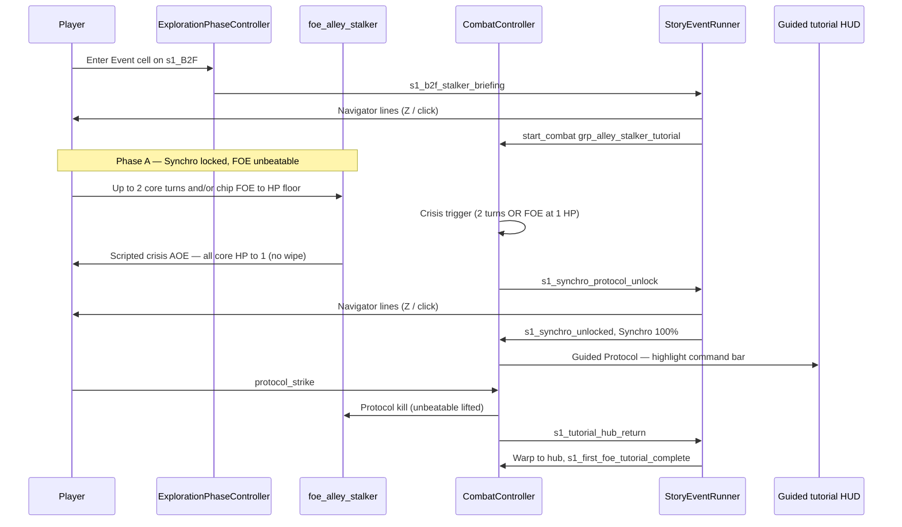

# Story Events (Visual Novel Presentation)

**Authority:** [ADR 028](../../decisions/028-story-visual-novel-events.md) (Proposed — stakeholder decisions 2026-05-23) · Coaching layer: [ADR 029](../../decisions/029-guided-tutorial.md)  
**Implementation:** [game #87](https://github.com/miramocha/griddungeon-game/issues/87) · HUD coach: [#88](https://github.com/miramocha/griddungeon-game/issues/88) · Synchro chrome: [#35](https://github.com/miramocha/griddungeon-game/issues/35) (done)  
**Status:** Draft — combat UI retract during mid-fight story still open.

Scripted **story scenes** with visual-novel-style presentation: character portraits, dialogue lines, optional choices, and **side effects** (campaign flags, combat tutorial phase, UI hints). One pipeline for hub briefings, exploration tile events, and **mid-combat** tutorials (first use: S1 Synchro / Protocol on `foe_alley_stalker`).

**Not the same as:** combat skill **cinematics** ([combat presentation](combat-presentation.md), [ADR 027](../../decisions/027-combat-cinematic-timeline-events.md)).

---

## Goals

| Goal | Approach |
|------|----------|
| Reuse everywhere | Single `StoryEventRunner` + `StoryEventView`; content-driven `storyEventId` |
| Combat-safe | Overlay + pause queue; **no** extra `GamePhase` |
| Rules stay in Core | Effects call campaign/combat APIs; runner does not embed S1 logic |
| EO-readable pacing | Line-by-line advance; presentation lock until scene completes or skips to safe point |
| Navigator POV | Player is the Navigator; [blank-state amnesia](narrative-pov.md) — mechanics named only when the beat teaches them |

---

## Runtime shape (proposed)

```
Trigger (hub / explore / combat)
  → StoryEventRunner.Play(storyEventId)
  → InputRouter: story-only (or UI) map
  → StoryEventView: show step
  → Player advance / auto wait / choice
  → Apply step effects
  → Next step or Complete()
  → Release lock; caller resumes (e.g. CombatController continues AGI)
```

| Type | Assembly | Role |
|------|----------|------|
| `StoryEventDefinition` | Content | Steps, speakers, effects |
| `StoryEventRunner` | Runtime | Orchestration, effect dispatch |
| `StoryEventView` | UI | VN layout (UI Toolkit) |

---

## Step kinds (MVP1 minimum)

| Kind | Fields (draft) | Notes |
|------|----------------|-------|
| `line` | `speakerId`, `text` or `textKey`, `emotion?` | Name plate + body |
| `effect` | `effects[]` | No visible line; run between lines |
| `wait` | `durationSec` | Auto-advance |
| `choice` | `prompt`, `options[]` → `gotoStep` / `branchId` | Post-MVP1 if not needed for S1 |

### Speaker ids

Reuse content ids where possible: `navigator:guild_handler`, `core:<characterId>`, `narrator`, `foe:foe_alley_stalker` (silhouette / icon only if no bust).

---

## Effects (draft)

Executed synchronously when a step is entered (or when a choice is picked). Implementations must be **idempotent** where replay / skip could re-fire.

| Effect | Parameters | Owner API |
|--------|------------|-----------|
| `set_campaign_flag` | `flag`, `value` | `CampaignSaveData` |
| `set_synchro_charge` | `percent` | `PartyRuntime` / combat session |
| `combat_tutorial_phase` | `phase` | **Target** — advance S1 tutorial beat via campaign flags + `CombatController` (crisis / unlock); not a field on `CombatEntryContext` |
| `show_combat_hint` | `hintId` | Combat HUD (#35) — optional delegation |
| `start_guided_protocol` | `skillId` | Set unlock flags → `CombatTutorialHudRules` Protocol-only gate + guided coach ([#88](https://github.com/miramocha/griddungeon-game/issues/88)) |
| `start_combat` | `encounterGroupId`, `noFlee?` | `GameState.RequestCombat(CombatEntryContext)` — S1 tutorial: `grp_alley_stalker_tutorial` ([`CombatTutorialHudRules.S1FirstFoeEncounterGroupId`](https://github.com/miramocha/griddungeon-game/blob/main/Assets/Scripts/Core/Campaign/CombatTutorialHudRules.cs)) |
| `teleport_to_hub` | — | `GamePhaseController` scripted `Combat → Hub` |
| `end_story_event` | — | Runner |

New effects require an ADR amendment or appendix — avoid ad-hoc string effects in scenes.

---

## Act 1 — first hub (B1F)

**Authority:** [s1-intro § Act 1](../03-content/campaign/s1-intro.md#three-acts-same-s1_b1f-map) · movement coaching: [guided-tutorial](guided-tutorial.md) (orthogonal paginated hints).

| `storyEventId` | When | Effects (on complete) |
|----------------|------|------------------------|
| **`s1_b1f_mouth_briefing`** | Exploration Event cell **`!` `(10, 9)`** on mouth approach — **before** first **`^` → hub** | `s1_b1f_mouth_briefing_seen` |

**Trigger (locked):** `ExplorationPhaseController` / tile script → `StoryEventRunner.Play` on `OnPartyEnteredCell`; overlay lock until dismiss; then player walks to **`^`** for `Exploration → Hub`.

**Act 1 exception:** one story event at the mouth; other Act 1 beats stay **guided tutorial** ([ADR 029](../../decisions/029-guided-tutorial.md) — not a fourth macro phase).

Draft copy: [s1/s1_b1f_mouth_briefing.md](../03-content/story-events/s1/s1_b1f_mouth_briefing.md).

---

## S1 tutorial flow — `foe_alley_stalker`

**Authority for combat rules:** [synchro § S1 gating](synchro-protocol.md#s1-tutorial-gating-first-foe) · **Presentation:** this doc + [ADR 028](../../decisions/028-story-visual-novel-events.md).



| Step | Systems | Story / UI |
|------|---------|------------|
| **Approach (exploration)** | Event cell `(7, 11)` on `s1_B2F` | **`s1_b2f_stalker_briefing`** → `start_combat` (tutorial group); main path before hub warp |
| **Crisis trigger** | `CombatController` tutorial phase | Same condition as before: **2 core turns** OR **FOE at HP floor** (anti soft-lock) |
| **Crisis AOE** | Scripted FOE action — party HP → **1** each living core | Combat log + VFX; **not** GAME OVER |
| **Unlock VN** | `s1_synchro_protocol_unlock` after AOE UI beat | Navigator-only click-through block |
| **Guided Protocol** | [#88](https://github.com/miramocha/griddungeon-game/issues/88) coach + [#35](https://github.com/miramocha/griddungeon-game/issues/35) Protocol-only gate | Only **Protocol → `protocol_strike`** enabled |
| **Finisher** | `protocol_strike` kills FOE | Sets `s1_synchro_protocol_tutorial_done` |
| **Hub outro** | `s1_tutorial_hub_return` | VN lines → **`teleport_to_hub`** (scripted `Combat → Hub`) |

### Guided tutorial (HUD)

Between unlock VN and Protocol resolve — **authority:** [guided-tutorial § combat](guided-tutorial.md#combat-guided-tutorial-s1--protocol) · content: [`s1_combat_guided_protocol`](../03-content/campaign/s1-guided-tutorials.md#guided-hint--protocol-coach).

Summary: Synchro at **100%**; pulse **Protocol**; other commands disabled; player still confirms **`protocol_strike`**; no skip until resolve.

### Story events (MVP1)

| `storyEventId` | When | Effects (on complete) |
|----------------|------|------------------------|
| **`s1_b2f_stalker_briefing`** | Exploration Event cell on B2F (before tutorial fight / hub) | `s1_b2f_stalker_briefing_seen`, `start_combat` → `grp_alley_stalker_tutorial` |
| **`s1_synchro_protocol_unlock`** | After crisis AOE UI beat | `s1_synchro_unlocked`, Synchro 100%, enter guided phase |
| **`s1_tutorial_hub_return`** | After Protocol kills FOE | `s1_first_foe_tutorial_complete`, `teleport_to_hub` |

Mid-fight intro / separate retreat scene: **not** used — approach VN + crisis AOE + hub outro cover the arc. FOE grid contact remains a **fallback** if the player reaches the stalker without the Event cell.

**Exploration trigger (locked):** `ExplorationPhaseController` (or floor tile script) calls `StoryEventRunner.Play` on `OnPartyEnteredCell` for the Event tile — same overlay lock as combat VN; exploration steps blocked until dismiss.

**Save:** hub inn only — no mid-fight save.

Draft copy: [s1/s1_b1f_mouth_briefing.md](../03-content/story-events/s1/s1_b1f_mouth_briefing.md), [s1/s1_b2f_stalker_briefing.md](../03-content/story-events/s1/s1_b2f_stalker_briefing.md), [s1/s1_synchro_protocol_unlock.md](../03-content/story-events/s1/s1_synchro_protocol_unlock.md), [s1/s1_tutorial_hub_return.md](../03-content/story-events/s1/s1_tutorial_hub_return.md).

---

## Content layout (proposed)

| Location | Contents |
|----------|----------|
| `docs/03-content/story-events/` | Index table: id, once?, prerequisites, trigger summary |
| `docs/03-content/story-events/s1/` | S1 YAML drafts |
| Game: `Assets/Content/StoryEvents/` | Imported definitions |

Example index row:

| storyEventId | once | prerequisite | trigger |
|--------------|------|--------------|---------|
| `s1_synchro_protocol_unlock` | yes | `s1_tutorial_dive_started` | Combat: after crisis AOE on `grp_alley_stalker_tutorial` |

---

## UI — MVP1 vs full VN

| Phase | Presentation |
|-------|----------------|
| **MVP1** | **Click-through block:** full-screen panel, body text, **Z** or **click** to advance/dismiss each step; arena stays visible |
| **Next** | Full VN: portraits, name plate, bottom text box; emotion swaps on bust (**low art priority**) |
| **Later** | Skip, auto-advance, back — deferred; no skip on S1 tutorial in MVP1 |

**Combat backdrop (locked):** battle **arena visible**; which HUD panels retract during scene — **TBD** (command bar, AGI strip, when Synchro meter appears, etc.).

## Speakers and custom party

**Authority:** [narrative POV](narrative-pov.md) — Navigator **blank state**; player is the active Navigator; cores stay silent in scripted fiction.

| Speaker | Use |
|---------|-----|
| **`navigator:guild_handler`** (S1) | All MVP1 story VN + mandatory coach voice — **first person**, amnesia-safe copy |
| **Narrator / radio / signage** | Impersonal lines only (post-MVP1) |
| **`core:<id>`** | **Avoid** — roster is player-defined |
| **FOE** | SFX / UI reaction; no dialogue MVP1 |

**S1 (locked):** Navigator only. Do **not** explain Synchro / Protocol in Act 1 mouth briefing; first in-fiction **name** of the channel burst = `s1_synchro_protocol_unlock` after crisis AOE.

**Authoring:** Match [reveal pacing](narrative-pov.md#blank-state-locked) before importing `textEn` to game assets.

## Localization

**Recommendation (for schema, even in click-block MVP1):**

| Field | Use |
|-------|-----|
| `textKey` | Required stable id, e.g. `story.s1.synchro_unlock.line_02` |
| `textEn` (optional) | Inline English in content files until a string table exists |

At runtime: resolve `textKey` from localization table; if missing and `textEn` present, show `textEn` (dev-friendly). Avoid English-only fields with no key — retrofit is painful.

**VO:** not planned; optional `voClipId` on step reserved for later — unused in MVP1.

## Input (locked)

| Action | Binding |
|--------|---------|
| Advance / dismiss step | **Z** (same as combat confirm) **or** click on story panel |
| Back | Not in MVP1 tutorial |
| Skip | Disabled MVP1 |

Reuse combat confirm routing while `StoryEventRunner.IsActive`; dedicated **Story** action map optional post-MVP1.

---

## Triggers by game phase

| Phase | Example trigger |
|-------|-----------------|
| Hub | Service script after Navigator unlock |
| Exploration | Cell script `storyEventId` on `OnPartyEnteredCell` — **MVP1:** `s1_b1f_mouth_briefing` (Act 1, before first hub); `s1_b2f_stalker_briefing` (B2F, before tutorial combat / scripted hub) |
| Combat | Tutorial phase callback, boss intro before turn 1 |

Tile **Event** encounters ([dungeons § Encounter types](../03-content/dungeons-and-encounters.md#encounter-types)): **S1 tutorial** = dialogue on enter, then `start_combat` on dismiss (no flee). Other events may use before/after fight — per content row.

---

## Open design questions

1. **Combat UI retract** — which panels hide during mid-combat story (command bar, AGI strip, enemy row, Synchro meter reveal on scene end only, etc.).
2. **Authoring** — YAML vs ScriptableObject for MVP1 ([#87](https://github.com/miramocha/griddungeon-game/issues/87)); graph-UI editor deferred — [ADR 030](../../decisions/030-story-event-graph-authoring.md).

---

## Graph authoring (post-MVP1)

**Authority:** [ADR 030](../../decisions/030-story-event-graph-authoring.md).

Designers author **one graph per `storyEventId`** (nodes = steps, edges = branches/choices). An Editor compile step exports the **same** `StoryEventDefinition` step array `StoryEventRunner` already runs — runtime does not interpret the graph in builds.

| Concern | MVP1 ([#87](https://github.com/miramocha/griddungeon-game/issues/87)) | Post-MVP1 ([ADR 030](../../decisions/030-story-event-graph-authoring.md)) |
|---------|------|-------------|
| Branching in play | Linear S1 only | `choice` + flag branches |
| Authoring UI | Hand YAML / SO | GraphView editor + compile |
| Tests | Compiled steps | Same — tests use compiled output |

---

## Related

- [Guided tutorial](guided-tutorial.md) — HUD coaching (exploration + combat); distinct from VN
- [ADR 028 — Story events](../../decisions/028-story-visual-novel-events.md)
- [ADR 030 — Story event graph authoring](../../decisions/030-story-event-graph-authoring.md)
- [Synchro Protocol — S1 gating](synchro-protocol.md#s1-tutorial-gating-first-foe)
- [S1 campaign intro](../03-content/campaign/s1-intro.md)
- [FOE encounters — tutorial FOE](foe-encounters.md#tutorial-foe-s1--foe_alley_stalker)
- [Game phase](game-phase.md)
- [Campaign content README](../03-content/campaign/README.md)
