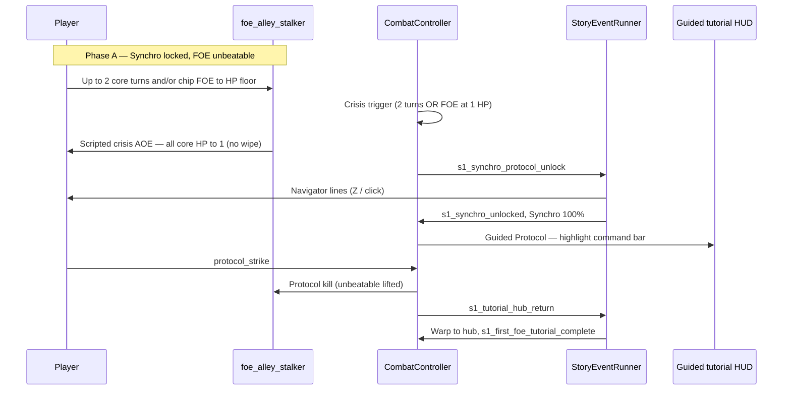

# Story Events (Visual Novel Presentation)

**Authority:** [ADR 028](../../decisions/028-story-visual-novel-events.md) (Proposed — stakeholder decisions 2026-05-23) · Coaching layer: [ADR 029](../../decisions/029-guided-tutorial.md)  
**Status:** Draft — UI retract + #35 split still open.

Scripted **story scenes** with visual-novel-style presentation: character portraits, dialogue lines, optional choices, and **side effects** (campaign flags, combat tutorial phase, UI hints). One pipeline for hub briefings, exploration tile events, and **mid-combat** tutorials (first use: S1 Synchro / Protocol on `foe_alley_stalker`).

**Not the same as:** combat skill **cinematics** ([combat presentation](combat-presentation.md), [ADR 027](../../decisions/027-combat-cinematic-timeline-events.md)).

---

## Goals

| Goal | Approach |
|------|----------|
| Reuse everywhere | Single `StoryEventRunner` + `StoryEventView`; content-driven `storyEventId` |
| Combat-safe | Overlay + pause queue; **no** extra `GamePhase` |
| Rules stay in Core | Effects call campaign/combat APIs; runner does not embed S1 logic |
| EO-readable pacing | Line-by-line advance; presentation lock until scene completes or skips to safe point |

---

## Runtime shape (proposed)

```
Trigger (hub / explore / combat)
  → StoryEventRunner.Play(storyEventId)
  → InputRouter: story-only (or UI) map
  → StoryEventView: show step
  → Player advance / auto wait / choice
  → Apply step effects
  → Next step or Complete()
  → Release lock; caller resumes (e.g. CombatController continues AGI)
```

| Type | Assembly | Role |
|------|----------|------|
| `StoryEventDefinition` | Content | Steps, speakers, effects |
| `StoryEventRunner` | Runtime | Orchestration, effect dispatch |
| `StoryEventView` | UI | VN layout (UI Toolkit) |

---

## Step kinds (MVP1 minimum)

| Kind | Fields (draft) | Notes |
|------|----------------|-------|
| `line` | `speakerId`, `text` or `textKey`, `emotion?` | Name plate + body |
| `effect` | `effects[]` | No visible line; run between lines |
| `wait` | `durationSec` | Auto-advance |
| `choice` | `prompt`, `options[]` → `gotoStep` / `branchId` | Post-MVP1 if not needed for S1 |

### Speaker ids

Reuse content ids where possible: `navigator:guild_handler`, `core:<characterId>`, `narrator`, `foe:foe_alley_stalker` (silhouette / icon only if no bust).

---

## Effects (draft)

Executed synchronously when a step is entered (or when a choice is picked). Implementations must be **idempotent** where replay / skip could re-fire.

| Effect | Parameters | Owner API |
|--------|------------|-----------|
| `set_campaign_flag` | `flag`, `value` | `CampaignSaveData` |
| `set_synchro_charge` | `percent` | `PartyRuntime` / combat session |
| `combat_tutorial_phase` | `phase` | `CombatController` / `TutorialCombatKind` |
| `show_combat_hint` | `hintId` | Combat HUD (#35) — optional delegation |
| `start_guided_protocol` | `skillId` | Enable guided Protocol only (`protocol_strike`) |
| `teleport_to_hub` | — | `GamePhaseController` scripted `Combat → Hub` |
| `end_story_event` | — | Runner |

New effects require an ADR amendment or appendix — avoid ad-hoc string effects in scenes.

---

## S1 tutorial flow — `foe_alley_stalker`

**Authority for combat rules:** [synchro § S1 gating](synchro-protocol.md#s1-tutorial-gating-first-foe) · **Presentation:** this doc + [ADR 028](../../decisions/028-story-visual-novel-events.md).



| Step | Systems | Story / UI |
|------|---------|------------|
| **Crisis trigger** | `CombatController` tutorial phase | Same condition as before: **2 core turns** OR **FOE at HP floor** (anti soft-lock) |
| **Crisis AOE** | Scripted FOE action — party HP → **1** each living core | Combat log + VFX; **not** GAME OVER |
| **Unlock VN** | `s1_synchro_protocol_unlock` after AOE UI beat | Navigator-only click-through block |
| **Guided Protocol** | [#35](https://github.com/miramocha/griddungeon-game/issues/35) HUD + combat gate | Only **Protocol → `protocol_strike`** enabled |
| **Finisher** | `protocol_strike` kills FOE | Sets `s1_synchro_protocol_tutorial_done` |
| **Hub outro** | `s1_tutorial_hub_return` | VN lines → **`teleport_to_hub`** (scripted `Combat → Hub`) |

### Guided tutorial (HUD)

Between unlock VN and Protocol resolve — **authority:** [guided-tutorial § combat](guided-tutorial.md#combat-guided-tutorial-s1--protocol) · content: [`s1_combat_guided_protocol`](../03-content/campaign/s1-guided-tutorials.md#guided-hint--protocol-coach).

Summary: Synchro at **100%**; pulse **Protocol**; other commands disabled; player still confirms **`protocol_strike`**; no skip until resolve.

### Story events (MVP1)

| `storyEventId` | When | Effects (on complete) |
|----------------|------|------------------------|
| **`s1_synchro_protocol_unlock`** | After crisis AOE UI beat | `s1_synchro_unlocked`, Synchro 100%, enter guided phase |
| **`s1_tutorial_hub_return`** | After Protocol kills FOE | `s1_first_foe_tutorial_complete`, `teleport_to_hub` |

Fight-start intro / separate retreat scene: **not** used — crisis AOE + hub outro replace them.

**Save:** hub inn only — no mid-fight save.

Draft copy: [s1/s1_synchro_protocol_unlock.md](../03-content/story-events/s1/s1_synchro_protocol_unlock.md), [s1/s1_tutorial_hub_return.md](../03-content/story-events/s1/s1_tutorial_hub_return.md).

---

## Content layout (proposed)

| Location | Contents |
|----------|----------|
| `docs/03-content/story-events/` | Index table: id, once?, prerequisites, trigger summary |
| `docs/03-content/story-events/s1/` | S1 YAML drafts |
| Game: `Assets/Content/StoryEvents/` | Imported definitions |

Example index row:

| storyEventId | once | prerequisite | trigger |
|--------------|------|--------------|---------|
| `s1_synchro_protocol_unlock` | yes | `s1_tutorial_dive_started` | Combat: `TutorialCombatKind.SynchroFirstFoe` phase B |

---

## UI — MVP1 vs full VN

| Phase | Presentation |
|-------|----------------|
| **MVP1** | **Click-through block:** full-screen panel, body text, **Z** or **click** to advance/dismiss each step; arena stays visible |
| **Next** | Full VN: portraits, name plate, bottom text box; emotion swaps on bust (**low art priority**) |
| **Later** | Skip, auto-advance, back — deferred; no skip on S1 tutorial in MVP1 |

**Combat backdrop (locked):** battle **arena visible**; which HUD panels retract during scene — **TBD** (command bar, AGI strip, when Synchro meter appears, etc.).

## Speakers and custom party

**Avoid dialogue attributed to specific core members** — player picks classes/names. Prefer:

- **Navigator** (`navigator:guild_handler`) for tutorials and briefings
- **Narrator / radio / signage** for impersonal lines (post-MVP1)
- **FOE** — SFX/UI reaction only unless a beat needs explicit monster voice (not MVP1 unlock)

**S1 unlock scene (locked):** Navigator only.

## Localization

**Recommendation (for schema, even in click-block MVP1):**

| Field | Use |
|-------|-----|
| `textKey` | Required stable id, e.g. `story.s1.synchro_unlock.line_02` |
| `textEn` (optional) | Inline English in content files until a string table exists |

At runtime: resolve `textKey` from localization table; if missing and `textEn` present, show `textEn` (dev-friendly). Avoid English-only fields with no key — retrofit is painful.

**VO:** not planned; optional `voClipId` on step reserved for later — unused in MVP1.

## Input (locked)

| Action | Binding |
|--------|---------|
| Advance / dismiss step | **Z** (same as combat confirm) **or** click on story panel |
| Back | Not in MVP1 tutorial |
| Skip | Disabled MVP1 |

Reuse combat confirm routing while `StoryEventRunner.IsActive`; dedicated **Story** action map optional post-MVP1.

---

## Triggers by game phase

| Phase | Example trigger |
|-------|-----------------|
| Hub | Service script after Navigator unlock |
| Exploration | Cell script `storyEventId` on enter |
| Combat | Tutorial phase callback, boss intro before turn 1 |

Tile **Event** encounters ([dungeons § Encounter types](../03-content/dungeons-and-encounters.md#encounter-types)) may call `Play()` before or after combat starts — **TBD** per event.

---

## Open design questions

1. **Combat UI retract** — which panels hide during mid-combat story (command bar, AGI strip, enemy row, Synchro meter reveal on scene end only, etc.).
2. **Game #35** — HUD/meter/reactive chrome only vs includes `StoryEventRunner`.
3. **Authoring** — YAML vs ScriptableObject (deferred).
4. **MVP1 build order** — S1 combat unlock vs Act 1 B1F beats first (deferred).

---

## Related

- [Guided tutorial](guided-tutorial.md) — HUD coaching (exploration + combat); distinct from VN
- [ADR 028 — Story events](../../decisions/028-story-visual-novel-events.md)
- [Synchro Protocol — S1 gating](synchro-protocol.md#s1-tutorial-gating-first-foe)
- [S1 campaign intro](../03-content/campaign/s1-intro.md)
- [FOE encounters — tutorial FOE](foe-encounters.md#tutorial-foe-s1--foe_alley_stalker)
- [Game phase](game-phase.md)
- [Campaign content README](../03-content/campaign/README.md)
