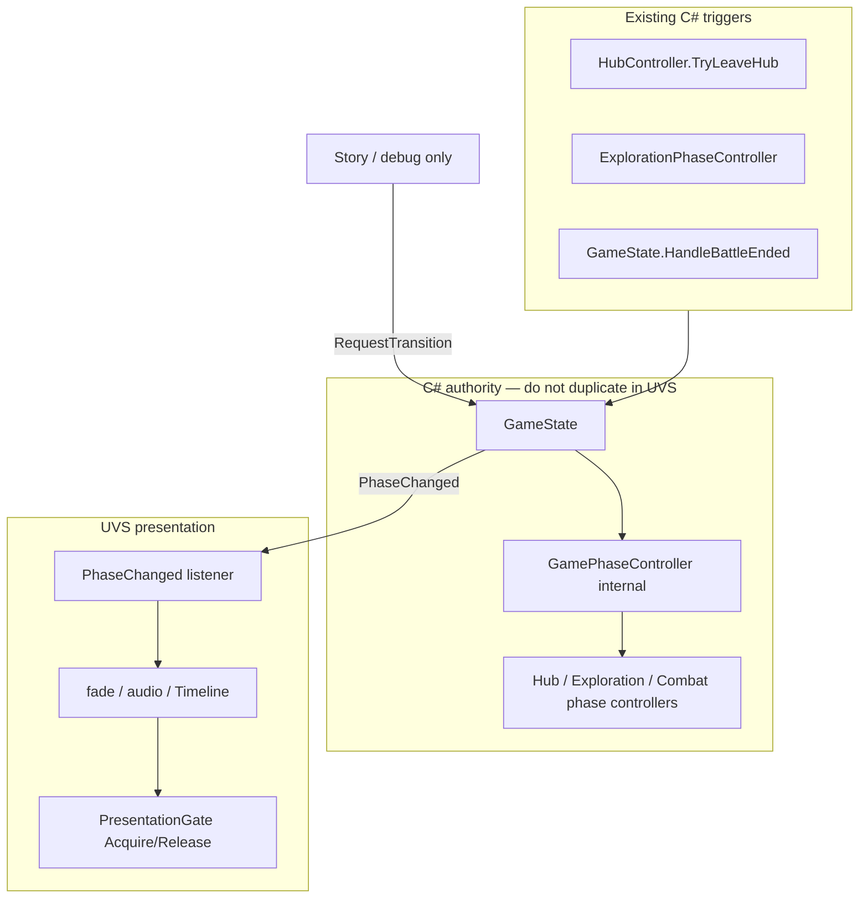

---
tags:
  - path/docs/02-systems
  - type/system
  - scope/later
  - status/draft
  - domain/phase
---
# UVS — Phase & Presentation Hooks

**Authority:** [ADR 017](../../decisions/017-game-phase-controller.md) (macro phases stay in C#) · [game phase](game-phase.md) (transition table, lifecycle)  
**Implementation:** [griddungeon-game](https://github.com/miramocha/griddungeon-game) — `GameState`, `GamePhaseController`, phase controllers  
**Status:** Draft — optional later presentation layer; APIs below match the game repo as of 2026-05.

Unity **Visual Scripting (UVS)** may drive **presentation** (fades, camera, audio, Timeline) around macro phases **Hub / Exploration / Combat**. It must **not** own transition rules, combat math, or save writes.

---

## Goals

| Goal | Approach |
|------|----------|
| One source of truth for macro mode | Read `GameState.Current`; subscribe to `GameState.PhaseChanged` |
| Testable gameplay | Call `GameState.RequestTransition` / `RequestCombat` only from scripted beats (story, debug); default triggers stay in C# |
| Input stays consistent | Do not enable Input System maps from UVS — `InputRouter` already reacts to `PhaseChanged` |
| Block UI during overlays | Use per-mode **presentation gates** (`Acquire` / `Release`) |

---

## Setup (game repo)

### 1. Scene references

| Object | Component | UVS use |
|--------|-----------|---------|
| **Game** (bootstrap root) | `GameState` | Phase read/write façade |
| Same hierarchy | `HubController` | Hub → Exploration (`TryLeaveHub`) |
| Same hierarchy | `DungeonExplorer` | Grid move / spawn (Exploration only) |
| Same hierarchy | `CombatController` | In-fight events; `PresentationGate` |
| **Game** or bootstrap child | `InputRouter` | Do not drive from UVS — reference only |

`GameBootstrap` calls `InputRouter.Bind(gameState)` on play — your graph should assume that wiring exists in `DevBootstrap.unity`.

### 2. Node library assemblies

In **Project Settings → Visual Scripting → Node Library → Assembly Options**, include at least:

- `GridDungeon.Core` — `GamePhase`, `GridPosition`, `CombatEntryContext`, `BattleResult`, …
- `GridDungeon.Runtime` — `GameState`, `HubController`, `DungeonExplorer`, `CombatController`, presentation gates

`GridDungeon.Runtime` is `autoReferenced`; if nodes are missing, regenerate the node library after adding those assemblies.

### 3. Recommended graph placement

| Graph type | Host | Role |
|------------|------|------|
| **State Graph** (optional) | Child of **Game** e.g. `PhasePresentation` | Mirror `GamePhase` for fade/audio; **listen-only** for production |
| **Script Graph** | Story runner / debug hook | One-shot `RequestTransition`, `SpawnAt`, gate lock |
| **Custom C# node** (optional) | `Assets/Scripts/` bridge | Thin wrappers if UVS cannot bind `Action<,>` events cleanly |

---

## Architecture



**`GamePhaseController` is not on the scene** — only `GameState` forwards transitions.

---

## Macro phase API

### `GamePhase` (Core)

| Value | Meaning |
|-------|---------|
| `Hub` | Guild / services |
| `Exploration` | Grid FPV dungeon |
| `Combat` | Battle arena (exploration view hidden) |

### Valid transitions

| From | To | Typical C# caller |
|------|-----|-------------------|
| Hub | Exploration | `HubController.TryLeaveHub` |
| Exploration | Combat | `GameState.RequestCombat` |
| Exploration | Hub | Stairs up (gate), scripted exit |
| Combat | Exploration | `GameState` on `BattleEnded` (victory / flee) |
| Combat | Hub | `GameState` on `BattleEnded` (wipe); S1 story `teleport_to_hub` |

Invalid `RequestTransition` returns `false` and leaves `Current` unchanged.

### `GameState` — primary UVS façade

| Member | Direction | Notes |
|--------|-----------|-------|
| `Current` | Read | Same as internal `GamePhaseController.Current` |
| `PhaseChanged` | Event `(previous, next)` | **Main hook** for presentation graphs |
| `RequestTransition(GamePhase)` | Write | Hub / Exploration / Combat only |
| `RequestCombat(CombatEntryContext)` | Write | Sets pending entry, then Combat |
| `RequestQuitToTitle()` | Write | Pause quit — **not** a phase change |
| `ExplorationBindingsWired` | Event | Exploration handlers re-attached (e.g. dev reset) |

**Full HUD event tables (integrator):** [UI event contract](../04-dev/ui-event-contract.md).
| `Combat` | Read | `CombatController` reference |

### Internal (do not call from UVS)

| Type | Why |
|------|-----|
| `GamePhaseController.TryTransitionTo` | No scene reference; use `GameState.RequestTransition` |
| `IPhaseController.OnEnter` / `OnExit` | Invoked only by phase controller |
| Direct `DungeonView.SetVisible`, scene loads | Owned by phase controllers |

---

## Examples — phase changes

Use **C#** in Custom Event nodes, `Script Machine` graphs, or a small `MonoBehaviour` bridge. Paths are under the game repo `Assets/Scripts/`.

### A. React to phase changes (recommended default)

Subscribe once at Start; run presentation only.

```csharp
// On a MonoBehaviour next to GameState, or a UVS-invoked bridge method.
using GridDungeon.Core.Enums;
using GridDungeon.Runtime.Game;
using UnityEngine;

public sealed class PhasePresentationBridge : MonoBehaviour
{
    [SerializeField] GameState m_gameState = null!;

    void OnEnable() => m_gameState.PhaseChanged += OnPhaseChanged;
    void OnDisable() => m_gameState.PhaseChanged -= OnPhaseChanged;

    void OnPhaseChanged(GamePhase previous, GamePhase next)
    {
        switch (next)
        {
            case GamePhase.Hub:
                PlayHubEnter(previous);
                break;
            case GamePhase.Exploration:
                PlayExplorationEnter(previous);
                break;
            case GamePhase.Combat:
                PlayCombatEnter(previous);
                break;
        }
    }

    void PlayHubEnter(GamePhase from) { /* fade, BGM */ }
    void PlayExplorationEnter(GamePhase from) { /* fade; if from == Combat, footstep resume */ }
    void PlayCombatEnter(GamePhase from) { /* battle sting; arena already shown by CombatPhaseController */ }
}
```

**UVS State Graph pattern (listen-only):**

1. **On Start** → get `GameState` (GameObject variable or `Get Component`).
2. **Add Listener** on `PhaseChanged` (custom event unit or bridge above).
3. **Switch** on `next` (`GamePhase` enum).
4. Each branch: **DOTween / Audio / Timeline** — no `RequestTransition` in production branches.

### B. Hub → Exploration (player leaves guild)

Prefer the existing hub API so campaign gates and save clearing run.

```csharp
using GridDungeon.Runtime.Hub;

// HubController on same Game object as GameState (serialized on Dev Bootstrap).
bool ok = hubController.TryLeaveHub(stratumId: "s1", floorId: "B1F");
// ok == false → party not ready, missing refs, or transition rejected
```

Do **not** call `gameState.RequestTransition(GamePhase.Exploration)` from UVS unless you are intentionally bypassing `OnHubLeaveForStratum` / `ClearExplorationState` (debug only).

### C. Exploration → Combat (scripted encounter)

Build a `CombatEntryContext` (Core) and request combat through `GameState`.

```csharp
using GridDungeon.Core;
using GridDungeon.Core.Enums;
using GridDungeon.Core.Models;
using GridDungeon.Runtime.Game;

var entry = new CombatEntryContext
{
    EncounterGroupId = "grp_alley_stalker_tutorial",
    FightAnchor = explorer.Cell,
    PartyFacing = explorer.Facing,
    NoFlee = true,
};

bool started = gameState.RequestCombat(entry);
```

FOE contact fights should set `Foe` and match fields the exploration controller uses (`BuildFoeContactEntry` in `ExplorationPhaseController`).

### D. Scripted Combat → Hub (story)

For beats such as `teleport_to_hub` ([story-events](story-events.md)), after presentation completes:

```csharp
using GridDungeon.Core.Enums;
using GridDungeon.Runtime.Game;

// Only when design doc says Combat → Hub is allowed (tutorial outro, wipe handled elsewhere).
bool ok = gameState.RequestTransition(GamePhase.Hub);
```

Wipe → Hub is already handled in `GameState.HandleBattleEnded` — do not duplicate on `BattleEnded` unless you are **adding** overlay before the automatic transition (listen to `BattleEnded`, play GAME OVER, then let C# transition or call `RequestTransition` once).

### E. Dev / QA shortcuts (not shipping graphs)

Dev HUD and F-keys call the same APIs:

| Action | API |
|--------|-----|
| Force Hub | `gameState.RequestTransition(GamePhase.Hub)` |
| Force Exploration | `gameState.RequestTransition(GamePhase.Exploration)` |
| Force Combat | `gameState.RequestCombat(entry)` or dev bootstrap entry |

See [game phase — Dev bootstrap HUD](game-phase.md#dev-bootstrap-hud-ui-toolkit).

---

## Examples — exploration movement

Grid movement is **`DungeonExplorer`** during **`GamePhase.Exploration`** only. Phase enter wires walkability and step handlers; phase exit unbinds them.

### When UVS may move the party

| OK | Avoid |
|----|-------|
| Cutscene teleport: `SpawnAt(cell, facing)` after story lock | Calling `TryStep*` while `GamePhase != Exploration` |
| Tutorial: single scripted step after gate + phase check | Teleport during Combat (use combat presentation) |
| Listen to `OnPartyEnteredCell` for story triggers | Writing `SaveSystem` from UVS |

### Read state

```csharp
using GridDungeon.Core;
using GridDungeon.Core.Enums;
using GridDungeon.Runtime.Exploration;

GridPosition cell = explorer.Cell;
FacingDirection facing = explorer.Facing;
bool busy = explorer.IsAnimating;
```

### Teleport (scripted position)

```csharp
using GridDungeon.Core;
using GridDungeon.Core.Enums;
using GridDungeon.Runtime.Exploration;

// Stops active tween, updates cell, fires OnPartyEnteredCell (map reveal hooks).
explorer.SpawnAt(new GridPosition(10, 9), FacingDirection.North);
```

Use during **presentation lock** (gate acquired) so `InputRouter` does not race the player.

### Single step / turn (cutscene pacing)

Same methods the Input System handler calls ([input-bindings](input-bindings.md)):

```csharp
using GridDungeon.Runtime.Exploration;

MovementAcceptance result = explorer.TryStepForward();
// TryStepBack, TryStrafeLeft, TryStrafeRight, TryTurnLeft, TryTurnRight, TryInteract

// result == Ignored when IsAnimating or blocked; Started when tween began.
```

Wait for **`AnimationCompleted`** or poll `!explorer.IsAnimating` before the next scripted step. Respect [ADR 018](../../decisions/018-exploration-animation-speed.md) durations (`StepDuration` / `TurnDuration` on the component).

### UVS graph — “walk party to cell” (high level)

1. `PhaseChanged` → branch `Exploration`.
2. `hub.PresentationGate.Acquire()` or `ExplorationPresentationGate` on HUD.
3. Loop: compare `explorer.Cell` to target; if not equal, `TryStepForward()` (or pick direction in C# bridge); **Wait Until** `AnimationCompleted` or delay `StepDuration`.
4. `SpawnAt` if design needs exact cell regardless of path.
5. `gate.Release()`.

Production movement should remain **player input** via `InputRouter` — scripted loops are for tutorials and cinematics only.

### Exploration events (story triggers)

| Event | Use |
|-------|-----|
| `OnPartyEnteredCell` | Tile `!` story, gate briefing |
| `OnPartyStep` | FOE patrol tick, random encounter roll |
| `InteractRequested` | Stairs, gather — usually player `Space` / `Z` |
| `AnimationCompleted` | Chain scripted steps |

Subscribe in a bridge `MonoBehaviour`; forward to UVS **Custom Event** nodes if needed.

---

## UI presentation hooks

**ADR:** [042 — Runtime presentation bus + shell catalog](../../decisions/042-presentation-bus.md) · **Integrator:** [ui-event-contract § Presentation bus](../04-dev/ui-event-contract.md#presentation-bus)

`UiPresentationBridge` on the bootstrap `Game` object mirrors presentation DTOs for graphs that should react to HUD chrome without referencing `GridDungeon.UI`.

### Bridge fields (Play Mode)

| Field / event | When fired | UVS use |
|---------------|------------|---------|
| `OnCommandRailChanged` (`UnityEvent`) | Hub/combat/party rail context or menu snapshot updates | Animator triggers, debug log, Timeline markers |
| `OnCommandRailFocusBeat` | Focus index changed on rail menu | One-shot mesh highlight |
| `OnCommandRailModalOpen` | Modal chip rail opened | Block secondary VFX |
| `OnCommandRailInfoChanged` | Header / service copy updates | World-space title plate |

C# subscribers use `IUiPresentationBus.CommandRailChanged` on the same component.

### Example graph — rail change smoke test

1. Add **Script Graph** to `Game` (or presentation rig).
2. **Node library:** include `GridDungeon.Runtime` (Edit → Project Settings → Visual Scripting).
3. **Start** → get `UiPresentationBridge` (`GetComponent` on `Game`).
4. **Add Listener** → `OnCommandRailChanged` → **Debug Log** (`state.Context` or serialized fields).
5. Play Mode **F1** hub / **F3** combat — log fires on rail context changes.

### UVS boundaries (listen-only)

| OK | Not OK |
|----|--------|
| Fade, camera, audio, Animator, Timeline on rail beats | `GameState.RequestTransition` |
| Read `CommandRailPresentationState` fields | Rebuild UITK / `PanelHost` |
| `PresentationGate.Acquire` / `Release` around beats | Save writes, combat adjudication |

Sample graph asset (when shipped): `Assets/UVS/Samples/UiPresentationRailSmoke.asset`.

---

## Examples — presentation gates

Locks block hub menu focus, exploration HUD actions, and combat commands until UVS finishes mandatory motion ([04 — Tech notes § UI reactivity](../04-tech-notes.md#ui-reactivity)).

| Gate | Component location | Acquire / Release |
|------|-------------------|-----------------|
| Hub | `HubController` → `PresentationGate` | `Acquire()` at overlay start, `Release()` when done |
| Exploration | `ExplorationHudView` → `ExplorationPresentationGate` | Same |
| Combat | `CombatController` → `PresentationGate` | Same; query `IsPresentationLocked` |

```csharp
// Hub story overlay
hubController.PresentationGate.Acquire();
// … play DOTween fade / StoryEventView …
hubController.PresentationGate.Release();
```

`HubController.LeaveHubUi()` calls `ResetLocks()` on hub exit (phase controller) — do not rely on locks persisting across phases.

---

## Examples — combat presentation (not macro phase)

**Combat round** state is `CombatPhase` on `CombatController` (`Idle`, `CommandPlanning`, `TurnPhase`, `EndOfRound`) — separate from `GamePhase.Combat`.

| Hook | Use in UVS |
|------|------------|
| `BattleEnded` | GAME OVER overlay before/after macro transition |
| `OnTurnStart`, `OnActionResolved` | Hit FX, camera punch |
| `CombatScenePresenter.Show` / `Hide` | Already called from `CombatPhaseController` — animate around, don’t replace |

Arena visibility: `CombatPhaseController.OnEnter` hides `DungeonView` and shows the presenter; your graph should assume that layout when reacting to `PhaseChanged` → `Combat`.

---

## Anti-patterns

| Do not | Do instead |
|--------|------------|
| UVS State Graph owns `GamePhase` transitions | Listen to `PhaseChanged`; C# calls `RequestTransition` |
| Enable `Exploration` / `Combat` action maps in UVS | Let `InputRouter` handle maps |
| `RequestTransition(Exploration)` from hub without `TryLeaveHub` | `HubController.TryLeaveHub` |
| `SpawnAt` during Combat | Wait for Exploration phase |
| Duplicate wipe/victory routing on `BattleEnded` | Trust `GameState` unless adding overlay only |
| Save game from UVS | Inn/hub services (`TrySaveAtInn`) or existing C# paths |

---

## Checklist — new UVS presentation feature

- [ ] Graph reads phase from `GameState.Current` or `PhaseChanged` only
- [ ] Transition **requests** go through documented APIs (`TryLeaveHub`, `RequestCombat`, `RequestTransition`)
- [ ] Exploration movement only when `Current == Exploration` and gates allow input
- [ ] Presentation gates acquired/released in `try/finally` or UVS **Finally** flow
- [ ] `GridDungeon.Core` + `GridDungeon.Runtime` in Visual Scripting assembly list
- [ ] Manual test: DevBootstrap F1 → F2 → F3 → F4; story beat does not desync input maps

---

## Related docs

- [Game phase](game-phase.md) — diagrams, who requests transitions, dev HUD
- [ADR 017 — Game phase controller](../../decisions/017-game-phase-controller.md)
- [Story events](story-events.md) — `start_combat`, `teleport_to_hub` effects
- [Input bindings](input-bindings.md) — player movement vs UVS scripted move
- [Exploration UI](exploration-ui.md) — `ExplorationPresentationGate`, HUD lifecycle
- [Hub & services](hub-and-services.md) — `TryLeaveHub`, inn save
- [Combat scene](combat-scene.md) — arena vs dungeon FPV
