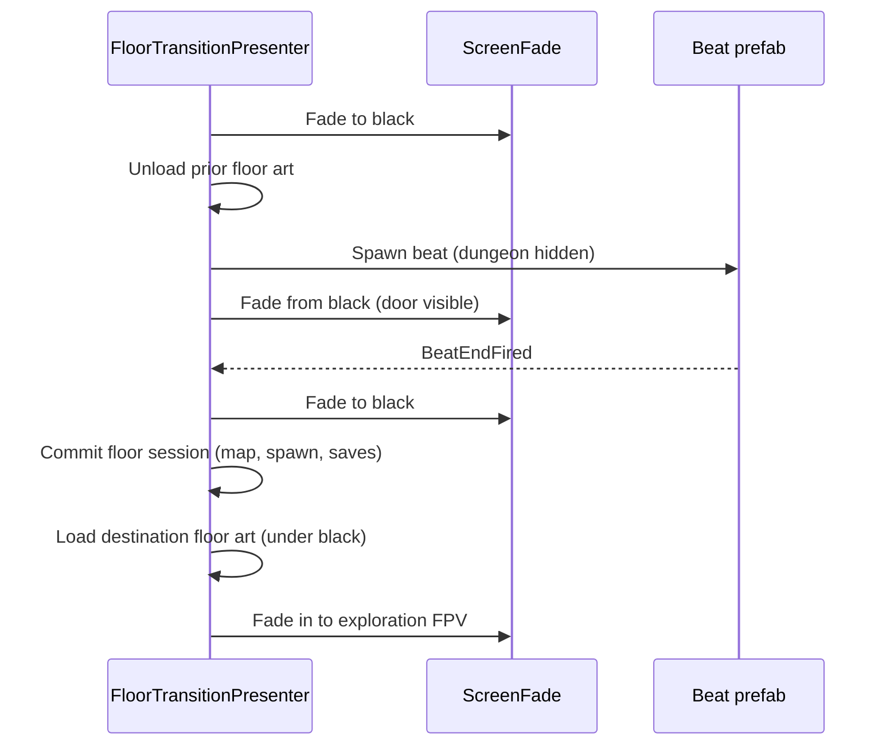

# Authoring floor transition beats (stairs vignette)

**Scope:** 3D **transition prefabs** played when the party changes exploration floor via stairs or hub stratum entry — **not** dungeon grid markers (`^` / `v` on `StratumFloor`). For layout stairs, see [floor level painter](../02-systems/floor-level-painter.md) and [dungeons & encounters](../03-content/dungeons-and-encounters.md#map-legend-ascii-blockouts).

**Runtime spec:** [floor transition](../02-systems/floor-transition.md) · [ADR 032](../../decisions/032-floor-transition-vignette-mvp1.md)  
**Game repo paths:** `Assets/Scenes/Transitions/` · [Transitions/README](https://github.com/miramocha/griddungeon-game/blob/main/Assets/Scenes/Transitions/README.md)

---

## What you are authoring

MVP1 uses one default beat, **`stairs_default`**: black void, a threshold door prop, and two **Cinemachine 3** cameras. `FloorTransitionPresenter` instantiates the prefab during floor changes; `FloorTransitionCatalog` maps **beat id** (and optional floor keys) → prefab + safety timeout.

| Beat id | Typical trigger | MVP1 prefab |
|---------|-----------------|-------------|
| `stairs_default` | B1F↔B2F↔B3F stairs (`TryChangeFloor`) | `stairs_default.prefab` |
| `hub_enter_stratum` | Hub → Enter Stratum 1 | Same prefab (catalog row) |
| `hub_return_from_exploration` | B1F gate `^` → hub | Same prefab (optional row) |

Unique beats per floor pair are **post-MVP1**; override with catalog `leaveFloorKey` / `enterFloorKey` when needed.

---

## Quick start (Unity, game repo)

1. Open **`griddungeon-game`** in Unity 6.
2. **GridDungeon → Floor Transition → Create Stairs Default Beat Prefab**  
   → `Assets/Scenes/Transitions/Prefabs/stairs_default.prefab` (+ materials under `Materials/`).
3. **GridDungeon → Floor Transition → Sync Default Beats (Catalog)**  
   → wires prefab on `Assets/Content/FloorTransition/FloorTransitionCatalog.asset`.
4. **GridDungeon → Scenes → Create Dev Bootstrap** if `FloorTransitionPresenter` or **`ScreenFade`** child refs are stale.
5. Play Mode: **F2** exploration → use stairs (**Interact** `Space` / `Z` on `^` or `v` cell).

Batch / CI (Editor closed):  
`FloorTransitionBeatPrefabCreator.CreateStairsDefaultBeatPrefabBatch` then save assets.

---

## Folder layout

```text
Assets/Scenes/Transitions/
├── README.md
├── Materials/
│   ├── TransitionVoid.mat      # black backdrop
│   └── TransitionDoor.mat        # placeholder door panel
└── Prefabs/
    └── stairs_default.prefab   # MVP1 default beat
```

**Catalog (not under Transitions/):** `Assets/Content/FloorTransition/FloorTransitionCatalog.asset`

Transition prefabs are **referenced by the catalog**; they do **not** need a row in **Build Settings** (unlike FPV floor scenes — [floor art FPV](../02-systems/floor-art-fpv.md)).

---

## Prefab contract

Root GameObject must have **`FloorTransitionBeat`** (`GridDungeon.Runtime.Exploration.FloorTransition`).

```text
stairs_default                    ← FloorTransitionBeat (root)
├── Environment/
│   ├── BlackBackdrop             ← inverted sphere, unlit black, no collider
│   └── KeyLight                  ← dim directional (optional tweak)
├── Props/
│   └── ThresholdDoor             ← frame + DoorPanel (look target for vcams)
└── Cameras/
    ├── CM_Wide                   ← CinemachineCamera
    └── CM_Threshold              ← CinemachineCamera
```

| Rule | Why |
|------|-----|
| Root at world origin when spawned | Presenter `Instantiate`s with no parent offset |
| **No colliders** on backdrop / door primitives | Beat is presentation-only |
| **Two+ `CinemachineCamera`** under root | Presenter sets priority **100+** on all child vcams |
| Look target = door / threshold | Wide + close shots share one `TrackingTarget` |
| Optional `PlayableDirector` + Timeline | Drive door motion and call signals (below) |

The menu **Create Stairs Default Beat Prefab** builds this hierarchy with placeholder cubes; swap meshes/materials on the prefab instance or variant.

---

## `FloorTransitionBeat` signals

Component on the prefab root:

| Field / API | Role |
|-------------|------|
| **`m_autoScheduleSignals`** | When enabled, `Start()` runs timed `NotifyThreshold` / `NotifyBeatEnd` |
| **`m_thresholdSeconds`** | Time before `NotifyThreshold()` (default **1.5** s) — optional mid-beat hook |
| **`m_beatEndSeconds`** | Total time before `NotifyBeatEnd()` (default **3** s) |
| **`NotifyThreshold()`** | Timeline animation event or custom mid-beat (SFX, door open) |
| **`NotifyBeatEnd()`** | **Ends the door vignette** — presenter waits for this before second fade |

**MVP1 presenter timing (locked in code):** floor **commit + map load** run **after** `BeatEndFired` (or catalog `durationMax` timeout), **not** on `OnThreshold`. Use threshold only for presentation inside the beat.

Disable **Auto Schedule Signals** when Timeline (or Animator events) call `NotifyBeatEnd()` explicitly.

**Catalog `DurationMaxSeconds`** must be ≥ real beat length (Sync menu uses **3.5** s for stairs / hub enter). If the beat never fires `BeatEndFired`, the presenter logs a warning and continues at the safety limit.

---

## Cinemachine

| Requirement | Detail |
|-------------|--------|
| Package | `com.unity.cinemachine` **3.x** (game manifest) |
| Session brain | **One** `CinemachineBrain` on main camera — **Create Dev Bootstrap** / `DevSceneComposition` |
| Beat cameras | `CinemachineCamera` children; presenter raises **Priority** to **100+** while beat lives |
| Exploration FPV | `ExplorationCameraRig` **disabled** during beat; re-enabled before final unfade to level |

Authoring tips:

- Start from generated **CM_Wide** / **CM_Threshold** positions; adjust FOV and local position on the prefab.
- For a single active shot, disable the unused vcam or blend via Timeline later.
- Do not add a second `CinemachineBrain` on the beat prefab.

---

## Catalog rows

Open **`FloorTransitionCatalog`** in the Inspector or rely on **Sync Default Beats (Catalog)**.

| Field | Meaning |
|-------|---------|
| **Beat Id** | `stairs_default`, `hub_enter_stratum`, `hub_return_from_exploration` ([`FloorTransitionBeatIds`](https://github.com/miramocha/griddungeon-game/blob/main/Assets/Scripts/Core/Exploration/FloorTransitionBeatIds.cs)) |
| **Leave Floor Key** | e.g. `s1_B1F` — empty = wildcard |
| **Enter Floor Key** | e.g. `s1_B2F` or `hub` — empty = wildcard |
| **Beat Prefab** | Root with `FloorTransitionBeat` |
| **Duration Max Seconds** | Safety timeout for `WaitForBeatEnd` |

Resolve order: most specific `(beatId, leave, enter)` wins; see `FloorTransitionCatalogResolve` tests in game repo.

**Fallback:** null prefab → fade-only transition (same commit/load sequence, no 3D beat).

---

## What the player sees (`stairs_default`)

Sequence implemented in `FloorTransitionPresenter` (vignette path):



Input and exploration HUD are suppressed for the whole transition (`ExplorationPresentationGate`).

---

## Authoring a new beat variant

1. **Duplicate** `stairs_default.prefab` → e.g. `stairs_b2_hatch.prefab`.
2. Edit props/cameras/Timeline on the duplicate; keep root **`FloorTransitionBeat`**.
3. Tune **`m_beatEndSeconds`** or Timeline so `NotifyBeatEnd()` matches the clip end.
4. Add or edit a row on **`FloorTransitionCatalog`**:
   - Set **Beat Id** (new constant in `FloorTransitionBeatIds` if code references it), or reuse `stairs_default` with specific **Leave** / **Enter** keys.
   - Assign **Beat Prefab** and **Duration Max Seconds**.
5. If a new beat id is used from C#, update `ExplorationPhaseController` / hub paths to pass that `beatId` on `FloorTransitionRequest` (today stairs use `FloorTransitionBeatIds.StairsDefault` only).
6. Manual QA (below).

Post-MVP1: per-pair rows such as `leave=s1_B1F`, `enter=s1_B2F` without code changes, as long as the request still resolves the row (may require passing `beatId` + keys from caller).

---

## Screen fade (UITK)

Floor transitions use **`ScreenFadePresenter`** on a child **`ScreenFade`** under `Game` (UI Toolkit full-screen `backgroundColor`, high sort order). Wired on `GameState` by Dev Bootstrap.

If fades do not appear, re-run **Create Dev Bootstrap** so `PanelSettings` and `ScreenFadePresenter` refs are assigned. Do not stack uGUI `Image` fades on the same HUD.

---

## Manual QA

| Step | Action | Expected |
|------|--------|----------|
| 1 | F2 B1F, walk to `v`, Interact | Fade → door vignette → fade → B2F FPV; no movement during beat |
| 2 | B2F↔B3F and reverse | Same default beat; spawn on paired stair cell |
| 3 | Hub → Enter Stratum | `hub_enter_stratum` row or same prefab |
| 4 | B1F gate `^` → hub | Transition or fade; phase → Hub |
| 5 | Spam Interact on stairs mid-beat | Second request ignored; no duplicate floor art |
| 6 | Clear **Beat Prefab** on catalog row | Fade-only still changes floor |

---

## Troubleshooting

| Symptom | Likely cause | Fix |
|---------|----------------|-----|
| Black screen, no door | Beat prefab null / missing from catalog | Create prefab + **Sync Default Beats** |
| Door flashes, level never loads | `BeatEnd` never fires and `durationMax` too low | Raise **Duration Max**; fix Timeline / auto schedule |
| Stuck on door, old floor | Commit failed; check Console | Campaign gates (B1F `v` needs Act 3); save errors |
| Fade invisible | `ScreenFade` unwired | **Create Dev Bootstrap** |
| Door visible but FPV wrong | Art load after commit | Check `FloorArtCatalog` entry for `enterFloorKey` |
| No Cinemachine motion | Brain missing on main cam | Dev Bootstrap → `EnsureCinemachineBrain` |

---

## Related

- [Floor transition (system)](../02-systems/floor-transition.md)
- [Floor art FPV — transitions](../02-systems/floor-art-fpv.md#floor-transitions--mvp1-vs-planned-transition-scene)
- [Hub and services](../02-systems/hub-and-services.md)
- Game epic [#114](https://github.com/miramocha/griddungeon-game/issues/114) · prefab [#116](https://github.com/miramocha/griddungeon-game/issues/116)
