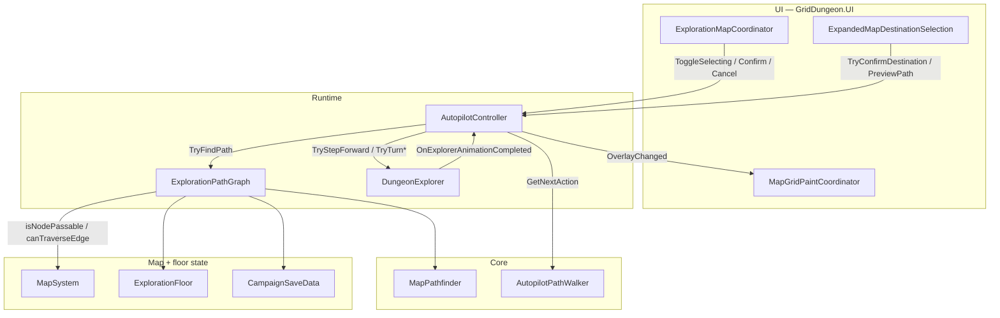

---
tags:
  - path/docs/04-dev
  - type/dev
  - scope/optional
  - status/active
  - domain/exploration
  - domain/map
---
# Autopilot pathfinding (developer)

Expanded-map autopilot: **A\*** over **revealed** exploration cells, then **turn/step** execution through `DungeonExplorer`. Player-facing rules: [02 — Autopilot](../02-systems/autopilot.md). Decision record: [ADR 021](../../decisions/021-autopilot-mvp2.md).

**Implementation repo:** [griddungeon-game](https://github.com/miramocha/griddungeon-game) — `Assets/Scripts/Core/Simulators/MapPathfinder.cs`, `Assets/Scripts/Runtime/Map/ExplorationPathGraph.cs`, `Assets/Scripts/Core/Exploration/AutopilotPathWalker.cs`, `Assets/Scripts/Runtime/Exploration/AutopilotController.cs`.

---

## Code flow



**Typical confirm → walk sequence**

1. Player opens expanded map; **`C`** enters `AutopilotState.Selecting` (`ExplorationMapCoordinator.ConfirmAutopilotDestinationFromInput`).
2. Cursor moves (arrows or pointer hover); `ExpandedMapDestinationSelection` calls `AutopilotController.TryPreviewPath` → overlay path preview.
3. **`C` Confirm** or LMB on cell → `TryConfirmDestination` → `ExplorationPathGraph.TryFindPath` → `m_pathIndex = 1` → `Walking`.
4. `ExecuteNextWalkerAction` → `AutopilotPathWalker.GetNextAction` → `DungeonExplorer` turn or step.
5. Exploration presenter calls `AutopilotController.OnExplorerAnimationCompleted` after lerp; index advances; repeat until destination or cancel.

Combat: `SuspendForCombat` → `Suspended` (destination retained); after fight `TryResumeAfterCombat` re-runs pathfind from new cell.

---

## API signatures

### `MapPathfinder` (`GridDungeon.Core.Simulators`)

```csharp
public static bool TryFindPath(
    GridPosition start,
    GridPosition goal,
    Func<GridPosition, bool> isNodePassable,
    Func<GridPosition, GridPosition, bool> canTraverseEdge,
    out IReadOnlyList<GridPosition> path
);
```

- Returns `false` and empty path when start/goal fail `isNodePassable` or no route exists.
- `start == goal` → `{ start }`, `true`.
- Path is **start-inclusive**, cardinal-only, shortest by uniform cost when heuristic is consistent.

### `ExplorationPathGraph` (`GridDungeon.Runtime.Map`)

```csharp
public static bool TryFindPath(
    MapSystem map,
    ExplorationFloor floor,
    CampaignSaveData campaign,
    string floorKey,
    GridPosition start,
    GridPosition goal,
    out IReadOnlyList<GridPosition> path
);
```

Wires predicates:

| Predicate | Implementation |
|-----------|----------------|
| Node | `map.IsVisited(cell)` && `S1ExplorationWalkability.IsWalkable(...)` |
| Edge | No solid layout edge; no revealed wall on step side; no closed door on `from` or `to` |

### `AutopilotPathWalker` (`GridDungeon.Core.Exploration`)

```csharp
public static AutopilotWalkerAction GetNextAction(
    IReadOnlyList<GridPosition> path,
    int pathIndex,
    GridPosition currentCell,
    FacingDirection facing
);
```

`AutopilotWalkerAction`: `TurnLeft`, `TurnRight`, `StepForward`, `Done`.

### `AutopilotController` (`GridDungeon.Runtime.Exploration`)

| Member | Role |
|--------|------|
| `ToggleSelecting()` / `EnterSelecting()` / `ExitSelecting()` | Expanded-map arm/disarm (blocked while `Walking` / `Suspended`) |
| `TryConfirmDestination(goal, out previewPath)` | Validate, pathfind, start walk |
| `TryPreviewPath(goal, out path)` | Hover preview while selecting |
| `PreviewPathOverlay(cursor, destination, path)` | Push overlay state to UI |
| `Cancel()` | Clear path and return `Idle` |
| `SuspendForCombat()` / `TryResumeAfterCombat()` | Combat pause + optional resume |
| `OnManualPlayerInput()` | Any manual move/turn/interact → `Cancel` |
| `OnExplorerAnimationCompleted()` | Advance `pathIndex`, queue next walker action |
| `IsValidDestination(cell)` | Visited + walkable tile; not party cell |
| `OverlayChanged` | `AutopilotOverlayState(cursor, destination, path)` |
| `WalkStarted` | Fired when entering `Walking` (UI may close expanded map) |

`#if UNITY_EDITOR` test seams: `SetPathfinderForTests`, `SetIsValidDestinationForTests`, `StateForTests`, `SavedDestinationForTests`.

---

## Path index contract

```text
path[0]     = party cell at route commit (start)
path[^1]     = destination (goal)
pathIndex   = index of next waypoint to enter (usually 1 at walk start)

OnExplorerAnimationCompleted:
  if cell == path[pathIndex] → pathIndex++
  if pathIndex >= Count OR cell == savedDestination → complete
  else → ExecuteNextWalkerAction()
```

`GetNextAction` always targets `path[pathIndex]`; it does not scan ahead. Non-cardinal gap between `currentCell` and `path[pathIndex]` yields `Done` (controller treats as complete).

---

## How to extend

### New edge rule (e.g. one-way tile, hazard avoidance)

1. Add logic to `ExplorationPathGraph.CanTraverseEdge` (or a dedicated helper it calls).
2. Add an `ExplorationPathGraphTests` case with a small `ExplorationFloor` + `MapSystem` fixture.
3. If the rule is **floor-authoring only** (no save/reveal), consider whether `FloorLayoutConnectivity` should mirror it for painter validation — autopilot still uses `ExplorationPathGraph` at runtime.

Do **not** embed `MapSystem` checks inside `MapPathfinder`; keep Core generic.

### Different heuristic or cost

Change `MapPathfinder` only:

| Change | Touch points |
|--------|----------------|
| Weighted tiles | Replace `tentativeG = currentG + 1` with a cost callback |
| Diagonal steps | Extend `s_CardinalOffsets` and edge predicate; switch heuristic (e.g. octile) |
| Tie-break policy | `BinaryMinHeap.Compare` |

Re-run `MapPathfinderTests` plus graph integration tests.

### Avoid-FOE routing (spec backlog)

Inject FOE occupancy into `isNodePassable` or `canTraverseEdge` inside `ExplorationPathGraph` (read `MapSystem` FOE icon cells). Fail `TryConfirmDestination` when no path exists rather than silent teleport.

### Interactable stop-before-enter

Hook in `AutopilotController.ExecuteNextWalkerAction` or before `TryStepForward`: if `path[pathIndex]` has a blocking feature and is not `m_savedDestination`, `Cancel` (or pause) and surface toast — not implemented yet.

---

## Edit Mode test paths

Unity **Test Runner → Edit Mode** ([`Assets/Tests/README.md`](https://github.com/miramocha/griddungeon-game/blob/main/Assets/Tests/README.md)):

| Path | Fixture | What it proves |
|------|---------|----------------|
| `Tests → Map → MapPathfinderTests` | Core A* | Shortest cardinal route, detour, no path |
| `Tests → Map → ExplorationPathGraphTests` | Reveal + doors + campaign | Graph predicates match exploration rules |
| `Tests → Exploration → AutopilotPathWalkerTests` | Turn vs step | Walker planner |
| `Tests → Exploration → AutopilotControllerTests` | State machine | Select, walk, suspend/resume, manual cancel |
| `Tests → UI → ExpandedMapDestinationSelectionTests` | Pointer/cursor | Expanded-map selection wiring |

Category filter: `Map` or `Exploration` per `TestCategories.cs`.

---

## vs `FloorLayoutConnectivity` (layout connectivity)

| | **`MapPathfinder` + `ExplorationPathGraph`** | **`FloorLayoutConnectivity`** |
|---|---------------------------------------------|------------------------------|
| **Purpose** | Player autopilot on **saved exploration** state | **Authoring validation** — “can the player reach stairs?” on raw `ExplorationFloor` |
| **Assembly** | Core + Runtime | Runtime (`Assets/Scripts/Runtime/Map/FloorLayoutConnectivity.cs`) |
| **Algorithm** | A* (Manhattan, heap) | Delegates to **`MapPathfinder`** (same A* on unit-cost layout tiles) |
| **Walkability** | Visited + `S1ExplorationWalkability` + reveal walls/doors | `ExplorationFloorLayout.IsWalkable` (+ optional `extraWalkable` cells) |
| **Walls / doors** | Revealed `WallMask`, closed doors in save | Layout tiles only (no fog) |
| **Tests** | `MapPathfinderTests`, `ExplorationPathGraphTests` | `S1B1FLayoutTests`, `S1B2FLayoutTests`, `S1B3FLayoutTests`; `tools/layout_grid_check.py` (Python BFS for script-only parity) |

Use **FloorLayoutConnectivity** when validating floor painter output; use **ExplorationPathGraph** for anything that depends on what the party has already mapped.

---

## Related docs
- [02 — Autopilot](../02-systems/autopilot.md) — player-facing rules and shipped vs spec table
- [04 — Tech notes § Autopilot](../04-tech-notes.md#autopilot-mvp2)
- [Mapping](../02-systems/mapping.md) — reveal model (ADR 002)
- [ADR 001 — Grid movement](../../decisions/001-grid-movement.md) — step/turn lerp
- [ADR 021 — Autopilot MVP2](../../decisions/021-autopilot-mvp2.md)
