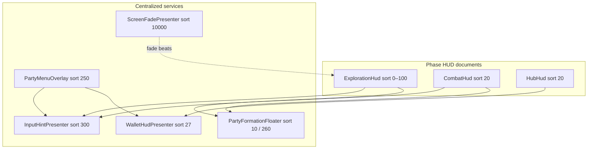
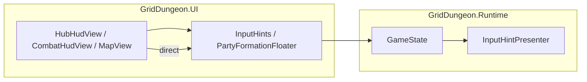

# Centralized UI services (UITK)

How Grid Dungeon hosts **screen-wide overlays** that outlive a single phase HUD — global input hints, the shared party formation floater, screen fade, and similar `UIDocument` roots. Use this when adding a new cross-phase panel or when deciding whether chrome belongs in `ExplorationHud.uxml` vs its own scene object.

**Implementation repo:** [griddungeon-game](https://github.com/miramocha/griddungeon-game) — `Assets/Scripts/Runtime/UI/`, `Assets/Scripts/UI/Views/`, `Assets/UI/Screens/Shared/`.

**Related:** [UI event contract](ui-event-contract.md) (events/commands, not layout), [shared menu & picker UI § Global input hints](shared-menu-picker-ui.md#global-input-hints), [custom party UI](custom-party-ui.md) (formation grid API), [layered UITK panels](layered-uitk-panels.md) (future HUD splits), [04 — Tech notes § UI reactivity](../04-tech-notes.md#ui-reactivity).

---

## Problem

Phase HUDs (`ExplorationHud`, `CombatHud`, `HubHud`) own most screen chrome. Some UI must:

- Appear in **more than one phase** (party strip in exploration and combat).
- Sit **above** phase HUD without being torn down on phase exit.
- Publish **one authoritative copy** (input binds) instead of duplicating footers on every modal.

**Centralized UI services** solve this with **one scene `GameObject` per concern**, its own `UIDocument`, and a fixed place in the `sortingOrder` stack.



Phase views **orchestrate** (show/hide, publish hint copy, bind data). They do **not** embed these trees in their UXML.

### Standalone document — no cross-`UIDocument` dock

A centralized service **owns one scene `GameObject` + `UIDocument` + root UXML**. Phase HUDs and overlays call the **facade** (`OpenBag`, `SetHubShopMode`, `CombatItemInput`, …). They do **not**:

- `CloneTree` the service UXML into hub / combat / party phase trees as the **shipped** integration
- Reparent service `VisualElement` nodes into another document’s host (`InventoryPaneHost`, `party-menu-pane-inventory`, …)
- Sync layout with **`worldBound` / `GeometryChangedEvent`** to fake embedding across `UIDocument` roots

**When migrating** a panel that today lives inside a phase HUD (embedded clone or “docked” pane), the **final** implementation must move the tree to a centralized presenter and show it as a **full-screen transparent modal** (or other self-contained overlay chrome) at the service’s `sortingOrder`. Align beside fixed rails with **USS modifiers** (e.g. `tabbed-picker--rail-offset`, `left: 240px`) — not by parenting into the phase shell.

| OK | Not OK (reject in review / migration complete) |
|----|------------------------------------------------|
| `ItemListInventory.OpenBag` while party menu section = Inventory | `PartyInventory.uxml` cloned into `party-menu-pane-inventory` |
| Hub shop modal at sort **200** via `ItemListInventory.SetHubShopMode` | `ItemListPicker.uxml` cloned on `HubHud` root |
| Combat item via `ItemListInventory.CombatItemInput` | Local `CombatItemPickerHost` + picker clone on `CombatHud` |
| `PartyFormationFloater.ApplyFormationDockState` / `ApplyPartyMenuFloaterDock` — **context** + sort on the **same** floater document | Reparenting floater grid nodes into `PartyMenu.uxml` |

Agent rule: [`centralized-ui-services.mdc`](../../.cursor/rules/centralized-ui-services.mdc).

---

## Pattern — Presenter + facade (+ `GameState` ref)

| Piece | Responsibility |
|-------|----------------|
| **`*Presenter`** (`MonoBehaviour`, `[RequireComponent(typeof(UIDocument))]`) | Owns `UIDocument`, clones UXML/USS, `sortingOrder`, slide/fade animation, context switching |
| **Static facade** (optional, `GridDungeon.UI`) | `InputHints`, `PartyFormationFloater` — thin `Publish` / `SetRevealed` API so phase views avoid hunting components |
| **`GameState` serialized ref** (optional, `GridDungeon.Runtime`) | `GameState.InputHint`, `GameState.ScreenFade` — composition root exposes long-lived presenters to Runtime and UI |
| **Phase `*View`** | Subscribes to events; calls facade or presenter; **clears** or **restores** on overlay close / phase exit |



**Rules**

1. **Runtime does not reference UITK views** — presenters live in Runtime (`InputHintPresenter`, `ScreenFadePresenter`) or UI (`PartyFormationFloaterPresenter`); phase logic stays in controllers.
2. **One publisher per strip** — e.g. only `CombatHudView.RefreshInputHint` owns combat bind copy while combat is idle; overlays call `InputHints.Publish` while open, then `Clear` or restore underlying hint on dismiss.
3. **USS owns pixels; C# toggles classes** — slide-in/out uses BEM modifiers (`input-hint__text--retracted`, `party-formation-floater--collapsed`), not per-frame `style` writes except layout-derived coordinates.
4. **Shared `PanelSettings`** — `Assets/UI/Settings/GamePanelSettings.asset` on every `UIDocument` unless a panel needs a deliberate scale override ([04 — Tech notes](../04-tech-notes.md#combat-hud-ui-toolkit)).
5. **Standalone service document** — one `UIDocument` per concern; phase views orchestrate via facade only. **No** embedding clones in phase UXML and **no** cross-document dock / geometry sync as the shipped integration (see [Standalone document — no cross-`UIDocument` dock](#standalone-document--no-cross-uidocument-dock)).

---

## `sortingOrder` stack (MVP1)

Lower draws first. Values are **convention** — keep new panels in the gaps or extend upward.

| `sortingOrder` | Document | Owner |
|----------------|----------|--------|
| **0** | `ExplorationHud` (side map) | `ExplorationHudView` |
| **10** | Party formation floater (exploration / combat) | `PartyFormationFloaterPresenter` |
| **20** | `CombatHud`, `HubHud` | `CombatHudView`, `HubHudView` |
| **25** | Global command rail (bookmark buttons) | `CommandRailPresenter` |
| **255** | Party menu section rail (same `CommandRail` document; raised while overlay open) | `CommandRailPresenter` via `SetPartyMenuRailVisible` |
| **26** | Global command-rail copy (header title, service blurbs, combat prompt) | `CommandRailInfoPresenter` |
| **27** | Global wallet strip (Credits balance) | `WalletHudPresenter` |
| **200** | Skill use picker (combat) + item-list modals (hub shop, combat item) | `SkillUsePickerPresenter`, `ItemListInventoryPresenter` (`HubShop`, `CombatItem`) |
| **100** | Map fullscreen (reuses exploration doc) | `MapView` via `BindToHud` |
| **150** | Story modal | `StoryEventView` on `StoryHud` |
| **250** | Party menu overlay (hub + exploration pause) | `PartyMenuOverlayView` |
| **251** | Party bag modal + character detail (Formation / Equipment; rail offset) | `ItemListInventoryPresenter` (`PartyBag`), `CharacterDetailPresenter` |
| **260** | Party floater while formation edit docked | `PartyFormationFloaterPresenter` |
| **300** | Global input hint strip | `InputHintPresenter` |
| **10000** | Full-screen fade | `ScreenFadePresenter` |

**Layered HUD refactor (draft):** [ADR 037](../../decisions/037-layered-uitk-panels.md) splits monolith HUDs into more rows in this table; **global** `InputHintPresenter` stays unchanged.

---

## Shipped services

### Command-rail info — `CommandRailInfoPresenter` + `CommandRailInfo`

**Job:** Top-left **non-button copy** for the shared command rail — phase **header title** (`rail-info-header`), service headings/lines, combat targeting/planning prompts. Bookmark buttons stay on `CommandRailPresenter` (`sortingOrder` 25). **Credits** live on `WalletHudPresenter` (top-right).

| Type | Path | Notes |
|------|------|-------|
| Presenter | `Assets/Scripts/Runtime/UI/CommandRailInfoPresenter.cs` | `sortingOrder` **26**; `pickingMode = Ignore`; flush top-left (no outer margin) |
| Facade | `Assets/Scripts/UI/Views/CommandRailInfo.cs` | `SetHeaderTitle`, `SetServiceCopy`, `SetCombatPrompt`, `SyncVisibility`, `Clear` |
| UXML / USS | `Assets/UI/Screens/Shared/CommandRailInfo.uxml`, `CommandRailInfo.uss` | `name="rail-info"`; header block `rail-info-header` (phase-agnostic) |
| Bootstrap | `DevSceneComposition.WireCommandRailInfo` | Child of `GameState`; ref on `m_commandRailInfo` |

**Publishers:** `HubHudView.RefreshCredits` (header title only), `HubHudServicePanelView.Populate`, `CommandPanelView.ShowForCombatant`; visibility synced from `CommandRailPresenter.ApplyVisualContext` (hidden during exploration, party-menu rail, hub-leave transition).

---

### Global command rail — `CommandRailPresenter` + `CommandPanelModalSupport`

**Job:** One **vertical bookmark rail** (`CommandRail.uxml` → `command-rail-panel` / `CommandRail.PanelHost`) shared by hub root menu, hub service actions, combat command bar, and party menu section rail. Phase owners **populate** the panel in code (`CommandRailPanelBuilder` + `RailMenuPresenter`); they do not each own a duplicate rail document.

| Type | Path | Notes |
|------|------|-------|
| Presenter | `Assets/Scripts/UI/Views/CommandRailPresenter.cs` | `sortingOrder` **25** (phase) / **255** (party menu); context: `Hub` / `Combat` / `PartyMenu` / `Hidden` |
| Facade | `Assets/Scripts/UI/Views/CommandRail.cs` | `PanelHost`, `Body`, `SetPartyMenuRailVisible`, `SyncPhaseOwnership` |
| Modal chrome helper | `Assets/Scripts/UI/Views/CommandPanelModalSupport.cs` | Shared **sibling-chip disable** + panel BEM cleanup on the **same** `PanelHost` |
| UXML / USS | `Assets/UI/Screens/Shared/CommandRail.uxml`, `CommandPanel.uss`, `RailMenu.uss` | `command-panel--disabled`, `command-panel--modal-open`, `command-panel--protocol-only` |

**Who populates `PanelHost`**

| Phase / overlay | Owner | When |
|-----------------|-------|------|
| Hub root | `HubRootMenuPanel.Populate` | Hub bind + `RestoreCommandRailPanel` after party menu |
| Hub service (Buy/Sell/Back) | `HubHudServicePanelView` | Shop / guild / inn panels |
| Combat commands | `CommandPanelView.EnsureBuilt` | Combat phase |
| Party menu sections | `PartyMenuOverlayView.PopulateSectionRail` | Tab / Esc overlay open |

**Modal rail sibling disable**

While a **modal child** owns input (picker open, target select, combat log, party pane engaged), non-owner rail chips are `SetEnabled(false)` so W/S does not move focus on siblings. The **active owner** chip keeps `rail-menu__item--selected` and full opacity (`CommandPanel.uss` + `RailMenu.uss` `:disabled` hover suppression).

| Consumer | Modal-open signal | Active owner |
|----------|-------------------|--------------|
| `CommandPanelView` | Skill/item picker, target select, log modal | Command slot that opened the modal (`PendingTargetCommand` for targeting) |
| `HubHudView` | Hub shop buy/sell picker open | Buy or Sell service button (`ItemListInventory.HubMode`) |
| `PartyMenuOverlayView` | Section pane **engaged** (not merely revealed) | Active section chip (`PartyMenuSectionRailFocusRules`) |

Helpers: `CommandPanelModalSupport.SetModalOpen`, `SetEnabledForModal` / `ResolveEnabled`.

**Panel chrome reset (shared host)**

Combat teardown must not leave `command-panel--disabled` on the shared host — hub/party buttons inherit the modifier and look dim. **`CommandPanelModalSupport.ResetPanelChrome`** clears `command-panel--modal-open`, `command-panel--disabled`, and `command-panel--protocol-only`.

| When | Who calls `ResetPanelChrome` |
|------|------------------------------|
| Battle end / null combat actor | `CommandPanelView.ShowForCombatant(null, …)` early return |
| Leave combat context | `CommandRailPresenter.ResolveAndApplyContext` |
| Hub root repopulate | `HubRootMenuPanel.Populate` |
| Party section rail build | `PartyMenuOverlayView.PopulateSectionRail` |

Picker / modal integration detail: [shared menu & picker UI § Modal rail sibling disable](shared-menu-picker-ui.md#modal-rail-sibling-disable-commandpanelmodalsupport).

---

### Wallet HUD — `WalletHudPresenter` + `WalletHud`

**Job:** Top-right **Credits balance** — visible during hub Shop, party inventory pane, and brief transient pulses when balance changes elsewhere (hospital spend, dev grant, future battle loot).

| Type | Path | Notes |
|------|------|-------|
| Presenter | `Assets/Scripts/Runtime/UI/WalletHudPresenter.cs` | `sortingOrder` **27**; `pickingMode = Ignore`; balance lerp + slide in/out |
| Facade | `Assets/Scripts/UI/Views/WalletHud.cs` | `SetReason`, `SyncFromSave`, `NotifyBalanceChanged` |
| UXML / USS | `Assets/UI/Screens/Shared/WalletHud.uxml`, `WalletHud.uss` | `name="wallet-hud"`, `name="wallet-hud-amount"` |
| Bootstrap | `DevSceneComposition.WireWalletHud` | Child of `GameState`; ref on `m_walletHud` |

**Publishers:**

| Context | Owner |
|---------|--------|
| Hub Shop open/close | `HubHudView.OpenServicePanel` / `CloseServicePanel*` |
| Party inventory pane | `PartyMenuOverlayView.SyncWalletHudInventoryReason` |
| Balance delta (transient if hidden) | `HubHudView.RunServiceAction`, `DevPlayModeActions.DevGrantCredits` |

```csharp
WalletHud.SetReason(m_gameState, WalletHudReason.Shop, active: true);
WalletHud.SyncFromSave(m_gameState, animate: false);
WalletHud.NotifyBalanceChanged(m_gameState); // lerp; transient pulse when no Shop/Inventory reason
```

---

### Global input hints — `InputHintPresenter` + `InputHints`

**Job:** Bottom-right **input bind copy only** (`Z Confirm · X Cancel · W/S Command`). Not map legend, HP, quest text, or tutorial body copy.

| Type | Path | Notes |
|------|------|-------|
| Presenter | `Assets/Scripts/Runtime/UI/InputHintPresenter.cs` | `sortingOrder` **300**; `pickingMode = Ignore` |
| Facade | `Assets/Scripts/UI/Views/InputHints.cs` | `Publish(gameState, text)` / `Clear(gameState)` |
| Copy constants | `Assets/Scripts/UI/Views/TabbedPickerRailHints.cs` | Segment order: Z/X → W/S & Q/E → other keys |
| UXML / USS | `Assets/UI/Screens/Shared/InputHint.uxml`, `InputHint.uss` | `name="input-hint"`, `name="input-hint-text"` |
| Bootstrap | `DevSceneComposition.WireInputHint` | Child of `GameState`; ref on `m_inputHint` |

**Publishers (extend this list — do not add a second strip):**

| Phase / overlay | Owner method |
|-----------------|--------------|
| Hub | `HubHudView.RefreshInputHint` / `RestoreInputHint` |
| Combat | `CombatHudView.RefreshInputHint` / `RestoreInputHint` |
| Exploration map | `MapView.RefreshGlobalInputHint` |
| Party menu / pause | `PartyMenuOverlayView.RefreshMenuHint` |
| Story modal | `StoryEventView` → `TabbedPickerRailHints.ModalDismiss` |
| Victory rewards | `BattleRewardScreenView` on show; clear on dismiss |
| Floor transition | `FloorTransitionPresenter` clears on start; map/hub republish on `PresentationReleased` |
| Story end / pause close | `InputRouter.RestoreGlobalInputHintForPhase` |

Full bind table: [shared menu & picker UI § Global input hints](shared-menu-picker-ui.md#global-input-hints). Agent rule: `unity-global-input-hints.mdc`.

```csharp
// Typical publish while a modal owns binds
InputHints.Publish(m_gameState, TabbedPickerRailHints.CombatCommand);

// On dismiss — restore phase hint or clear
InputHints.Clear(m_gameState);
m_combatHud.RestoreInputHint();
```

---

### Party formation floater — `PartyFormationFloaterPresenter` + `PartyFormationFloater`

**Job:** One **party formation grid** shared by exploration strip, combat roster (center column), and formation-edit dock in party menu. Enemy roster stays on `CombatRosterView` inside `CombatHud` ([custom party UI](custom-party-ui.md)).

| Type | Path | Notes |
|------|------|-------|
| Presenter | `Assets/Scripts/UI/Views/PartyFormationFloaterPresenter.cs` | Context machine: `Exploration` / `Combat` / `FormationEdit` / `Hidden` |
| View helper | `Assets/Scripts/UI/Views/PartyFormationFloaterView.cs` | Collapse / `RevealWithDip` animation |
| Facade | `Assets/Scripts/UI/Views/PartyFormationFloater.cs` | `Grid`, `ExplorationSync`, `ApplyFormationDockState`, `ApplyPartyMenuFloaterDock`, `SetCombatSlotClickHandler` |
| Grid | `PartyFormationGridView` + `PartyFormationGrid.uxml` | 8 fixed slots; BEM `party-formation-slot` |
| UXML / USS | `PartyFormationFloater.uxml`, `PartyFormationFloater.uss` | Mount: `party-formation-mount` |
| Bootstrap | `DevSceneComposition.WirePartyFormationFloater` | Sibling `PartyFormationFloater` GO, not under `ExplorationHud` |

**Context ownership**

| Context | `sortingOrder` | Who drives visibility |
|---------|----------------|------------------------|
| Exploration strip | 10 | `ExplorationHudView` → `PartyFormationFloater.SetRevealed`; map fullscreen collapses strip |
| Combat roster | 10 | `CombatHudView` binds highlights / slot clicks via `PartyFormationFloater.Grid` |
| Formation edit | 260 | `PartyMenuOverlayView` → `ApplyPartyMenuFloaterDock(docked: true, formationEdit: true)` |
| Party menu equipment | 260 | `PartyMenuOverlayView` → `ApplyPartyMenuFloaterDock(docked: true, formationEdit: false)` — member focus on floater; clear on section exit (`PartyEquipmentFloaterToolkitView.ClearMemberFocus`) |
| Hidden | — | Phase not exploration/combat and no party-menu dock |

Phase changes flow through `PartyFormationFloater.SyncPhaseOwnership(GamePhase)` (subscribed inside presenter). **Formation bind copy** uses global `InputHints`, not labels on the floater.

```csharp
// Exploration: show strip after phase enter
PartyFormationFloater.SetRevealed(true);

// Combat: wire slot clicks for targeting
PartyFormationFloater.SetCombatSlotClickHandler(OnRosterSlotClicked);
var grid = PartyFormationFloater.Grid;
grid?.SetActingHighlight(actor);

// Party menu formation pane
PartyFormationFloater.ApplyPartyMenuFloaterDock(docked: true, formationEdit: true);

// Party menu equipment pane (floater only — no formation swap chrome)
PartyFormationFloater.ApplyPartyMenuFloaterDock(docked: true, formationEdit: false);
```

Integrator detail (replace grid, events, combat chrome): [custom party UI](custom-party-ui.md).

---

### Skill use picker — `SkillUsePickerPresenter` + `SkillUsePickerOverlay`

**Job:** Combat **Skill** command tabbed overlay — one scene-wide document instead of `CloneTree` on `CombatHud`.

| Type | Path | Notes |
|------|------|-------|
| Presenter | `Assets/Scripts/UI/Views/SkillUsePickerPresenter.cs` | `sortingOrder` **200**; combat phase only |
| Facade | `Assets/Scripts/UI/Views/SkillUsePickerOverlay.cs` | `Input` (`ICombatSkillPickerInput?`), `TabCount`, `OpenStateChanged` |
| UXML / USS | `Assets/UI/Screens/Combat/SkillUsePicker.uxml`, `SkillUsePicker.uss` | `ui:Instance` → `ItemListPickerShell` |
| Host | `CombatSkillPickerHost` + `CombatSkillListPickerAdapter` | Wired inside presenter |
| Bootstrap | `DevSceneComposition.WireSkillUsePicker` | Child of `GameState` |

**Publishers:** `CombatHudView` reads `SkillUsePickerOverlay.Input` for `CommandPanelView`; `InputRouter` routes combat skill binds through the facade. Hide + ignore input when phase ≠ Combat.

---

### Item list inventory — `ItemListInventoryPresenter` + `ItemListInventory`

**Job:** One presenter, **three mutually exclusive contexts** — hub shop, combat item, and party bag — each a **full-screen transparent modal** on this service’s `UIDocument` (never embedded in hub / combat / party menu UXML).

| Type | Path | Notes |
|------|------|-------|
| Presenter | `Assets/Scripts/UI/Views/ItemListInventoryPresenter.cs` | Context machine: `HubShop` / `CombatItem` / `PartyBag` / `Hidden` |
| Facade | `Assets/Scripts/UI/Views/ItemListInventory.cs` | Hub shop, combat item input, bag open/close |
| UXML / USS | `Assets/UI/Screens/Shared/ItemListInventoryOverlay.uxml`, `ItemListInventoryOverlay.uss` | `item-list-inventory-overlay` + `tabbed-picker--modal-centered` + `tabbed-picker--rail-offset` (`left: 240px`); single `ItemListPickerShell` host |
| Bootstrap | `DevSceneComposition.WireItemListInventory` | Child of `GameState` |

**Modal chrome (all contexts)**

| Piece | USS / behavior |
|-------|----------------|
| Overlay root | Full-screen bleed (`left/right/top/bottom: 0`) on service document |
| Panel | Centered `tabbed-picker__panel`; transparent host (no dim) |
| Rail inset | `tabbed-picker--rail-offset` — **240px** left (command / section rail bookmark stays visible) |
| Party menu shell | `party-menu-pane-inventory` stays **empty chrome** — bag UI is **not** cloned into the dialog |

**Context ownership**

| Context | `sortingOrder` | Who drives visibility |
|---------|----------------|------------------------|
| Hub shop buy/sell | 200 | `HubHudView` → `ItemListInventory.SetHubShopMode` / `HideHubShop` |
| Combat item pick | 200 | `CombatItemPickerHost` inside presenter; `CombatHudView` uses `ItemListInventory.CombatItemInput` |
| Party bag | 251 | `PartyMenuOverlayView` → `OpenBag` / `CloseBag` / `RefreshBag` when Inventory section active (above party menu at 250) |
| Hidden | — | Phase exit, overlay close, or context switch |

```csharp
// Hub shop
ItemListInventory.SetHubShopMode(HubShopMode.Buy, content, bag);

// Combat item — CommandPanelView uses facade input
var itemPicker = ItemListInventory.CombatItemInput;

// Party menu inventory section — modal on service document, not embedded pane
ItemListInventory.OpenBag(party.Inventory);
ItemListInventory.CloseBag();
```

Picker integration detail: [shared menu & picker UI § Item list inventory service](shared-menu-picker-ui.md#item-list-inventory-service).

---

### Character detail — `CharacterDetailPresenter` + `CharacterDetail`

**Job:** One **single-combatant inspect panel** (stats + optional worn equipment rows) for party menu **Formation** and **Equipment** sections. Separate `UIDocument` at sort **251** — same full-bleed + `tabbed-picker--rail-offset` modal chrome as party bag ([`ItemListInventoryOverlay.uxml`](https://github.com/miramocha/griddungeon-game/blob/main/Assets/UI/Screens/Shared/ItemListInventoryOverlay.uxml)). Not embedded in `PartyMenu.uxml`.

| Type | Path | Notes |
|------|------|-------|
| Presenter | `Assets/Scripts/UI/Views/CharacterDetailPresenter.cs` | Context: `Hidden` / `PartyMenuFormation` / `PartyMenuEquipment`; `sortingOrder` **251** when visible |
| View | `Assets/Scripts/UI/Views/CharacterDetailView.cs` | Toolkit bind API; slot engage via `MenuFocusNavigator` |
| Facade | `Assets/Scripts/UI/Views/CharacterDetail.cs` | `SetPartyMenuContext`, `Bind`, `Refresh`, `View`, `Hide` |
| UXML / USS | `CharacterDetailOverlay.uxml` (hosts `CharacterDetail.uxml` instance), `CharacterDetail.uss` | Two-layer overlay: outer full bleed + inner rail-offset centered panel |
| Bootstrap | `DevSceneComposition.WireCharacterDetail` | Child `CharacterDetail` GO under `GameState` |

**Publishers:** `PartyMenuOverlayView.ShowActivePaneContent` — Formation → `PartyFormationInspect`; Equipment → `PartyEquipDisplay`; Inventory / Quit / close → `Hide`. Member bind from `PartyFormationToolkitView` / `PartyEquipmentFloaterToolkitView`.

```csharp
CharacterDetail.SetPartyMenuContext(
    CharacterDetailContext.PartyMenuEquipment,
    CharacterDetailLayout.PartyEquipDisplay
);
CharacterDetail.Bind(subject);
CharacterDetail.Hide();
```

**Deferred:** equipment bag picker window on slot confirm; combat analyze host (third caller → optional `GameState` ref).

---

### Screen fade — `ScreenFadePresenter` (no static facade)

**Job:** Full-screen opaque/translucent overlay for floor transitions and other beats.

| Type | Path | Notes |
|------|------|-------|
| Presenter | `Assets/Scripts/Runtime/UI/ScreenFadePresenter.cs` | `sortingOrder` **10000** |
| Access | `GameState.ScreenFade` | `FadeOut` / `FadeIn` / `SetOpaque` / `SetTransparent` |
| Bootstrap | Wired on `GameState` with `FloorTransitionPresenter` | See `DevSceneComposition.WireFloorTransition` |

Callers hold a `GameState` reference; there is no `ScreenFades.Publish` facade — fade is **imperative** and short-lived.

---

### Other scene-wide documents (same family, different API)

These use the **multi-`UIDocument` bootstrap** pattern but are **phase/modal-specific** rather than a static facade:

| Document | Sort | Role |
|----------|------|------|
| `PartyMenuOverlay` | 250 | Hub party menu + exploration pause shell |
| `StoryHud` | 150 | Story event modal |
| `FloorTransitionPresenter` | (uses fade + vignette) | Stairs transition; clears global hints on start |

Treat them as **overlays** with their own `*View` lifecycle, not as generic “services.” Only add a `PartyFormationFloater`-style facade when **three or more** unrelated callers need the same panel.

---

## Scene graph (Dev Bootstrap)

`GridDungeon → Scenes → Create Dev Bootstrap` creates siblings under `GameState`:

```
GameState
├── InputHint          (InputHintPresenter)
├── CommandRailInfo    (CommandRailInfoPresenter)
├── WalletHud          (WalletHudPresenter)
├── ScreenFade         (ScreenFadePresenter)
├── PartyFormationFloater (PartyFormationFloaterPresenter)
├── SkillUsePicker (SkillUsePickerPresenter)
├── ItemListInventory (ItemListInventoryPresenter)
├── CharacterDetail (CharacterDetailPresenter)
├── ExplorationHud
├── CombatHud
├── HubHud
├── PartyMenuOverlay
└── StoryHud
```

Wiring: `Assets/Scripts/Editor/DevBootstrapSceneCreator.cs`, `DevSceneComposition.cs`. After clone, run **Create Dev Bootstrap** if console reports missing floater or hint refs.

---

## Adding a new centralized service

Use this checklist when a panel must survive phase changes or serve multiple HUDs:

1. **Name the concern** — one reason to change (hints, party strip, fade). Do not merge unrelated chrome.
2. **New `GameObject` + `UIDocument`** under `GameState` (or documented sibling), UXML in `Assets/UI/Screens/Shared/` if cross-phase.
3. **Pick `sortingOrder`** from the table above; document the value in the presenter constant.
4. **Presenter** builds tree in `EnsureOverlay`, caches `Q()` results, ignores hits if non-interactive (`pickingMode = Ignore` for hint strip).
5. **Facade (optional)** — static `Register`/`Unregister` in `OnEnable`/`OnDisable` if UI views need access without serialized refs.
6. **`GameState` field (optional)** — when Runtime systems must drive the panel (`ScreenFade`, `InputHint`).
7. **Wire bootstrap** — `DevSceneComposition.Wire…` + menu item so clones stay consistent.
8. **Ownership doc** — list which views publish/clear; add row to [Global input hints](shared-menu-picker-ui.md#global-input-hints) publishers table if it touches bind copy.
9. **Tests** — Edit Mode under `Assets/Tests/UI/` for sort order, visibility, hint publish/clear (see existing `InputHint` / floater fixtures).

**Do not**

- Embed a second copy of the panel inside phase UXML “for convenience.”
- **Dock** or reparent the service tree into another `UIDocument` host, or ship `worldBound` geometry sync as the integration — use modal + `sortingOrder` + rail-offset USS instead.
- Duplicate bind footers on modals when `InputHints` already covers the context.
- Put gameplay rules or `CombatController` logic inside presenters.

**Migrating an embedded picker into this pattern**

1. Add or extend a centralized presenter + facade under `GameState` bootstrap.
2. Move picker UXML to the service overlay (`Assets/UI/Screens/Shared/`).
3. Replace phase `CloneTree` / local presenter with facade calls only.
4. Leave phase hosts empty if the shell still needs a section hook (e.g. party inventory pane).
5. Verify grep: no `CloneTree(ItemListPicker` / `PartyInventory` on phase HUDs; no `Dock*` APIs on the facade.

---

## Documentation map

| Topic | Authoritative doc |
|-------|-------------------|
| **This pattern** (presenter, sort stack, bootstrap) | **Here** |
| Command rail population, modal sibling disable, hub shop row nav | [shared menu & picker UI § Rail menu](shared-menu-picker-ui.md#rail-menu--chips-and-command-buttons) |
| Input hint copy table + picker policy | [shared menu & picker UI § Global input hints](shared-menu-picker-ui.md#global-input-hints) |
| Party grid API, combat highlights, replace strategies | [custom party UI](custom-party-ui.md) |
| Runtime events for custom HUD | [UI event contract](ui-event-contract.md) |
| Splitting monolith HUD into more documents | [layered UITK panels](layered-uitk-panels.md) |
| Input bind design (player-facing) | [input bindings § Global input hints](../02-systems/input-bindings.md#global-input-hints) |
