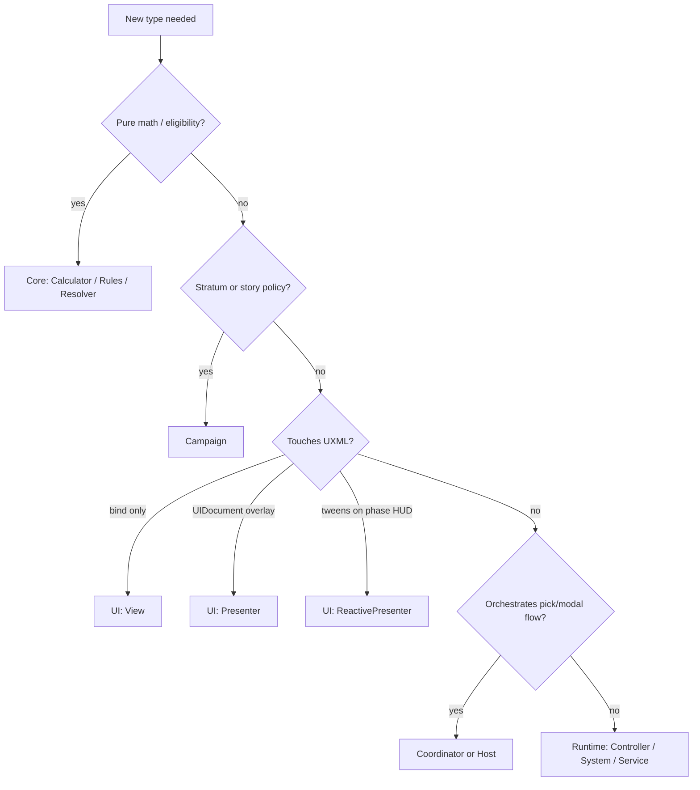

# Class naming patterns (C# suffixes)

Grid Dungeon uses **PascalCase type suffixes** to signal responsibility and assembly placement. This doc is the human-readable authority; agents also load [`.cursor/rules/unity-csharp-class-suffix-patterns.mdc`](../../.cursor/rules/unity-csharp-class-suffix-patterns.mdc).

Related: [05-class-design](../05-class-design.md) (type catalog), [unity-csharp-naming](../../.cursor/rules/unity-csharp-naming.mdc) (identifiers, `m_` fields), [architecture-design-principles](../../.cursor/rules/architecture-design-principles.mdc) (who owns what).

> **UXML/USS** use BEM kebab-case — not these C# suffixes. See [unity-ui-toolkit](../../.cursor/rules/unity-ui-toolkit.mdc).

---

## Assembly map

```
GridDungeon.Core       → Calculators, Resolvers, Rules, DTOs
GridDungeon.Campaign   → Stratum policy, story catalogs
GridDungeon.Runtime    → Controllers, Systems, Services, Hosts, SO Definitions
GridDungeon.UI         → Views, Presenters, Handlers, Pickers
GridDungeon.Tests      → *Tests per domain folder
```

---

## Suffix reference

### Phase and game loop

| Suffix | Responsibility | Examples |
|--------|----------------|----------|
| `*PhaseController` | `IPhaseController` — macro phase enter/exit | `CombatPhaseController`, `ExplorationPhaseController` |
| `*Controller` | Subsystem authority | `CombatController`, `HubController`, `GamePhaseController` |
| `*Coordinator` | Wire views + services for one flow | `SkillPickerCoordinator`, `ExplorationMapCoordinator`, `PartyMenuCoordinator` |
| `*Host` | Phase-owned modal/picker + input contract | `CombatSkillPickerHost`, `FieldSkillPickerHost` |
| `GameState` | Composition root (exception — no suffix) | Scene refs, `RequestTransition` |

**Host + Coordinator:** `CombatSkillPickerHost` owns combat wiring; `SkillPickerCoordinator` owns catalog → modal → selected skill. Do not fold both into the HUD view.

### Core (pure C#, no UnityEngine)

| Suffix | Responsibility | Examples |
|--------|----------------|----------|
| `*Calculator` | Formula or filtered list from state | `DamageCalculator`, `ValidTargetCalculator`, `MapRevealCalculator` |
| `*Resolver` | Choose outcome from rules + inputs | `ActionResolver`, `FloorExitResolver`, `ProtocolResolver` |
| `*Rules` | Eligibility / validation / classification | `GuildPartyRules`, `CombatValidTargetRules`, `ChestInteractRules` |
| `*Builder` | Assemble struct or ordered list | `TurnQueueBuilder`, `NoticeContentBuilder` |
| `*Catalog` | Static id → row tables | `SkillPickerCatalog`, `InventoryBagCatalog` |
| `*Evaluator` | Predicate over game state | `EncounterEventEvaluator` |
| `*Executor` | Dispatch effects from data | `StoryEventEffectExecutor` |
| `*System` | Stateful simulator in Core | `StatusSystem` |
| `*Data` | DTO at ScriptableObject boundary | `SkillData`, `EnemyData` |
| `*Factory` | Construct Core models | `Mvp1GuildRosterFactory` |

**Example pair (keep separate):** `ValidTargetCalculator.GetValidTargets(...)` builds the list; `CombatValidTargetRules.AreEnemies(...)` tells UI which picker branch to use.

### Runtime

| Suffix | Responsibility | Examples |
|--------|----------------|----------|
| `*Service` | Use-case API | `InnService`, `HospitalService`, `FieldItemUseService` |
| `*System` | Long-lived runtime subsystem | `MapSystem`, `FoeSystem`, `SaveSystem`, `ProtocolSystem` |
| `*Factory` | Build runtime models from save/content | `CombatantFactory` |
| `*Presenter` | Scene/world presentation (non-UITK overlay) | `CombatScenePresenter`, `FloorArtPresenter` |
| `*Definition` | ScriptableObject asset | `SkillDefinition`, `StoryEventDefinition` |

### UI Toolkit (`GridDungeon.UI`)

| Suffix | Responsibility | Examples |
|--------|----------------|----------|
| `*View` | UXML bind, BEM toggles, steady visual state | `CombatHudView`, `PartyFormationGridView`, `ItemListPickerView` |
| `*Presenter` | `UIDocument`, overlay lifecycle, `ICentralizedUiSurface` | `InputHintPresenter`, `CommandRailPresenter`, `ItemListInventoryPresenter` |
| `*ReactivePresenter` | Event-driven DOTween on HUD chrome — **no** `UIDocument` | `CombatHudReactivePresenter`, `HubHudReactivePresenter` |
| `*InputHandler` | Input System routing | `CombatInputHandler`, `ExplorationInputHandler` |
| `*Picker` | Keyboard/grid selection | `PartyFormationGridTargetPicker`, `FieldItemCharacterPicker` |
| `*ToolkitView` | Keyboard surface for tabbed picker shell | `SkillUsePickerToolkitView`, `PartyFormationToolkitView` |
| `*Navigator` / `*Focus` | Focus graph / grid index state | `MenuFocusNavigator`, `PartyFormationGridFocus` |
| `*Builder` | Build panel rows in code | `CommandRailPanelBuilder`, `ItemListRowBuilder` |
| `*Layout` | Picker profile / hook names (data) | `ItemListPickerLayout` |
| `*Adapter` | Bridge APIs | `CombatItemListPickerAdapter` |
| `*Support` | Shared static UI helpers | `CommandPanelModalSupport` |
| `*Transition` | DOTween show/hide on `VisualElement` | `SlideTransition`, `PopInTransition` |

#### View + Presenter pairs

Common pattern for centralized services:

- `WalletHudView` — clones UXML, sets balance label
- `WalletHudPresenter` — `UIDocument`, slide in/out, `CentralizedUiPresenterBase`

Phase HUDs often use:

- `*HudView` — `MonoBehaviour` + phase UXML
- `*HudReactivePresenter` — subscribes to `CombatController` / `MapSystem` / hub services for motion

#### Map markers

`MapChestMarkerRules` (when to show) + `MapChestMarkersPresenter` (bind map → glyphs). One pair per marker family — repetition is intentional until a generic layer is justified ([#341](https://github.com/miramocha/griddungeon-game/issues/341)).

### Campaign

| Suffix | Examples |
|--------|----------|
| `*Rules` | `HubStratumEntryRules` |
| `*Resolver` | `S1CampaignResolver` |
| `*Catalog` / `*Ids` | `StoryEventTriggerCatalog`, `StoryEventIds` |
| `*Runner` / `*Playback` | `StoryEventRunner`, `StoryEventPlayback` (Runtime) |

### Editor

| Suffix | Examples |
|--------|----------|
| `*Window` | `FloorEditorWindow` |
| `*Inspector` | `FloorEditorFoeInspector` |
| `*Store` | `FloorEditorFoeSpawnStore` |
| `*AssetResolver` | `FloorEditorStoryEventAssetResolver` |

### Tests

| Pattern | Rule |
|---------|------|
| `FooTests` | Mirror type under test; folder = domain |
| `*ForTests` | `internal` only; prefer ADR 039 transition simulators before new seams |

---

## Decision flow (new type)



---

## Known legacy / tech debt

| Symbol | Issue | Target suffix |
|--------|-------|----------------|
| `TargetSelectionView` | [#343](https://github.com/miramocha/griddungeon-game/issues/343) | `CombatTargetSelectionCoordinator` |
| `HubServices.cs` (multi-type file) | naming only | split or `HubServiceTypes.cs` |
| `FormationGridFocusController` | internal; file `FormationGridFocus.cs` | keep internal |

Do **not** treat these as patterns to copy for new code.

---

## Interfaces (common)

| Pattern | When |
|---------|------|
| `I*Host` | Phase callback for modal (`ICombatSkillPickerHost`) |
| `I*View` / `I*KeyboardView` | Swappable UITK surface |
| `I*Service` | Centralized overlay facade |
| `I*Controller` | Phase hook (`IPhaseController`) |
| `I*Rules` | Injectable rule set |

---

## File layout

- One primary `MonoBehaviour` per file; filename = class name.
- Target **≤300 lines**; split by suffix before god class ([#341](https://github.com/miramocha/griddungeon-game/issues/341)).
- Namespace mirrors folders: `GridDungeon.UI.Views`, `GridDungeon.Core.Simulators`.

---

## See also

- [centralized UI services](centralized-ui-services.md)
- [shared menu & picker UI](shared-menu-picker-ui.md)
- [ui-event-contract](ui-event-contract.md)
- [Assets/Scripts/README.md](https://github.com/miramocha/griddungeon-game/blob/main/Assets/Scripts/README.md)
