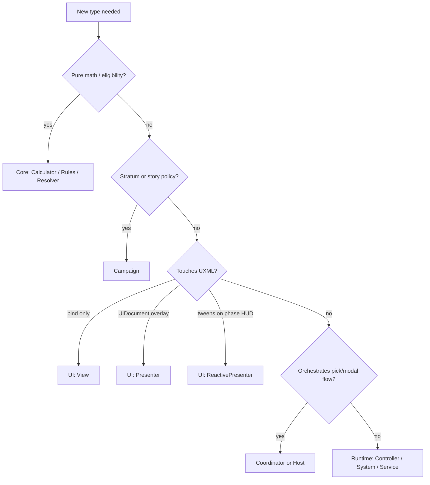

---
tags:
  - path/docs/04-dev
  - type/dev
  - scope/required
  - status/active
---
# Class naming patterns (C# suffixes)

PascalCase **suffix** = responsibility + assembly. Shipped type tables: [05 — Class design](../05-class-design.md). Suffix rules stay in this file.

Agents: read this file **before creating or renaming** a type ([`unity-csharp-class-creation`](../../.cursor/rules/unity-csharp-class-creation.mdc), [**class-naming-grid-dungeon**](../../.cursor/skills/class-naming-grid-dungeon/SKILL.md)). Compressed checklist: [`.cursor/rules/unity-csharp-class-suffix-patterns.mdc`](../../.cursor/rules/unity-csharp-class-suffix-patterns.mdc) (`*.cs` glob). Paths resolve via [`.cursor/review-config.json`](../../.cursor/review-config.json) → `classNaming.patternsDoc` ([code-review-config](../../.cursor/rules/code-review-config.mdc)).

| Doc | Owns |
|-----|------|
| **This file** | `*View` / `*Presenter` / `*Calculator` rules, decision flow, partial-class seams, file caps |
| [05 — Class design](../05-class-design.md) | Assemblies, enums, **shipped** type tables, side-dungeon API sketch |
| [03 — Content](../03-content/README.md) | Locked IDs, ScriptableObject schema |

Also: [unity-csharp-naming](../../.cursor/rules/unity-csharp-naming.mdc) (`m_` fields, identifiers), [architecture-design-principles](../../.cursor/rules/architecture-design-principles.mdc) (phase ownership).

> **UXML/USS** use BEM kebab-case — not these C# suffixes. See [unity-ui-toolkit](../../.cursor/rules/unity-ui-toolkit.mdc).

---

## Assembly map

Summary only — dependency diagram and `asmdef` paths: [05 — Class design § Assembly structure](../05-class-design.md#assembly-structure).

```
GridDungeon.Core       → Calculators, Resolvers, Rules, DTOs
GridDungeon.Campaign   → Stratum policy, story catalogs
GridDungeon.Runtime    → Controllers, Systems, Services, Hosts, SO Definitions
GridDungeon.UI         → Views, Presenters, Handlers, Pickers
GridDungeon.Tests      → *Tests per domain folder
```

---

## Suffix reference

### Phase and game loop

| Suffix | Responsibility | Examples |
|--------|----------------|----------|
| `*PhaseController` | `IPhaseController` — macro phase enter/exit | `CombatPhaseController`, `ExplorationPhaseController` |
| `*Controller` | Subsystem authority | `CombatController`, `HubController`, `GamePhaseController` |
| `*Coordinator` | Wire views + services for one flow | `SkillPickerCoordinator`, `CombatTargetSelectionCoordinator`, `ExplorationMapCoordinator`, `PartyMenuCoordinator` |
| `*Host` | Phase-owned modal/picker + input contract | `CombatSkillPickerHost`, `FieldSkillPickerHost` |
| `GameState` | Composition root (exception — no suffix) | Scene refs, `RequestTransition` |

**Host + Coordinator:** `CombatSkillPickerHost` owns combat wiring; `SkillPickerCoordinator` owns catalog → modal → selected skill. Do not fold both into the HUD view.

### Core (pure C#, no UnityEngine)

| Suffix | Responsibility | Examples |
|--------|----------------|----------|
| `*Calculator` | Formula or filtered list from state | `DamageCalculator`, `ValidTargetCalculator`, `MapRevealCalculator` |
| `*Resolver` | Choose outcome from rules + inputs | `ActionResolver`, `FloorExitResolver`, `ProtocolResolver` |
| `*Rules` | Eligibility / validation / classification | `GuildPartyRules`, `CombatValidTargetRules`, `ChestInteractRules` |
| `*Builder` | Assemble struct or ordered list | `TurnQueueBuilder`, `NoticeContentBuilder` |
| `*Catalog` | Static id → row tables | `SkillPickerCatalog`, `InventoryBagCatalog` |
| `*Evaluator` | Predicate over game state | `EncounterEventEvaluator` |
| `*Executor` | Dispatch effects from data | `StoryEventEffectExecutor` |
| `*System` | Stateful simulator in Core | `StatusSystem` |
| `*Data` | DTO at ScriptableObject boundary | `SkillData`, `EnemyData` |
| `*Factory` | Construct Core models | `Mvp1GuildRosterFactory` |

**Example pair (keep separate):** `ValidTargetCalculator.GetValidTargets(...)` builds the list; `CombatValidTargetRules.AreEnemies(...)` tells UI which picker branch to use.

### Runtime

| Suffix | Responsibility | Examples |
|--------|----------------|----------|
| `*Service` | Use-case API | `InnService`, `HospitalService`, `FieldItemUseService` |
| `*System` | Long-lived runtime subsystem | `MapSystem`, `FoeSystem`, `SaveSystem`, `ProtocolSystem` |
| `*Factory` | Build runtime models from save/content | `CombatantFactory` |
| `*Presenter` | Scene/world presentation (non-UITK overlay) | `CombatScenePresenter`, `FloorArtPresenter` |
| `*Host` | Runtime scene composition root (visibility, child presenters) | `DungeonSceneHost` |
| `*Definition` | ScriptableObject asset | `SkillDefinition`, `StoryEventDefinition` |

#### Party menu stage vs reusable character prefab

| Family | Lives on | Examples |
|--------|----------|----------|
| `Character*` | Reusable character prefab `MonoBehaviour` (`GridDungeon.Runtime.Characters`) | `VrmCharacterLookAt`, `CharacterMaterialSilhouette` |
| `PartyCharacterVisual*` | `GameState` session pool / static helpers | `PartyCharacterVisualRegistry`, `PartyCharacterVisualPose` |
| `PartyMenu*` | Stage rig, content SOs, motion helpers, per-instance stage hooks | `PartyMenuStageOrbitRig`, `PartyMenuRuntimeContent`, `PartyMenuEquipPoseCatalog`, `PartyMenuEquipInspectMotion` |
| `PartyMenu*Host` | Per-spawned-visual `MonoBehaviour` on party menu character prefab | `PartyMenuCharacterAnimatorOverrideHost` (cached override controller + equip layer blend) |

### UI Toolkit (`GridDungeon.UI`)

| Suffix | Responsibility | Examples |
|--------|----------------|----------|
| `*View` | UXML bind, BEM toggles, steady visual state | `CombatHudView`, `PartyFormationGridView`, `ItemListPickerView` |
| `*Presenter` | `UIDocument`, overlay lifecycle, `ICentralizedUiSurface` | `InputHintPresenter`, `CommandRailPresenter`, `ItemListInventoryPresenter` |
| `*ReactivePresenter` | Event-driven DOTween on HUD chrome — **no** `UIDocument` | `CombatHudReactivePresenter`, `HubHudReactivePresenter` |
| `*InputHandler` | Input System routing | `CombatInputHandler`, `ExplorationInputHandler` |
| `*Picker` | Keyboard/grid selection | `PartyFormationGridTargetPicker`, `FieldItemCharacterPicker` |
| `*ToolkitView` | Keyboard surface for tabbed picker shell | `SkillUsePickerToolkitView`, `PartyFormationToolkitView` |
| `*Navigator` / `*Focus` | Focus graph / grid index state | `MenuFocusNavigator`, `PartyFormationGridFocus`, `RailMenuFocus` |
| `*Builder` | Build panel rows in code | `CommandRailPanelBuilder`, `ItemListRowBuilder` |
| `*Layout` | Picker profile / hook names (data) | `ItemListPickerLayout` |
| `*Adapter` | Bridge APIs | `CombatItemListPickerAdapter` |
| `*Support` | Shared static UI helpers | `CommandPanelModalSupport` |
| `*Transition` | DOTween show/hide on `VisualElement` | `SlideTransition`, `PopInTransition`, `RailInfoCopyTransition` |
| `*Routine` | Static **coroutine beat** helpers (fade-to → work → fade-from) | `ScreenFadeBeatRoutine` |
| *(no suffix)* static facade | Thin API on `CentralizedUiFacade<TPresenter>` or presenter register | `InputHints`, `CommandRailInfo`, `ScreenFades`, `PartyMenuEnvironmentFade` |
| `*Defaults` | Path / tuning constants (static class) | `PartyMenuStageDefaults`, `WorldBackdropFadeDefaults` |
| *(no suffix)* token helper | Shared static value resolver (color, copy table) | `WorldBackdropColor`, `TabbedPickerRailHints` |
| `internal` helper | Implementation behind `*Presenter` / `*View` — no public suffix | `UiFadeOverlay` (UITK fade shell used by fade presenters) |

#### View + Presenter pairs

Common pattern for centralized services:

- `WalletHudView` — clones UXML, sets balance label
- `WalletHudPresenter` — `UIDocument`, slide in/out, `CentralizedUiPresenterBase`

**Static facades** (optional, `GridDungeon.UI` or co-located with Runtime presenter):

- `InputHints` → `InputHintPresenter`
- `CommandRailInfo` → `CommandRailInfoPresenter`
- `ScreenFades` → `ScreenFadePresenter` (floor transitions; sort **10000**)
- `PartyMenuEnvironmentFade` → `PartyMenuEnvironmentFadePresenter` (3D backdrop mask; sort **15**)

Facade = register/unregister in presenter `OnEnable`/`OnDisable`, thin static methods; no `UIDocument` on the facade type. See [centralized UI services](centralized-ui-services.md).

**`*Routine` vs `*Transition`:** `*Transition` tweens a `VisualElement` in place. `*Routine` yields `IEnumerator` beats that **orchestrate** multiple steps (e.g. fade to black → swap under black → fade from). Do not put coroutine beat graphs on `*Presenter` when a static `*Routine` is shared across phases.

Phase HUDs often use:

- `*HudView` — `MonoBehaviour` + phase UXML
- `*HudReactivePresenter` — subscribes to `CombatController` / `MapSystem` / hub services for motion

#### Embedded rail focus

`RailMenuFocus` — vertical command-rail or horizontal tab focus over existing `VisualElement` trees. Owns `MenuFocusNavigator` (+ optional `RailMenuView` chip menu). **No** `UIDocument`, **no** overlay lifecycle — not `*Presenter`. Static factories (`CreateHorizontal`, `CreateVerticalFocus`, `ConfigureButton`) stay on the focus type.

| Type | Role |
|------|------|
| `RailMenuFocus` | Focus index, selection sync, chip/tab wiring |
| `RailMenuView` | Chip list DOM bind on host (`VisualElement`); horizontal tabs or vertical chips — not a `UIDocument` / UXML-file view |

#### Map markers

`MapChestMarkerRules` (when to show) + `MapChestMarkersPresenter` (bind map → glyphs). One pair per marker family — repetition is intentional until a generic layer is justified ([#341](https://github.com/miramocha/griddungeon-game/issues/341)).

### Campaign

| Suffix | Examples |
|--------|----------|
| `*Rules` | `HubStratumEntryRules` |
| `*Resolver` | `S1CampaignResolver` |
| `*Catalog` / `*Ids` | `StoryEventTriggerCatalog`, `StoryEventIds` |
| `*Runner` / `*Playback` | `StoryEventRunner`, `StoryEventPlayback` (Runtime) |

### Editor

| Suffix | Examples |
|--------|----------|
| `*Window` | `FloorEditorWindow` |
| `*Inspector` | `FloorEditorFoeInspector` |
| `*Store` | `FloorEditorFoeSpawnStore` |
| `*AssetResolver` | `FloorEditorStoryEventAssetResolver` |
| `*Creator` | Menu entry that authors a **scene or full prefab** | `DevBootstrapSceneCreator`, `PartyMenuStagePrefabCreator`, `FloorTransitionBeatPrefabCreator` |
| `*Factory` | Reusable **prefab fragment** or asset builder shared by creators | `WorldBackdropSphereFactory` (shared `Backdrop` / `BackdropSphere` + party backdrop material) |

Prefer `*Creator` for one-shot menu tools that save a prefab/scene asset. Extract a `*Factory` when two or more creators share the same hierarchy chunk (party stage + floor-transition beats both use `WorldBackdropSphereFactory`).

### Tests

| Pattern | Rule |
|---------|------|
| `FooTests` | Mirror type under test; folder = domain |
| `*ForTests` | `internal` only; prefer ADR 039 transition simulators before new seams |

---

## Decision flow (new type)



---

## Interfaces (common)

| Pattern | When |
|---------|------|
| `I*Host` | Phase callback for modal (`ICombatSkillPickerHost`) |
| `I*View` / `I*KeyboardView` | Swappable UITK surface |
| `I*Service` | Centralized overlay facade |
| `I*Controller` | Phase hook (`IPhaseController`) |
| `I*Rules` | Injectable rule set |

---

## File layout

- One primary `MonoBehaviour` per file; filename = class name.
- Target **≤300 lines**; split by suffix before god class ([#341](https://github.com/miramocha/griddungeon-game/issues/341)).
- Namespace mirrors folders: `GridDungeon.UI.Views`, `GridDungeon.Core.Simulators`.

### Partial class file naming (locked)

When a type exceeds file caps, prefer **`partial class`** over `#region` or a second public type. **Do not** invent new C# type names for orchestration slices — one public type, multiple files.

**Pattern:** `{TypeName}.{Concern}.cs` — PascalCase concern segment after the dot.

| Layer | Concern suffix = | Examples |
|-------|------------------|----------|
| **Runtime `*Controller`** | Loop / orchestration **seam** (planning → turn → dispatch → round-end) | `CombatController.Planning.cs`, `CombatController.TurnDriver.cs`, `CombatController.ActionDispatch.cs`, `CombatController.RoundEnd.cs` ([#352](https://github.com/miramocha/griddungeon-game/issues/352)) |
| **UI `*Presenter` / `*Coordinator`** | Screen, overlay, or chrome **feature** | `ItemListInventoryPresenter.Combat.cs`, `ExplorationMapCoordinator.Autopilot.cs` |
| **Editor tools** | Content or panel **domain** | `ContentDatabaseAuthoring.Skills.cs` |

**Host file (`{TypeName}.cs`)** — keep in the primary file only:

- `[SerializeField]` and shared instance fields
- Public properties, events, and stable public API
- Lifecycle entry points callers depend on (`StartBattle`, `OnEnable`, `Show`, …)
- Target **≤500 lines** for edited Runtime controllers ([#341](https://github.com/miramocha/griddungeon-game/issues/341))

**Partial files** — private implementation for one seam; no duplicate fields; each file **≤400 lines** when practical.

**Runtime controller seam vocabulary** (pick names that match [architecture-design-principles](../../.cursor/rules/architecture-design-principles.mdc) — do not copy UI feature labels):

| Suffix | Typical contents |
|--------|------------------|
| `.Planning` | Player command queue, targeting, commit-to-AGI |
| `.TurnDriver` | Turn queue advance, coroutine/step delay, `BeginCurrentTurn` |
| `.ActionDispatch` | Resolve handoff to Core simulators, protocol/deploy/item side effects |
| `.RoundEnd` | End-of-round hooks, victory/defeat transitions, party sync |

Other controllers may use domain-specific concern names (e.g. `.Input`, `.Persistence`) when those seams are clearer than the combat set.

**Do not:**

- Add new public types named `*TurnDriver`, `*Dispatcher`, etc. — slices stay `partial` on the existing `*Controller`
- Move Core simulators into Runtime partials to shrink files
- Split only for line count with meaningless suffixes (`.Part2.cs`)

Authority for caps: [unity-csharp-file-size-limits](../../.cursor/rules/unity-csharp-file-size-limits.mdc).

---

## See also

- [05 — Class design](../05-class-design.md) — shipped type inventory, assemblies, enums
- [centralized UI services](centralized-ui-services.md)
- [shared menu & picker UI](shared-menu-picker-ui.md)
- [ui-event-contract](ui-event-contract.md)
- [Assets/Scripts/README.md](https://github.com/miramocha/griddungeon-game/blob/main/Assets/Scripts/README.md)
