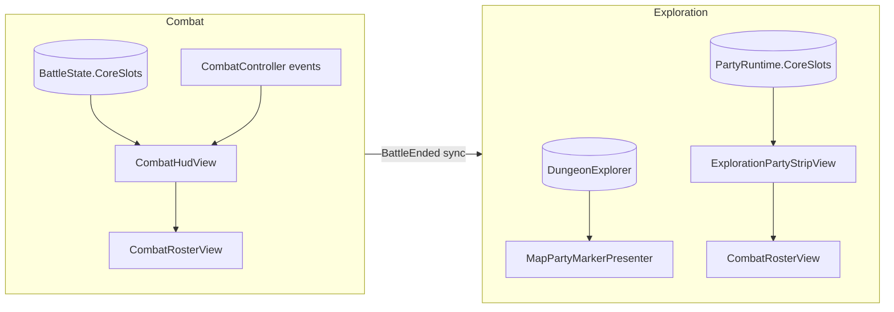
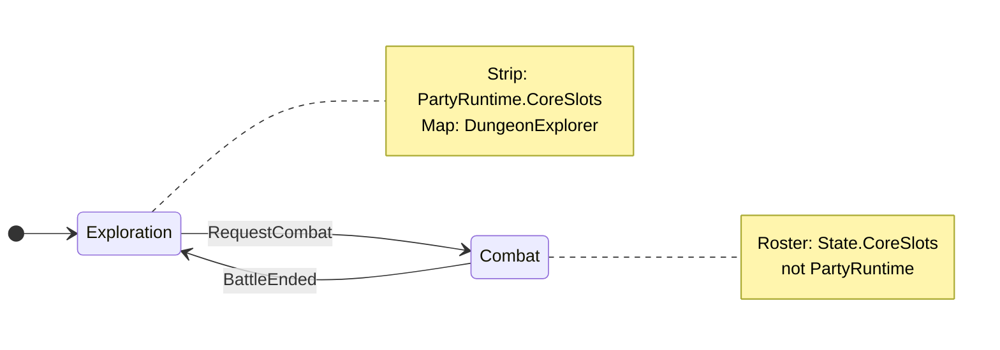
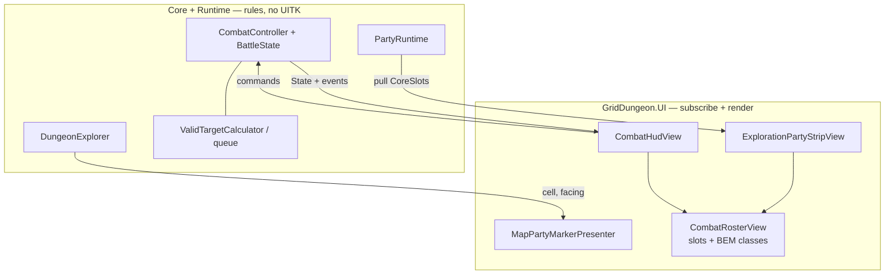

# Custom party UI (dev / integrator)

How to replace or extend **party-facing HUD plates** — exploration strip, combat party roster, and (optionally) the map party glyph — without moving roster rules, combat planning, or phase authority into UI.

Unlike the [skill use picker](custom-skill-picker-ui.md), party UI has **no single swap port** (`ISkillUsePickerView`). MVP1 ships imperative presenters built on a shared **`CombatRosterView`** slot builder. You fork or replace those views while keeping the same **data sources** and **events** documented in [UI event contract](ui-event-contract.md).

**Implementation repo:** [griddungeon-game](https://github.com/miramocha/griddungeon-game) — reference types under `Assets/Scripts/UI/Views/`.

---

## Three surfaces (pick scope)

| Surface | When visible | Data authority | Shipped owner |
|---------|--------------|----------------|---------------|
| **Exploration party strip** | `GamePhase.Exploration` | `PartyRuntime.CoreSlots` | `ExplorationPartyStripView` → `CombatRosterView` (single row) |
| **Combat party roster** | `GamePhase.Combat` | `CombatController.State.CoreSlots` (`BattleState` copy) | `CombatHudView` + `CombatRosterView` (front/back rows) |
| **Map party marker** | Exploration map open | `DungeonExplorer` cell + facing | `MapPartyMarkerPresenter` |

**Out of scope for this doc:** Hub guild roster / party-ready gate (`s1_party_ready`), inn save UI, and full-screen menus — those are hub/content flows ([party & classes](../02-systems/party-and-classes.md)), not the exploration strip or combat roster.

**Do not** read `PartyRuntime` for HP/MP during an active fight — use `BattleState` on `CombatController` ([UI event contract — Combat](ui-event-contract.md#combat-phase)). After `BattleEnded`, exploration strip refreshes from `PartyRuntime` (often with `forceRebuild` when returning from combat).





---

## Architecture (do not invert)



| Layer | Owns | Must not own |
|-------|------|----------------|
| **Core / Runtime** | `Combatant` stats, formation indices, `ValidTargetCalculator`, queue/back, battle copy | UITK layout, focus chrome |
| **`CombatRosterView`** | Build slot `VisualElement`s, HP/MP labels, highlight modifiers | When to transition phase or submit actions |
| **Phase views** | Subscribe to events; call `Bind*` / `Set*Highlight` | Duplicate damage math or AGI order |

**Do not** add `GridDungeon.UI` references to `GridDungeon.Runtime`. Custom party UI lives in UI (or your asmdef referencing Runtime); wire from `ExplorationHudView` / `CombatHudView` bootstrap or your own `UIDocument`.

---

## Shared building block: `CombatRosterView`

Path: `Assets/Scripts/UI/Views/CombatRosterView.cs`  
Styles: `Assets/UI/Screens/Combat/CombatHud.uss` (`.combat-roster__*` — reused on exploration strip)

### Constructors

| Constructor | Use |
|-------------|-----|
| `CombatRosterView(VisualElement slotsContainer)` | Single-row strip (`party-strip-slots`) |
| `CombatRosterView(VisualElement front, VisualElement back)` | Combat party or enemy formation |

### Bind / refresh

| Method | When |
|--------|------|
| `BindCoreRow(Combatant?[] slots)` | Exploration strip or flat party list |
| `BindCoreFormation(Combatant?[] slots)` | Combat party front/back (`BattleFormation.MaxEnemyFront` split) |
| `BindEnemyFormation(Combatant[] slots)` | Enemy panel only (combat) |
| `RefreshCombatantStats(Combatant c)` | In-place HP/MP/dead class after bind |

### Interaction & combat chrome

| Method | Contract |
|--------|----------|
| `SetSlotClickHandler(Action<string>? onId)` | LMB on slot → combatant id (planning / targeting) |
| `SetActingHighlight(Combatant? actor)` | **One** party slot `--acting` during player command turn |
| `SetQueuedHighlights(Func<string, bool>)` | `--queued` per core with a queued command |
| `SetQueuedActionLabels(Func<string, string?>?)` | Action line under slot (Attack, Guard, skill name, …) |
| `ClearQueuedActionLabels()` | End of planning / battle |
| `SetTargetHighlights(validIds, selecting)` | `--targetable` / `--invalid-target` during target pick |
| `SetStaleTargetHighlights(staleIds)` | `--stale-target` + tooltip *Target down — will retarget* ([#65](https://github.com/miramocha/griddungeon-game/issues/65)) |
| `TryGetSlotElement(string id, out VisualElement?)` | VFX / pulse without rebuilding DOM |

Slots are created in code (`BuildSlot`) with BEM classes `combat-roster__slot`, `combat-roster__slot-name`, `combat-roster__slot-hp`, optional `combat-roster__slot-mp` (**party cores / aux only** — omitted for `CombatantKind.Enemy`), optional `combat-roster-slot-action` (`name` for queries).

**Planning highlight rule:** During a **core command turn**, gold **acting** highlight belongs on the **party roster** slot for that core, **not** on the AGI turn-order strip ([combat § Turn order strip](../02-systems/combat.md#turn-order-strip-agi-queue-ui)). Strip highlight is for auto/AI/enemy turns.

---

## Exploration party strip

### UXML hooks

`Assets/UI/Screens/Exploration/ExplorationHud.uxml`:

| `name` | Role |
|--------|------|
| `party-strip` | Root; toggle `exploration-hud__party-strip--hidden` |
| `party-strip-slots` | Container passed to `CombatRosterView` |

Exploration-specific USS: `ExplorationHud.uss` (strip layout, status line). Status summaries use extra labels with class `exploration-party-strip__status` (see shipped `ExplorationPartyStripView`).

### Shipped wiring

1. `ExplorationHudView` queries `party-strip`, constructs `ExplorationPartyStripView`.
2. `ExplorationHudReactivePresenter` calls `SyncParty` on `DungeonExplorer.OnPartyStep`, `OnPartyEnteredCell`, and after map reveal beats (gate only).
3. `ExplorationHudView.OnPhaseChanged` → `SetVisible(exploration)`; **Combat → Exploration** uses `forceRebuild: true` and optional HP pulse.

### Events to subscribe (no `PartyRuntime` events)

From [UI event contract — Exploration](ui-event-contract.md#exploration-phase):

| Source | Refresh |
|--------|---------|
| `GameState.PhaseChanged` | Show/hide strip; rebuild when entering exploration from combat |
| `GameState.ExplorationBindingsWired` | Full rebuild after exploration phase wires |
| `DungeonExplorer.OnPartyStep` / `OnPartyEnteredCell` | Stats refresh (strip uses member-id diff to avoid full rebuild) |
| `PartyRuntime.CoreSlots` | Read-only each refresh |

Minimal custom strip (same contract as shipped):

```csharp
void OnEnable(GameState gs, DungeonExplorer ex, PartyRuntime party)
{
    gs.PhaseChanged += (_, to) =>
    {
        if (to == GamePhase.Exploration) RebuildFrom(party.CoreSlots);
        SetStripVisible(to == GamePhase.Exploration);
    };
    gs.ExplorationBindingsWired += () => RebuildFrom(party.CoreSlots);
    ex.OnPartyStep += () => RefreshStats(party.CoreSlots);
    ex.OnPartyEnteredCell += _ => RefreshStats(party.CoreSlots);
}
```

### Replace strategies

| Approach | Notes |
|----------|-------|
| **Reskin** | Keep `ExplorationPartyStripView`; change USS / slot template in `CombatRosterView.BuildSlot` fork |
| **New layout, same data** | New view class; still read `PartyRuntime`; optional reuse of `ExplorationPartyStripFormatter.FormatStatusSummary` for status text |
| **Drop strip** | Hide `party-strip`; ensure map or other UI still exposes party state if needed for your mode |

Reference: `ExplorationPartyStripView.cs`, `ExplorationPartyStripFormatter.cs`.

---

## Combat party roster

### UXML hooks

`Assets/UI/Screens/Combat/CombatHud.uxml`:

| `name` | Role |
|--------|------|
| `party-roster-front` | Front row slot container |
| `party-roster-back` | Back row slot container |

Enemy panel (`enemy-roster-front` / `enemy-roster-back`) uses the same `CombatRosterView` API but is a separate instance — replace party only by wiring your view in `CombatHudView` instead of `m_partyRoster`.

### Shipped wiring (`CombatHudView`)

- Builds `m_partyRoster` + `m_enemyRoster`; `SetSlotClickHandler(OnRosterSlotClicked)` for planning/targeting.
- Subscribes to `CombatController`: `OnQueueRebuilt`, `OnTurnStart`, `OnCommandTargetChanged`, `OnPartyCommandsChanged`, `OnTargetingChanged`, `OnActionResolved`, `BattleEnded`, etc.
- `TargetSelectionView` takes **both** rosters for keyboard target focus ([ADR 026](../../decisions/026-combat-menu-focus-navigation.md)) — if you replace roster DOM, either keep `CombatRosterView` instances for `TargetSelectionView` or reimplement focus against your slots.

### Combat events (party roster)

| Event | Typical roster effect |
|-------|------------------------|
| `OnPartyCommandsChanged` | Queued labels + queued highlights |
| `OnCommandTargetChanged` | Planning highlight on selected core |
| `OnTargetingChanged` | Valid / invalid target highlights |
| `OnTurnStart` | Acting highlight (player core turn → party roster) |
| `OnActionResolved` | HP refresh, hit flash classes via reactive presenter |
| `BattleEnded` | Clear highlights / labels |

**Commands (wire clicks or focus):**

| `CombatController` API | Use |
|------------------------|-----|
| `SelectCommandTarget(Combatant core)` | Planning: pick which core to assign |
| `SubmitPlayerAction(...)` | After command bar / skill picker / target confirm |

Full table: [UI event contract — Combat](ui-event-contract.md#combat-phase).

### Replace strategies

| Approach | Notes |
|----------|-------|
| **Reskin slots** | Fork `CombatRosterView.BuildSlot` or override USS modifiers |
| **Custom party panel only** | Replace `m_partyRoster` wiring; keep `m_enemyRoster` + `TargetSelectionView` unchanged |
| **Full combat HUD fork** | Duplicate `CombatHudView` event subscriptions; must preserve acting-on-roster vs strip rule and stale-target styling for MVP1 parity |

Motion (HP lerp, hit flash, synchro bar): `CombatHudReactivePresenter` — optional to reuse or replace; does not change combat rules.

---

## Map party marker (optional)

Separate from strip/roster plates: a single glyph on the exploration map.

| Piece | Path |
|-------|------|
| Presenter | `MapPartyMarkerPresenter` |
| Tests | `Tests → UI → MapPartyMarkerPresenterTests` |

Subscribe `DungeonExplorer` position/facing and `MapSystem` reveal as in [exploration UI § MapView](../02-systems/exploration-ui.md#mapview-push-updates). Replacing the strip does **not** require replacing the map marker unless you want a unified visual language.

---

## Step-by-step: new exploration strip (UITK)

1. Add or fork `ExplorationHud.uxml` — keep `name="party-strip"` and `party-strip-slots` if you still use `CombatRosterView`, or assign new `name` hooks and query them in your view.
2. Implement `MyPartyStripView` with `SyncParty(PartyRuntime, bool forceRebuild)` mirroring shipped diff logic (member ids) to avoid rebuilding every step.
3. Wire in `ExplorationHudView` (or your HUD `MonoBehaviour`) + subscribe phase/explorer events above.
4. On disable: unsubscribe all; clear tweens if you use DOTween gates like `ExplorationHudReactivePresenter`.

**Create Dev Bootstrap** if scene `UIDocument` refs are stale: **GridDungeon → Scenes → Create Dev Bootstrap**.

Manual: **F2** exploration with **F6** full guild party — strip shows six cores; walk to refresh HP display.

---

## Step-by-step: new combat party roster (UITK)

1. Fork `CombatHud.uxml` party section or inject containers at runtime under `combat-hud`.
2. Instantiate `CombatRosterView(partyFront, partyBack)` **or** your own slot builder that implements the same highlight methods `CombatHudView` expects.
3. In `CombatHudView`-equivalent bootstrap:
   - Pass `CombatController` into subscriptions.
   - On planning: `BindCoreRow(state.CoreSlots)` or formation bind; call highlight setters when events fire.
   - Wire `TargetSelectionView(partyRoster, enemyRoster, combat)` if keyboard targeting stays enabled.
4. Keep `CommandPanelView` + skill picker host unchanged — party roster is independent of ADR 035 modal.

Manual: **F3** dev combat — acting highlight on **party roster** for core turns; **F9** for two-row enemy + party formation QA ([Assets/Scripts/README.md](https://github.com/miramocha/griddungeon-game/blob/main/Assets/Scripts/README.md)).

---

## Testing without Play Mode

| Fixture | Path |
|---------|------|
| `ExplorationPartyStripFormatterTests` | Status summary strings |
| `TargetSelectionViewTests` | Roster focus + `CombatController` targeting (uses real `CombatRosterView` + UXML fragment) |
| `MapPartyMarkerPresenterTests` | Map glyph position |

There is no dedicated `CombatRosterViewTests` — roster behavior is covered indirectly via combat UI tests. Prefer testing **highlight state** and **bind** through your view’s public methods or Edit Mode UI harnesses.

Do not run Unity CLI batch tests while the Editor has the project open ([unity-no-cli-tests-while-editor-open](https://github.com/miramocha/griddungeon-game/blob/main/.cursor/rules/unity-no-cli-tests-while-editor-open.mdc)).

---

## Checklist

- [ ] Exploration strip reads `PartyRuntime`, not `BattleState`
- [ ] Combat roster reads `CombatController.State` during fight
- [ ] Rebuild or resync strip on **Combat → Exploration** (`PhaseChanged`)
- [ ] Acting highlight on **party roster** during core command turns (not AGI strip)
- [ ] Target pick: valid / invalid / stale roster classes + tooltip for stale queued targets
- [ ] Unsubscribe all events in `OnDisable` / HUD teardown
- [ ] No combat rules or damage math in UI
- [ ] UITK default; no new uGUI without explicit approval

---

## Related

- [UI event contract](ui-event-contract.md) — exploration + combat event tables
- [Exploration UI](../02-systems/exploration-ui.md) — phase visibility, party strip checklist
- [Combat § UI](../02-systems/combat.md#ui-requirements) — roster vs strip, enemy rows
- [Custom skill picker UI](custom-skill-picker-ui.md) — command **Skill** modal (separate from roster)
- [ADR 026 — Combat menu focus](../../decisions/026-combat-menu-focus-navigation.md)
- [Assets/Scripts/README.md](https://github.com/miramocha/griddungeon-game/blob/main/Assets/Scripts/README.md) — F2/F3/F6/F9 QA
