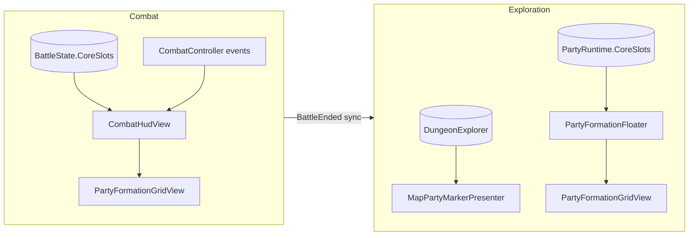
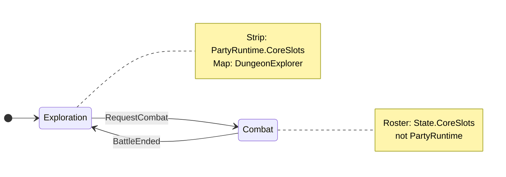
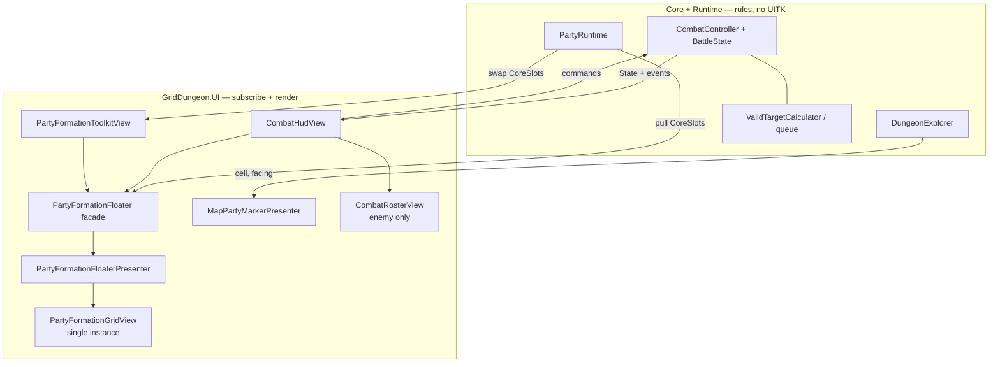

# Custom party UI (dev / integrator)

How to replace or extend **party-facing HUD plates** — exploration strip, combat party roster, and (optionally) the map party glyph — without moving roster rules, combat planning, or phase authority into UI.

Unlike the [skill use picker](custom-skill-picker-ui.md), party UI has **no single swap port** (`ISkillUsePickerView`). MVP1 ships imperative presenters built on a shared **`PartyFormationGridView`** (8 fixed cells, `PartyFormationSlotBinder` plates). **`CombatRosterView`** is **enemy-only**. You fork or replace those views while keeping the same **data sources** and **events** documented in [UI event contract](ui-event-contract.md).

**Implementation repo:** [griddungeon-game](https://github.com/miramocha/griddungeon-game) — reference types under `Assets/Scripts/UI/Views/`.

---

## Three surfaces (pick scope)

| Surface | When visible | Data authority | Shipped owner |
|---------|--------------|----------------|---------------|
| **Exploration party strip** | `GamePhase.Exploration` | `PartyRuntime.CoreSlots` | `ExplorationHudView` → `PartyFormationFloater` facade → shared `PartyFormationGridView` |
| **Combat party roster** | `GamePhase.Combat` | `CombatController.State.CoreSlots` (`BattleState` copy) | `CombatHudView` → `PartyFormationFloater.Grid` (combat-center inset) |
| **Formation menu** | Hub / exploration pause | `PartyRuntime.CoreSlots` | `PartyMenuOverlayView` → **`CharacterDetail`** facade (`PartyFormationInspect`, sort **251**) + `PartyFormationToolkitView` on shared floater (sort **260**) |
| **Equipment menu** | Hub / exploration pause | `PartyRuntime` + save equipment | `PartyMenuOverlayView` → **`CharacterDetail`** facade (sort **251**) + `PartyEquipmentFloaterToolkitView` on floater (sort **260**) |
| **Map party marker** | Exploration map open | `DungeonExplorer` cell + facing | `MapPartyMarkerPresenter` |

**Out of scope for this doc:** Hub guild roster / party-ready gate (`s1_party_ready`), inn save UI, and full-screen menus — those are hub/content flows ([party & classes](../02-systems/party-and-classes.md)), not the exploration strip or combat roster.

**Do not** read `PartyRuntime` for HP/MP during an active fight — use `BattleState` on `CombatController` ([UI event contract — Combat](ui-event-contract.md#combat-phase)). After `BattleEnded`, exploration strip refreshes from `PartyRuntime` (often with `forceRebuild` when returning from combat).





---

## Architecture (do not invert)



| Layer | Owns | Must not own |
|-------|------|----------------|
| **Core / Runtime** | `Combatant` stats, formation indices (`PartyFormationLayout`), `ValidTargetCalculator`, queue/back, battle copy | UITK layout, focus chrome |
| **`PartyFormationGridView`** | 8 fixed party cells, plate bind, highlight modifiers | When to transition phase or submit actions |
| **`CombatRosterView`** | Enemy slot build (dynamic, no empty placeholders) | Party formation |
| **Phase views** | Subscribe to events; call `BindParty` / `Set*Highlight` | Duplicate damage math or AGI order |

**Do not** add `GridDungeon.UI` references to `GridDungeon.Runtime`. Custom party UI lives in UI (or your asmdef referencing Runtime); wire from `ExplorationHudView` / `CombatHudView` bootstrap or your own `UIDocument`.

---

## Shared building blocks

**Grid:** `PartyFormationGridView` — `Assets/Scripts/UI/Views/PartyFormationGridView.cs`  
Plate builder: `PartyFormationSlotBinder.cs`  
Styles: `PartyFormationSlot.uss`, `PartyFormationGrid.uss`  
UXML: `PartyFormationGrid.uxml` — **two row containers** (front slots 0–3, back slots 4–7); no flex-wrap.

**Central floater:** `PartyFormationFloaterPresenter` + `PartyFormationFloater` static facade — see [centralized UI services](centralized-ui-services.md#party-formation-floater--partyformationfloaterpresenter--partyformationfloater) (same pattern as `InputHintPresenter` / `InputHints`).  
UXML/USS: `PartyFormationFloater.uxml`, `PartyFormationFloater.uss` — one scene `UIDocument` (sort **10** exploration/combat; **260** formation menu). Combat uses `party-formation-floater-host--combat-center` inset. Formation bind copy uses global `InputHints`, not inline labels on the floater.

### Floater visibility

| Modifier / API | Use |
|----------------|-----|
| `party-formation-floater--collapsed` | Floater translated off bottom edge (always rendered; not `display:none`). **Authority** for off-screen state — reveal/dismiss motion is DOTween via `CollapseTransition` ([ADR 039](../../decisions/039-uitk-dotween-show-hide.md)). |
| `PartyFormationFloaterView.SetRevealed(bool)` | Exploration strip + formation menu slide; combat HUD stays revealed |

### Bind / refresh

| Method | When |
|--------|------|
| `BindParty(Combatant?[] core, Combatant?[] aux, PartyFormationBindOptions)` | All party surfaces — empty slots stay visible |
| `RefreshCombatantStats(Combatant c)` | In-place HP/MP/dead class after bind |

Enemy roster remains `CombatRosterView` (`BindEnemyFormation` only).

Path: `Assets/Scripts/UI/Views/CombatRosterView.cs`  
Styles: `Assets/UI/Screens/Combat/CombatHud.uss` (`.combat-roster__*` — enemy only)

### Interaction & combat chrome

| Method | Contract |
|--------|----------|
| `SetSlotClickHandler(Action<string>? onId)` | LMB on slot → combatant id (planning / targeting) |
| `SetActingHighlight(Combatant? actor)` | **One** party slot `--acting` during player command turn |
| `SetQueuedHighlights(Func<string, bool>)` | `--queued` per core with a queued command |
| `SetQueuedActionLabels(Func<string, string?>?)` | Action line under slot (Attack, Guard, skill name, …) |
| `ClearQueuedActionLabels()` | End of planning / battle |
| `SetTargetHighlights(validIds, selecting)` | `--targetable` / `--invalid-target` during target pick |
| `SetStaleTargetHighlights(staleIds)` | `--stale-target` + tooltip *Target down — will retarget* ([#65](https://github.com/miramocha/griddungeon-game/issues/65)) |
| `TryGetSlotElement(string id, out VisualElement?)` | VFX / pulse without rebuilding DOM |
| `SetFormationEditMode(bool)`, `SetSelectedSlot(int?)`, `SetFocusedSlot(int?)` | Formation menu swap chrome |

Party plates use BEM `party-formation-slot` (+ `__header`, `__stat`, `__footer`, …) from `PartyFormationSlot.uss`. Empty cells keep the shell with `--empty` (never `display:none`). Index map: `PartyFormationLayout` (Core).

Enemy slots remain `combat-roster__slot*` in `CombatHud.uss` — built by `CombatRosterView.BuildSlot` (no MP on enemies).

**Planning highlight rule:** During a **core command turn**, gold **acting** highlight belongs on the **party roster** slot for that core, **not** on the AGI turn-order strip ([combat § Turn order strip](../02-systems/combat.md#turn-order-strip-agi-queue-ui)). Strip highlight is for auto/AI/enemy turns.

---

## Exploration party strip

### Scene wiring

Party strip is **not** on `ExplorationHud` (orchestrator-only — no phase HUD UXML). Bootstrap creates `PartyFormationFloater` `GameObject` with `PartyFormationFloaterPresenter` (`GridDungeon → Scenes → Create Dev Bootstrap`).

| API | Role |
|-----|------|
| `PartyFormationFloater.SyncPhaseOwnership(GamePhase)` | Phase context (called from presenter on `PhaseChanged`; exploration HUD may call after bootstrap) |
| `PartyFormationFloater.ApplyFormationDockState(false, revealed)` | Slide floater; map fullscreen / transition suppress strip |
| `PartyFormationFloater.ExplorationSync` | `PartyFormationExplorationSync` — bind + status labels |

`ApplyFormationDockState` slides floater; map fullscreen collapses strip. Status summaries: `party-formation-slot__status` via `PartyFormationExplorationSync`.

### Shipped wiring

1. `ExplorationHudView` calls `ApplyFormationDockState(formationEditActive: false, revealed: …)` on phase, map fullscreen, and floor-transition suppress.
2. `ExplorationHudReactivePresenter` calls `ExplorationSync.SyncParty` on `DungeonExplorer.OnPartyStep`, `OnPartyEnteredCell`, and after map reveal beats (gate only).
3. **Combat → Exploration** uses `forceRebuild: true` and optional HP pulse.

### Events to subscribe (no `PartyRuntime` events)

From [UI event contract — Exploration](ui-event-contract.md#exploration-phase):

| Source | Refresh |
|--------|---------|
| `GameState.PhaseChanged` | Show/hide strip; rebuild when entering exploration from combat |
| `GameState.ExplorationBindingsWired` | Full rebuild after exploration phase wires |
| `DungeonExplorer.OnPartyStep` / `OnPartyEnteredCell` | Stats refresh (strip uses member-id diff to avoid full rebuild) |
| `PartyRuntime.CoreSlots` | Read-only each refresh |

Minimal custom strip (same contract as shipped):

```csharp
void OnEnable(GameState gs, DungeonExplorer ex, PartyRuntime party)
{
    gs.PhaseChanged += (_, to) =>
    {
        if (to == GamePhase.Exploration) RebuildFrom(party.CoreSlots);
        SetStripVisible(to == GamePhase.Exploration);
    };
    gs.ExplorationBindingsWired += () => RebuildFrom(party.CoreSlots);
    ex.OnPartyStep += () => RefreshStats(party.CoreSlots);
    ex.OnPartyEnteredCell += _ => RefreshStats(party.CoreSlots);
}
```

### Replace strategies

| Approach | Notes |
|----------|-------|
| **Reskin** | Keep shared grid; change `PartyFormationSlot.uss` or fork `PartyFormationSlotBinder` |
| **New layout, same data** | Fork `PartyFormationFloaterPresenter` or replace grid mount; still read `PartyRuntime`; optional reuse of `ExplorationPartyStripFormatter.FormatStatusSummary` for status text |
| **Drop strip** | `PartyFormationFloater.ApplyFormationDockState(false, revealed: false)`; ensure map or other UI still exposes party state if needed for your mode |

Reference: `PartyFormationFloaterPresenter.cs`, `PartyFormationExplorationSync.cs`, `ExplorationPartyStripFormatter.cs`.

---

## Formation menu (party pause)

Hub / exploration pause → **Formation** section shows centered **`CharacterDetailView`** (`PartyFormationInspect` — read-only worn gear) **and** the shared bottom floater (`PartyFormationFloaterPresenter`, sort **260**).

| Step | Behaviour |
|------|-----------|
| **Z** on Formation (pane reveal) | Center dialog + floater slide in; **Z** again engages swap mode — front slot **0** gets `party-formation-grid__cell--focused`. |
| **WASD** (engaged) | Move focus across the 2×4 grid; read-only detail mirrors focused **core** (`CharacterDetailView`). |
| **Z** (engaged) | Pick core slot or confirm swap (`PartyFormationCoordinator`). |
| **X** | Cancel pending swap, or disengage swap mode; **X** again hides pane. |

Global bind copy: `TabbedPickerRailHints.PartyFormationSwap` while engaged; `PartyFormationEngage` only after **X** backs out of swap mode but the pane stays open. See [shared menu & picker UI — `TabbedPickerRailHints` copy](shared-menu-picker-ui.md#tabbedpickerrailhints-copy).

Section rail siblings disable only while swap mode is **engaged** (`PartyMenuSectionRailFocusRules` + `CommandPanelModalSupport`). Leaving the pane (`HideActivePane`) or switching sections calls `ResetPaneEngagement()` → `SyncSectionRailFocus()`.

Owner: `PartyMenuOverlayView` → `PartyFormationToolkitView` on `PartyFormationFloater.Grid` + **`CharacterDetail`** service overlay (sort **251**). Party menu floater context: `PartyFormationFloater.ApplyPartyMenuFloaterDock(docked: true, formationEdit: true)`.

---

## Equipment menu (party pause)

**Formation** and **Equipment** share the centralized **`CharacterDetail`** service (context switch — never visible together). Equipment uses `PartyEquipDisplay`: worn slots are focusable; **Z** on a slot is a **no-op** until a follow-up picker window ships (inline bag list removed).

| Step | Behaviour |
|------|-----------|
| **Z** on Equipment (pane reveal) | Center `CharacterDetail` + floater dock (sort **260**). |
| **WASD** (slots not engaged) | Move floater focus; core focus updates active member + detail. |
| **Z** (slots not engaged) | Engage worn-slot focus on `CharacterDetail`. |
| **W/S** (slots engaged) | Move worn-slot focus. |
| **Z** (slot engaged) | **No picker** — equip deferred. |
| **X** | Disengage slots, then hide pane. |

Member tabs removed — floater replaces `party-equipment-members`. Floater member focus uses `party-formation-grid__cell--focused` on the shared grid (`PartyEquipmentFloaterToolkitView`). **Switching sections** or hiding the pane must call `ClearMemberFocus()` (via `PartyMenuOverlayView.ResetPaneEngagement`) so the yellow outline does not persist on Equipment → Formation/Inventory.

Party menu dock: `PartyFormationFloater.ApplyPartyMenuFloaterDock(docked: true, formationEdit: false)`. Section rail siblings disable when the Equipment pane is **revealed** (`paneRevealed` — first **Z** after section select; same session as Inventory bag open), via `PartyMenuSectionRailFocusRules` + `CommandPanelModalSupport` — see [modal rail sibling disable](shared-menu-picker-ui.md#modal-rail-sibling-disable-commandpanelmodalsupport). Revealing the pane is sufficient; floater-only member focus does not need a separate modal signal. Worn-slot engage on `CharacterDetail` still switches **hints** (`PartyEquipmentEngage` → `PartyEquipmentSlots`) and worn-slot **W/S** input; it does not gate section-rail modal.

Global hints: `PartyEquipmentEngage` / `PartyEquipmentSlots` ([`TabbedPickerRailHints`](../../griddungeon-game/Assets/Scripts/UI/Views/TabbedPickerRailHints.cs)).

---

## Combat party roster

### UXML hooks

`Assets/UI/Screens/Combat/CombatHud.uxml`:

| `name` | Role |
|--------|------|
| `enemy-roster-front` / `enemy-roster-back` | Enemy row containers (`CombatRosterView`) |

Party roster uses the **shared** `PartyFormationFloater.Grid` (combat-center USS inset), not a host inside combat UXML.

Replace party only by forking `PartyFormationFloaterPresenter` or injecting a custom `PartyFormationGridView` via the facade. Enemy roster stays `m_enemyRoster` in `CombatHudView`.

### Shipped wiring (`CombatHudView`)

- Resolves `PartyFormationFloater.Grid` → `m_partyRoster` + `m_enemyRoster`; `SetCombatSlotClickHandler(OnRosterSlotClicked)` for planning/targeting.
- Subscribes to `CombatController`: `OnQueueRebuilt`, `OnTurnStart`, `OnCommandTargetChanged`, `OnPartyCommandsChanged`, `OnTargetingChanged`, `OnActionResolved`, `BattleEnded`, etc.
- `TargetSelectionView` takes **`IRosterStatSlots`** for party (`PartyFormationGridView`) and `CombatRosterView` for enemies ([ADR 026](../../decisions/026-combat-menu-focus-navigation.md)) — if you replace party DOM, implement the same highlight/focus surface or fork `TargetSelectionView`.

### Combat events (party roster)

| Event | Typical roster effect |
|-------|------------------------|
| `OnPartyCommandsChanged` | Queued labels + queued highlights |
| `OnCommandTargetChanged` | Planning highlight on selected core |
| `OnTargetingChanged` | Valid / invalid target highlights |
| `OnTurnStart` | Acting highlight (player core turn → party roster) |
| `OnActionResolved` | HP refresh, hit flash classes via reactive presenter |
| `BattleEnded` | Clear highlights / labels |

**Commands (wire clicks or focus):**

| `CombatController` API | Use |
|------------------------|-----|
| `SelectCommandTarget(Combatant core)` | Planning: pick which core to assign |
| `SubmitPlayerAction(...)` | After command bar / skill picker / target confirm |

Full table: [UI event contract — Combat](ui-event-contract.md#combat-phase).

### Replace strategies

| Approach | Notes |
|----------|-------|
| **Reskin slots** | Change `PartyFormationSlot.uss` or fork `PartyFormationSlotBinder` |
| **Custom party panel only** | Replace `m_partyRoster` (`PartyFormationGridView`); keep `m_enemyRoster` + `TargetSelectionView` unchanged |
| **Full combat HUD fork** | Duplicate `CombatHudView` event subscriptions; must preserve acting-on-roster vs strip rule and stale-target styling for MVP1 parity |

Motion (HP lerp, hit flash, synchro bar): `CombatHudReactivePresenter` — optional to reuse or replace; does not change combat rules.

---

## Map party marker (optional)

Separate from strip/roster plates: a single glyph on the exploration map.

| Piece | Path |
|-------|------|
| Presenter | `MapPartyMarkerPresenter` |
| `SyncImmediate(forceSnap: true)` | Kills step tween; snaps shell to explorer cell + facing **even in fog** — floor load / layout resync via `MapView` |
| Tests | `Tests → UI → MapPartyMarkerPresenterTests` (`SyncImmediate_WithForceSnap_StopsStepTweenAndSnapsToCell`) |

Subscribe `DungeonExplorer` position/facing and `MapSystem` reveal as in [exploration UI § MapView](../02-systems/exploration-ui.md#mapview-push-updates). Replacing the strip does **not** require replacing the map marker unless you want a unified visual language. Marker snap semantics: [UITK BEM transition guide § Map marker](uitk-bem-transition-guide.md#related-map-party-marker-forcesnap).

---

## Step-by-step: new exploration strip (UITK)

1. Fork `PartyFormationFloaterPresenter` or extend `PartyFormationExplorationSync` for custom bind/status logic.
2. Drive visibility via `PartyFormationFloater.ApplyFormationDockState` from your phase HUD; ensure `SyncPhaseOwnership` runs on phase changes.
3. Subscribe phase/explorer events above; call `ExplorationSync.SyncParty` on step/cell.
4. On disable: unsubscribe all; clear tweens if you use DOTween gates like `ExplorationHudReactivePresenter`.

**Create Dev Bootstrap** if scene `UIDocument` refs are stale: **GridDungeon → Scenes → Create Dev Bootstrap**.

Manual: **F2** exploration with **F6** full guild party — strip shows six cores; walk to refresh HP display.

---

## Step-by-step: new combat party roster (UITK)

1. Fork `PartyFormationFloaterPresenter` (combat-center inset) or provide a custom grid through your own facade.
2. Implement `IRosterStatSlots` + combat highlight methods `CombatHudView` expects if not using `PartyFormationGridView`.
3. In `CombatHudView`-equivalent bootstrap:
   - Pass `CombatController` into subscriptions.
   - On planning: `BindParty(state.CoreSlots, aux, PartyFormationBindOptions.Combat)`; call highlight setters when events fire.
   - Wire `TargetSelectionView(partyRoster, enemyRoster, combat)` if keyboard targeting stays enabled.
4. Keep `CommandPanelView` + skill picker host unchanged — party roster is independent of ADR 035 modal.

Manual: **F3** dev combat — acting highlight on **party roster** for core turns; **F9** for two-row enemy + party formation QA ([Assets/Scripts/README.md](https://github.com/miramocha/griddungeon-game/blob/main/Assets/Scripts/README.md)).

---

## Testing without Play Mode

| Fixture | Path |
|---------|------|
| `PartyFormationLayoutTests` | Grid index ↔ core/aux mapping |
| `PartyFormationGridViewTests` | Empty cells, bind, combat highlights |
| `PartyFormationFloaterPresenterTests` | Context priority, reveal, exploration bind |
| `PartyFormationFloaterViewTests` | Collapse / picking mode |
| `CombatRosterViewTests` | Enemy bind only |
| `PartyFormationCoordinatorTests` | Core swap / move semantics |
| `ExplorationPartyStripFormatterTests` | Status summary strings |
| `TargetSelectionViewTests` | Roster focus + `CombatController` targeting |
| `MapPartyMarkerPresenterTests` | Map glyph position |

Prefer testing **highlight state** and **bind** through `PartyFormationGridView` public methods or Edit Mode UI harnesses.

Do not run Unity CLI batch tests while the Editor has the project open ([unity-no-cli-tests-while-editor-open](https://github.com/miramocha/griddungeon-game/blob/main/.cursor/rules/unity-no-cli-tests-while-editor-open.mdc)).

---

## Checklist

- [ ] Exploration strip reads `PartyRuntime`, not `BattleState`
- [ ] Combat roster reads `CombatController.State` during fight
- [ ] Rebuild or resync strip on **Combat → Exploration** (`PhaseChanged`)
- [ ] Acting highlight on **party roster** during core command turns (not AGI strip)
- [ ] Target pick: valid / invalid / stale roster classes + tooltip for stale queued targets
- [ ] Unsubscribe all events in `OnDisable` / HUD teardown
- [ ] No combat rules or damage math in UI
- [ ] UITK default; no new uGUI without explicit approval

---

## Related

- [UI event contract](ui-event-contract.md) — exploration + combat event tables
- [Exploration UI](../02-systems/exploration-ui.md) — phase visibility, party strip checklist
- [Combat § UI](../02-systems/combat.md#ui-requirements) — roster vs strip, enemy rows
- [Custom skill picker UI](custom-skill-picker-ui.md) — command **Skill** modal (separate from roster)
- [ADR 026 — Combat menu focus](../../decisions/026-combat-menu-focus-navigation.md)
- [Assets/Scripts/README.md](https://github.com/miramocha/griddungeon-game/blob/main/Assets/Scripts/README.md) — F2/F3/F6/F9 QA
