---
tags:
  - path/docs/04-dev
  - type/dev
  - scope/required
  - status/active
  - domain/ui
  - domain/combat
---
# Custom skill use picker UI (dev / integrator)

How to replace or extend the **combat skill selection modal** without changing catalog rules, combat queue logic, or `CombatController`. Locked behavior: [ADR 035 — Skill use picker](../../decisions/035-skill-use-picker.md). Player bindings: [input bindings § Skill use picker](../02-systems/input-bindings.md#skill-use-picker-modal).

**Implementation repo:** [griddungeon-game](https://github.com/miramocha/griddungeon-game) — shipped UITK reference: `SkillUsePickerToolkitView` + `SkillUsePickerOverlay.uxml` (centralized service; same row chrome as item picker).

**Shared components:** Skill picker reuses **tab strip** (`PickerTabStripView`), **windowed list** (`WindowedListPaneView`), and **`ItemListRowBuilder`** (`item-row` + `menu-focus-filled`) with hub shop / party bag / combat item lists. View class differs (`SkillUsePickerToolkitView` vs `ItemListPickerView`). See [shared menu & picker UI](shared-menu-picker-ui.md) and [UITK focus chrome](uitk-focus-chrome.md).

---

## Architecture (do not invert)

| Layer | Assembly | Owns |
|-------|----------|------|
| **Catalog** | `GridDungeon.Core` | `SkillPickerCatalog.Build`, `SkillPickerPresentationModel`, MP/bind/context enable rules, `CostLabel` via `SkillPickerRowCostLabel` — **no Unity UI** |
| **Coordinator** | `GridDungeon.Runtime` | Show/hide view, `Selected` / `Cancelled` events, supersede in-flight picks |
| **Host** | `GridDungeon.Runtime` | `SkillPickerBuildRequest`, skill id list (allocated vs summon kit), `SubmitPlayerAction(Skill)` |
| **View** | `GridDungeon.UI` (your code) | Render tabs + rows only; fire `Selected(skillId)` / `Cancelled` |

```mermaid
flowchart LR
  skill[Command bar Skill]
  host[ICombatSkillPickerHost.OpenForCommandActor]
  coord[SkillPickerCoordinator.BeginPick]
  catalog[SkillPickerCatalog.Build Core]
  view[ISkillUsePickerView.Show]
  submit[CombatController.SubmitPlayerAction Skill]
  target[Targeting #60 if required]

  skill --> host --> coord --> catalog --> view
  view -->|Selected skillId| submit
  submit --> target
```



**Do not** filter by `SkillType`, format MP cost strings, or read `SkillDefinition` assets inside the view — the catalog already supplies `CostLabel`, `DescriptionEn`, and enable flags.

**Do not** add `GridDungeon.UI` references to `GridDungeon.Runtime` (asmdef boundary). Implement `ISkillUsePickerView` in UI; pass the instance into `CombatSkillPickerHost` in your HUD bootstrap.

---

## Ports to implement

### `ISkillUsePickerView` (required)

Path: `Assets/Scripts/Runtime/Combat/ISkillUsePickerView.cs`

| Member | Contract |
|--------|----------|
| `bool IsOpen` | `true` after `Show` until `Hide` |
| `void Show(SkillPickerPresentationModel model)` | Build chrome from `model.Tabs[]`; default tab is **All** (index 0) |
| `void Hide()` | Tear down; `IsOpen = false` |
| `event Action<string> Selected` | Enabled row confirmed — non-empty `skillId` |
| `event Action Cancelled` | Player dismissed (X / back) — no queue |

**Empty list:** When the actor has no combat skills, the catalog still returns one **All** tab with **zero rows**. **Show the picker** (modal visible, empty list). Do not auto-close or invent an `attack` row for cores — **Attack** stays on the command bar.

### `ITabbedRowPickerKeyboardView` (required for keyboard parity)

Path: `Assets/Scripts/UI/Views/ITabbedRowPickerKeyboardView.cs`

Replaces the deleted per-picker interfaces `ICombatSkillPickerKeyboardView` and `ICombatItemPickerKeyboardView` ([#232](https://github.com/miramocha/griddungeon-game/issues/232)). Implement on the same class as the view (or a wrapper). `CombatInputHandler` calls these only while `ICombatSkillPickerHost.IsOpen`:

| Method | Launch input |
|--------|------------|
| `MoveRowFocusNext` / `MoveRowFocusPrevious` | Arrows / WASD (`MenuNavigate`) |
| `ConfirmFocused` | Z / Enter (`MenuConfirm`) |
| `SelectPreviousTab` / `SelectNextTab` | Q / E (`SkillPickerTabPrev` / `SkillPickerTabNext` on **Combat** map) |

Disabled rows (`SkillPickerRowModel.IsEnabled == false`) stay visible; ignore confirm on them (show `DisabledReason` on the row). The **detail panel** still shows `DescriptionEn` for the focused row even when disabled.

### `ICombatSkillPickerHost` (wire from command bar)

Path: `Assets/Scripts/Runtime/Combat/ICombatSkillPickerHost.cs`

Your combat HUD passes this into `CommandPanelView` instead of calling `SubmitPlayerAction(Skill)` directly from the Skill button.

| Member | Use |
|--------|-----|
| `OpenForCommandActor(Combatant? actor)` | Skill button / focused Skill confirm |
| `Cancel()` | Shared back path (`CombatPlayerCommandGate.TryBack`) |
| `bool IsOpen` | Disable command bar while open; gate keyboard |

Shipped host: `CombatSkillPickerHost` — you may subclass or duplicate the thin wiring, but prefer **injecting your view** into the existing host.

---

## Step-by-step: new UITK picker

### 1. Assets

Copy or fork:

- `Assets/UI/Screens/Shared/SkillUsePickerOverlay.uxml`
- `Assets/UI/Screens/Shared/SkillUsePickerOverlay.uss`
- `Assets/UI/Screens/Shared/ItemListRow.uss` (row + focus chrome)
- `Assets/UI/Screens/Combat/SkillUsePickerShell.uxml` (shell template inside overlay)

Required `name` hooks (query in code on `skill-picker` host or shell):

- `skill-picker` — tabbed host; `tabbed-picker--hidden` when closed
- `skill-picker-title`, `skill-picker-tabs`, `skill-picker-rows`, `skill-picker-detail`

**Shipped row chrome** (via `ItemListRowBuilder` + `SkillPickerRowModel`):

| Element | Source | Notes |
|---------|--------|--------|
| Name | `DisplayName` | `item-row__name` |
| Cost | `CostLabel` | `ItemListRowBuilder.AppendTextBadge` → qty-style pill (`5 MP`) |
| Disabled hint | `DisabledReason` | `item-row__reason` when `IsEnabled == false` |
| Detail panel | `DescriptionEn` | Update on row focus change |

BEM classes follow project UITK rules ([unity-ui-toolkit](https://github.com/miramocha/griddungeon-design-docs/blob/main/.cursor/rules/unity-ui-toolkit.mdc)).

### 2. View class (`GridDungeon.UI`)

Reference: `Assets/Scripts/UI/Views/SkillUsePickerToolkitView.cs`

```csharp
public sealed class MySkillPickerView
    : ISkillUsePickerView,
        ITabbedRowPickerKeyboardView
{
    public bool IsOpen { get; private set; }
    public event Action<string>? Selected;
    public event Action? Cancelled;

    public void Show(SkillPickerPresentationModel model) { /* clone tabs/rows from model only */ }
    public void Hide() { /* hide root, clear */ }
    // keyboard methods → row/tab focus navigator
}
```

Use `MenuFocusNavigator` (same as command bar) for row focus if you want ADR 026 parity — see `SkillUsePickerToolkitView`.

### 3. Mount (shipped: centralized service)

Production uses **`SkillUsePickerPresenter`** on a `GameState` child `UIDocument` with `SkillUsePickerOverlay.uxml` — not embedded under `CombatHudView`. See [centralized UI services § Skill use picker](centralized-ui-services.md#skill-use-picker--skillusepickerpresenter--skillusepickeroverlay).

Custom integrators replacing only the view:

1. Implement `ISkillUsePickerView` + `ITabbedRowPickerKeyboardView`.
2. Inject into `CombatSkillPickerHost` (or fork presenter wiring).
3. Keep `SkillUsePickerOverlay` facade + phase gates unchanged unless explicitly replacing the service.

### 4. Input

Reference: `InputRouter.WireCombatCommandPanel()`

```csharp
m_combatHandler.SetSkillPicker(m_combatHud.SkillPicker); // ICombatSkillPickerInput
```

`CombatInputHandler` routes Combat-map actions while `IsOpen`. Custom input must **not** steal Q/E for exploration turn during combat (Exploration map is off in `GamePhase.Combat`).

### 5. Gates

While `host.IsOpen`:

- `CombatPlayerCommandGate.CanUseCommandBarKeyboard(combat, skillPickerOpen: true)` → false
- `CommandPanelView` disables command buttons (see shipped `ShowForCombatant`)

Custom HUD must call the same gates or mirror them.

---

## Step-by-step: non-UITK / uGUI / canvas (not shipped)

Only if you have explicit approval for new uGUI ([unity-ui-toolkit](https://github.com/miramocha/griddungeon-design-docs/blob/main/.cursor/rules/unity-ui-toolkit.mdc)).

1. Implement `ISkillUsePickerView` on a `MonoBehaviour` that owns your Canvas/widgets.
2. `Show` / `Hide` toggle visibility; raise `Selected` / `Cancelled` from buttons.
3. Implement `ITabbedRowPickerKeyboardView` or leave keyboard no-op and document mouse-only.
4. Wire host + `CommandPanelView` as above — **no** changes to `CombatController`.

---

## Data you receive (`SkillPickerPresentationModel`)

Built only by `SkillPickerCatalog` in Core. Read-only at the view boundary.

| DTO | Fields |
|-----|--------|
| `SkillPickerTabModel` | `TabId`, `Label`, `Rows[]` |
| `SkillPickerRowModel` | `SkillId`, `DisplayName`, `DescriptionEn`, `CostLabel`, `MpCost`, `SkillType`, `IsEnabled`, `DisabledReason` |

Copy authority: [class-skills](../03-content/class-skills.md) (`descriptionEn` on assets). Descriptions are **authored** — the catalog copies `DescriptionEn` from `SkillData`; it does **not** build description text from stats.

Tab rules At launch:

- **All** tab always present (may have 0 rows).
- Type tabs (`physical`, `elemental`, `heal`, …) only when that type has ≥1 row in this pick.
- Sort order is catalog-defined (display name, then id).

Skill ids for the request (host, not view):

| Actor | `SkillPickerBuildRequest.SkillIds` |
|-------|-----------------------------------|
| Core | `Combatant.AllocatedSkillIds` (may be empty) |
| Summon | `SummonDefinition.SkillIds` (content asset) |

---

## Testing without UI

| Tool | Use |
|------|-----|
| `NullSkillUsePicker` | Edit Mode: `Show` sets `IsOpen`; `SimulateSelect` / `SimulateCancel` drive events |
| `SkillPickerCoordinator` | Unit-test catalog → coordinator → null view |
| `CombatSkillPickerHostTests` | Host + null view + real `CombatController` planning |

Edit Mode paths: `Tests → Combat → SkillPickerCatalogTests`, `SkillPickerCoordinatorTests`, `CombatSkillPickerHostTests`; `Tests → UI → SkillUsePickerToolkitViewTests` for UITK.

Catalog tests ([#149](https://github.com/miramocha/griddungeon-game/issues/149)): `Build_RowIncludesDescriptionEnFromSkillData`, `Build_RowCostLabel_ShowsMpOnly`. UI: focus row → `skill-picker-detail` text; row shows `CostLabel`.

Do not simulate `<Keyboard>/q` in Edit Mode — test tab/row via `ITabbedRowPickerKeyboardView` or view public methods ([unity-input-system-editmode-tests](https://github.com/miramocha/griddungeon-game/blob/main/.cursor/rules/unity-input-system-editmode-tests.mdc)).

Manual: **DevBootstrap → F3** → **Skill** → focus rows: detail panel updates; MP on row; medic/breaker kits; empty allocation → All tab, zero rows.

---

## Field picker (later)

ADR 035 reserves `FieldSkillPickerHost` + Field UI scope for hub/exploration **Use skill** (ADR 034). Same `ISkillUsePickerView` and catalog with `SkillUseContext.Field`. Combat doc above applies to view implementation; host and input map differ.

---

## Checklist

- [ ] View implements `ISkillUsePickerView` (+ keyboard interface at launch PC binds)
- [ ] No skill filtering or MP formatting in view — bind `CostLabel` and `DescriptionEn` from the model
- [ ] Detail panel tracks focused row (`DescriptionEn`); list rows show name + cost (+ disabled reason)
- [ ] `Selected` only for enabled rows with valid `skillId`
- [ ] Empty allocation → open picker, All tab, zero rows
- [ ] `Detach()` on HUD disable; picker not left `IsOpen`
- [ ] `CommandPanelView` receives `ICombatSkillPickerHost`; Skill button does not call `ResolvePrimarySkillId` / hard-coded skill
- [ ] `InputRouter` / handler wired with `SetSkillPicker`
- [ ] Edit Mode tests for coordinator + host; UI tests optional

---

## Related docs
- [ADR 035 — Skill use picker](../../decisions/035-skill-use-picker.md)
- [UI event contract — Combat](ui-event-contract.md#combat--commands) — `SubmitPlayerAction`, gates
- [Combat § UI](../02-systems/combat.md)
- [Assets/Scripts/README.md](https://github.com/miramocha/griddungeon-game/blob/main/Assets/Scripts/README.md) — Dev bootstrap, F3 QA
