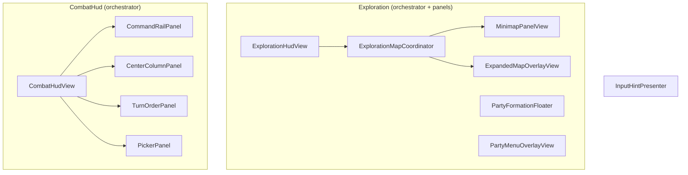

---
tags:
  - path/docs/04-dev
  - type/dev
  - scope/later
  - status/proposed
  - domain/ui
---
# Layered UITK panels (dev / integrator)

**Draft:** Draft — pairs with [ADR 037](../../decisions/037-layered-uitk-panels.md).
**Tracking:** Map POC shipped ([#244](https://github.com/miramocha/griddungeon-game/pull/244)); remaining Tier 1 splits optional — [ADR 037](../../decisions/037-layered-uitk-panels.md).

## Goal

Make HUD feel **more 3-dimensional** by splitting monolithic `UIDocument` trees into **smaller panel components**, each with its own `UIDocument` + `sortingOrder`, plus USS depth (translate / tilt / shadow). **Not** a gameplay or Core refactor.

## What already exists

See [centralized UI services](centralized-ui-services.md) for the full cross-phase overlay catalog and `sortingOrder` table.

| Pattern | Example |
|---------|---------|
| Multi-document bootstrap | `PartyMenuOverlay`, `StoryHud`, `InputHintPresenter`, `ScreenFadePresenter` |
| Sort stack | `sortingOrder` 0 → 20 → 150 → 250 → 300 → 10000 |
| Shared `PanelSettings` | `Assets/UI/Settings/GamePanelSettings.asset` |
| USS depth on screen | `CommandPanel.uss` rail poke (`translate -28px` → `0`) |
| Runtime swap boundary | [ui-event-contract](ui-event-contract.md) — controllers do not call UI |

## What to split

### Exploration (orchestrator `ExplorationHud` GO — no phase HUD UXML)

| Panel | Current owner | Notes |
|-------|---------------|-------|
| Map | `ExplorationMapCoordinator` + `MinimapPanelView` / `ExpandedMapOverlayView` — own `UIDocument` each ([#244](https://github.com/miramocha/griddungeon-game/pull/244)) | **Shipped** — no `BindToHud` mount |
| Party strip | `PartyFormationFloaterPresenter` (already own doc, sort **10**) | Optional: merge into exploration orchestrator only |
| Pause / party menu | `PartyMenuOverlayView` (already own doc, sort **250**) | Optional: split formation pane only |

`ExplorationHudView` keeps: phase bind, `ExplorationPresentationGate`, reactive presenter wiring.

### Combat (today: one `CombatHud` GO)

| Panel | Current UXML region | Notes |
|-------|---------------------|-------|
| Command rail | `combat-hud__command-rail` | Already has USS slide depth |
| Center column | `combat-hud__center` | Rosters + synchro + log preview |
| Turn order | `turn-order-strip` | Right rail |
| Pickers | cloned into combat root | Consider own doc at sort 40+ |
| Battle reward | `BattleRewardScreenView` on same GO | Already separate component — candidate for own doc |

## Suggested scene graph (Tier 1)

## Tier 2 (optional) — world-space panel

Unity UITK: duplicate `PanelSettings` → **World Space** → parent `UIDocument` transform to camera or arena anchor.

| Candidate | Parent | Why |
|-----------|--------|-----|
| Navigator corner | FPV / battle camera child | [navigator § 3D presence](../02-systems/navigator.md#consider--explore--navigator-3d-presence) |
| Command rail | Combat camera offset | Tilt toward arena without moving rules |

Requires per-panel `PanelSettings`, pixels-per-unit tuning, and explicit focus owner — **defer until Tier 1 stable**.

## Focus orchestration (sketch)

UITK focus is **per panel**. Handlers must know active panel:

1. `InputRouter` delegates to phase handler as today.
2. Handler asks **focus owner** (new small type or static on orchestrator): `MapPanel` vs `PauseOverlay` vs `CombatCommandRail`.
3. Modal open → owner = modal panel; close → restore previous.
4. Edit Mode smoke: only one panel receives synthetic `MenuNavigate` per frame.

## Files likely touched (game repo)

| Area | Paths |
|------|-------|
| Bootstrap | `DevBootstrapSceneCreator.cs`, `DevSceneComposition.cs` |
| Exploration | `ExplorationHudView.cs`, `ExplorationMapCoordinator.cs`, `MinimapPanelView.cs`, `ExpandedMapOverlayView.cs`, `PartyMenuOverlayView.cs` |
| Combat | `CombatHudView.cs`, `CombatHud.uxml` (split) |
| Input | `InputRouter.cs`, `*InputHandler.cs` |
| Tests | `Assets/Tests/UI/` — panel sort, focus owner, map fullscreen sort |

## Test plan (when implementing)

### Automated
- [x] Edit Mode → `Tests → UI` — `ExplorationMapCoordinatorTests`, `MinimapPanelPresenterTests`, `ExpandedMapOverlayPresenterTests` ([#244](https://github.com/miramocha/griddungeon-game/pull/244))
- [ ] Focus owner — modal supersedes underlying panel

### Manual (Play Mode)
- **Scene:** `DevBootstrap.unity` — F2 exploration, F3 combat
- **Steps:** expanded map `M`; pause `Esc`; combat command rail focus `W/S`; open skill picker — confirm depth + input on each layer
- **Expected:** panels stack correctly; no duplicate input; hints strip still bottom-right

## Out of scope

- `GridDungeon.Core` rule changes
- In-world combat on exploration grid ([ADR 013](../../decisions/013-combat-scene-rendering.md))
- Replacing global `InputHintPresenter` with per-panel hint copy
