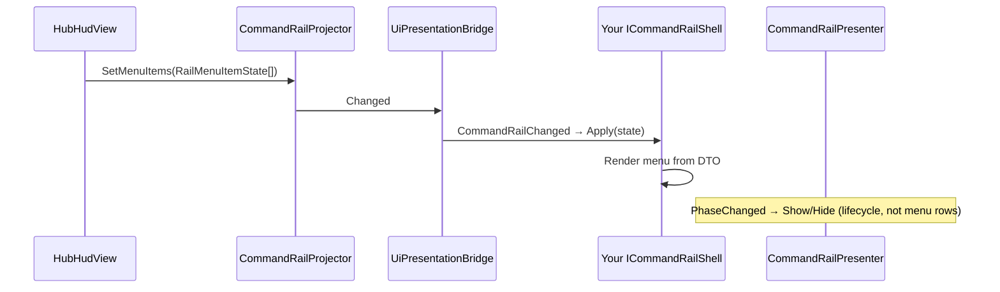

# Implementing a presentation shell

How to add a **new UI shell** on the [presentation bus](centralized-ui-services.md#presentation-bus) — swap art/layout or host world-space chrome without forking projectors or phase HUDs.

**Authority:** [ADR 042 — Runtime presentation bus + shell catalog](../../decisions/042-presentation-bus.md)  
**Related:** [ui-event-contract § Presentation bus](ui-event-contract.md#presentation-bus), [UVS presentation hooks](../02-systems/uvs-phase-presentation.md#ui-presentation-hooks), [layered UITK panels](layered-uitk-panels.md)

---

## What a shell is (and is not)

| Piece | Assembly | Owns |
|-------|----------|------|
| **Projector** | `GridDungeon.Runtime.Presentation` | Reads gameplay; builds **DTO snapshots**; publishes on bus |
| **`UiPresentationBridge`** | Runtime (`Game` bootstrap) | Forwards DTOs to C# + `UnityEvent` (UVS) |
| **Shell** | `GridDungeon.UI` on a **prefab** | `Apply(dto)` + `PlayBeat(beat)` — **display only** |
| **Phase HUD** | `GridDungeon.UI` | Publishes menu rows to projector; focus, confirm, service logic |

A shell is **not** enough by itself. You also need:

- A **projector** (or an existing one) publishing the right DTO
- A **phase view** (e.g. `HubHudView`) calling `SetMenuItems` / equivalent when content changes
- A **catalog row** (or scene-placed shell) so `PresentationShellHost` can resolve the prefab

**Do not** put save writes, phase transitions, or combat rules inside `Apply` or `PlayBeat`.

---

## When to add a shell vs something else

| Goal | Use |
|------|-----|
| New **look** for command rail (screen UITK, world rig, A/B art) | New shell prefab + catalog row — **same** `CommandRailPresentationState` |
| New **menu content** or hub service flow | Extend **projector** + **phase HUD** (e.g. `HubHudView`) — shell unchanged |
| New **cross-phase modal** (picker, bag, confirm) | [Centralized UI services](centralized-ui-services.md) — presentation bus is for **shell-swappable chrome**, not modal lifecycle |
| Combat roster on bus (party + enemy plates) | `CombatRosterScreenShell` + `CombatRosterPresentationProjector` — see [presentation shell gotchas](presentation-shell-gotchas.md) |
| UVS fade / Animator on rail change | Listen on `UiPresentationBridge` — **no** shell required |

---

## Reference implementations (game repo)

| Shell | Interface | Prefab path (bootstrap `Ensure*`) |
|-------|-----------|-----------------------------------|
| Screen command rail | `ICommandRailShell` | `Assets/UI/Prefabs/Presentation/CommandRailScreenShell.prefab` |
| World rig spike (P2) | `ICommandRailShell` | `Assets/UI/Prefabs/Presentation/CommandRailWorldRigShell.prefab` |
| Rail info copy | `ICommandRailInfoShell` | Scene `CommandRailInfo` GO + `CommandRailInfoScreenShell` |

**Read first:**

- `Assets/Scripts/UI/Views/CommandRailScreenShell.cs` — subscribe, `Apply`, render menu from DTO
- `Assets/Scripts/UI/Views/CommandRailPresenter.cs` — rail **lifecycle** (show/hide, context, panel swap)
- `Assets/Scripts/UI/Views/HubHudView.cs` — `BuildRootMenu` → `CommandRailProjector.SetMenuItems`
- `Assets/Scripts/Runtime/Presentation/CommandRailPresentationProjector.cs` — DTO builder
- `Assets/Scripts/Runtime/Presentation/PresentationShellHost.cs` — catalog resolve + instantiate
- `Assets/Scripts/Editor/DevSceneComposition.cs` — `EnsureUiPresentationCatalog`, `EnsureCommandRailScreenShellPrefab`

---

## Recipe A — New command-rail shell (same data, new visuals)

Use when hub/combat menu **structure** is unchanged but you want different UITK, layout, or a world-space rig.

### 1. Implement the Runtime contract

Shell lives in **`GridDungeon.UI`**. Interface is in **`GridDungeon.Runtime.Presentation`**:

```csharp
// GridDungeon.UI — illustrative
public sealed class MyCommandRailShell : MonoBehaviour, ICommandRailShell
{
    void OnEnable()
    {
        UiPresentationBridge? bridge = UiPresentationBridge.Instance;
        if (bridge == null) return;
        bridge.CommandRailChanged += Apply;
        Apply(bridge.CurrentCommandRail); // catch-up if bus already published
    }

    void OnDisable()
    {
        if (UiPresentationBridge.Instance != null)
            UiPresentationBridge.Instance.CommandRailChanged -= Apply;
    }

    public void Apply(CommandRailPresentationState state)
    {
        // Render from state only — menu rows: state.ReadMenuItems
        // Context / visibility: state.Context, state.Visible, state.HubLeaveTransition
    }

    public void PlayBeat(PresentationBeat beat)
    {
        // Optional one-shots: focus changed, modal open, enter/exit (mesh/Animator)
    }
}
```

**Screen-space UITK:** copy `CommandRailScreenShell` prefab hierarchy:

- `UIDocument` + shared `GamePanelSettings`
- `CommandRailPresenter` (lifecycle + `ICentralizedUiSurface`)
- Your shell component implementing `ICommandRailShell`

**World-space:** see `CommandRailWorldRigShell` — optional world `PanelSettings`, mesh/Animator children; same `Apply` / `PlayBeat`.

### 2. Shell rules (locked)

| Do in shell | Do not in shell |
|-------------|-----------------|
| Subscribe to `UiPresentationBridge.CommandRailChanged` | Subscribe to `GameState.PhaseChanged` for rules |
| Map `RailMenuItemState` → buttons/labels/mesh | Call `HubController`, `CombatController`, save APIs |
| Toggle BEM / USS from DTO flags | Call `CommandRail.SwapPanelContent` or write `PanelHost` from phase HUDs |
| `PlayBeat` for VFX / Animator triggers | `RequestTransition`, input map changes |

**Lazy-init** presenter refs in `Apply` — `PresentationShellHost` may call `Apply` before your `Awake` (see `CommandRailInfoScreenShell.EnsurePresenter`).

**Menu cache:** if you skip rebuild when DTO signature is unchanged, also rebuild when the panel is **empty** (return from Exploration) — see `CommandRailScreenShell.ApplyMenuItems`.

### 3. Create the prefab

1. Duplicate `CommandRailScreenShell.prefab` (or build from scratch with the components above).
2. Assign `CommandRail.uxml` / `CommandRail.uss` on `CommandRailPresenter` (screen default).
3. Save under `Assets/UI/Prefabs/Presentation/`.

Optional Editor helper: extend `DevSceneComposition.EnsureCommandRailScreenShellPrefab` pattern for your prefab path.

### 4. Register on `UiPresentationCatalog`

Asset: `Assets/UI/Settings/UiPresentationCatalog.asset` (created by **GridDungeon → Scenes → Create Dev Bootstrap**).

Each row (`PresentationShellDefinition`):

| Field | Example |
|-------|---------|
| `Surface` | `CommandRail` |
| `ShellPrefab` | Your prefab |
| `IsDefault` | `true` for the shipped screen fallback |
| `ProfileId` | `""` or `screen_default` / `world_combat` |
| `UsePhaseFilter` + `Phase` | Optional — e.g. Combat-only world rig |
| `UseRailContextFilter` + `RailContext` | Optional — Hub vs Combat chrome |
| `AnchorKind` | `SceneRoot`, `MainCameraChild`, `BattleCameraChild` |

**First match wins**; default row (`IsDefault`) is fallback when no filter matches. See `UiPresentationCatalogResolve` tests.

To **swap** shells: change prefab on the row or add a row with a narrower filter — no projector/HUD code change.

### 5. Bootstrap wiring

Re-run **GridDungeon → Scenes → Create Dev Bootstrap** if `Game` is missing:

- `UiPresentationBridge`
- `PresentationShellHost` (catalog + bridge + `GameState` refs)
- `PresentationAnchors` under Main Camera (world parenting)

Shells **spawn at Play Mode** from catalog. Scene-placed `CommandRail` + `CommandRailScreenShell` is still supported — host prefers an existing `ICommandRailShell` in the scene before instantiating.

### 6. Input and focus

Shells render **display state** only. **Focus and confirm** stay on the phase HUD:

- `HubHudView` binds `Button` refs after menu exists (`BindButtonsFromHost`) and uses `RailMenuPresenter` focus
- Clicks can route via `CommandRailScreenShell.ItemInvoked` + item `Id` if you adopt bus-first wiring

Do not duplicate `InputHints` or global bind footers on the shell.

### 7. Verify

**Edit Mode**

- `Tests → UI → UiPresentationCatalogResolveTests`
- `Tests → UI → CommandRailPresentationProjectorTests`
- `Tests → UI → CommandRailPresenterTests`

**Play Mode**

1. F1 Hub — root menu on rail  
2. F7 Exploration — rail hidden  
3. F1 Hub — menu restored  
4. (Optional) UVS graph on `OnCommandRailChanged` — [UVS samples README](https://github.com/miramocha/griddungeon-game/blob/main/Assets/UVS/Samples/README.md)

---

## Recipe B — New surface (e.g. second chrome block)

Not required for command-rail art swaps. Use when adding a **new bus surface** (follow-on services).

1. **Runtime**
   - DTO + `PresentationSurfaceKind` value
   - `IYourShell` with `Apply(YourState)`, `PlayBeat`
   - Projector reading existing gameplay events
   - Bridge event + optional `UnityEvent`
2. **UI** — shell prefab implementing `IYourShell`
3. **Catalog** — row with new `Surface`
4. **`PresentationShellHost`** — extend resolve/spawn for that surface (today: `CommandRail`, `CommandRailInfo`)
5. **Docs** — [ui-event-contract](ui-event-contract.md), this file

Command rail pilot is the template; do not grow `ICommandRailShell` for unrelated UI.

---

## Recipe C — Listen-only (UVS / Timeline, no UITK shell)

1. Add **Script Graph** on `Game` (or rig).
2. Node library: include **`GridDungeon.Runtime`**.
3. `GetComponent` → `UiPresentationBridge` → listener on `OnCommandRailChanged` / `OnCommandRailFocusBeat`.
4. **Listen only** — see [UVS boundaries](../02-systems/uvs-phase-presentation.md#uvs-boundaries-listen-only).

---

## Call flow (hub menu)



---

## Checklist

- [ ] `ICommandRailShell` (or new surface interface) on prefab root or child with `GetComponent` resolve
- [ ] Subscribe in `OnEnable`, unsubscribe in `OnDisable`, catch-up `Apply(bridge.CurrentCommandRail)`
- [ ] No gameplay authority in `Apply` / `PlayBeat`
- [ ] Catalog row + default/filters documented in Inspector
- [ ] Dev Bootstrap run; Play Mode F1 hub rail visible
- [ ] Hub → Exploration → Hub menu restore
- [ ] Edit Mode tests green for catalog resolve / projector if you touched Runtime

---

## Anti-patterns

| Smell | Fix |
|-------|-----|
| Phase HUD calls `Q("command-rail-panel")` | Publish DTO; shell renders |
| Shell implements hub shop buy/sell | Logic in `HubHudView` + Core rules |
| String type name on catalog SO | **Prefab** on `PresentationShellDefinition` |
| Second parallel menu path (Populate + bus) | One path: `SetMenuItems` → shell `Apply` |
| UVS graph calls `SwapPanelContent` | Listen on bridge; C# owns transitions |

**Implementation traps:** [presentation shell gotchas](presentation-shell-gotchas.md) — stale bus snapshots, wire lifecycle, scene shell vs catalog prefab.

---

## Changelog

| Date | Note |
|------|------|
| 2026-06-18 | Link presentation shell gotchas; combat roster surface shipped (#314) |
| 2026-06-18 | Initial guide — command rail pilot, catalog, bootstrap |
