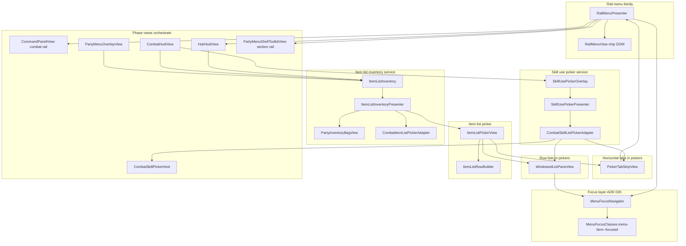
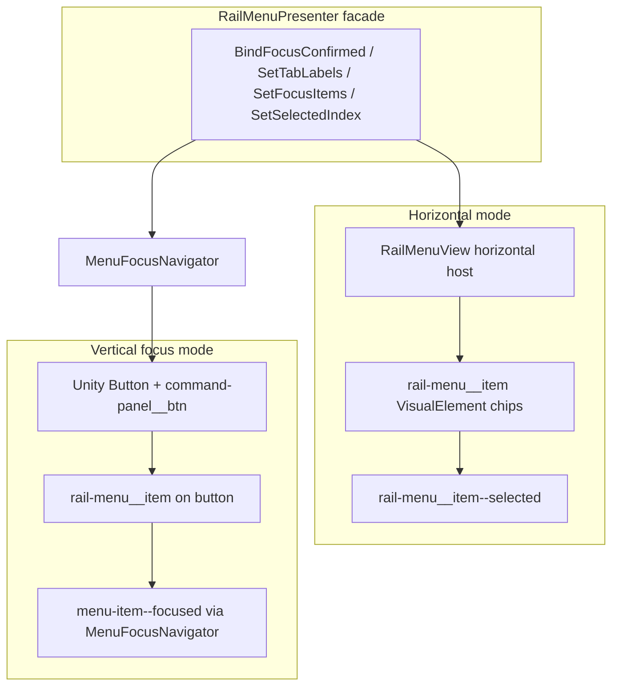
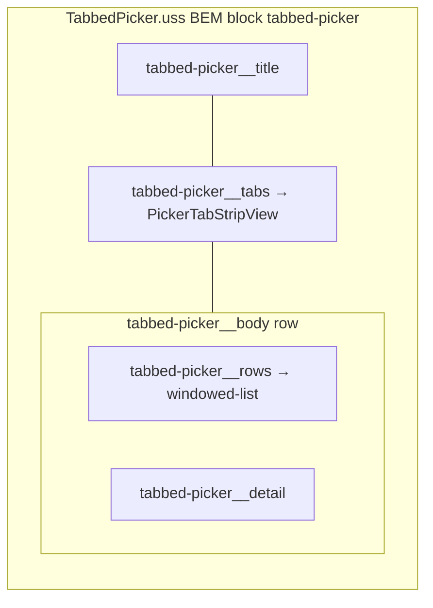
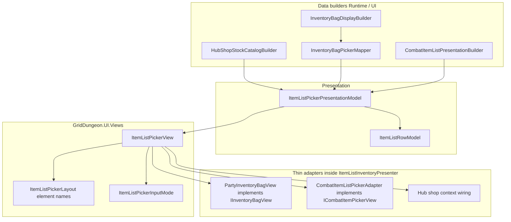
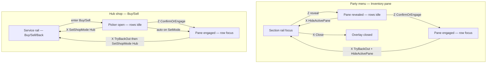
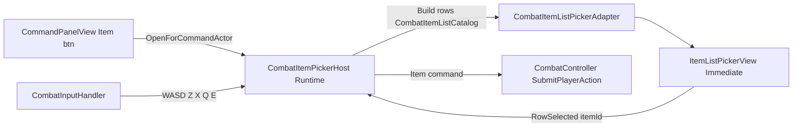
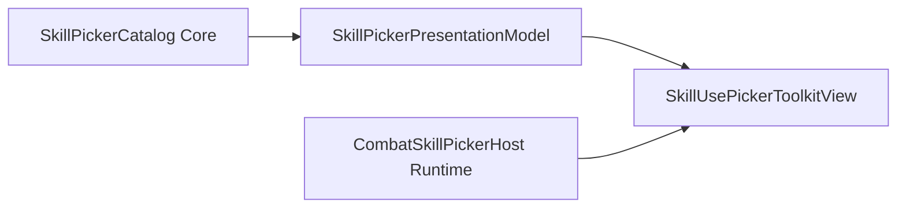

# Shared menu & picker UI (UITK)

How **rail menus**, **item list pickers**, and **skill use pickers** share UITK building blocks in [griddungeon-game](https://github.com/miramocha/griddungeon-game). Use this when skinning hub/combat/party chrome, adding a new tabbed modal, or deciding whether to extend an existing view vs fork.

**Related:** [ADR 026 — Combat menu focus navigation](../../decisions/026-combat-menu-focus-navigation.md) (`MenuFocusNavigator`, `menu-item--focused`), [ADR 035 — Skill use picker](../../decisions/035-skill-use-picker.md), [ADR 036 — Party inventory model](../../decisions/036-party-inventory-model.md), [custom skill picker UI](custom-skill-picker-ui.md), [UI event contract](ui-event-contract.md).

**Shipped ([#185](https://github.com/miramocha/griddungeon-game/issues/185)):** `WindowedListPaneView` (8-row windowing + `IListFocusNavigator`), unified `ItemListPickerView` / `RailMenuPresenter` across hub shop, party bag, and combat item picker; tabbed overlays use a **transparent** full-screen host (no modal dim).

**Implementation root:** `Assets/Scripts/UI/Views/` · `Assets/UI/Navigation/` · `Assets/UI/Screens/Shared/` · feature UXML under `Assets/UI/Screens/{Combat,Hub}/`.

---

## Overview — three families, one focus stack

Grid Dungeon does **not** use one mega-widget for every menu. MVP1 has three **families** that **compose** shared primitives:

| Family | Primary types | Orientation | Typical use |
|--------|---------------|-------------|-------------|
| **Rail menu** | `RailMenuPresenter` → `RailMenuView` or `MenuFocusNavigator` | Vertical **or** horizontal | Command bar, hub services, party section rail, **category tab chips** |
| **Item list picker** | `ItemListPickerView` (+ thin adapters) | Horizontal tabs + windowed rows | Hub shop buy/sell, party bag, combat **Item** command |
| **Skill use picker** | `SkillUsePickerPresenter` + `CombatSkillListPickerAdapter` | Horizontal tabs + windowed rows | Combat **Skill** command (ADR 035) |

All keyboard lists share **`MenuFocusNavigator`** ([ADR 026](../../decisions/026-combat-menu-focus-navigation.md)) and, for long lists, **`WindowedListPaneView`** (8 visible rows + scroll bars).



---

## Focus navigation contract (`IListFocusNavigator`)

**Job:** One keyboard contract for **linear row lists** — command bar slots, picker rows, windowed panes, equipment slots.

| Type | Implements | Notes |
|------|------------|-------|
| `MenuFocusNavigator` | `IListFocusNavigator` | Flat list; toggles `menu-item--focused` on bound targets ([ADR 026](../../decisions/026-combat-menu-focus-navigation.md)) |
| `WindowedListPaneView` | `IListFocusNavigator` | Owns inner `MenuFocusNavigator` on the **visible slice**; `FocusIndex` is **global** across the full list |
| `ItemListPickerView.RowNavigator` | → `WindowedListPaneView` | Hosts route WASD / confirm / cancel here when the pane is engaged |

**API surface:** `SetFocus`, `MoveNext` / `MovePrevious`, `Confirm`, `Cancel`, `ClearFocus`, `EngageFocus(preferredIndex)` — plus `HasFocus`, `FocusIndex`, and `Confirmed` / `Cancelled` / `FocusChanged` events.

**Engage vs immediate row focus** (`ItemListPickerInputMode`):

| Mode | Row focus when list opens | Typical hosts |
|------|---------------------------|---------------|
| **`Immediate`** | `WindowedListPaneView.SetItems(…, acquireFocus: true)` | Combat **Item** picker (`ItemListPickerView` default) |
| **`EngageOnConfirm`** | Rows render; focus stays on shell/rail until **Z** (`ConfirmOrEngage` → `EngagePane` / `EngageFocus`) | Hub shop + party bag via `ItemListInventory` (`PartyInventoryBagView` adapter) |

`EngageOnConfirm` also registers row **click** → `EngagePaneAt(index)` so mouse can engage without keyboard.

**Disengage:** `ItemListPickerView.TryBackOut()` → `DisengagePane()` → `ClearFocus` on the row pane, clears detail text, raises `EngagementChanged`. Hosts peel UI layers on **X** / Back (see [Cancel / back layering](#cancel--back-layering-engageonconfirm-hosts) below).

---

## Rail menu — chips and command buttons

**Job:** One visual language for **selectable chips** (tabs) and **stacked actions** (command rail).

### Layering



| Type | Factory | DOM | Selection vs focus |
|------|---------|-----|-------------------|
| **Horizontal chips** | `RailMenuPresenter.CreateHorizontal(host)` | `RailMenuView` builds `rail-menu__item` + `rail-menu__item-label` | **`--selected`** on active tab (Q/E or click) |
| **Vertical focus rail** | `RailMenuPresenter.CreateVerticalFocus()` | Existing UXML `Button`s; `ConfigureButton` adds `rail-menu__item` | **`menu-item--focused`** via `SetFocusItems`; optional **`--selected`** via `BindSelectionTargets` (party section) |

**Styles:** `Assets/UI/Screens/Shared/RailMenu.uss` (imported by `CommandPanel.uss` and `TabbedPicker.uss`). Unity `Button` rails need the combined selectors (e.g. `.rail-menu__item.unity-button.menu-item--focused`, `.rail-menu__item.unity-button.rail-menu__item--selected`).

### Vertical rail bookmark (focus poke)

Horizontal tab chips stay compact (`11px` / `26px` min-height). **Vertical** command rails use a fixed-width bookmark slide — not width animation.

| Token | Value | USS |
|-------|-------|-----|
| Rail column | `240px` | `.command-rail` |
| Item chip | `268px` | `.command-panel__btn` (poke = **28px**) |
| Unfocused | `translate: -28px 0` | Left edge off-screen; right edge flush with rail |
| Focused / `--selected` | `translate: 0` | Left at rail; right pokes into stage |
| Content inset | `padding-left: 28px` | Matches tuck — wrapped labels stay inside visible rail |

```
[ off-screen 28px ][ rail 240px ][ stage … ]
     unfocused ←──────────────┤
              focused ──────────────────┤→ poke
```

- **No `overflow: hidden`** on the rail — left tuck is clipped by the screen edge.
- **Combat pickers:** `.combat-hud > .tabbed-picker { left: 240px }` so the modal does not cover the rail bookmark.
- **Labels:** `RailMenuPresenter.ConfigureButton` migrates `Button.text` → child `rail-menu__item-label` so long names wrap with the chip (no fixed-width label hack).

### Consumers (vertical)

| Screen | Owner | UXML hook |
|--------|-------|-----------|
| Combat command bar | `CommandPanelView` | `CommandRail.PanelHost` — buttons built in code |
| Hub root menu | `HubHudView` / `HubRootMenuFocus` | `CommandRail.PanelHost` via `CommandRailPanelBuilder` |
| Hub service back/actions | `HubHudServicePanelView` | `CommandRail.PanelHost` (buttons); service copy via `CommandRailInfo` |
| Party section rail | `PartyMenuOverlayView` → `PartyMenuShellToolkitView` | `CommandRail.PanelHost` on Tab open |

### Consumers (horizontal)

| Screen | Owner | Notes |
|--------|-------|-------|
| Tab strips (all pickers) | `PickerTabStripView` | Thin wrapper over `CreateHorizontal` |
| Party equipment member select | `PartyEquipmentFloaterToolkitView` | Floater 2×4 grid focus → `PartyEquipmentCoordinator.SetActiveMemberListIndex` (no inline tabs) |

**Global command rail:** `CommandRail.uxml` (`command-rail-panel` — **buttons only**). Phase owners populate `CommandRail.PanelHost` through `CommandRailPanelBuilder` + `RailMenuPresenter.CreateVerticalFocus()`. **Non-button copy** (phase header title, service headings/lines, combat prompts) lives in the global `CommandRailInfoPresenter` (`CommandRailInfo.uxml`, `sortingOrder` 26) via `CommandRailInfo` facade; **Credits balance** on `WalletHudPresenter` (`WalletHud.uxml`, `sortingOrder` 27) — see [centralized UI services](centralized-ui-services.md). Canonical empty template for new rails: `RailMenuVertical.uxml`.

**Extend:** New vertical rail → populate `PanelHost` with `CommandRailPanelBuilder` + `RailMenuPresenter.CreateVerticalFocus()`, bind `MenuFocusNavigator` in your input handler. New horizontal strip → empty host with class `tabbed-picker__tabs` (or `rail-menu rail-menu--horizontal`) and `PickerTabStripView`.

### Modal rail sibling disable (`CommandPanelModalSupport`)

**Job:** `CommandRail.PanelHost` is **one shared DOM** across hub, combat, and party menu. When a modal child owns input, non-owner chips on that rail are `SetEnabled(false)` so W/S does not steal focus from the active picker or engaged pane. The **owner** chip keeps `rail-menu__item--selected` and full opacity (`CommandPanel.uss` + `RailMenu.uss` suppress `:disabled` hover on siblings).

| Helper | Role |
|--------|------|
| `SetModalOpen(host, open)` | Toggles `command-panel--modal-open` on the host |
| `SetEnabledForModal(button, baseEnabled, modalOpen, isActiveOwner)` | Per-chip enable while modal open |
| `ResetPanelChrome(host)` | Clears `command-panel--modal-open`, `command-panel--disabled`, `command-panel--protocol-only` — **required** when combat ends or a non-combat owner repopulates the host |

| Consumer | Modal-open when | Active owner |
|----------|-----------------|--------------|
| `CommandPanelView` | Skill/item picker, target select, combat log | Command slot that opened the modal (`CombatController.PendingTargetCommand` for targeting) |
| `HubHudView` | Hub shop buy/sell picker open | Buy or Sell service chip (`ItemListInventory.HubMode` + `HubShopServiceFocus`) |
| `PartyMenuOverlayView` | Section pane **engaged** (not merely revealed) | Active section chip (`PartyMenuSectionRailFocusRules`) |

**Party section modal** — siblings disable only when:

| Section | Engaged signal |
|---------|----------------|
| Inventory | Bag picker open (`inventoryBagOpen`) |
| Equipment | Worn slots engaged on `CharacterDetail` (`equipmentSlotsEngaged`) — floater member focus alone does **not** modal the section rail |
| Formation | Swap mode engaged (`formationPaneEngaged`) |
| Quit | Quit pane has menu focus (`quitPaneFocused`) |

`HideActivePane` / section change → `ResetPaneEngagement()` (clears equipment floater `party-formation-grid__cell--focused`) → `SyncSectionRailFocus()`.

**Hub shop row navigation:** `HubShopServiceFocus.ShouldBlockServiceRailNavigation(pickerOpen, paneEngaged)` — service-rail W/S blocked only when the picker is open **and** rows are **not** engaged. When engaged, `HubHudView.ActiveNavigator()` routes W/S to `ItemListInventory.HubRowNavigator`.

Service overview: [centralized UI services § Global command rail](centralized-ui-services.md#global-command-rail--commandrailpresenter--commandpanelmodalsupport).

---

## Global input hints

**Status:** Shipped — single bottom-right strip for **input bind copy only** (keys + actions). Replaces per-panel bind footers on command rail, hub, party menu, tabbed pickers, exploration minimap, and victory overlay.

**Architecture:** Part of the [centralized UI services](centralized-ui-services.md) pattern (`InputHintPresenter` + `InputHints` facade, `sortingOrder` 300).

### Policy — input binds only

The global strip answers: *what can I press right now?* It does **not** carry map legend (`north up`), party coordinates, facing, HP, quest text, or warnings.

| Belongs on `InputHintPresenter` | Keep elsewhere (HUD label, modal body, `hud-overlay__hint`) |
|--------------------------------|---------------------------------------------------------------|
| `Z Confirm · X Cancel` | Inn-save quit warning on pause confirm panel |
| `M Fullscreen · Esc Pause` | Floor title on map chrome |
| `Z Pick · X Back · Q/E Member · W/S Slots` | Tutorial story lines; focused slot names (`· Weapon`) — use pane focus highlight |

**Do not** duplicate bind lines on `hud-overlay__hint`, picker footers, or map chrome — publish once via `InputHints`.

| Piece | Role |
|-------|------|
| `InputHintPresenter` | `MonoBehaviour` on `InputHint` child; `UIDocument` + `InputHint.uxml` / `InputHint.uss`; **`sortingOrder` 300** |
| `InputHints` | `Publish(gameState, text)` / `Clear(gameState)` — static facade to `GameState.InputHint` |
| `TabbedPickerRailHints` | Shared bind-copy strings for hub, combat, exploration, and party pickers |

**Publishers:** `HubHudView.RefreshInputHint` / `RestoreInputHint`, `CombatHudView.RefreshInputHint` / `RestoreInputHint`, `PartyMenuOverlayView.RefreshMenuHint` (hub shell, exploration pause shell, engage, row/slot picker states; quit confirm clears strip), `MapView.RefreshGlobalInputHint`, `StoryEventView`, `BattleRewardScreenView` (victory dismiss), `FloorTransitionPresenter` (clear on transition start; `MapView` / `HubHudView` republish on `PresentationReleased`), `InputRouter` (restore phase hint on story end).

**Removed UXML bind footers:** `cmd-input-hint`, `hub-input-hint`, `party-menu-hint`, `tabbed-picker__hint`, `item-list-picker-hint`, `skill-picker-hint`, `party-equipment-detail` bind footer, `map-view-hint`, `battle-reward-hint`, `exploration-pause-hint`, `story-event-hint`.

### `TabbedPickerRailHints` copy

**Segment order (locked):** Z/X → W/S and Q/E → other keys (L, Esc, M, Click, …).

| Constant / helper | Copy |
|-------------------|------|
| `HubRoot` | Z Confirm · X Cancel · W/S Menu |
| `HubService` | Z Confirm · X Back · W/S Action |
| `CombatIdle` | Z Confirm · X Cancel · L Log · Esc Pause |
| `CombatCommand` | Z Confirm · X Cancel · W/S Command · L Log · Esc Pause |
| `CombatTarget` | Z Confirm · X Cancel · W/S Target · L Log |
| `LogModal` | X Close · L Close |
| `BattleReward` / `ModalDismiss` | Z Continue · Click Close |
| `ExplorationPauseMenuShell` | Z Open · X Close · W/S Section · Esc Close |
| `ExplorationMapPanel` | M Fullscreen · Esc Pause |
| `ExplorationMapFullscreen` | M or Esc Exit Fullscreen |
| `PartyMenuShell` | Z Open · X Close · W/S Section |
| `PartyQuitConfirm` | Z Confirm · X Back · W/S Row |
| `PartyInventoryEngage` | Z Engage · X Back · Q/E Tab |
| `PartyEquipmentEngage` | Z Engage · X Back · Q/E Member |
| `PartyEquipmentSlots` | Z Pick · X Back · Q/E Member · W/S Slots |
| `PartyFormationSwap` | Z Pick · X Cancel · Q/E Column · W/S Row — default when Formation pane is open (auto-engage on reveal) |
| `PartyFormationEngage` | Z Engage · X Back · Q/E Column · W/S Row — after **X** backs out of swap mode while pane stays open |
| `ForItemPickerEngage(backVerb)` | Z Confirm · X {backVerb} |
| `ForItemPickerRows(multiTab, backVerb)` | Z Confirm · X {backVerb} · Q/E Tab · W/S Row — or Z Confirm · X {backVerb} · W/S Row when single tab |

Party equipment (slots engaged): `Z Pick · X Back · Q/E Member · W/S Slots` — focused worn slot shown on the pane (`menu-item--focused`), not on the global strip.

---

## Tabbed picker shell — shared modal chrome

**Job:** Title, optional tabs, **side-by-side** list + detail (`tabbed-picker__body` row), windowed list region — **not** row content. Bind copy lives on **global** `InputHintPresenter`, not modal footers.



| Asset | Role |
|-------|------|
| `TabbedPicker.uss` | Panel layout; **transparent** full-screen host (`tabbed-picker { background-color: rgba(0,0,0,0) }` — **no modal dim**); imports `RailMenu.uss` |
| `WindowedList.uss` | `windowed-list`, `windowed-list__slots`, scroll bars |
| `TabbedPickerShellClasses` | BEM constants (`Hidden`, `TabsHidden`, …) |
| `PartyMenu.uss` | **Opaque** full-screen party shell (`rgb(20, 22, 26)`); imports `CommandPanel.uss`. **`party-menu__dialog`** hosts quit confirm only — bag and character detail modals live on centralized services ([centralized UI services](centralized-ui-services.md)) |

**Overlay contrast:**

| Host | Root chrome | List panel |
|------|-------------|------------|
| Hub shop / combat pickers | `tabbed-picker` — transparent; stage/rail stay visible | `tabbed-picker__panel` — dim panel (`rgba(30, 34, 40, 0.97)`) |
| Party menu shell | `party-menu` — opaque full-screen | `party-menu__dialog` — quit confirm only |
| Party bag (menu Inventory) | `ItemListInventory` modal — transparent (sort **251**) | `tabbed-picker__panel` |

**Rail inset (240px):** centralized item modals use `tabbed-picker--rail-offset` on [`ItemListInventoryOverlay.uss`](https://github.com/miramocha/griddungeon-game/blob/main/Assets/UI/Screens/Shared/ItemListInventoryOverlay.uss) (see [centralized UI services](centralized-ui-services.md#item-list-inventory--itemlistinventorypresenter--itemlistinventory)). Legacy embedded clones used `.combat-hud > .tabbed-picker { left: 240px }` (`CombatHud.uss`) — remove when phase HUDs migrate off local picker trees.

**Panel layout:** `tabbed-picker__panel` and `party-menu__dialog` **shrink-wrap** content (`flex-grow: 0` — no fixed viewport-% height). **`tabbed-picker__body`** — horizontal row: windowed list (`flex-grow: 1`) + fixed-width detail column (`168px`). Fixed body height (`288px`) fits eight windowed rows + scroll chrome.

**UXML patterns:**

- **Full-screen overlay (shipped):** `tabbed-picker` root + `tabbed-picker__panel` — hub shop, combat item, **party bag** via `ItemListInventory` service; combat skill via `SkillUsePickerPresenter`.

---

## Item list inventory service

**Job:** One [`ItemListInventoryPresenter`](centralized-ui-services.md#item-list-inventory--itemlistinventorypresenter--itemlistinventory) + `ItemListInventory` facade — three contexts, one `ItemListPickerView` host, **standalone** `UIDocument` (never embedded in hub / combat / party menu UXML).

| Context | `sortingOrder` | Facade | Input mode |
|---------|----------------|--------|------------|
| Hub shop buy/sell | 200 | `SetHubShopMode` / `HideHubShop` | `EngageOnConfirm` |
| Combat item | 200 | `CombatItemInput` | `Immediate` |
| Party bag | 251 | `OpenBag` / `CloseBag` / `RefreshBag` | `EngageOnConfirm` |

**Chrome:** full-screen transparent overlay + centered panel + `tabbed-picker--rail-offset` (`left: 240px`). Party bag draws on `ItemListInventory` (sort **251**) above the party menu shell (250).

**Do not ship:** embedded bag clones in `PartyMenu`, `DockBag` / `worldBound` geometry sync, or hub/combat `CloneTree(ItemListPicker.uxml)` on phase HUD roots.

Agent rule: [`centralized-ui-services.mdc`](../../.cursor/rules/centralized-ui-services.mdc).

---

## Item list picker — one view, multiple hosts

**Job:** Render **`ItemListPickerPresentationModel`** — tabs of **`ItemListRowModel`** rows. Catalog/build logic stays in Core/Runtime; view only builds DOM and fires selection.



**Host:** all three consumers call `ItemListInventory` facade — not local `HubShopPickerPresenter` or embedded bag clones in phase HUDs.

### `ItemListPickerView` responsibilities

| Concern | Owner |
|---------|--------|
| Tab labels / selection | `PickerTabStripView` → `RailMenuPresenter` horizontal |
| Row window + focus | `WindowedListPaneView` |
| Row DOM | `ItemListRowBuilder` + `ItemListRow.uss` |
| Detail panel | `item-list-picker-detail` label text from `ItemListRowModel.Detail` |
| Confirm / cancel | `RowSelected` / `Cancelled` events |

### Layout profiles (`ItemListPickerLayout`)

Same C# view, different UXML **name hooks** and hidden class. Bind copy: global `InputHintPresenter` (`HubHudView`, `CombatHudView`, `PartyMenuOverlayView`) — not per-picker footer labels.

| Profile | `HiddenClass` | Used by |
|---------|---------------|---------|
| `ShopOverlay` (default) | `tabbed-picker--hidden` | `ItemListInventoryOverlay.uxml`, `ItemListPicker.uxml` |
| `CombatOverlay` | `tabbed-picker--hidden` | Same host names; combat item context |

Required element names (party profile uses the same ids):

- `item-list-picker-title`, `item-list-picker-tabs`, `item-list-picker-rows`, `item-list-picker-detail`

### Input modes (`ItemListPickerInputMode`)

| Mode | When | Row focus |
|------|------|-----------|
| **`Immediate`** | Combat **Item** picker | Acquired when `Show` rebuilds rows (`acquireFocus: true`) |
| **`EngageOnConfirm`** | Hub shop buy/sell, party bag modal | Rows visible; **Z** (`ConfirmOrEngage`) calls `EngagePane` / `EngageFocus`; shell or service rail owns focus until then |

**Hub shop:** `ItemListInventoryPresenter` hub context wires `EngageOnConfirm` and calls `EnsureInitialRowFocus` when entering Buy/Sell so rows **auto-engage** on open. While the picker is open but **not** pane-engaged, hub **service-rail** W/S is blocked (`HubShopServiceFocus.ShouldBlockServiceRailNavigation`); **Buy/Sell** chips stay **`--selected`** via `SyncShopActionSelectedIndex`. When rows **are** engaged, `HubHudView.ActiveNavigator()` routes W/S to `ItemListInventory.HubRowNavigator` (selection chips still reflect Buy vs Sell).

**Party bag:** **`PartyInventoryBagView`** inside `ItemListInventoryPresenter` — implements `IInventoryBagView` + `IInventoryBagKeyboardView`, delegates to shared `ItemListPickerView` with `EngageOnConfirm`. First **Z** on Inventory may **reveal** the section (`PartyMenuOverlayView` → `OpenBag`); second **Z** engages rows. Bag UI is the service modal (sort 251), not an embedded pane in `PartyMenu.uxml`.

### Cancel / back layering (`EngageOnConfirm` hosts)

Intended **two-step** peel — disengage row focus before closing the pane or exiting the screen:



| Host | X / Back when rows **engaged** | X / Back when pane open, rows **idle** | X when pane hidden |
|------|-------------------------------|----------------------------------------|-------------------|
| **Party bag** | `TryBackOut` + `HideActivePane` → section rail | `HideActivePane` → section rail | Close entire party overlay |
| **Hub shop** | `TryBackOut` + `SetShopMode(Hub)` in one **X** → exit Buy/Sell | `SetShopMode(Hub)` → exit Buy/Sell | Close service panel (non-shop) |

Combat **Item** uses **`Immediate`** — **X** / Back closes the whole picker via `CombatPlayerCommandGate.TryBack` → `ICombatItemPickerHost.Cancel()` (no disengage step).

### Combat item picker — host integration

Combat reuses `ItemListPicker.uxml` + **`Immediate`** `ItemListPickerView` (default constructor).



| Piece | Role |
|-------|------|
| `CombatItemListPickerAdapter` | UITK view port — `Show`/`Hide`, row keyboard via `RowNavigator`; maps `RowSelected` → `itemId` |
| `CombatItemPickerHost` | Runtime orchestration — bag resolve, `CombatItemListCatalog`, `SubmitPlayerAction`, `OpenStateChanged` |
| `ItemListInventory` + `CombatItemPickerHost` | Centralized service document (`sortingOrder` 200); `CombatHudView` uses `ItemListInventory.CombatItemInput` — no `CloneTree` on combat HUD |
| `CombatHudView` | Wires `CombatItemPickerHost` + adapter; exposes `ICombatItemPickerInput` to `CombatInputHandler` / `CommandPanelView` |
| `CombatItemListPresentationBuilder` | `CombatItemListRow[]` → `ItemListPickerPresentationModel` (single tab, tabs hidden in UI) |

**Row styles:** Always import `ItemListRow.uss` on the host UXML (party pane historically missed this and fell back to dark default label text).

---

## Skill use picker — parallel tabbed shell

**Job:** Render **`SkillPickerPresentationModel`** from Core (`SkillPickerCatalog`). Implements **`ISkillUsePickerView`** — swappable port ([ADR 035](../../decisions/035-skill-use-picker.md), [custom skill picker UI](custom-skill-picker-ui.md)).



### What is shared with item list picker

| Shared | Skill-specific |
|--------|----------------|
| `PickerTabStripView` + `RailMenu.uss` tabs | `SkillPickerPresentationModel` / `SkillPickerRowModel` |
| `WindowedListPaneView` + `WindowedList.uss` | Row DOM: `skill-picker__row` in `SkillUsePicker.uss` |
| `TabbedPicker.uss` shell | `CreateRowElement` inline in view (name, cost, disabled reason) |
| `MenuFocusNavigator` on rows | `ISkillUsePickerView` / `ICombatSkillPickerKeyboardView` ports |

**Not** using `ItemListPickerView` today — skill rows have a different column layout (MP cost, disabled reason) and a Runtime presentation type owned by ADR 035. A future refactor could introduce a generic `TabbedListPickerView<TRow>` or a row-builder delegate; MVP1 keeps **`SkillUsePickerToolkitView`** separate to avoid coupling item economy to combat skill catalog.

### UXML

`Assets/UI/Screens/Combat/SkillUsePicker.uxml` — same shell classes as shop picker; row host `skill-picker-rows` (class `windowed-list`).

---

## Windowed list pane (`WindowedListPaneView`)

**Job:** Fixed-height list region with **eight slot elements always allocated** (`DefaultVisibleRowCount = 8`). When `ItemCount > 8`, only a **window** of rows is mounted in slots; up/down scroll bars indicate off-window items; **global** `FocusIndex` is stable while the window slides.

Used by: `ItemListPickerView`, `SkillUsePickerToolkitView`, party equipment slot list, equipment sub-picker.

### Windowing model

| Concern | Behavior |
|---------|----------|
| Slot pool | Always **8** `windowed-list__slot` children under `windowed-list__slots` (empty slots stay in DOM) |
| Window start | `WindowStart` — first global index shown in slot 0 |
| Windowed mode | Root gets `windowed-list--windowed` when `ItemCount > visibleRowCount` |
| Focus slide | `MoveNext` / `MovePrevious` on global list; `EnsureWindowContainsFocus` repositions window before `SyncDom` |
| Short lists | `ItemCount ≤ 8` — all rows visible; scroll bars **hidden** (`windowed-list__scroll--hidden`), not collapsed |
| Row DOM | Row `VisualElement`s are **re-parented** into slot hosts on each sync (detach on clear) |

### Scroll bars

| Class | Meaning |
|-------|---------|
| `windowed-list__scroll--up` / `--down` | Bar chrome (always reserves space when not collapsed) |
| `windowed-list__scroll--hidden` | No more items above/below window — bar non-interactive |
| Click | `ScrollUp` / `ScrollDown` — shifts window by one row |

### Focus (`IListFocusNavigator`)

Inner `MenuFocusNavigator` runs on the **visible slice** only. `WindowedListPaneView` implements `IListFocusNavigator` and forwards `Confirm` / `Cancel` / `EngageFocus` / `ClearFocus`. `SetItems(…, acquireFocus: false)` supports `EngageOnConfirm` idle rows.

| Piece | Class / type |
|-------|----------------|
| Root | `windowed-list` |
| Slots column | `windowed-list__slots` → `windowed-list__slot` × 8 |
| Scroll hints | `windowed-list__scroll--up` / `--down` |
| Focus ring | `menu-item--focused` on row elements via inner navigator |

Inside party menu dialogs, `PartyMenu.uss` disables focus **scale** (`scale: 1 1`) so borders are not clipped by scroll/slot overflow.

---

## Consumer matrix

| Feature | Rail (vertical) | Tab strip | List view | Presentation builder | Runtime port |
|---------|-----------------|-----------|-----------|----------------------|--------------|
| Combat command bar | `CommandPanelView` | — | — | — | `CombatInputHandler` |
| Hub root / services | `HubHudView` | — | — | — | `HubInputHandler` |
| Hub shop buy/sell | — | `PickerTabStripView` | `ItemListPickerView` via `ItemListInventory` | `HubShopStockCatalogBuilder` | `ItemListInventory` facade + `HubHudView` |
| Party menu section | `PartyMenuShellToolkitView` | — | — | — | `PartyMenuInputHandler` |
| Party inventory | — | ✓ | `ItemListPickerView` via `ItemListInventory` → `PartyInventoryBagView` | `InventoryBagDisplayBuilder` → mapper | `ItemListInventory.BagKeyboardView` |
| Party equipment display | — | — | — | `CharacterDetailView` via `CharacterDetail` facade | `IPartyEquipmentKeyboardView` |
| Party equipment members (floater) | — | — | — | `PartyFormationFloater` grid focus | `PartyEquipmentFloaterToolkitView` |
| Combat Item | — | ✓ (single tab) | `ItemListPickerView` via `ItemListInventory` → adapter | `CombatItemListPresentationBuilder` | `ItemListInventory.CombatItemInput` |
| Combat Skill | — | ✓ | `SkillUsePickerToolkitView` | `SkillPickerCatalog` (Core) | `ICombatSkillPickerHost` |

---

## Extension guide

### New category-tabbed **item** modal

**Cross-phase or multi-HUD (hub / combat / party):** extend [`ItemListInventory`](centralized-ui-services.md#item-list-inventory--itemlistinventorypresenter--itemlistinventory) — do **not** add a fourth embedded `CloneTree` on a phase HUD.

**Single-screen-only (rare):**

1. Build `ItemListPickerPresentationModel` (or use `ItemListPickerPresentationBuilder.FromCategoryTabs`).
2. Prefer a new centralized service `UIDocument` if a second screen will need the same chrome within MVP1.
3. `new ItemListPickerView(root)` (or custom `ItemListPickerLayout` if element names differ).
4. Wire keyboard: Q/E → `SelectNextTab` / `SelectPreviousTab`; WASD → `RowNavigator` or `MoveRowFocus*`; Z/X → confirm/cancel on `RowNavigator`.
5. Import styles: `TabbedPicker.uss`, `WindowedList.uss`, `ItemListRow.uss`.

### New **skill** or non-item row shape

- If rows match item columns (name, trailing meta, qty badge) → prefer **item list picker**.
- If rows need skill-specific columns → follow **`SkillUsePickerToolkitView`**: share `PickerTabStripView` + `WindowedListPaneView`, own row USS + builder, implement the appropriate Runtime port (`ISkillUsePickerView` or new interface in Runtime, not Core).

### New **command rail** or section strip

- Vertical actions: `RailMenuPresenter.CreateVerticalFocus()` + `ConfigureButton` on each `Button`.
- Horizontal sections/tabs: `PickerTabStripView` or `CreateHorizontal` directly.

### Do not

- Put catalog/filter logic in `GridDungeon.UI` views (asmdef boundary).
- Add uGUI overlays for these menus without explicit approval ([UITK rule](../../.cursor/rules/unity-ui-toolkit.mdc)).
- Duplicate `rail-menu__item` styles — extend `RailMenu.uss` or use BEM modifiers.
- Embed or geometry-dock item pickers in phase UXML when [`ItemListInventory`](centralized-ui-services.md) covers the context ([`centralized-ui-services.mdc`](../../.cursor/rules/centralized-ui-services.mdc)).

---

## Tests (Edit Mode)

| Fixture | Path |
|---------|------|
| `WindowedListPaneViewTests` | `Tests/UI/` — 8-slot pool, windowing, scroll bar visibility |
| `ItemListPickerViewTests` | `Tests/UI/` — shop-style tabs + row selection |
| `PartyInventoryBagViewTests` | `Tests/UI/` — party layout + engage-on-confirm |
| `CombatItemListPickerAdapterTests` | `Tests/UI/` — combat adapter + presentation builder |
| `SkillUsePickerToolkitViewTests` | `Tests/UI/` — skill tabs + row confirm |
| `MenuFocusNavigatorTests` | `Tests/UI/` — focus wrap/skip |
| `CommandPanelViewTests` | `Tests/Combat/` — command rail focus, modal sibling disable, `ResetPanelChrome` on null actor |
| `PartyMenuSectionRailFocusRulesTests` | `Tests/UI/` — section rail modal only when pane engaged |
| `HubShopServiceFocusTests` | `Tests/UI/` — buy/sell rail index + service-rail W/S block when picker unengaged |
| `PartyEquipmentFloaterToolkitViewTests` | `Tests/UI/` — `ClearMemberFocus` removes `party-formation-grid__cell--focused` |
| `CharacterDetailPresenterTests` | `Tests/UI/` — party-menu context, sort 251, rail-offset modal chrome |
| `CharacterDetailViewTests` | `Tests/UI/` — layouts, slot engage, confirm noop |

Manual: Dev bootstrap **F1** hub shop (W/S rows after Buy/Sell), **Tab** party inventory / equipment / formation section rails, **F3** combat Skill / Item pickers; hub after combat end (command rail not dim).

---

## File map (game repo)

| Path | Purpose |
|------|---------|
| `Assets/UI/Screens/Shared/InputHint.uxml` | Global bind-hint overlay |
| `Assets/UI/Screens/Shared/InputHint.uss` | Bottom-right chip styles |
| `Assets/Scripts/Runtime/UI/InputHintPresenter.cs` | Overlay presenter (`sortingOrder` 300) |
| `Assets/Scripts/UI/Views/InputHints.cs` | `Publish` / `Clear` facade |
| `Assets/Scripts/UI/Views/TabbedPickerRailHints.cs` | Shared bind-copy strings |
| `Assets/UI/Screens/Shared/RailMenu.uss` | Chip + button rail styles |
| `Assets/UI/Screens/Shared/CommandPanel.uss` | Vertical rail panel + modal/disable modifiers |
| `Assets/Scripts/UI/Views/CommandPanelModalSupport.cs` | Shared rail sibling disable + `ResetPanelChrome` |
| `Assets/Scripts/UI/Views/PartyMenuSectionRailFocusRules.cs` | Party section modal-open rules |
| `Assets/Scripts/UI/Navigation/HubShopServiceFocus.cs` | Hub shop buy/sell rail index + service-rail nav gate |
| `Assets/UI/Screens/Shared/TabbedPicker.uss` | Modal shell |
| `Assets/UI/Screens/Shared/WindowedList.uss` | Windowed list chrome |
| `Assets/UI/Screens/Shared/ItemListRow.uss` | Item row BEM |
| `Assets/UI/Screens/Shared/ItemListInventoryOverlay.uxml` | Centralized item-list service (hub / combat / party bag modals) |
| `Assets/UI/Screens/Shared/CharacterDetailOverlay.uxml` | Centralized character detail service (party Formation / Equipment) |
| `Assets/Scripts/UI/Views/CharacterDetailPresenter.cs` | Character detail context + modal chrome |
| `Assets/Scripts/UI/Views/CharacterDetail.cs` | Static facade |
| `Assets/Scripts/UI/Views/CharacterDetailView.cs` | Single-combatant bind + slot focus |
| `Assets/Scripts/UI/Views/ItemListInventoryPresenter.cs` | Context machine + single `ItemListPickerView` host |
| `Assets/Scripts/UI/Views/ItemListInventory.cs` | Static facade for phase views |
| `Assets/UI/Screens/Shared/ItemListPicker.uxml` | Reference shell / Edit Mode fixtures |
| `Assets/UI/Screens/Combat/SkillUsePicker.uxml` | Skill modal template |
| `Assets/Scripts/UI/Views/RailMenuPresenter.cs` | Rail facade |
| `Assets/Scripts/UI/Views/PickerTabStripView.cs` | Horizontal tabs |
| `Assets/Scripts/UI/Views/WindowedListPaneView.cs` | Windowed list + `IListFocusNavigator` (#185) |
| `Assets/Scripts/UI/Views/WindowedListPaneClasses.cs` | BEM constants for windowed list |
| `Assets/Scripts/UI/Views/ItemListPickerView.cs` | Unified item picker |
| `Assets/Scripts/UI/Views/HubShopPickerPresenter.cs` | **Legacy** — remove after `ItemListInventory` hub migration |
| `Assets/Scripts/UI/Views/PartyInventoryBagView.cs` | Party bag adapter |
| `Assets/Scripts/UI/Views/CombatItemListPickerAdapter.cs` | Combat UITK adapter |
| `Assets/Scripts/Runtime/Combat/CombatItemPickerHost.cs` | Combat Item command orchestration |
| `Assets/Scripts/UI/Views/SkillUsePickerToolkitView.cs` | Skill picker |
| `Assets/Scripts/UI/Navigation/IListFocusNavigator.cs` | Shared list focus contract |
| `Assets/Scripts/UI/Navigation/MenuFocusNavigator.cs` | ADR 026 focus index |
| `Assets/UI/Screens/Shared/PartyMenu.uss` | Opaque party shell + rail bookmark |
| `Assets/UI/Screens/Combat/CombatHud.uss` | Combat picker `left: 240px` offset |
