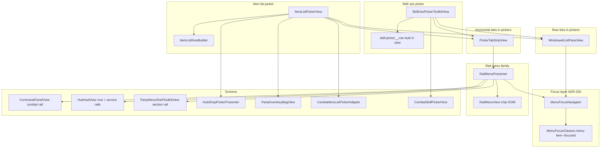
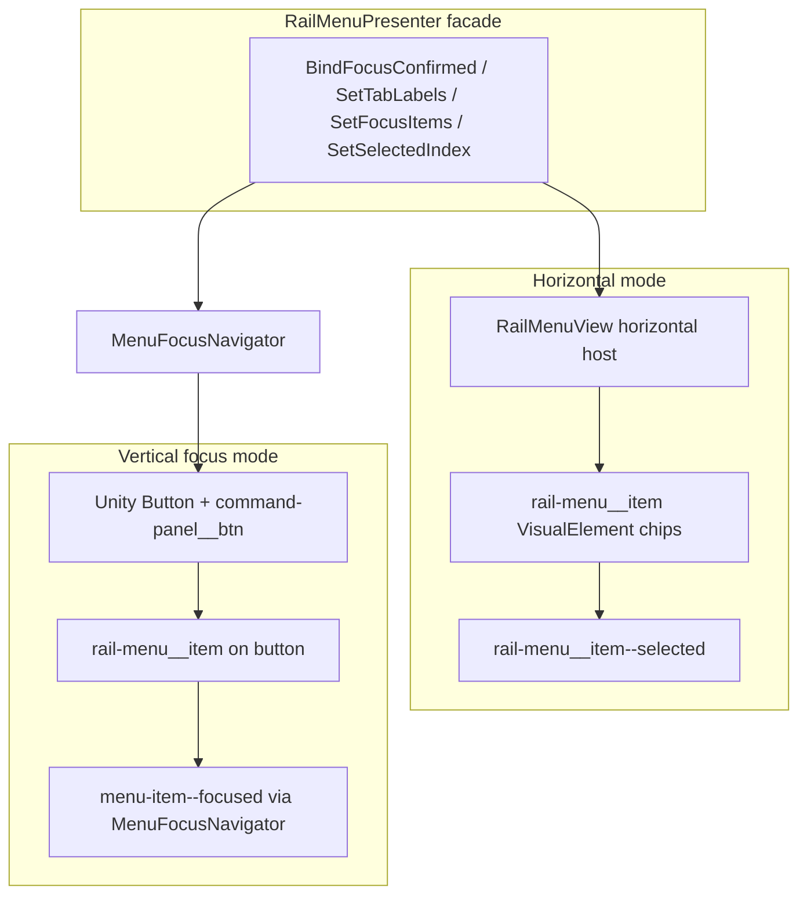
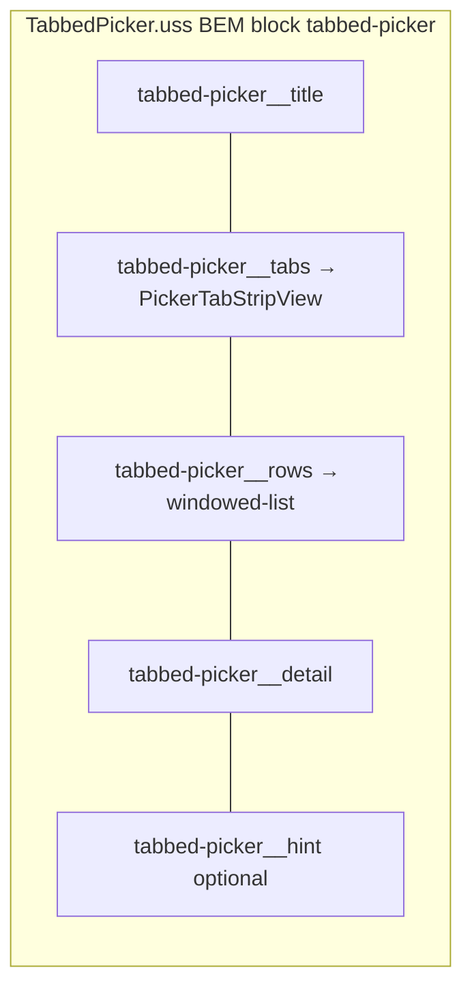
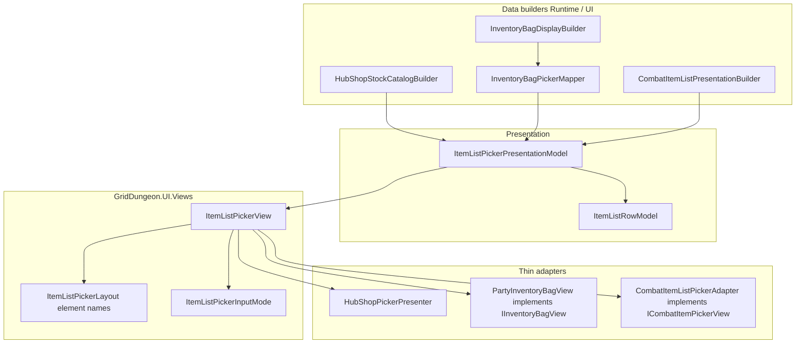
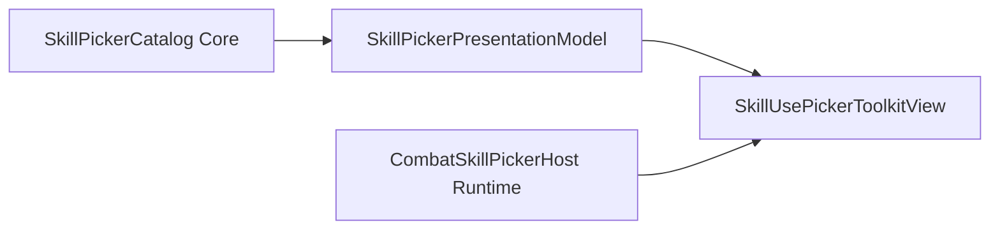

# Shared menu & picker UI (UITK)

How **rail menus**, **item list pickers**, and **skill use pickers** share UITK building blocks in [griddungeon-game](https://github.com/miramocha/griddungeon-game). Use this when skinning hub/combat/party chrome, adding a new tabbed modal, or deciding whether to extend an existing view vs fork.

**Related:** [ADR 026 — Combat menu focus navigation](../../decisions/026-combat-menu-focus-navigation.md) (`MenuFocusNavigator`, `menu-item--focused`), [ADR 035 — Skill use picker](../../decisions/035-skill-use-picker.md), [ADR 036 — Party inventory model](../../decisions/036-party-inventory-model.md), [custom skill picker UI](custom-skill-picker-ui.md), [UI event contract](ui-event-contract.md).

**Implementation root:** `Assets/Scripts/UI/Views/` · `Assets/UI/Screens/Shared/` · feature UXML under `Assets/UI/Screens/{Combat,Hub}/`.

---

## Overview — three families, one focus stack

Grid Dungeon does **not** use one mega-widget for every menu. MVP1 has three **families** that **compose** shared primitives:

| Family | Primary types | Orientation | Typical use |
|--------|---------------|-------------|-------------|
| **Rail menu** | `RailMenuPresenter` → `RailMenuView` or `MenuFocusNavigator` | Vertical **or** horizontal | Command bar, hub services, party section rail, **category tab chips** |
| **Item list picker** | `ItemListPickerView` (+ thin adapters) | Horizontal tabs + windowed rows | Hub shop buy/sell, party bag, combat **Item** command |
| **Skill use picker** | `SkillUsePickerToolkitView` | Horizontal tabs + windowed rows | Combat **Skill** command (ADR 035) |

All keyboard lists share **`MenuFocusNavigator`** ([ADR 026](../../decisions/026-combat-menu-focus-navigation.md)) and, for long lists, **`WindowedListPaneView`** (8 visible rows + scroll bars).

---

## Rail menu — chips and command buttons

**Job:** One visual language for **selectable chips** (tabs) and **stacked actions** (command rail).

### Layering

| Type | Factory | DOM | Selection vs focus |
|------|---------|-----|-------------------|
| **Horizontal chips** | `RailMenuPresenter.CreateHorizontal(host)` | `RailMenuView` builds `rail-menu__item` + `rail-menu__item-label` | **`--selected`** on active tab (Q/E or click) |
| **Vertical focus rail** | `RailMenuPresenter.CreateVerticalFocus()` | Existing UXML `Button`s; `ConfigureButton` adds `rail-menu__item` | **`menu-item--focused`** via `SetFocusItems`; optional **`--selected`** via `BindSelectionTargets` (party section) |

**Styles:** `Assets/UI/Screens/Shared/RailMenu.uss` (imported by `CommandPanel.uss` and `TabbedPicker.uss`). Unity `Button` rails need the combined selectors (e.g. `.rail-menu__item.unity-button.menu-item--focused`, `.rail-menu__item.unity-button.rail-menu__item--selected`).

### Consumers (vertical)

| Screen | Owner | UXML hook |
|--------|-------|-----------|
| Combat command bar | `CommandPanelView` | `CombatHud.uxml` → `command-panel__btn` |
| Hub root menu | `HubHudView` / `HubRootMenuFocus` | `HubHud.uxml` |
| Hub service back/actions | `HubHudServicePanelView` | per-service panel |
| Party section rail | `PartyMenuShellToolkitView` | `PartyMenu.uxml` → Inventory / Equipment |

### Consumers (horizontal)

| Screen | Owner | Notes |
|--------|-------|-------|
| Tab strips (all pickers) | `PickerTabStripView` | Thin wrapper over `CreateHorizontal` |
| Party equipment member tabs | `PartyEquipmentToolkitView` | `RailMenuPresenter.CreateHorizontal` on `party-equipment-members` |

**Extend:** New vertical rail → clone `command-rail` + `command-panel` from `RailMenuVertical.uxml`, wire `RailMenuPresenter.CreateVerticalFocus()`, bind `MenuFocusNavigator` in your input handler. New horizontal strip → empty host with class `tabbed-picker__tabs` (or `rail-menu rail-menu--horizontal`) and `PickerTabStripView`.

---

## Tabbed picker shell — shared modal chrome

**Job:** Title, optional tabs, windowed list region, detail line, optional hint — **not** row content.

| Asset | Role |
|-------|------|
| `TabbedPicker.uss` | Panel layout, dim overlay (`tabbed-picker`), imports `RailMenu.uss` |
| `WindowedList.uss` | `windowed-list`, `windowed-list__slots`, scroll bars |
| `TabbedPickerShellClasses` | BEM constants (`Hidden`, `TabsHidden`, …) |

**UXML patterns:**

- **Full-screen overlay:** `tabbed-picker` root + `tabbed-picker__panel` — hub shop (`ItemListPicker.uxml`), combat skill/item pickers.
- **Embedded pane:** same inner structure without overlay — party bag (`PartyInventory.uxml` inside `party-menu__dialog`).

---

## Item list picker — one view, multiple hosts

**Job:** Render **`ItemListPickerPresentationModel`** — tabs of **`ItemListRowModel`** rows. Catalog/build logic stays in Core/Runtime; view only builds DOM and fires selection.

### `ItemListPickerView` responsibilities

| Concern | Owner |
|---------|--------|
| Tab labels / selection | `PickerTabStripView` → `RailMenuPresenter` horizontal |
| Row window + focus | `WindowedListPaneView` |
| Row DOM | `ItemListRowBuilder` + `ItemListRow.uss` |
| Detail panel | `item-list-picker-detail` label text from `ItemListRowModel.Detail` |
| Confirm / cancel | `RowSelected` / `Cancelled` events |

### Layout profiles (`ItemListPickerLayout`)

Same C# view, different UXML **name hooks** and hidden class:

| Profile | `HiddenClass` | Hint label | Used by |
|---------|---------------|------------|---------|
| `ShopOverlay` (default) | `tabbed-picker--hidden` | `item-list-picker-hint` | `ItemListPicker.uxml` |
| `PartyInventoryPane` | `party-inventory--hidden` | none (shell hint on rail) | `PartyInventory.uxml` |

Required element names (party profile uses the same ids):

- `item-list-picker-title`, `item-list-picker-tabs`, `item-list-picker-rows`, `item-list-picker-detail`

### Input modes (`ItemListPickerInputMode`)

| Mode | When | Row focus |
|------|------|-----------|
| **`Immediate`** | Hub shop, combat Item | Acquired when picker opens |
| **`EngageOnConfirm`** | Party bag pane | Z engages first row; shell owns first Z to open modal ([ADR 036](../../decisions/036-party-inventory-model.md)) |

Party adapter: **`PartyInventoryBagView`** — implements `IInventoryBagView` + `IInventoryBagKeyboardView`, delegates to `ItemListPickerView` with `EngageOnConfirm`. Coordinator (`InventoryBagCoordinator`) unchanged; still passes `InventoryBagViewPresentationModel`.

Combat adapter: **`CombatItemListPickerAdapter`** — maps `RowSelected` → `skillId` / bag slot per `ItemListRowModel`.

**Row styles:** Always import `ItemListRow.uss` on the host UXML (party pane historically missed this and fell back to dark default label text).

---

## Skill use picker — parallel tabbed shell

**Job:** Render **`SkillPickerPresentationModel`** from Core (`SkillPickerCatalog`). Implements **`ISkillUsePickerView`** — swappable port ([ADR 035](../../decisions/035-skill-use-picker.md), [custom skill picker UI](custom-skill-picker-ui.md)).

### What is shared with item list picker

| Shared | Skill-specific |
|--------|----------------|
| `PickerTabStripView` + `RailMenu.uss` tabs | `SkillPickerPresentationModel` / `SkillPickerRowModel` |
| `WindowedListPaneView` + `WindowedList.uss` | Row DOM: `skill-picker__row` in `SkillUsePicker.uss` |
| `TabbedPicker.uss` shell | `CreateRowElement` inline in view (name, cost, disabled reason) |
| `MenuFocusNavigator` on rows | `ISkillUsePickerView` / `ICombatSkillPickerKeyboardView` ports |

**Not** using `ItemListPickerView` today — skill rows have a different column layout (MP cost, disabled reason) and a Runtime presentation type owned by ADR 035. A future refactor could introduce a generic `TabbedListPickerView<TRow>` or a row-builder delegate; MVP1 keeps **`SkillUsePickerToolkitView`** separate to avoid coupling item economy to combat skill catalog.

### UXML

`Assets/UI/Screens/Combat/SkillUsePicker.uxml` — same shell classes as shop picker; row host `skill-picker-rows` (class `windowed-list`).

---

## Windowed list pane

**Job:** Show at most **N** rows (default **8**) in a fixed-height region; up/down bars indicate off-window items; global focus index wraps.

Used by: `ItemListPickerView`, `SkillUsePickerToolkitView`, party equipment slot list, equipment sub-picker.

| Piece | Class / type |
|-------|----------------|
| Root | `windowed-list` |
| Slots column | `windowed-list__slots` → child `windowed-list__slot` per visible row |
| Scroll hints | `windowed-list__scroll--up` / `--down` |
| Focus | `MenuFocusNavigator` on row elements; `menu-item--focused` |

Inside party menu dialogs, `PartyMenu.uss` disables focus **scale** (`scale: 1 1`) so borders are not clipped by scroll/slot overflow.

---

## Consumer matrix

| Feature | Rail (vertical) | Tab strip | List view | Presentation builder | Runtime port |
|---------|-----------------|-----------|-----------|----------------------|--------------|
| Combat command bar | `CommandPanelView` | — | — | — | `CombatInputHandler` |
| Hub root / services | `HubHudView` | — | — | — | `HubInputHandler` |
| Hub shop buy/sell | — | `PickerTabStripView` | `ItemListPickerView` | `HubShopStockCatalogBuilder` | `HubShopPickerPresenter` |
| Party menu section | `PartyMenuShellToolkitView` | — | — | — | `PartyMenuInputHandler` |
| Party inventory | — | ✓ | `ItemListPickerView` via `PartyInventoryBagView` | `InventoryBagDisplayBuilder` → mapper | `IInventoryBagKeyboardView` |
| Party equipment members | — | `RailMenuPresenter` | slots + picker | `PartyEquipmentCatalog` | `IPartyEquipmentKeyboardView` |
| Combat Item | — | ✓ (single tab) | `ItemListPickerView` via adapter | `CombatItemListPresentationBuilder` | `ICombatItemPickerHost` |
| Combat Skill | — | ✓ | `SkillUsePickerToolkitView` | `SkillPickerCatalog` (Core) | `ICombatSkillPickerHost` |

---

## Extension guide

### New category-tabbed **item** modal

1. Build `ItemListPickerPresentationModel` (or use `ItemListPickerPresentationBuilder.FromCategoryTabs`).
2. Clone `ItemListPicker.uxml` or embed the inner panel in your screen.
3. `new ItemListPickerView(root)` (or custom `ItemListPickerLayout` if element names differ).
4. Wire keyboard: Q/E → `SelectNextTab` / `SelectPreviousTab`; WASD → `RowNavigator` or `MoveRowFocus*`; Z/X → confirm/cancel on `RowNavigator`.
5. Import styles: `TabbedPicker.uss`, `WindowedList.uss`, `ItemListRow.uss`.

### New **skill** or non-item row shape

- If rows match item columns (name, trailing meta, qty badge) → prefer **item list picker**.
- If rows need skill-specific columns → follow **`SkillUsePickerToolkitView`**: share `PickerTabStripView` + `WindowedListPaneView`, own row USS + builder, implement the appropriate Runtime port (`ISkillUsePickerView` or new interface in Runtime, not Core).

### New **command rail** or section strip

- Vertical actions: `RailMenuPresenter.CreateVerticalFocus()` + `ConfigureButton` on each `Button`.
- Horizontal sections/tabs: `PickerTabStripView` or `CreateHorizontal` directly.

### Do not

- Put catalog/filter logic in `GridDungeon.UI` views (asmdef boundary).
- Add uGUI overlays for these menus without explicit approval ([UITK rule](../../.cursor/rules/unity-ui-toolkit.mdc)).
- Duplicate `rail-menu__item` styles — extend `RailMenu.uss` or use BEM modifiers.

---

## Tests (Edit Mode)

| Fixture | Path |
|---------|------|
| `ItemListPickerViewTests` | `Tests/UI/` — shop-style tabs + row selection |
| `PartyInventoryBagViewTests` | `Tests/UI/` — party layout + engage-on-confirm |
| `SkillUsePickerToolkitViewTests` | `Tests/UI/` — skill tabs + row confirm |
| `MenuFocusNavigatorTests` | `Tests/UI/` — focus wrap/skip |
| `CommandPanelViewTests` | `Tests/Combat/` — command rail focus |

Manual: Dev bootstrap **F1** hub shop, **Tab** party inventory, **F3** combat Skill / Item pickers.

---

## File map (game repo)

| Path | Purpose |
|------|---------|
| `Assets/UI/Screens/Shared/RailMenu.uss` | Chip + button rail styles |
| `Assets/UI/Screens/Shared/CommandPanel.uss` | Vertical rail panel |
| `Assets/UI/Screens/Shared/TabbedPicker.uss` | Modal shell |
| `Assets/UI/Screens/Shared/WindowedList.uss` | Windowed list chrome |
| `Assets/UI/Screens/Shared/ItemListRow.uss` | Item row BEM |
| `Assets/UI/Screens/Shared/ItemListPicker.uxml` | Shop overlay template |
| `Assets/UI/Screens/Shared/PartyInventory.uxml` | Party bag pane template |
| `Assets/UI/Screens/Combat/SkillUsePicker.uxml` | Skill modal template |
| `Assets/Scripts/UI/Views/RailMenuPresenter.cs` | Rail facade |
| `Assets/Scripts/UI/Views/PickerTabStripView.cs` | Horizontal tabs |
| `Assets/Scripts/UI/Views/WindowedListPaneView.cs` | Windowed list + focus |
| `Assets/Scripts/UI/Views/ItemListPickerView.cs` | Unified item picker |
| `Assets/Scripts/UI/Views/PartyInventoryBagView.cs` | Party bag adapter |
| `Assets/Scripts/UI/Views/SkillUsePickerToolkitView.cs` | Skill picker |
| `Assets/Scripts/UI/Navigation/MenuFocusNavigator.cs` | ADR 026 focus index |
