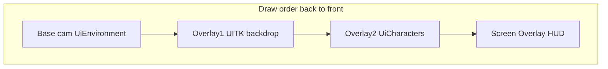

---
tags:
  - path/docs/04-dev
  - type/dev
  - scope/required
  - status/active
  - domain/ui
---
# UI camera stack (URP)

How Grid Dungeon sandwiches **3D environment → UITK backdrop → 3D characters** using URP **camera stacking**, while screen HUD stays on **Screen Space - Overlay**.

**Authority:** [ADR 049 — UI camera stack](../../decisions/049-ui-camera-stack.md)  
**Implementation:** [griddungeon-game#428](https://github.com/miramocha/griddungeon-game/issues/428) — `UiCameraStackSession`, `PresentationActorTags`, `GameObjectLayerScope` (planned)  
**Related:** [centralized UI services](centralized-ui-services.md), [presentation shell implementation](presentation-shell-implementation.md), [ADR 033 — Hub Cinemachine](../../decisions/033-hub-environment-cinemachine.md), [ADR 047 — Party menu 3D stage](../../decisions/047-party-menu-3d-stage.md)

---

## Problem

| Need | Screen Overlay UITK | Single camera + sort order |
|------|---------------------|----------------------------|
| UITK backdrop **behind** 3D characters | No | No |
| UITK backdrop **in front of** 3D env | N/A | Partial |
| Command rail / hints **above** everything | Yes | N/A |

**Solution:** URP Base + Overlay cameras when a **backdrop** UITK panel (`Screen Space - Camera`) is shown; otherwise **SingleCam** (one pass, env + chars via layers + depth).

---

## Render modes (`UiCameraStackSession`)

Presenters **register GOs and backdrop** — they do **not** pick Stack vs SingleCam.

```
no backdrop UITK visible  →  SingleCam
backdrop UITK visible     →  Stack (3-cam)
exploration FPV / no UI 3D →  Off
```

| Mode | Overlay cams | Base culling (typical) |
|------|--------------|------------------------|
| Off | Disabled | Exploration / combat default |
| SingleCam | Disabled | `UiEnvironment` \| `UiCharacters` |
| Stack | Overlay1 UITK + Overlay2 chars (if any) | `UiEnvironment` only on base |

**Char overlay** enabled only when `RegisterCharacters` count > 0.

---

## Stack layout (Stack mode)



| Camera | Content |
|--------|---------|
| Base | Hub town, party stage, beat shell, backdrop sphere |
| Overlay 1 | `UiBackdropPanelSettings` panel (stack trigger) |
| Overlay 2 | Party roster visuals (≤10 GOs) |
| Above all | `GamePanelSettings` — command rail, hints, modals |

Overlay clear flags: **Depth only** (do not wipe env color).

---

## Tags vs layers

| | When set | Use |
|---|----------|-----|
| **Tag** | At `Instantiate` | Cutscene/skill identity — `PresentationActorTags` |
| **Layer** | On `Register*` / restore on `Unregister` | Camera masks — `UiEnvironment`, `UiCharacters` |

| Tag | Spawn site |
|-----|------------|
| `PresentationCharacter` | `PartyCharacterVisualRegistry`, future cinematic spawns |
| `PresentationEnemy` | `CombatScenePresenter.SpawnEnemyVisuals` |
| `PresentationEnvironment` | Hub town, party stage, floor beat root |

Prefabs: **Default layer**, **Untagged** in asset; spawn site calls `PresentationActorTags.Apply*`.

---

## Layer naming standard (no Default for camera routing)

**Scoped rule** — not “ban Default layer entirely.” See [ADR 049 §7](https://github.com/miramocha/griddungeon-design-docs/blob/main/decisions/049-ui-camera-stack.md).

> **Do not rely on Default for camera routing.** Camera-visible roots use a **named layer** for their **current role**. Default is OK for editor scratch, vendor assets, and brief pre-assignment state.

| Layer | Phase | Role |
|-------|-------|------|
| `UiEnvironment` | 1 ([#428](https://github.com/miramocha/griddungeon-game/issues/428)) | Registered UI env (hub town, stage, beat) |
| `UiCharacters` | 1 | Registered UI chars (party on stage, cinematics) |
| `Exploration` | 2 | `FloorArtPresenter` / dungeon props — **not** UI stack |
| `PresentationIdle` | 2 (optional) | Pooled chars in stash — alternative to Default on unregister |

**Phase 1:** unregister → restore **Default**; explicit camera masks only (`UiEnvironment` on base in Stack — not “render all Default”).

**Phase 2:** floor art → `Exploration`; optional idle layer for stash; review flags camera-visible GOs stuck on Default.

**Rejected:** global Default ban (migration cost, Unity ergonomics, conflicts with phase-1 restore).

---

## Presentation spawn tagging standard

**Scoped rule** — not “tag every `GameObject`.”

> Every runtime **`Instantiate` under presentation/cinematic ownership** sets a locked **`PresentationActorTags`** value on the **root** in the same frame. Layers remain **`Register*`** only.

### Required (in scope)

| Spawn owner | Tag |
|-------------|-----|
| `PartyCharacterVisualRegistry` | `PresentationCharacter` |
| `CombatScenePresenter` | `PresentationEnemy` |
| Hub town / party stage / beat root | `PresentationEnvironment` |
| Future skill / cutscene spawner | `PresentationCharacter` or `PresentationEnemy` |

### Exempt

| Area | Reason |
|------|--------|
| `FloorArtPresenter`, floor props | Exploration — not UI stack |
| Editor tools, dev primitives | Unless promoted to presentation actor |
| Vendor / plugin spawns | Not owned |
| UITK trees | Not `GameObject` |

### Enforcement

- **`PresentationActorTags.Apply*`** at spawn — single constants type; no string literals.
- **Root only** — children stay default unless a future spec says otherwise.
- Dev **`Debug.Assert(CompareTag)`** in `Register*` optional guard.
- Code review / **fresh-reviewer**: new presentation `Instantiate` without `Apply*Tag` → Should fix.

**Why not tag everything:** Unity allows one tag per GO; floor-art props would need a vague catch-all tag and do not participate in camera stack routing.

---

## API sketch

```csharp
using var scope = UiCameraStackSession.BeginScope(UiStackScope.PartyMenu);

UiCameraStackSession.SetBackdrop(backdropUidocument);
UiCameraStackSession.RegisterEnvironment(envRoot);
UiCameraStackSession.RegisterCharacters(charRoots);
// Unregister / scope dispose → restore layers, RefreshRenderMode
```

`RefreshRenderMode()` runs on: backdrop show/hide, register/unregister, scope dispose.

---

## Spawn / register matrix

| Site | Tag at spawn | Layer register |
|------|--------------|----------------|
| `PartyCharacterVisualRegistry` | `PresentationCharacter` | On `PresentOnStage`; unregister on stash |
| `HubEnvironmentPresenter` | `PresentationEnvironment` | Town root on hub enter |
| `PartyMenuStagePresenter` | `PresentationEnvironment` | Stage for menu session |
| `FloorTransitionPresenter` | `PresentationEnvironment` | Beat lifecycle |
| `CombatScenePresenter` | `PresentationEnemy` | Deferred until combat stack |
| `FloorArtPresenter` | — | **Not** in UI stack |

---

## UITK assets

| Asset | Render mode |
|-------|-------------|
| `GamePanelSettings` | Screen Space - Overlay |
| `UiBackdropPanelSettings` | Screen Space - Camera → overlay 1 camera |

Only backdrop affects SingleCam vs Stack.

---

## Performance

| State | Typical passes |
|-------|----------------|
| Exploration FPV | 1 |
| Hub, no backdrop | 1 (SingleCam) |
| Hub + backdrop | 2 |
| Party menu + backdrop + chars | 3 |

Post: one camera only in stack modes. Geometry ≤10 chars is not the bottleneck — pass count is.

---

## Shadows

- Directional shadow map includes registered casters before base draws env.
- Char → floor contact: env drawn in base pass samples shadow map (standard URP forward).
- Light shadow / rendering layer masks must include `UiEnvironment` and `UiCharacters` while UI 3D is active.

---

## Testing

- Frame Debugger: backdrop off → 1 pass; backdrop on → 2–3.
- Edit Mode: register/unregister restores Default layer; tag unchanged.
- Manual: hub → party menu → close; no stray `UiCharacters` layer after stash.

---

## Future exploration (deferred)

**URP Render Objects** — optional follow-up to evaluate single-camera layer injection (world-space UITK backdrop quad, env → backdrop → char pass order) and presentation VFX (occlusion silhouette). May complement or replace Stack mode on specific screens after a spike.

- Authority note: [ADR 049 § Future exploration](../../decisions/049-ui-camera-stack.md)
- Ticket: [griddungeon-game#429](https://github.com/miramocha/griddungeon-game/issues/429)
- Unity reference: [Render Objects renderer feature](https://docs.unity3d.com/Packages/com.unity.render-pipelines.universal@13.1/manual/renderer-features/how-to-custom-effect-render-objects.html)

Does **not** block [griddungeon-game#428](https://github.com/miramocha/griddungeon-game/issues/428).

---

## Anti-patterns

- Manual `SetStackMode` from presenters
- Overlay HUD as `SetBackdrop`
- Baked stack layers on prefabs
- `go.layer =` outside session helpers
- Registering exploration `FloorArtPresenter` roots
- **Tag-every-`Instantiate` policy** — use presentation spawn standard only ([ADR 049 §6](https://github.com/miramocha/griddungeon-design-docs/blob/main/decisions/049-ui-camera-stack.md))
- **Relying on Default for camera masks** — use explicit `Ui*` / `Exploration` layers ([ADR 049 §7](https://github.com/miramocha/griddungeon-design-docs/blob/main/decisions/049-ui-camera-stack.md))
- **Ban Default layer entirely** — phased standard instead; see §7
