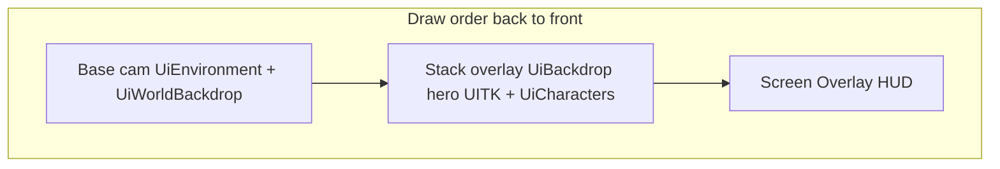

---
tags:
  - path/docs/04-dev
  - type/dev
  - scope/required
  - status/active
  - domain/ui
---
# UI camera stack (URP)

How Grid Dungeon sandwiches **3D environment → UITK backdrop → 3D characters** using URP **camera stacking**, while screen HUD stays on **Screen Space - Overlay**.

**Authority:** [ADR 049 — UI camera stack](../../decisions/049-ui-camera-stack.md)  
**Shipped:** [griddungeon-game#428](https://github.com/miramocha/griddungeon-game/issues/428) (layer routing) · [griddungeon-game#430](https://github.com/miramocha/griddungeon-game/issues/430) / [PR #431](https://github.com/miramocha/griddungeon-game/pull/431) (party menu hero backdrop)  
**Related:** [centralized UI services](centralized-ui-services.md), [presentation shell implementation](presentation-shell-implementation.md), [ADR 033 — Hub Cinemachine](../../decisions/033-hub-environment-cinemachine.md), [ADR 047 — Party menu 3D stage](../../decisions/047-party-menu-3d-stage.md)

---

## Problem

| Need | Screen Overlay UITK | World Space UITK (unsynced) | URP stack + layers (shipped) |
|------|---------------------|-----------------------------|------------------------------|
| UITK backdrop **behind** 3D characters | No | Partial (depth/lens fragile) | Yes — `UiBackdrop` on stack overlay + `SetCharacterDrawLayer` |
| UITK backdrop **in front of** 3D env | N/A | Partial | Yes — non-focused roster on `UiEnvironment` base pass |
| Command rail / hints **above** everything | Yes | N/A | N/A |

## UITK render modes (Unity 6)

[`PanelRenderMode`](https://docs.unity3d.com/6000.3/Documentation/ScriptReference/UIElements.PanelRenderMode.html) — **not** the same as uGUI `Canvas` render modes:

| Mode | Value | Behavior |
|------|-------|----------|
| `ScreenSpaceOverlay` | 0 | After **all** cameras; independent of world geometry (`GamePanelSettings`). |
| `WorldSpace` | 1 | 3D panel in scene; camera distance + layer culling ([World Space UI](https://docs.unity3d.com/6000.3/Documentation/Manual/ui-systems/create-world-space-ui.html)). |

There is **no** `ScreenSpaceCamera` enum. Do **not** map uGUI “Screen Space - Camera” (`m_RenderMode = 1`) onto `UiBackdropPanelSettings` — in UITK that value is **World Space**.

**Shipped solution:**

1. **[#428](https://github.com/miramocha/griddungeon-game/issues/428):** URP base + stack overlay + `UiCameraStackSession` layer routing.
2. **[#430](https://github.com/miramocha/griddungeon-game/issues/430) / [PR #431](https://github.com/miramocha/griddungeon-game/pull/431):** World-space hero `UIDocument` on `UiBackdrop`, cover-synced from base camera (`UiBackdropWorldPanelSync`); not `ScreenSpaceOverlay` and not an RT quad on the base pass.

**Deferred:** UITK → [`targetTexture`](https://docs.unity3d.com/ScriptReference/UIElements.PanelSettings-targetTexture.html) → env-layer quad; URP **Render Objects** ([#429](https://github.com/miramocha/griddungeon-game/issues/429)).

---

## Render modes (`UiCameraStackSession`)

Presenters **register GOs and backdrop** — they do **not** pick Stack vs SingleCam.

```
no backdrop UITK visible  →  SingleCam
backdrop UITK visible     →  Stack (3-cam)
exploration FPV / no UI 3D →  Off
```

| Mode | Overlay cams | Base culling (via `UiCameraStackRig`) |
|------|--------------|--------------------------------------|
| Off | Disabled | `UiLayers.OffMask` — all layers **except** `UiStackRoutingMask`; includes `Exploration` for FPV |
| SingleCam | Disabled | `UiEnvironment` \| `UiWorldBackdrop` \| `UiCharacters` |
| Stack | `UiStackOverlay` enabled | `UiEnvironment` \| `UiWorldBackdrop` only |

**Stack overlay** culling: `UiBackdrop` \| `UiCharacters`. Enabled when Stack mode **and** `RegisteredCharacterCount > 0` (same gate as pre-#430 char overlay).

**Off after hub:** `SingleCam` excludes `Exploration`; switching to Off must restore FPV floor art — `OffMask` strips only UI stack routing layers, not `Exploration` ([`UiCameraStackSessionTests`](https://github.com/miramocha/griddungeon-game/blob/main/Assets/Tests/GameFlow/UiCameraStackSessionTests.cs)).

---

## Stack layout (Stack mode)

**Target** draw order (back → front):



| Pass | Content |
|------|---------|
| Base | Hub town, party stage, beat shell, world backdrop sphere; **non-focused** roster (`SetCharacterDrawLayer` → `UiEnvironment`) |
| Stack overlay | World-space hero UITK on `UiBackdrop`; **focused** roster on `UiCharacters` |
| Above all | `GamePanelSettings` — command rail, hints, modals |

Char overlay clear flags: **Depth only** (do not wipe env color).

### Runtime notes (shipped)

- `UiStackOverlay` child on base camera — legacy `UiStackOverlay1_Backdrop` / `UiStackOverlay2_Characters` names removed at runtime.
- `SetBackdrop(UIDocument)` → Stack when document is active; `UiBackdropWorldPanelSync` assigns `UiBackdrop` layer and syncs cover transform from base camera each frame.
- `SetCharacterDrawLayer(root, foreground, backdropSplitActive)` — foreground → `UiCharacters`; non-focused during backdrop split → `UiEnvironment`.
- **MToon roster** stays on char overlay pass — do not merge focused characters onto base pass in this phase.
- `UiBackdropDefaults.PanelDistanceFromNearClip` (50 world units from near clip) + `UiBackdropCoverLayout` (1920×1080 reference, `WorldPanelPixelsPerUnit` 100).
- Hero font: `Assets/Resources/UI/Fonts/PartyMenuHeroCosmicIndustry.otf` (class name label).

---

## World-space backdrop tuning

| Constant / type | Role |
|-----------------|------|
| `UiBackdropDefaults.PanelDistanceFromNearClip` | Offset from camera near clip to backdrop plane (world units) |
| `UiBackdropDefaults.ReferenceWidth` / `ReferenceHeight` | 1920×1080 cover reference |
| `UiBackdropCoverLayout` | CSS object-fit **cover** sizing from live camera aspect |
| `UiBackdropWorldPanelSync` | Per-frame position/rotation/scale from base camera while Stack active |

**MToon constraint:** roster characters use MToon as authored; sandwich ordering uses layers + overlay pass, not character shader queue edits.

**Deferred spike:** RT quad on base pass + custom Shader Graph ZTest — see [ADR 049 § Deferred alternatives](../../decisions/049-ui-camera-stack.md).

---

## Tags vs layers

| | When set | Use |
|---|----------|-----|
| **Tag** | At `Instantiate` | Cutscene/skill identity — `PresentationActorTags` |
| **Layer** | On `Register*` / restore on `Unregister` | Camera masks — `UiEnvironment`, `UiCharacters` |

| Tag | Spawn site |
|-----|------------|
| `PresentationCharacter` | `PartyCharacterVisualRegistry`, future cinematic spawns |
| `PresentationEnemy` | `CombatScenePresenter.SpawnEnemyVisuals` |
| `PresentationEnvironment` | Hub town, party stage, floor beat root |

Prefabs: **Default layer**, **Untagged** in asset; spawn site calls `PresentationActorTags.Apply*`.

---

## Layer naming standard (no Default for camera routing)

**Scoped rule** — not “ban Default layer entirely.” See [ADR 049 §7](https://github.com/miramocha/griddungeon-design-docs/blob/main/decisions/049-ui-camera-stack.md).

> **Do not rely on Default for camera routing.** Camera-visible roots use a **named layer** for their **current role**. Default is OK for editor scratch, vendor assets, and brief pre-assignment state.

| Layer | Phase | Role |
|-------|-------|------|
| `UiEnvironment` | 1 ([#428](https://github.com/miramocha/griddungeon-game/issues/428)) | Registered UI env (hub town, stage, beat); non-focused roster during backdrop |
| `UiCharacters` | 1 | Registered / focused UI chars (party on stage, cinematics) |
| `UiBackdrop` | 1 ([#430](https://github.com/miramocha/griddungeon-game/issues/430)) | World-space hero UITK `UIDocument` on stack overlay |
| `UiWorldBackdrop` | 1 | Greybox / transition sphere (`WorldBackdropLayerRules`) |
| `Exploration` | 2 | `FloorArtPresenter` / dungeon props — **not** UI stack |
| `PresentationIdle` | 2 (optional) | Pooled chars in stash — alternative to Default on unregister |

**Phase 1:** unregister → restore **Default**; explicit camera masks only (`UiEnvironment` on base in Stack — not “render all Default”).

**Phase 2:** floor art → `Exploration`; optional idle layer for stash; review flags camera-visible GOs stuck on Default.

**Rejected:** global Default ban (migration cost, Unity ergonomics, conflicts with phase-1 restore).

---

## Presentation spawn tagging standard

**Scoped rule** — not “tag every `GameObject`.”

> Every runtime **`Instantiate` under presentation/cinematic ownership** sets a locked **`PresentationActorTags`** value on the **root** in the same frame. Layers remain **`Register*`** only.

### Required (in scope)

| Spawn owner | Tag |
|-------------|-----|
| `PartyCharacterVisualRegistry` | `PresentationCharacter` |
| `CombatScenePresenter` | `PresentationEnemy` |
| Hub town / party stage / beat root | `PresentationEnvironment` |
| Future skill / cutscene spawner | `PresentationCharacter` or `PresentationEnemy` |

### Exempt

| Area | Reason |
|------|--------|
| `FloorArtPresenter`, floor props | Exploration — not UI stack |
| Editor tools, dev primitives | Unless promoted to presentation actor |
| Vendor / plugin spawns | Not owned |
| UITK trees | Not `GameObject` |

### Enforcement

- **`PresentationActorTags.Apply*`** at spawn — single constants type; no string literals.
- **Root only** — children stay default unless a future spec says otherwise.
- Dev **`Debug.Assert(CompareTag)`** in `Register*` optional guard.
- Code review / **fresh-reviewer**: new presentation `Instantiate` without `Apply*Tag` → Should fix.

**Why not tag everything:** Unity allows one tag per GO; floor-art props would need a vague catch-all tag and do not participate in camera stack routing.

---

## API sketch

```csharp
using var scope = UiCameraStackSession.BeginScope(UiStackScope.PartyMenu);

UiCameraStackSession.SetBackdrop(backdropUidocument);
UiCameraStackSession.RegisterEnvironment(envRoot);
UiCameraStackSession.RegisterCharacters(charRoots);
// Unregister / scope dispose → restore layers, RefreshRenderMode
```

`RefreshRenderMode()` runs on: backdrop show/hide, register/unregister, scope dispose.

---

## Spawn / register matrix

| Site | Tag at spawn | Layer register |
|------|--------------|----------------|
| `PartyCharacterVisualRegistry` | `PresentationCharacter` | On `PresentOnStage`; unregister on stash |
| `HubEnvironmentPresenter` | `PresentationEnvironment` | Town root on hub enter |
| `PartyMenuStagePresenter` | `PresentationEnvironment` | Stage for menu session |
| `FloorTransitionPresenter` | `PresentationEnvironment` | Beat lifecycle |
| `CombatScenePresenter` | `PresentationEnemy` | Deferred until combat stack |
| `FloorArtPresenter` | — | **Not** in UI stack |

---

## UITK assets

| Asset | `PanelRenderMode` | Role |
|-------|-------------------|------|
| `GamePanelSettings` | `ScreenSpaceOverlay` (0) | Phase HUD — always on top |
| `UiBackdropPanelSettings` | `WorldSpace` (1) — source asset; runtime clone via `UiBackdropDocumentSetup` | Backdrop source panel; `SetBackdrop` triggers Stack when document active |
| `PartyMenuClassBackdrop.uxml` | — | Hero class name shell (`party-menu-class-backdrop-label`) |
| `UiBackdropRuntimeContent` | — | `Resources/UI/UiBackdropRuntimeContent` — player-build fallback for panel + UXML |

Only backdrop visibility affects SingleCam vs Stack — not overlay HUD documents.

### Shipped types (party menu backdrop)

| Type | Role |
|------|------|
| `PartyMenuClassBackdropPresenter` | World-space `UIDocument`; `ICentralizedUiSurface`; label reveal on member focus |
| `PartyMenuClassBackdrop` | Static facade (`Show` / `Hide` / `ActivateMemberFocus` / `SyncRosterNames`) |
| `PartyMenuClassBackdropContentTransition` | Label fade timing aligned with silhouette reveal |
| `UiBackdropDocumentSetup` | Runtime `PanelSettings` clone + `WorldSpace` bind |
| `UiBackdropWorldPanelSync` | Layer + per-frame cover sync from base camera |
| `UiBackdropCoverLayout` | Cover math (1920×1080 reference) |
| `UiCameraStackRig` | Applies `OffMask` / `SingleCamMask` / `StackBaseMask`; syncs overlay lens |

---

## Performance

| State | Typical passes |
|-------|----------------|
| Exploration FPV (Off) | 1 |
| Hub / party menu, no backdrop (SingleCam) | 1 |
| Stack + hero backdrop (party menu member focus) | 2 (base env + stack overlay: `UiBackdrop` + `UiCharacters`) |

Post: one camera only in stack modes. Geometry ≤10 chars is not the bottleneck — pass count is.

---

## Shadows

- Directional shadow map includes registered casters before base draws env.
- Char → floor contact: env drawn in base pass samples shadow map (standard URP forward).
- Light shadow / rendering layer masks must include `UiEnvironment` and `UiCharacters` while UI 3D is active.

---

## Testing

- Frame Debugger: backdrop off → SingleCam (1 pass); Stack + chars → base + stack overlay (`UiBackdrop` + `UiCharacters`).
- Edit Mode: `UiCameraStackSessionTests`, `UiBackdropCoverLayoutTests`, `UiBackdropWorldPanelSyncTests`, `PartyMenuClassBackdropFocusShiftTests`; register/unregister restores Default layer; tag unchanged.
- Manual: party menu member focus — non-focused roster behind hero text, focused char in front (shipped [#430](https://github.com/miramocha/griddungeon-game/issues/430)).
- Manual: hub (SingleCam) → close party menu → F2 exploration — floor art visible (`OffMask` includes `Exploration`).
- Manual: hub → party menu → close; no stray `UiCharacters` layer after stash.

---

## Backdrop sandwich (shipped)

**Goal:** `env 3D → hero UITK → focused character → overlay HUD`.

**Do not assume** `PanelRenderMode` value `1` is uGUI Screen Space - Camera — in UITK it is **`WorldSpace`**.

**Verification checklist:**

1. `PartyMenuClassBackdropPresenter` shows on member focus; `SetBackdrop` active in Stack.
2. World-space panel on `UiBackdrop`; cover sync tracks Cinemachine base camera orbit/overview.
3. Non-focused roster on `UiEnvironment`; focused on `UiCharacters`.
4. Overlay lens matches base (`UiCameraStackRig.SyncStackOverlayLensFromBase`).
5. Backdrop root `pickingMode = Ignore`; global HUD unchanged.

**Manual Frame Debugger:** base pass → env + world backdrop sphere; stack overlay → hero UITK + focused roster; Screen Overlay HUD last.

---

## Future exploration (deferred)

RT quad on base pass, presentation VFX (occlusion silhouette) on `UiCharacters` / `PresentationEnemy` — optional ([#429](https://github.com/miramocha/griddungeon-game/issues/429)).

- Authority: [ADR 049 § Deferred alternatives](../../decisions/049-ui-camera-stack.md)
- Closed: [griddungeon-game#430](https://github.com/miramocha/griddungeon-game/issues/430) · Shipped: [PR #431](https://github.com/miramocha/griddungeon-game/pull/431)
- Optional: [griddungeon-game#429](https://github.com/miramocha/griddungeon-game/issues/429) (Render Objects / VFX)

---

## Anti-patterns

- Manual `SetStackMode` from presenters
- Overlay HUD as `SetBackdrop`
- Baked stack layers on prefabs
- `go.layer =` outside session helpers
- Registering exploration `FloorArtPresenter` roots
- **`m_RenderMode = 1` on UITK assuming Screen Space - Camera** — value `1` is `WorldSpace`
- **Expecting overlay/world-space UITK to sandwich without `UiBackdrop` layer + per-frame sync**
- **Tag-every-`Instantiate` policy** — use presentation spawn standard only ([ADR 049 §6](https://github.com/miramocha/griddungeon-design-docs/blob/main/decisions/049-ui-camera-stack.md))
- **Relying on Default for camera masks** — use explicit `Ui*` / `Exploration` layers ([ADR 049 §7](https://github.com/miramocha/griddungeon-design-docs/blob/main/decisions/049-ui-camera-stack.md))
- **Ban Default layer entirely** — phased standard instead; see §7
