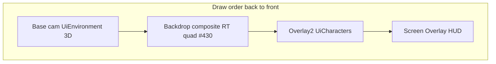

---
tags:
  - path/docs/04-dev
  - type/dev
  - scope/required
  - status/active
  - domain/ui
---
# UI camera stack (URP)

How Grid Dungeon sandwiches **3D environment → UITK backdrop → 3D characters** using URP **camera stacking**, while screen HUD stays on **Screen Space - Overlay**.

**Authority:** [ADR 049 — UI camera stack](../../decisions/049-ui-camera-stack.md)  
**Implementation:** [griddungeon-game#428](https://github.com/miramocha/griddungeon-game/issues/428) (3D layer routing + backdrop scaffold) · [griddungeon-game#430](https://github.com/miramocha/griddungeon-game/issues/430) (backdrop render pass)  
**Related:** [centralized UI services](centralized-ui-services.md), [presentation shell implementation](presentation-shell-implementation.md), [ADR 033 — Hub Cinemachine](../../decisions/033-hub-environment-cinemachine.md), [ADR 047 — Party menu 3D stage](../../decisions/047-party-menu-3d-stage.md)

---

## Problem

| Need | Screen Overlay UITK | World Space UITK | URP stack + layers only |
|------|---------------------|------------------|-------------------------|
| UITK backdrop **behind** 3D characters | No | Partial (depth/lens fragile) | No — needs backdrop pass ([#430](https://github.com/miramocha/griddungeon-game/issues/430)) |
| UITK backdrop **in front of** 3D env | N/A | Partial | Yes — env on base pass |
| Command rail / hints **above** everything | Yes | N/A | N/A |

## UITK render modes (Unity 6)

[`PanelRenderMode`](https://docs.unity3d.com/6000.3/Documentation/ScriptReference/UIElements.PanelRenderMode.html) — **not** the same as uGUI `Canvas` render modes:

| Mode | Value | Behavior |
|------|-------|----------|
| `ScreenSpaceOverlay` | 0 | After **all** cameras; independent of world geometry (`GamePanelSettings`). |
| `WorldSpace` | 1 | 3D panel in scene; camera distance + layer culling ([World Space UI](https://docs.unity3d.com/6000.3/Documentation/Manual/ui-systems/create-world-space-ui.html)). |

There is **no** `ScreenSpaceCamera` enum. Do **not** map uGUI “Screen Space - Camera” (`m_RenderMode = 1`) onto `UiBackdropPanelSettings` — in UITK that value is **World Space**.

**Solution (two phases):**

1. **[#428](https://github.com/miramocha/griddungeon-game/issues/428):** URP Base + char Overlay + `UiCameraStackSession` layer routing when `SetBackdrop` is active.
2. **[#430](https://github.com/miramocha/griddungeon-game/issues/430):** Backdrop **composite** between base env and char overlay — UITK → [`targetTexture`](https://docs.unity3d.com/ScriptReference/UIElements.PanelSettings-targetTexture.html) → env-layer quad ([#429](https://github.com/miramocha/griddungeon-game/issues/429) optional Render Objects spike).

---

## Render modes (`UiCameraStackSession`)

Presenters **register GOs and backdrop** — they do **not** pick Stack vs SingleCam.

```
no backdrop UITK visible  →  SingleCam
backdrop UITK visible     →  Stack (3-cam)
exploration FPV / no UI 3D →  Off
```

| Mode | Overlay cams | Base culling (typical) |
|------|--------------|------------------------|
| Off | Disabled | Exploration / combat default |
| SingleCam | Disabled | `UiEnvironment` \| `UiCharacters` |
| Stack | Char overlay only ([#428](https://github.com/miramocha/griddungeon-game/issues/428)); backdrop overlay reserved | `UiEnvironment` only on base |

**Char overlay** enabled only when `RegisterCharacters` count > 0.

---

## Stack layout (Stack mode)

**Target** draw order (back → front):



| Pass | Content |
|------|---------|
| Base | Hub town, party stage, beat shell; non-focused roster on `UiEnvironment` |
| Backdrop composite ([#430](https://github.com/miramocha/griddungeon-game/issues/430)) | Hero / modal UITK via `RenderTexture` + quad — **not** a native overlay-camera UITK pass |
| Char overlay | Focused roster roots on `UiCharacters` (≤10 GOs) |
| Above all | `GamePanelSettings` — command rail, hints, modals |

Char overlay clear flags: **Depth only** (do not wipe env color).

### [#428](https://github.com/miramocha/griddungeon-game/issues/428) / [#430](https://github.com/miramocha/griddungeon-game/issues/430) runtime notes

- `UiStackOverlay1_Backdrop` exists in Dev Bootstrap but stays **disabled**; backdrop UITK renders off-screen to `targetTexture`.
- `SetCharacterDrawLayer(root, foreground)` moves roster roots between `UiEnvironment` (behind backdrop) and `UiCharacters` (char overlay, in front).
- **Char overlay stays enabled in Stack** when characters are registered — required for **MToon** roster (character render order is not tunable).
- Composite quad: **`UiEnvironment`**, camera-child, cover layout 1920×1080, plane distance `nearClip + offset`; per-frame sync on base camera while composite is visible.
- Assign **Shader Graph material** via `UiBackdropCompositePresenter.m_quadMaterialTemplate` for quad depth/queue vs char overlay (agent does not override template shader state).

---

## Composite quad tuning (Dev Bootstrap)

| Field | Role |
|-------|------|
| `m_quadDistanceFromNearClip` | Offset from camera near clip to backdrop plane (world units) |
| `m_quadMaterialTemplate` | Optional Shader Graph material — **ZTest / queue / blend** for mid-stack ordering |

**MToon constraint:** only the composite quad material is fair game for shader ordering; roster characters use MToon as authored.

**Deferred spike:** merge quad + focused char onto one base camera after SG validates in Frame Debugger.

---

## Tags vs layers

| | When set | Use |
|---|----------|-----|
| **Tag** | At `Instantiate` | Cutscene/skill identity — `PresentationActorTags` |
| **Layer** | On `Register*` / restore on `Unregister` | Camera masks — `UiEnvironment`, `UiCharacters` |

| Tag | Spawn site |
|-----|------------|
| `PresentationCharacter` | `PartyCharacterVisualRegistry`, future cinematic spawns |
| `PresentationEnemy` | `CombatScenePresenter.SpawnEnemyVisuals` |
| `PresentationEnvironment` | Hub town, party stage, floor beat root |

Prefabs: **Default layer**, **Untagged** in asset; spawn site calls `PresentationActorTags.Apply*`.

---

## Layer naming standard (no Default for camera routing)

**Scoped rule** — not “ban Default layer entirely.” See [ADR 049 §7](https://github.com/miramocha/griddungeon-design-docs/blob/main/decisions/049-ui-camera-stack.md).

> **Do not rely on Default for camera routing.** Camera-visible roots use a **named layer** for their **current role**. Default is OK for editor scratch, vendor assets, and brief pre-assignment state.

| Layer | Phase | Role |
|-------|-------|------|
| `UiEnvironment` | 1 ([#428](https://github.com/miramocha/griddungeon-game/issues/428)) | Registered UI env (hub town, stage, beat) |
| `UiCharacters` | 1 | Registered UI chars (party on stage, cinematics) |
| `Exploration` | 2 | `FloorArtPresenter` / dungeon props — **not** UI stack |
| `PresentationIdle` | 2 (optional) | Pooled chars in stash — alternative to Default on unregister |

**Phase 1:** unregister → restore **Default**; explicit camera masks only (`UiEnvironment` on base in Stack — not “render all Default”).

**Phase 2:** floor art → `Exploration`; optional idle layer for stash; review flags camera-visible GOs stuck on Default.

**Rejected:** global Default ban (migration cost, Unity ergonomics, conflicts with phase-1 restore).

---

## Presentation spawn tagging standard

**Scoped rule** — not “tag every `GameObject`.”

> Every runtime **`Instantiate` under presentation/cinematic ownership** sets a locked **`PresentationActorTags`** value on the **root** in the same frame. Layers remain **`Register*`** only.

### Required (in scope)

| Spawn owner | Tag |
|-------------|-----|
| `PartyCharacterVisualRegistry` | `PresentationCharacter` |
| `CombatScenePresenter` | `PresentationEnemy` |
| Hub town / party stage / beat root | `PresentationEnvironment` |
| Future skill / cutscene spawner | `PresentationCharacter` or `PresentationEnemy` |

### Exempt

| Area | Reason |
|------|--------|
| `FloorArtPresenter`, floor props | Exploration — not UI stack |
| Editor tools, dev primitives | Unless promoted to presentation actor |
| Vendor / plugin spawns | Not owned |
| UITK trees | Not `GameObject` |

### Enforcement

- **`PresentationActorTags.Apply*`** at spawn — single constants type; no string literals.
- **Root only** — children stay default unless a future spec says otherwise.
- Dev **`Debug.Assert(CompareTag)`** in `Register*` optional guard.
- Code review / **fresh-reviewer**: new presentation `Instantiate` without `Apply*Tag` → Should fix.

**Why not tag everything:** Unity allows one tag per GO; floor-art props would need a vague catch-all tag and do not participate in camera stack routing.

---

## API sketch

```csharp
using var scope = UiCameraStackSession.BeginScope(UiStackScope.PartyMenu);

UiCameraStackSession.SetBackdrop(backdropUidocument);
UiCameraStackSession.RegisterEnvironment(envRoot);
UiCameraStackSession.RegisterCharacters(charRoots);
// Unregister / scope dispose → restore layers, RefreshRenderMode
```

`RefreshRenderMode()` runs on: backdrop show/hide, register/unregister, scope dispose.

---

## Spawn / register matrix

| Site | Tag at spawn | Layer register |
|------|--------------|----------------|
| `PartyCharacterVisualRegistry` | `PresentationCharacter` | On `PresentOnStage`; unregister on stash |
| `HubEnvironmentPresenter` | `PresentationEnvironment` | Town root on hub enter |
| `PartyMenuStagePresenter` | `PresentationEnvironment` | Stage for menu session |
| `FloorTransitionPresenter` | `PresentationEnvironment` | Beat lifecycle |
| `CombatScenePresenter` | `PresentationEnemy` | Deferred until combat stack |
| `FloorArtPresenter` | — | **Not** in UI stack |

---

## UITK assets

| Asset | `PanelRenderMode` | Role |
|-------|-------------------|------|
| `GamePanelSettings` | `ScreenSpaceOverlay` | Phase HUD — always on top |
| `UiBackdropPanelSettings` | TBD in [#430](https://github.com/miramocha/griddungeon-game/issues/430) | Backdrop source panel; triggers Stack when shown via `SetBackdrop` |

Only backdrop visibility affects SingleCam vs Stack — not overlay HUD documents.

---

## Performance

| State | Typical passes |
|-------|----------------|
| Exploration FPV | 1 |
| Hub / party menu, no backdrop | 1 (SingleCam) |
| Stack + backdrop ([#428](https://github.com/miramocha/griddungeon-game/issues/428)) | 2 (base env + char overlay) |
| Stack + backdrop composite ([#430](https://github.com/miramocha/griddungeon-game/issues/430)) | 2–3 (+ backdrop quad draw) |

Post: one camera only in stack modes. Geometry ≤10 chars is not the bottleneck — pass count is.

---

## Shadows

- Directional shadow map includes registered casters before base draws env.
- Char → floor contact: env drawn in base pass samples shadow map (standard URP forward).
- Light shadow / rendering layer masks must include `UiEnvironment` and `UiCharacters` while UI 3D is active.

---

## Testing

- Frame Debugger: backdrop off → SingleCam (1 pass); Stack + chars → base + char overlay.
- Edit Mode: `UiCameraStackSessionTests`, register/unregister restores Default layer; tag unchanged.
- Manual: party menu member focus — non-focused roster behind hero text, focused char in front (**requires [#430](https://github.com/miramocha/griddungeon-game/issues/430)** for backdrop composite).
- Manual: hub → party menu → close; no stray `UiCharacters` layer after stash.

---

## Backdrop render pass ([#430](https://github.com/miramocha/griddungeon-game/issues/430))

**Goal:** `env 3D → hero UITK → focused character → overlay HUD`.

**Do not assume** assigning `m_TargetCamera` on `PanelSettings` creates uGUI-style screen-space-camera compositing — Unity does not expose that mode for UITK.

**Checklist (shipped / in progress):**

1. Render `PartyMenuClassBackdrop` to `RenderTexture` (1920×1080) via `PanelSettings.targetTexture`.
2. Draw texture on a screen-aligned quad on `UiEnvironment`, parented to base camera; cover layout via `UiBackdropCoverLayout`; sync each base-camera frame while composite active.
3. Keep char overlay on `UiCharacters` with lens synced from base — **required for MToon** (do not merge focused chars to base pass in this phase).
4. Tune quad **Shader Graph** via `m_quadMaterialTemplate` on `UiBackdropCompositePresenter` (ZTest, queue, blend) — not character materials.
5. Verify input: backdrop root `pickingMode = Ignore`; global HUD unchanged.

**Manual Frame Debugger:** base pass → env + quad; char overlay → focused roster; Screen Overlay HUD last.

---

## Future exploration (deferred)

Presentation VFX (occlusion silhouette, etc.) on `UiCharacters` / `PresentationEnemy` — optional ([#429](https://github.com/miramocha/griddungeon-game/issues/429)) after [#430](https://github.com/miramocha/griddungeon-game/issues/430) baseline.

- Authority: [ADR 049 § Backdrop render pass](../../decisions/049-ui-camera-stack.md)
- Ticket: [griddungeon-game#430](https://github.com/miramocha/griddungeon-game/issues/430)
- Optional: [griddungeon-game#429](https://github.com/miramocha/griddungeon-game/issues/429) (Render Objects / VFX)
- Unity: [Render Objects renderer feature](https://docs.unity3d.com/Packages/com.unity.render-pipelines.universal@13.1/manual/renderer-features/how-to-custom-effect-render-objects.html)

---

## Anti-patterns

- Manual `SetStackMode` from presenters
- Overlay HUD as `SetBackdrop`
- Baked stack layers on prefabs
- `go.layer =` outside session helpers
- Registering exploration `FloorArtPresenter` roots
- **`m_RenderMode = 1` on UITK assuming Screen Space - Camera** — value `1` is `WorldSpace`
- **Expecting overlay/world-space UITK to respect URP char overlay without RT pass**
- **Tag-every-`Instantiate` policy** — use presentation spawn standard only ([ADR 049 §6](https://github.com/miramocha/griddungeon-design-docs/blob/main/decisions/049-ui-camera-stack.md))
- **Relying on Default for camera masks** — use explicit `Ui*` / `Exploration` layers ([ADR 049 §7](https://github.com/miramocha/griddungeon-design-docs/blob/main/decisions/049-ui-camera-stack.md))
- **Ban Default layer entirely** — phased standard instead; see §7
