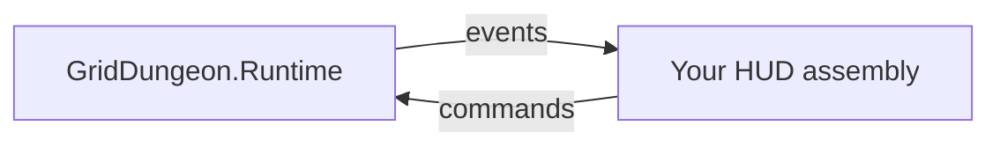

# UI event contract (integrator / external HUD)

Forward-facing reference for **replacing or extending Grid Dungeon HUD** without reading every shipped view. Describes **runtime events and command entry points** that custom UI in `GridDungeon.UI` (or a sibling assembly) should use.

**Audience:** external contributors, skin authors, tools/UVS bridges, fork teams reusing `GridDungeon.Runtime`.

**Authority:** If this doc disagrees with **shipped C#**, the game repo wins. Reconcile here when APIs change.

**Implementation repo:** [griddungeon-game](https://github.com/miramocha/griddungeon-game) — assemblies `GridDungeon.Core` → `GridDungeon.Runtime` → `GridDungeon.UI` (UI references Runtime; Runtime does **not** reference UI).

**Related (behavior, not event lists):** [exploration UI](../02-systems/exploration-ui.md), [combat § UI](../02-systems/combat.md#ui-requirements), [game phase](../02-systems/game-phase.md), [UVS phase presentation](../02-systems/uvs-phase-presentation.md), [04 — Tech notes § UI reactivity](../04-tech-notes.md#ui-reactivity). **Replace modals / plates:** [custom skill picker UI](custom-skill-picker-ui.md), [custom party UI](custom-party-ui.md).

### Documentation map (avoid duplicating this file)

| Topic | Authoritative doc | This file |
|-------|-------------------|-----------|
| **Runtime `public event` list + commands** | **Here** | Edit when C# API changes |
| Replace combat skill modal | [custom skill picker UI](custom-skill-picker-ui.md) | `ISkillUsePickerView` + host; events/commands here |
| Replace exploration strip / combat party roster | [custom party UI](custom-party-ui.md) | Event names + `CombatRosterView` API |
| Cross-phase overlays (hints, party floater, fade, sort stack) | [centralized UI services](centralized-ui-services.md) | Link only |
| Exploration HUD wiring, UXML mounts, scene graph | [exploration UI](../02-systems/exploration-ui.md) | Link only |
| MapView **per-event UI effect** (which presenter repaints what) | [exploration UI § MapView](../02-systems/exploration-ui.md#mapview-push-updates) | Cross-link |
| Combat **motion** (flash, lerp, block?) | [combat § UI motion](../02-systems/combat.md#ui-motion--feedback) | Event names only |
| Macro phase transitions, Enter/Exit | [game phase](../02-systems/game-phase.md) | `PhaseChanged` summary |
| UVS / Timeline bridges, scripted walk | [UVS phase presentation](../02-systems/uvs-phase-presentation.md) | Same events, UVS examples |
| Type sketches (target vs shipped) | [05 — class design](../05-class-design.md) | Prefer link over copying events |
| Short tech index | [04 — Tech notes](../04-tech-notes.md) | One-line pointer |

---

## Integration model

| Layer | Role for custom HUD |
|-------|---------------------|
| **Core** | Read models (`Combatant`, `BattleState`, sim results). **No events, no UI.** |
| **Runtime** | **Subscribe** to `public event` on controllers; **call** command/query methods. Owns phase transitions and rules. |
| **UI** | Your `MonoBehaviour` / presenters: clone UXML, `Q` by name, refresh on events. **No UITK data binding** at launch. |

Runtime **never** calls into your UI. You pull from `GameState` references (serialized on bootstrap or `FindAnyObjectByType` in dev only).



---

## Cross-phase (always useful)

### `GameState` (`GridDungeon.Runtime.Game`)

| Event | Signature | When raised | Typical HUD use |
|-------|-----------|-------------|-----------------|
| `PhaseChanged` | `Action<GamePhase, GamePhase>` | Macro phase transition (Hub / Exploration / Combat) | Show/hide HUD roots; full resync on enter |
| `ExplorationBindingsWired` | `Action` | After `ExplorationPhaseController` wires explorer ↔ map/foes (incl. dev re-enter) | Re-subscribe map markers; rebuild party strip |

**Read-only accessors:** `Current`, `Party`, `Map`, `Foes`, `Combat`, `Content`, `Save`.

**Transitions (call, not events):**

| Method | Use |
|--------|-----|
| `RequestTransition(GamePhase)` | Dev/tests; prefer phase-specific APIs in production |
| `RequestCombat(CombatEntryContext)` | Start fight (usually called from exploration systems) |
| `RequestQuitToTitle()` | Pause quit — no save |

### Presentation gates (Runtime + UI tweens)

All gates implement `IPresentationGate` and inherit `PresentationGateBase : MonoBehaviour` ([#231](https://github.com/miramocha/griddungeon-game/issues/231)). Callers type against `IPresentationGate` where possible.

| Component | Location | `IsLocked` | Purpose |
|-----------|----------|------------|---------|
| `HubPresentationGate` | `HubController` | Yes | Block hub confirms during feedback tweens |
| `ExplorationPresentationGate` | `ExplorationHud` GO | Yes | Block exploration HUD actions during beats; adds `AcquireHudSuppress()` / `ReleaseHudSuppress()` |
| `CombatPresentationGate` | `CombatController` | Yes | Combat playback waits; `CombatController.IsPresentationLocked` |

`Hub` and `Combat` gates share the same base logic; `ExplorationPresentationGate` extends with HUD suppress. Pattern: `Acquire()` → play DOTween → `Release()`. `ResetLocks()` on phase exit.

---

## Exploration phase

### `DungeonExplorer` (`GridDungeon.Runtime.Exploration`)

| Event | Signature | When raised | Typical HUD use |
|-------|-----------|-------------|-----------------|
| `OnPartyStep` | `Action` | Displacement step committed (before/after lerp per phase wiring) | Party strip stat refresh; FOE tick is phase-owned |
| `OnPartyEnteredCell` | `Action<GridPosition>` | Party landed on new cell | Map marker; party strip |
| `OnPartyFacingChanged` | `Action<FacingDirection>` | Turn completed | Map facing arrow |
| `OnBumpWall` | `Action<FacingDirection>` | Bump into wall | Optional feedback |
| `InteractRequested` | `Action` | Player interact input | Stairs, gather (when wired) |
| `AnimationCompleted` | `Action` | Step/turn tween finished | Scripted sequences; input repeat |

**Read:** `Cell`, `Facing`, `IsAnimating`, `StepDuration`, `TurnDuration`.

Movement is driven by **`ExplorationInputHandler`** → explorer methods, not by UI events.

### `MapSystem` (`GridDungeon.Runtime.Map`)

| Event | Signature | When raised | Typical HUD use |
|-------|-----------|-------------|-----------------|
| `RevealChanged` | `Action<IReadOnlyList<CellEdge>?>` | Fog/walls/features dirty (`null` = full refresh) | Repaint map cells; marker visibility |

### `FoeSystem` (`GridDungeon.Runtime.Exploration`)

| Event | Signature | When raised | Typical HUD use |
|-------|-----------|-------------|-----------------|
| `OnFoePatrolMoved` | `Action<FoePatrolMove>` | FOE patrol step | FOE marker slide; optional cell repaint |
| `OnFoePresenceChanged` | `Action` | FOE spawned/despawned/visibility | Marker layer refresh |

FOE **contact → combat** is handled in `ExplorationPhaseController` (`RequestCombat`), not a public `OnFoeContact` UI event.

### `PartyRuntime` — no events

Read `CoreSlots` / `AuxSlots` / `SynchroBar` directly. Refresh on `DungeonExplorer` step/cell, `PhaseChanged` (especially **Combat → Exploration**), and `ExplorationBindingsWired`.

Shipped reference: `PartyFormationFloaterPresenter` + `PartyFormationExplorationSync` + `ExplorationHudReactivePresenter` in game repo. Step-by-step replacement: [custom party UI](custom-party-ui.md#exploration-party-strip).

### `PartyMenuOverlayView` (UI, hub + exploration pause)

Shared `PartyMenu.uxml` overlay (`sortingOrder` **250**). Hub **`Tab`** and exploration **`Esc`** (map not fullscreen) open the same shell.

| Event | Signature | When raised |
|-------|-----------|-------------|
| `OpenStateChanged` | `Action` | Menu open/close — `InputRouter` / movement gates |
| `PaneLayoutChanged` | `Action` | Section or pane reveal changed |

| Method / property | Use |
|-------------------|-----|
| `Open()` / `Close()` | Toggle overlay (`PartyMenuInputHandler`, `MapInputHandler` → `Esc`) |
| `IsOpen` | Query without subscribing |

### Exploration — minimal subscribe example

```csharp
// Custom exploration party plates — GridDungeon.UI or your asmdef referencing Runtime
void OnEnable(GameState gs, DungeonExplorer ex, PartyRuntime party)
{
    gs.PhaseChanged += (_, to) =>
    {
        if (to == GamePhase.Exploration) RebuildPlates(party.CoreSlots);
        SetVisible(to == GamePhase.Exploration);
    };
    gs.ExplorationBindingsWired += () => RebuildPlates(party.CoreSlots);
    ex.OnPartyStep += () => RefreshStats(party.CoreSlots);
    ex.OnPartyEnteredCell += _ => RefreshStats(party.CoreSlots);
}

void OnDisable(/* unsubscribe all */) { }
```

Map panel: also subscribe `gs.Map.RevealChanged`, `gs.Foes.OnFoePatrolMoved` — see [exploration UI § MapView](../02-systems/exploration-ui.md#mapview-push-updates).

---

## Combat phase

### `CombatController` (`GridDungeon.Runtime.Combat`)

| Event | Signature | When raised | Typical HUD use |
|-------|-----------|-------------|-----------------|
| `OnQueueRebuilt` | `Action<TurnQueue>` | AGI queue built/rebuilt | Turn-order strip |
| `OnTurnStart` | `Action<Combatant>` | Actor becomes current | Highlights; command bar context |
| `OnCommandTargetChanged` | `Action<Combatant?>` | Planning: selected core | Roster highlight |
| `OnPartyCommandsChanged` | `Action` | Queue assign/remove/back | Queued action labels |
| `OnTargetingChanged` | `Action` | Enter/exit target pick | Valid target highlights |
| `OnPlanningPromptChanged` | `Action` | Planning HUD copy changed | Command panel prompt |
| `OnActionResolved` | `Action<CombatActionResult>` | One action resolved | HP/status/death; log line; synchro delta |
| `OnProtocolResolved` | `Action<ProtocolResolveResult>` | Protocol finished | Log; synchro reset; hit flashes |
| `BattleEnded` | `Action<BattleResult>` | Fight over | Clear HUD; gate reset |

**Read during fight:** `State` (`BattleState`), `CurrentPhase`, `IsCommandPlanning`, `IsWaitingForPlayer`, `IsSelectingTarget`, `ValidTargets`, `CommandTarget`, `PlanningPrompt`, `CanUseProtocol`, `RequiresProtocolOnlyCommands`, `IsPresentationLocked`.

Use **`State.CoreSlots` / `State.EnemySlots`** for plates, not `PartyRuntime` (battle copy). Party: `PartyFormationFloater.Grid` (`PartyFormationGridView`); enemies: `CombatRosterView.BindEnemyFormation` — [custom party UI — combat roster](custom-party-ui.md#combat-party-roster).

**Commands (wire buttons / focus nav):**

| Method | Use |
|--------|-----|
| `SelectCommandTarget(Combatant core)` | Planning roster pick |
| `SubmitPlayerAction(CombatAction action)` | Attack/guard/skill/item/protocol/flee |
| `ICombatSkillPickerHost.OpenForCommandActor` | **Skill** button — opens picker; do not submit `Skill` until player picks (see [custom skill picker UI](custom-skill-picker-ui.md)) |
| `SelectTarget(string combatantId)` | Targeting confirm |
| `CancelTargetSelection()` | Back from targeting |
| `StepBackCommandPlanning()` | LIFO undo in planning |
| `SubmitFlee()` | Flee |

Shipped reference: `CombatHudView` subscriptions in game repo `Assets/Scripts/UI/Views/CombatHudView.cs`.

### Combat — minimal subscribe example

```csharp
void OnEnable(CombatController combat, GameState gs)
{
    combat.OnActionResolved += _ => RefreshPlates(combat.State.CoreSlots);
    combat.OnTurnStart += _ => RefreshHighlights(combat);
    combat.OnPartyCommandsChanged += () => RefreshPlanning(combat);
    combat.OnCommandTargetChanged += _ => RefreshPlanning(combat);
    combat.OnTargetingChanged += () => RefreshTargets(combat);
    combat.OnQueueRebuilt += q => BindTurnStrip(q);
    combat.BattleEnded += _ => ClearPlates();
    gs.PhaseChanged += (_, to) =>
    {
        if (to == GamePhase.Combat) RefreshAll(combat.State);
    };
}

void OnAttack() => combat.SubmitPlayerAction(CombatAction.Attack(/* … */));
```

Respect `combat.IsPresentationLocked` before accepting player commands (same as `CombatPlayerCommandGate`).

While a skill picker is open, also respect `CombatPlayerCommandGate` with `skillPickerOpen: true` (command bar blocked). Wire `CombatPlayerCommandGate.TryBack(combat, skillPickerHost)` for cancel. Full replacement guide: [custom skill picker UI](custom-skill-picker-ui.md).

---

## Hub phase

Hub has **fewer runtime events**; services mutate `PartyRuntime` / save and return `bool` + message.

### `HubController` (`GridDungeon.Runtime.Hub`)

| API | Notes |
|-----|-------|
| `PresentationGate` | `HubPresentationGate` — lock during service feedback |
| `TryHealPartyAtHospital`, `TryReviveFirstFallenAtHospital`, … | Refresh credits/party UI **after** success |
| `TryLeaveHub(stratumId, floorId)` | → Exploration (sets up floor) |
| `HubCredits` | Wallet label refresh (display text from content/l10n) |

No `PartyChanged` event — refresh on button handler success or `PhaseChanged`.

Shipped reference: `HubHudView`, `HubHudReactivePresenter`.

---

## Input (not events, but required for playable HUD)

`InputRouter` (`GridDungeon.UI`) listens to `GameState.PhaseChanged` and enables **Input System** maps: Exploration, Combat, Map, Hub. Custom HUD should either:

- Keep `InputRouter` and point it at your views, or  
- Mirror the same phase → map enable rules ([input bindings](../02-systems/input-bindings.md), [game phase § Input maps](../02-systems/game-phase.md#input-maps-per-phase)).

---

## Shipped HUD entry points (reference implementations)

| Phase | Game repo path |
|-------|----------------|
| Bootstrap | `Assets/Scripts/UI/Game/GameBootstrap.cs` |
| Input | `Assets/Scripts/UI/Input/InputRouter.cs` |
| Exploration shell | `Assets/Scripts/UI/Views/ExplorationHudView.cs` |
| Party strip / combat roster | `PartyFormationFloaterPresenter.cs` · `PartyFormationGridView.cs` · `CombatRosterView.cs` (enemies) · [custom party UI](custom-party-ui.md) |
| Party / pause menu | `PartyMenuOverlayView.cs` · [exploration UI § Party / pause menu](../02-systems/exploration-ui.md#party--pause-menu-partymenuoverlayview) |
| Map | `Assets/Scripts/UI/Views/MapView.cs` |
| Map party glyph | `MapPartyMarkerPresenter` (runtime presenter) · [custom party UI § Map](custom-party-ui.md#map-party-marker-optional) |
| Combat | `Assets/Scripts/UI/Views/CombatHudView.cs` |
| Skill use picker (UITK) | `Assets/Scripts/UI/Views/SkillUsePickerToolkitView.cs` · [custom skill picker UI](custom-skill-picker-ui.md) |
| Hub | `Assets/Scripts/UI/Views/HubHudView.cs` |
| Scene wiring | `Assets/Scripts/Editor/DevSceneComposition.cs` |

---

## Checklist — custom skin parity

- [ ] Subscribe in `OnEnable`; unsubscribe in `OnDisable`
- [ ] One active combat HUD listener set per `CombatController`
- [ ] `PhaseChanged` show/hide per `GamePhase`
- [ ] Combat → Exploration: rebuild party from `PartyRuntime` / `State` sync
- [ ] Honor presentation gates if using EO-style tweens
- [ ] Do not add UI references to `GridDungeon.Runtime` asmdef

---

## Presentation bus

**ADR:** [042 — Runtime presentation bus + shell catalog](../../decisions/042-presentation-bus.md)

Runtime **gameplay events** (above) remain the authority for rules. **Presentation DTOs** are display snapshots for UITK shells, world rigs, and UVS — built by **projectors** in `GridDungeon.Runtime.Presentation`, published on **`UiPresentationBridge`**.

| Type | Location | Role |
|------|----------|------|
| `CommandRailPresentationState` | Runtime | Rail visibility, context, menu items, focus, modal flags |
| `CommandRailInfoPresentationState` | Runtime | Header title, service lines, combat prompt |
| `ItemListInventoryPresentationState` | Runtime | Hub shop / combat item / party bag picker rows, tabs, engage flags |
| `CommandRailPresentationProjector` | Runtime | Hub/combat/party menu → `CommandRailPresentationState` |
| `ItemListInventoryPresentationProjector` | Runtime | `ItemListInventoryPresenter` adapters → `ItemListInventoryPresentationState` |
| `UiPresentationBridge` | `Game` bootstrap | C# events + `UnityEvent` mirrors (`CommandRailChanged`, `ItemListInventoryChanged`, …) |
| `UiPresentationCatalog` | `Assets/UI/Settings/` | Prefab-assigned shells; `PresentationShellHost` instantiates at Play Mode |
| `ICommandRailShell` | Runtime interface, UI prefab | `Apply(state)`, `PlayBeat(beat)` — only layer that knows UXML/BEM |

**Integrator rule:** subscribe to the bridge or gameplay events; do **not** push `VisualElement` trees from Runtime. Phase HUDs contribute menu **data** via projectors (command rail pilot); shells render.

**UVS:** listen-only on `OnCommandRailChanged` / beat events — no `RequestTransition`, save writes, or `CommandRail.SwapPanelContent`. See [UVS phase presentation § UI presentation hooks](../02-systems/uvs-phase-presentation.md#ui-presentation-hooks).

**New shell prefab:** [presentation shell implementation](presentation-shell-implementation.md). **Traps:** [presentation shell gotchas](presentation-shell-gotchas.md).

---

## Not wired at launch

| Surface | Notes |
|---------|--------|
| Exploration combat log | No exploration HUD mount; combat uses `CombatHudLogView` only |
| `PartyRuntime` events | Read slots directly; refresh on explorer step / phase change |
| `IPartyRosterView` / party swap port | No single port — use events here + [custom party UI](custom-party-ui.md) |

---

## Changelog

| Date | Note |
|------|------|
| 2026-06-19 | Presentation bus: `ItemListInventoryPresentationState` + projectors ([#322](https://github.com/miramocha/griddungeon-game/pull/322)); command rail publish-only ([#321](https://github.com/miramocha/griddungeon-game/pull/321)) |
| 2026-05-30 | Cross-links to [custom party UI](custom-party-ui.md); doc map + shipped entry points |
| 2026-05-30 | mvp1-spec [#138](https://github.com/miramocha/griddungeon-game/issues/138) combat picker shipped; tech-notes party roster fix |
| 2026-05-25 | Initial integrator contract at launch shipped events); doc dedup pass |
