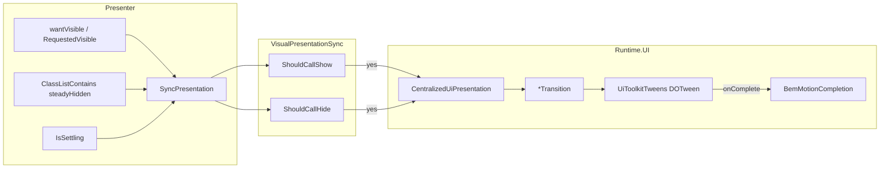

---
tags:
  - path/docs/04-dev
  - type/dev
  - scope/required
  - status/active
  - domain/ui
---
# UITK BEM transition implementation guide

**Shipped:** Shipped — [ADR 039](../../decisions/039-uitk-dotween-show-hide.md) · [ADR 038](../../decisions/038-centralized-ui-presentation-lifecycle.md) · [game PR #240](https://github.com/miramocha/griddungeon-game/pull/240)
**Namespace:** `GridDungeon.Runtime.UI` under `Assets/Scripts/Runtime/UI/`  
**Symptom catalog:** [centralized UI gotchas](centralized-ui-gotchas.md) (map fade, slide retract, party floater collapse)

## When to use

Orchestrated UITK show/hide splits **motion** from **steady state**:

| During tween | After complete |
|--------------|----------------|
| Inline `VisualElement.style` (opacity, translate, scale, width/height) via DOTween | BEM modifier on the animation target |
| `UiTransitionSession` generation guards | `StyleKeyword.Null` on inline motion properties |

Two helpers prevent order drift and presenter skip bugs:

1. **`BemMotionCompletion`** — transition `onComplete` / `Reset`: apply steady BEM **then** clear inline motion (never reverse).
2. **`VisualPresentationSync`** — presenter `SyncPresentation`: gate `Show()` / `Hide()` on **steady hidden class + `IsSettling`**, not `ICentralizedUiSurface.IsShown` alone.

`IsShown` stays **true through exit settle** ([ADR 038](../../decisions/038-centralized-ui-presentation-lifecycle.md)). A presenter that only checks `IsShown` can skip re-show while `--retracted` / `--faded` / `--collapsed` is still on, or call `Show()` again while already steady-visible.

## No hard cuts (player-visible show/hide)

**Default:** If the player can see a UITK chrome surface (slide strip, map panel, pop-in modal, command-rail body), its show/hide must use the presentation driver — **`Show()` / `Hide()`** — not an instant teardown that skips the exit tween.

| Player sees | Use | Avoid |
|-------------|-----|--------|
| Dismiss within same authority (close shop, leave service, floor beat starting) | `Hide()` / facade `Clear` | `HideImmediate()` mid-dismiss or mid-fade |
| Reopen / republish copy while strip still expanded | `SetHint` / `Show()` + `VisualPresentationSync` | `display: none` on parent while child still extended |
| Cross-fade with hub leave or `ScreenFadePresenter` | Phase owner **`Clear` at beat start** (sync with fade) | Second system caller `HideImmediate()` on same strip |

### `HideImmediate()` — allowed only when

1. **`OnDisable` / destroyed host** — no panel to animate.
2. **Context enum swap on a shared surface** — one picker across `HubShop` / `PartyBag` / `CombatItem`; deferred exit callback must not fire after the next context owns the tree ([gotchas § context switches](centralized-ui-gotchas.md#context-switches-must-not-use-animated-hide)).
3. **Competing overlay at the same sort** — authority handoff before the player could perceive exit motion.
4. **Chrome already steady-hidden** — `HideImmediate()` when `RequestedVisible` is already false and dismiss is not in flight (idempotent teardown).
5. **Fully occluded** — surface was never shown, or a full-screen fade already covers it **and** no overlapping chrome from the same family is still visible (e.g. do not snap input hint while hub leave fade is only half done).

`HideImmediate()` is **not** a shortcut for “system dismiss” when the strip is still on screen. Prefer **`Hide()`** and coordinate **who** dismisses (one owner per beat).

### One owner per beat

Multi-step flows (hub → stratum, stairs vignette, service panel close):

- **Start of player-visible beat** — phase owner calls animated dismiss (`InputHints.Clear`, minimap slide retract, hub leave fade + hint clear).
- **Mid-beat cross-system code** (`FloorTransitionPresenter`, gates, phase `OnEnter`) — do **not** call `HideImmediate()` on chrome the player still sees; use `Hide()` or skip if the owner already cleared.
- **End of beat** — `PresentationReleased` (or equivalent); underlying phase republishes with `Show()`.

**Shipped example:** hub **Depart** — `HubHudView` clears input hint when leave transition starts; `FloorTransitionPresenter` uses `InputHint.Hide()` (not `HideImmediate`); `ExplorationMapCoordinator.RefreshGlobalInputHint` on `PresentationReleased`.

### Review smells (reject in PR)

- `HideImmediate()` from Runtime beat code while phase HUD fade is in progress.
- USS `display: none` on a parent **and** slide/fade on a child in the same frame (dual authority).
- `SyncPresentation` `else` branch that applies `display: none` or steady hidden class **without** calling `Hide()` when the panel is still extended.
- `CancelPendingDismiss` → `HideImmediate` on every reason clear (wallet/floater pattern: cancel only on activate/reopen).

**Tests:** presenter settle tests (`Hide_EntersSettleWindowBeforeShownClears`, rapid swap during settle); `UiToolkitTweensTests` for transition helpers.

## Architecture



## API reference

### `BemMotionCompletion`

**Path:** `Assets/Scripts/Runtime/UI/BemMotionCompletion.cs`

```csharp
public static void ApplySteadyClassThenClearMotion(
    VisualElement target,
    string steadyClass,
    bool steadyClassActive);
```

| Step | Action |
|------|--------|
| 1 | `target.EnableInClassList(steadyClass, steadyClassActive)` |
| 2 | `UiToolkitTweens.ClearMotionStyles(target)` |

**`steadyClassActive` semantics**

| Transition moment | `steadyClassActive` | Meaning |
|-------------------|---------------------|---------|
| Present complete | `false` | Steady **visible** (hidden/retracted/faded class off) |
| Dismiss complete | `true` | Steady **hidden** (class on) |
| Reset to hidden | `true` | Same as dismiss steady state |

**Collapse exception:** `CollapseTransition` uses internal `ApplyCollapsedSteady` — class + `pickingMode` flip + `ClearMotionStyles`. Use that helper when dismiss must set `PickingMode.Ignore`.

### `VisualPresentationSync`

**Path:** `Assets/Scripts/Runtime/UI/VisualPresentationSync.cs`

All methods are pure gates — no UITK side effects.

#### `ShouldCallShow(wantVisible, steadyHidden, isSettling)`

Returns whether to call `ICentralizedUiSurface.Show()` / driver present.

| `wantVisible` | `steadyHidden` | `isSettling` | Result | Why |
|---------------|----------------|--------------|--------|-----|
| `false` | * | * | `false` | Authority wants hidden |
| `true` | `false` | `false` | `false` | Already steady visible |
| `true` | `true` | `false` | **`true`** | Steady hidden — need present |
| `true` | * | `true` | **`true`** | Mid-dismiss — reopen or finish present |

#### `ShouldCallHide(wantVisible, steadyHidden, isSettling)`

Returns whether to call `Hide()` / driver dismiss.

| `wantVisible` | `steadyHidden` | `isSettling` | Result | Why |
|---------------|----------------|--------------|--------|-----|
| `true` | * | * | `false` | Authority wants visible |
| `false` | `true` | `false` | `false` | Already steady hidden |
| `false` | `false` | `false` | **`true`** | Steady visible — need dismiss |
| `false` | * | `true` | **`true`** | Mid-present — finish dismiss |

#### `IsSteadyVisible` / `IsSteadyHidden`

Read-only chrome state (no tween in flight):

```csharp
IsSteadyVisible(steadyHidden, isSettling)  => !steadyHidden && !isSettling
IsSteadyHidden(steadyHidden, isSettling)   => steadyHidden && !isSettling
```

Use `IsSteadyVisible` to skip redundant present when context is unchanged (see `PartyFormationFloaterPresenter`).

**Tests:** `Tests → UI → VisualPresentationSyncTests` ([game repo](https://github.com/miramocha/griddungeon-game/blob/main/Assets/Tests/UI/VisualPresentationSyncTests.cs)).

---

## Recipe: new `*Transition` helper

1. **Pick steady BEM class** — kebab-case modifier on the element you tween. Add a row to [ADR 039 §3](../../decisions/039-uitk-dotween-show-hide.md#3-bem-authority-during-motion) and the [steady-class registry](#steady-class-registry) below.
2. **USS steady pixels** — opacity, translate, `display`, etc. on the modifier; no `transition-duration` on the same block C# animates.
3. **Session** — `int generation = UiTransitionSession.Begin(target)` before tween; bail in `onComplete` if `!UiTransitionSession.IsCurrent(target, generation)`.
4. **Present** — remove steady hidden class at tween start if needed; on complete: `BemMotionCompletion.ApplySteadyClassThenClearMotion(target, steadyClass, false)`.
5. **Dismiss** — on complete: `BemMotionCompletion.ApplySteadyClassThenClearMotion(target, steadyClass, true)`.
6. **Detached host** (`target.panel == null`) — skip tween; instant `BemMotionCompletion` (Edit Mode clones). See `FadeTransition.Present` / `Dismiss` in game repo.
7. **Duration** — one C# constant (e.g. `FadeTransition.DurationMs = 280`); do not duplicate in USS.
8. **Edit Mode tests** — add two cases in `UiToolkitTweensTests`:
   - `{Name}_Present_Clears{Steady}ClassAfterComplete`
   - `{Name}_Dismiss_Sets{Steady}ClassAfterComplete`  
   Use `SimulateDueScheduleCompletionForTests` + `CompleteImmediatelyForTests` patterns from existing slide/fade tests.

**Reference:** `FadeTransition`, `SlideTransition`, `CollapseTransition`, `CommandRailEnterTransition` — all complete via `BemMotionCompletion` except collapse steady path (`ApplyCollapsedSteady`).

---

## Recipe: presenter `SyncPresentation`

1. Resolve **animation target** (the element the driver tweens — label, floater root, map root).
2. `bool steadyHidden = target.ClassListContains(k_SteadyHiddenClass);`
3. `bool isSettling = m_presentation?.IsSettling ?? false;`
4. **Hide path** — when `!wantVisible`, call `Hide()` only if `VisualPresentationSync.ShouldCallHide(...)`.
5. **Show path** — when `wantVisible`, call `Show()` only if `VisualPresentationSync.ShouldCallShow(...)`.
6. **One owner** — single visibility path per chrome; avoid duplicate apply in the same frame (see [gotchas § party floater](centralized-ui-gotchas.md#party-formation-floater-double-slide-up-collapse-transition--partyformationfloaterpresenter)).

### Gold references (game repo)

| Presenter | Steady class | Pattern |
|-----------|--------------|---------|
| `InputHintPresenter` | `input-hint__text--retracted` | `ShouldCallShow` / `ShouldCallHide` on label |
| `WalletHudPresenter` | `wallet-hud__panel--retracted` | Same slide driver |
| `MinimapPanelPresenter` | `map-minimap--retracted` | `SyncMapChromeVisibility` → `SlideTransition` via `CentralizedUiPresentation` |
| `ExpandedMapOverlayPresenter` | `map-expanded--hidden` | `UniformScaleTransition` via `ScaleInPresentationDriver` |
| `PartyFormationFloaterPresenter` | `party-formation-floater--collapsed` | `IsSteadyVisible` + `ShouldCallShow` with context-reveal guard |

**Input hint sketch:**

```csharp
bool steadyHidden = m_label.ClassListContains(k_RetractedClass);
bool isSettling = m_presentation.IsSettling;

if (!RequestedVisible)
{
    if (VisualPresentationSync.ShouldCallHide(false, steadyHidden, isSettling))
        m_presentation.Hide(OnDismissVisualComplete);
    return;
}

if (!VisualPresentationSync.ShouldCallShow(true, steadyHidden, isSettling))
    return;

m_presentation.Show();
```

**Minimap chrome sketch:**

```csharp
bool steadyHidden = RetractTarget.ClassListContains(MinimapPanelPresenter.RetractedClass);
bool isSettling = m_minimap.IsSettling;

if (wantVisible && VisualPresentationSync.ShouldCallShow(true, steadyHidden, isSettling))
    m_minimap.Show();
else if (!wantVisible && VisualPresentationSync.ShouldCallHide(false, steadyHidden, isSettling))
    m_minimap.Hide();
```

Wire `SyncPresentation` from: `RequestedVisible` / context changes, `PresentationChanged`, phase suppress gates, and any authority that toggles chrome without going through `Show()` directly.

---

## Alternative: derive `IsShown` from steady class

When the **animation target is the surface root**, public `IsShown` can mirror BEM instead of lifecycle flags:

| Type | `IsShown` |
|------|-----------|
| `MinimapPanelPresenter` | `!RetractTarget.ClassListContains("map-minimap--retracted")` |
| `ExpandedMapOverlayPresenter` | `!m_surface.Root.ClassListContains("map-expanded--hidden")` |
| `CommandRailInfoPresenter` | `!m_view.Root.ClassListContains(CommandRailInfoView.HiddenClass)` |

`IsSettling` still comes from `CentralizedUiPresentation` when a driver is attached. Immediate-dismiss surfaces (`CommandRailInfoPresenter`: `IsSettling => false`) use BEM-only hide.

---

## Steady-class registry

| Transition | Steady class | USS | Present complete (`active`) | Dismiss complete (`active`) | Consumer |
|------------|--------------|-----|----------------------------|----------------------------|----------|
| `SlideTransition` | `map-minimap--retracted` | `MinimapPanel.uss` | `false` | `true` | `MinimapPanelPresenter` |
| `UniformScaleTransition` | `map-expanded--hidden` (+ `map-expanded-scale--expanded` on present complete) | `ExpandedMapPanel.uss` | scale steady | hidden steady | `ExpandedMapOverlayPresenter` |
| `FadeTransition` | `map-view--faded` | `MapView.uss` | `false` | `true` | Legacy / marker helpers |
| `SlideTransition` | `input-hint__text--retracted` | `InputHint.uss` | `false` | `true` | `InputHintPresenter` |
| `SlideTransition` | `wallet-hud__panel--retracted` | `WalletHud.uss` | `false` | `true` | `WalletHudPresenter` |
| `CollapseTransition` | `party-formation-floater--collapsed` | `PartyFormationFloater.uss` | `false` (+ picking) | `true` (+ picking) | `PartyFormationFloaterPresenter` |
| `CommandRailEnterTransition` | per-panel `hiddenClass` | phase USS | `false` on enter complete | `true` on close complete | `CommandRailPresenter` |
| Map marker fade | `map-view__marker--fade-hidden` | `MapView.uss` | immediate on hide start | — | `MapMarkerVisibility` |

Map marker row uses immediate class + opacity tween (separate DOTween target) — not `BemMotionCompletion` on shell position. See [gotchas § marker fade](centralized-ui-gotchas.md).

---

## Exceptions (do not force this pattern)

| Area | Why |
|------|-----|
| **PopIn pickers** | Host `tabbed-picker--hidden` + scale; race is `Refresh` vs `Show` during settle — hidden class applied in `CentralizedUiPresentation.FinishDismissVisual` |
| `MapViewPanelTransition` | Layout dimensions (cols/rows/cell size) on expanded surface — not show/hide authority |
| **`ScreenFadePresenter`** | Imperative full-screen fade; not `ICentralizedUiSurface` chrome |
| **`PopInTransition` enter `onComplete`** | Clears inline before host hidden class removed — documented ADR exception; do not “fix” without picker test pass |

---

## Testing checklist

### Automated (Edit Mode)

| Fixture | Covers |
|---------|--------|
| `UiToolkitTweensTests` | `BemMotionCompletion_*`, `SlideTransition_*`, `FadeTransition_*`, `CollapseTransition_*` |
| `VisualPresentationSyncTests` | All four gate methods |
| `InputHintPresenterTests` / `WalletHudPresenterTests` | Slide sync + retracted class |
| `PartyFormationFloaterPresenterTests` | Collapse sync + rapid reopen |
| `ExplorationMapCoordinatorTests` / `MinimapPanelPresenterTests` / `ExpandedMapOverlayPresenterTests` | Map chrome slide + scale sync |
| `MapPartyMarkerPresenterTests` | Marker snap (see below) |

Do not run Unity CLI batch tests while the Editor has the project open — use **Test Runner → Edit Mode** ([Assets/Tests/README.md](https://github.com/miramocha/griddungeon-game/blob/main/Assets/Tests/README.md)).

### Presenter settle tests

When changing sync gates, add or extend a test that:

1. Opens chrome (`Show` / `RequestedVisible = true`).
2. Starts dismiss (`Hide` / `RequestedVisible = false`) — `IsSettling` true, steady class may still be off.
3. Reopens before dismiss completes — must call `Show()` again (`ShouldCallShow` true while `isSettling`).

Detached hosts (`panel == null`) use instant dismiss — see [gotchas § Edit Mode without panel](centralized-ui-gotchas.md#edit-mode-tests-without-a-panel).

### Manual (Play Mode)

- **F2** exploration — minimap slide retract with stairs / HUD suppress / **Esc pause menu** ([gotchas § Map chrome vs floor transition](centralized-ui-gotchas.md#map-chrome-vs-floor-transition-screen-fade-explorationmapcoordinator)).
- Hub shop — wallet slide retract on context change.
- Bottom-right — input hint slide on overlay open/close.

---

## Related: map party marker (`forceSnap`)

Not BEM chrome — geometry-driven `left` / `top` on the marker shell via `MapGridMarkerAnimator`.

| API | Behavior |
|-----|----------|
| `MapPartyMarkerPresenter.SyncImmediate(forceSnap: true)` | Kills step tweens; snaps shell pose to `DungeonExplorer.Cell` + facing **even when the cell is still fogged** |
| `SyncImmediate(forceSnap: false)` | Skips sync while a step tween is active |

Floor load and layout resync call `forceSnap: true` from `MapView` so the marker aligns with the explorer after transitions without waiting for reveal.

**Tests:** `MapPartyMarkerPresenterTests.SyncImmediate_WithForceSnap_StopsStepTweenAndSnapsToCell`  
**Integrator:** [custom party UI § Map marker](custom-party-ui.md#map-party-marker-optional)

---

## PR checklist

- [ ] [ADR 039 §3](../../decisions/039-uitk-dotween-show-hide.md#3-bem-authority-during-motion) row for new steady class
- [ ] `BemMotionCompletion` (or documented exception)
- [ ] `VisualPresentationSync` or visual `IsShown`
- [ ] `UiToolkitTweensTests` present + dismiss class tests
- [ ] Presenter rapid-reopen-during-settle test if sync changed
- [ ] Rule: [uitk-bem-transition.mdc](../../.cursor/rules/uitk-bem-transition.mdc)

## Documentation map

| Topic | Doc |
|-------|-----|
| **This guide** | **Here** |
| Locked decision + checklist | [ADR 039](../../decisions/039-uitk-dotween-show-hide.md) |
| Lifecycle API (`IsShown`, `IsSettling`) | [centralized-ui-services § Presentation lifecycle](centralized-ui-services.md#presentation-lifecycle) |
| Symptom / fix stories | [centralized-ui-gotchas](centralized-ui-gotchas.md) |
| Service catalog + drivers | [centralized-ui-services](centralized-ui-services.md) |
