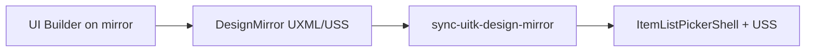

# UITK design mirror

Authority for UX sandbox workflow: mirror assets in Editor folder, agent sync to production bindables.

**Tracking:** [griddungeon-game#422](https://github.com/miramocha/griddungeon-game/issues/422)

Related: [shared menu & picker UI](shared-menu-picker-ui.md), [unity-ui-toolkit rule](../../.cursor/rules/unity-ui-toolkit.mdc), [centralized UI services](centralized-ui-services.md).

## Problem

Unity UI Builder rearranges and optimizes USS when production UXML and USS are open together. Production UITK must keep stable BEM `name` hooks and empty runtime hosts (for example `ItemListPickerShell.uxml` — empty `item-list-picker-tabs` and `windowed-list__slots`).

## Solution

| Layer | Location | Role |
|-------|----------|------|
| Mirror | `Assets/UI/Editor/DesignMirror/` | UX edits placeholder-filled UXML/USS in UI Builder |
| Production | `Assets/UI/Screens/` | Runtime bindable shells; populated in C# |
| Manifest | `mirror-manifest.yaml` | Maps mirror ↔ production paths, stripHosts, bindableNames |
| Skills | `create-uitk-design-mirror`, `sync-uitk-design-mirror` | Bootstrap mirror; promote to production |

## UX workflow

1. Open `Assets/UI/Editor/DesignMirror/.../*.DesignMirror.uxml` in **Unity UI Builder**.
2. Edit layout, BEM classes, placeholder copy.
3. Edit paired `*.DesignMirror.uss` only — not `Assets/UI/Screens/**/*.uss`.
4. Save; Builder canvas is the visual check.
5. Hand off to dev for sync.

On-ramp for UI team: [game `Assets/UI/Editor/DesignMirror/README.md`](https://github.com/miramocha/griddungeon-game/blob/main/Assets/UI/Editor/DesignMirror/README.md).

## Dev / agent workflow

| Task | Skill |
|------|-------|
| Create or refresh mirror from production + fixture | `create-uitk-design-mirror` |
| Promote UX edits to production | `sync-uitk-design-mirror` |

After sync:

- `tools/request-compile-status.ps1`
- `tools/request-test-status.ps1 -Category UI` when production UITK changed
- Manual: DevBootstrap hub shop picker (F1)

## Assembly and build

- Mirror assets: `Assets/UI/Editor/DesignMirror/` — Unity **Editor** folder, excluded from player builds.
- **No new asmdef** for initial delivery.
- Optional later Editor C#: `GridDungeon.Editor` only — never `GridDungeon.UI` / `GridDungeon.Runtime` references to mirror assets.

## Manifest schema

`Assets/UI/Editor/DesignMirror/mirror-manifest.yaml`:

| Field | Purpose |
|-------|---------|
| `id` | Component key for skills |
| `mirror.uxml` / `mirror.uss` / `fixture` | Mirror asset paths |
| `production.shellUxml` | Bindable shell to update on sync |
| `production.wrapperUxml` | Style imports only |
| `production.ussTargets` | Production USS files receiving merged selectors |
| `bindableNames` | `name` hooks that must survive sync |
| `stripHosts` | Hosts whose children are stripped in production |
| `rowTemplate.source` | C# builder documenting static row shape in mirror |

First component: `item-list-picker` → `ItemListPicker.DesignMirror.*`.

## Sync rules (summary)

1. **Shell UXML** — preserve `bindableNames`; copy non-host hierarchy/classes; empty `stripHosts`.
2. **USS** — merge mirror selector blocks into `ussTargets` by BEM prefix; Prettier.
3. **Wrapper** — `<Style src>` list only if imports changed.
4. **No placeholder text** in production labels except existing defaults.

Full procedure: **sync-uitk-design-mirror** skill.

## Language

No `phase`, `MVP`, `mvp`, or `PoC` in `Assets/**` from mirror work. Use *initial mirror*, *deferred*, *later* per [default-release-scope-language](../../.cursor/rules/default-release-scope-language.mdc).

## Out of scope (initial delivery)

- Play Mode preview / custom inspectors (deferred — separate issue if needed)
- Bi-directional production → mirror auto-sync
- Additional mirrored components beyond ItemListPicker (new issues when expanding)

## Generalization (later)

After first mirror sync is proven, add manifest entries per component (CommandRail sample panel, PartyMenu dialog, CharacterDetail). For code-built hosts (`runtimeBuilt: true`), sync USS and shell chrome only.

## Skills reference

| Skill | Canonical repo |
|-------|----------------|
| `create-uitk-design-mirror` | griddungeon-game |
| `sync-uitk-design-mirror` | griddungeon-game |

Register in `scripts/sync-cursor-skills.ps1`; run sync to design-docs copy after edits.
