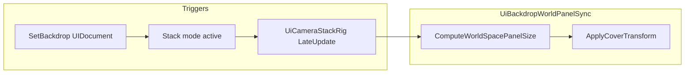

---
tags:
  - path/docs/04-dev
  - type/dev
  - scope/required
  - status/active
  - domain/ui
---
# World-space UITK cover-fit (screen aspect)

How Grid Dungeon sizes a **world-space** `UIDocument` so it **covers** the active camera view on every aspect ratio — CSS `object-fit: cover` semantics in 3D.

**Shipped:** [griddungeon-game#439](https://github.com/miramocha/griddungeon-game/pull/439) (party menu class backdrop)  
**Authority:** [UI camera stack](ui-camera-stack.md) · [ADR 049](../../decisions/049-ui-camera-stack.md)  
**Runtime:** `UiBackdropCoverLayout`, `UiBackdropWorldPanelSync` (`Assets/Scripts/Runtime/Presentation/UiBackdropWorldPanelSync.cs`)

---

## Problem

Party menu **member focus** shows a hero class label on a world-space UITK panel sandwiched between 3D environment and the focused character ([ADR 049](../../decisions/049-ui-camera-stack.md)). The panel must:

1. **Fill the camera frustum** at a fixed depth (no letterboxing on portrait or ultrawide).
2. **Track Game view / resolution resize** while Stack mode is active.
3. Stay on the **`UiBackdrop`** overlay pass — not `ScreenSpaceOverlay` HUD.

**What failed:** driving cover only via `Transform.localScale` on a fixed `worldSpaceSize` (1920×1080). Perspective height at the backdrop plane is nearly constant when width changes; uniform scale locked to height cover left landscape side gaps. Branching scale logic fixed one axis and regressed the other.

**Shipped fix:** resize **`UIDocument.worldSpaceSize`** each sync so UITK relayouts panel pixels; keep **`localScale = Vector3.one`**.

---

## Unity pieces

| Piece | Role |
|-------|------|
| `PanelSettings.renderMode` | `WorldSpace` (`1`) on `UiBackdropPanelSettings` — panel lives in scene space |
| `PanelSettings.referenceSpritePixelsPerUnit` | `100` (`UiBackdropDefaults.WorldPanelPixelsPerUnit`) — panel pixels → world units |
| `UIDocument.worldSpaceSize` | Panel size in **pixels** (width × height); UITK layout uses this as the panel canvas |
| `UIDocument` transform | Position + rotation only at runtime; **scale stays 1** |
| Base camera | Cinemachine-driven hub / party menu camera — frustum source of truth |
| Stack overlay camera | Same lens as base (`UiCameraStackRig.SyncStackOverlayLensFromBase`); draws `UiBackdrop` + `UiCharacters` |

**Do not** confuse UITK `WorldSpace` (`1`) with uGUI “Screen Space - Camera” (`m_RenderMode = 1`). See [ui-camera-stack § UITK render modes](ui-camera-stack.md#uitk-render-modes-unity-6).

---

## When sync runs



| Gate | Condition |
|------|-----------|
| `NeedsPerFrameSync` | `UiCameraStackRenderMode.Stack` **and** backdrop `UIDocument` enabled + active |
| Caller | `UiCameraStackRig` → `UiBackdropWorldPanelSync.SyncFromCameraIfNeeded(baseCamera)` |
| Layer | `ApplyDrawLayer` sets backdrop root to `UiBackdrop` when registered |

Presenters call `UiCameraStackSession.SetBackdrop(document)` — they do **not** compute cover math.

---

## Cover algorithm

Reference layout height is fixed at **1080** px (`UiBackdropDefaults.ReferenceHeight`). Width follows **live aspect** so the panel’s layout aspect matches the display.

### 1. Live aspect (`ComputeLiveAspect`)

Priority (first valid wins):

1. `camera.targetTexture` width ÷ height (tests, render-to-texture)
2. `Screen.width` ÷ `Screen.height` (Game view / player window), adjusted by `camera.rect`
3. `camera.pixelWidth` ÷ `camera.pixelHeight`
4. `camera.aspect`, adjusted by `camera.rect`

**Tests:** assign a known-size `RenderTexture` on the camera — do not assert hard-coded aspect against `Screen` in Edit Mode.

### 2. View frustum at plane (`ComputeViewSizeAtDistance`)

Plane distance: `nearClipPlane + PanelDistanceFromNearClip` (default **50** world units).

| Camera | Width | Height |
|--------|-------|--------|
| **Perspective** | `ViewportToWorldPoint` left ↔ right at mid-Y | bottom ↔ top at mid-X |
| **Orthographic** | `orthographicSize × 2 × liveAspect` | `orthographicSize × 2` |

Perspective width uses viewport corners (matches Cinemachine lens), not `viewHeight × aspect` — projection may not match stale `camera.aspect`.

### 3. Panel pixel size (`ComputeWorldSpacePanelSize`)

```
panelHeight = ReferenceHeight          // 1080
panelWidth  = panelHeight × screenAspect

layoutWorldW = panelWidth  / WorldPanelPixelsPerUnit
layoutWorldH = panelHeight / WorldPanelPixelsPerUnit

coverMultiplier = max(viewW / layoutWorldW, viewH / layoutWorldH)

worldSpaceSize = (panelWidth × coverMultiplier, panelHeight × coverMultiplier)
```

`coverMultiplier` is uniform — same as CSS **cover**: scale until **both** axes meet or exceed the frustum at the plane.

World extent on screen:

```
coverWorldW = worldSpaceSize.x / WorldPanelPixelsPerUnit
coverWorldH = worldSpaceSize.y / WorldPanelPixelsPerUnit
```

Invariant: `coverWorldW ≥ viewW` and `coverWorldH ≥ viewH` (within float tolerance).

### 4. Apply (`ApplyCoverTransform`)

| Property | Value |
|----------|--------|
| `worldSpaceSize` | Result of step 3 (skip write if `Mathf.Approximately` unchanged — avoids redundant UITK relayout) |
| `position` | `camera.position + camera.forward × planeDistance` |
| `rotation` | `LookRotation(camera.forward, camera.up)` |
| `localScale` | **`Vector3.one`** |

**Bootstrap:** `ConfigureWorldSpaceDocument` seeds **1920×1080** once at setup; first Stack sync overwrites with cover-sized dimensions.

---

## Constants

| Constant | Value | Notes |
|----------|-------|-------|
| `ReferenceWidth` / `ReferenceHeight` | 1920 / 1080 | Initial seed + mental model; runtime width is aspect-driven |
| `WorldPanelPixelsPerUnit` | 100 | Must match cloned `PanelSettings.referenceSpritePixelsPerUnit` |
| `PanelDistanceFromNearClip` | 50 | World units from near clip; tune with art if z-fighting |

---

## Shipped consumer: party menu class backdrop

| Piece | Path |
|-------|------|
| Presenter | `PartyMenuClassBackdropPresenter.cs` |
| Facade | `PartyMenuClassBackdrop` |
| UXML | `Assets/UI/Screens/PartyMenu/PartyMenuClassBackdrop.uxml` |
| Panel settings | `Assets/UI/Settings/UiBackdropPanelSettings.asset` |
| Setup | `UiBackdropDocumentSetup` — runtime `PanelSettings` clone, `WorldSpace` |

`PartyMenuStagePresenter` opens backdrop on **member focus** (orbit + core grid slot) → `SetBackdrop` → Stack → per-frame sync.

See also [centralized UI services § Party menu class backdrop](centralized-ui-services.md#party-menu-class-backdrop---partymenuclassbackdroppresenter--partymenuclassbackdrop).

---

## Testing

| Fixture | What it proves |
|---------|----------------|
| `UiBackdropCoverLayoutTests` | Aspect tracking, portrait/landscape cover both axes, `ComputeLiveAspect` RT priority, perspective frustum width |
| `UiBackdropWorldPanelSyncTests` | `localScale == 1`, `worldSpaceSize` aspect + frustum cover after `SyncFromCamera` |
| Manual | DevBootstrap → Hub → Party menu → Formation → focus core; resize Game view (narrow landscape, portrait, ultrawide) — no letterboxing |

**Edit Mode pitfall:** without `camera.targetTexture`, `ComputeLiveAspect` reads **`Screen`** — Game View aspect affects tests. Pattern:

```csharp
var rt = new RenderTexture(1920, 1080, 24);
camera.targetTexture = rt;
// ... assert ...
camera.targetTexture = null;
Object.DestroyImmediate(rt);
```

**TearDown:** `UiBackdropWorldPanelSync.ResetForTests()` + `UiCameraStackSession.ResetForTests()` — backdrop static holds `UIDocument` reference.

---

## Reuse checklist (new world-space cover panel)

1. **World Space** `PanelSettings` clone — not `GamePanelSettings` overlay.
2. Register via `SetBackdrop` so Stack mode and `NeedsPerFrameSync` engage.
3. Put root on **`UiBackdrop`** layer (`ApplyDrawLayer` / session helpers).
4. Do **not** set cover via `transform.localScale` — use `ComputeWorldSpacePanelSize` + `worldSpaceSize`.
5. Sync from **base** camera (same lens as stack overlay after `SyncStackOverlayLensFromBase`).
6. `pickingMode = Ignore` on backdrop chrome if it must not steal HUD pointer hits.
7. Add Edit Mode tests with **fixed `RenderTexture`** aspect when asserting layout ratios.

---

## Anti-patterns

| Avoid | Why |
|-------|-----|
| Uniform `localScale` on fixed 1920×1080 `worldSpaceSize` | Width-only resize does not grow panel layout; height-dominated cover math leaves side gaps |
| `viewHeight × camera.aspect` for perspective cover width | Stale or lens-adjusted aspect diverges from real viewport frustum |
| Hard-coded 16:9 in tests without RT | `ComputeLiveAspect` prefers `Screen` in Editor |
| Writing `worldSpaceSize` every frame unconditionally | Triggers unnecessary UITK relayout when size unchanged |
| `ScreenSpaceOverlay` for mid-stack hero art | Draws above all cameras — breaks env → UITK → character sandwich |

---

## Related

- [UI camera stack](ui-camera-stack.md) — layer routing, Stack vs SingleCam, spawn matrix
- [ADR 049 — UI camera stack](../../decisions/049-ui-camera-stack.md)
- [Presentation shell implementation](presentation-shell-implementation.md)
- Unity: [World Space UI](https://docs.unity3d.com/6000.3/Documentation/Manual/ui-systems/create-world-space-ui.html), [`UIDocument.worldSpaceSize`](https://docs.unity3d.com/6000.3/Documentation/ScriptReference/UIElements.UIDocument-worldSpaceSize.html)
