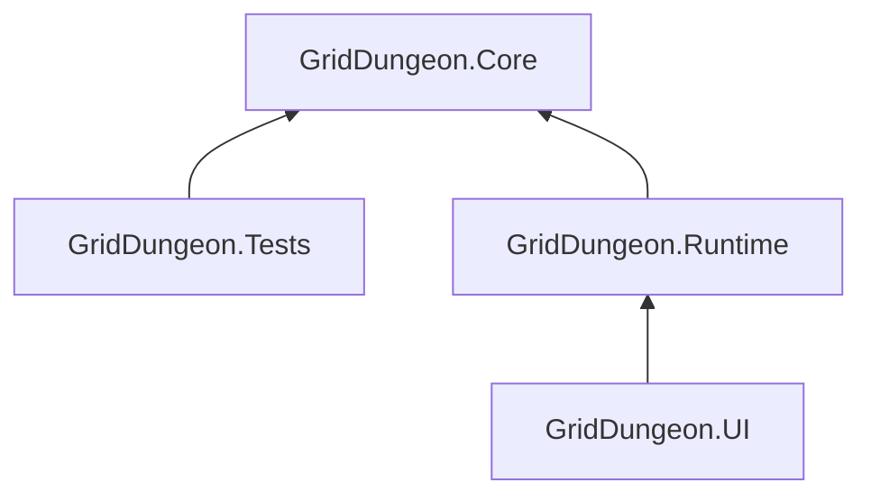

# Class Design — MVP1

Concrete classes, interfaces, and enums for the MVP1 implementation. Derived from [tech notes](04-tech-notes.md), [MVP1 spec](mvp1-spec.md), [ADR 014–016](../decisions/), and all locked system docs.

> **Status:** design draft — structure locked for MVP1; **game phase flow locked** ([ADR 017](../decisions/017-game-phase-controller.md), [game phase](02-systems/game-phase.md)); other naming open for bikeshedding before first `.cs` files commit.

---

## MVP1 architecture — design goals

| Goal | How architecture supports it |
|------|--------------------------------|
| **Test damage + AGI without Unity** | `GridDungeon.Core` simulators + `GridDungeon.Tests` (no `UnityEngine`) |
| **Hub ↔ explore ↔ combat loop** | `GamePhaseController` + three `IPhaseController`s ([game phase](02-systems/game-phase.md)) |
| **Spec-locked combat** | `CombatController` + `TurnQueue` + `EndOfRoundPipeline`; combat sub-phases not on `GamePhase` |
| **Content in data, not code** | ScriptableObjects in Runtime; **Core DTOs** (`SkillData`, `StatusData`, …) at simulator boundaries |
| **FOE + map + flee rules** | `ExplorationPhaseController` wires explorer events; `RetreatCellCalculator` in Core |
| **Phase vs presentation** | C# owns transitions; optional UVS later listens to `PhaseChanged` only ([ADR 017](../decisions/017-game-phase-controller.md)) |

Phase diagrams, exploration/combat sequences, and Enter/Exit checklists: **[game phase](02-systems/game-phase.md)**.

**Cursor rules:** Shared Unity principles from `griddungeon-game` (hard-linked under [`.cursor/rules/`](../.cursor/rules/)); architecture-specific mapping in [`architecture-design-principles.mdc`](../.cursor/rules/architecture-design-principles.mdc).

---

## Assembly structure

Four assemblies with a strict dependency direction:



```
GridDungeon.Core       (pure C#, no UnityEngine)
    ↑
GridDungeon.Runtime    (MonoBehaviours, ScriptableObjects)
    ↑
GridDungeon.UI         (UI Toolkit views, input handlers)

GridDungeon.Tests      (NUnit, references Core only)
```

| Assembly | `asmdef` path | Notes |
|----------|---------------|-------|
| `GridDungeon.Core` | `Assets/Scripts/Core/GridDungeon.Core.asmdef` | No `UnityEngine` refs; testable in CI without headless Unity |
| `GridDungeon.Runtime` | `Assets/Scripts/Runtime/GridDungeon.Runtime.asmdef` | References Core |
| `GridDungeon.UI` | `Assets/Scripts/UI/GridDungeon.UI.asmdef` | References Runtime; UI Toolkit bindings |
| `GridDungeon.Tests` | `Assets/Tests/GridDungeon.Tests.asmdef` | References Core only; `CombatSimulator` tests |

---

## Enums & value types (Core)

Defined in `GridDungeon.Core`. Shared across all layers.

```csharp
enum GamePhase       { Hub, Exploration, Combat }
enum FacingDirection { North, East, South, West }
enum CombatantKind   { Core, Summon, Guest, Enemy }
enum FormationRow    { Front, Back }
enum SkillType       { Physical, Elemental, Heal, Buff, Debuff, Deploy, Passive }
enum DamageElement   { None, Slash, Pierce, Fire, Ice, Volt }
enum BodyPart        { None, Head, Arm, Leg }
enum BattleResult    { Victory, Wipe, Flee }

// Status categories — mirrors StatusDefinition.category
enum StatusCategory  { Control, BindLimb, DoT, StatBuff, StatDebuff, BattleMod }

// Skill presentation — MVP1 only uses Fixed
enum SkillPresentation { Fixed, Cinematic, CinematicQTE }
```

### Value structs

```csharp
readonly struct GridPosition { int X; int Y; int Level; /* + operator, Equals; ADR 019 */ }
readonly struct CellEdge     { GridPosition Cell; FacingDirection Side; }
```

---

## Data layer — ScriptableObject definitions (Runtime)

All read-only at runtime. Created in the Unity editor and referenced by `ContentDatabase`.

### Character & class

```csharp
// Assets/Content/Classes/
class ClassDefinition : ScriptableObject
{
    string classId;               // "vanguard", "breaker", etc.
    string displayName;
    FormationRow preferredRow;
    CharacterBaseStats baseStats; // HP/MP/STR/TEC/AGI/VIT/LUC at level 1
    float[] statGrowth;           // per-level multipliers
    string[] allowedWeaponTypes;
    SkillTreeLayout skillTree;    // tree of SkillNodeDefinition
}

struct CharacterBaseStats { int Hp, Mp, Str, Tec, Agi, Vit, Luc; }

class SkillNodeDefinition
{
    string skillId;
    int maxRank;
    string[] prerequisiteSkillIds; // must be ≥1 to unlock this node
}
```

### Skills

```csharp
// Assets/Content/Skills/
class SkillDefinition : ScriptableObject
{
    string skillId;
    string displayName;
    SkillType skillType;
    DamageElement element;
    BodyPart bodyPartTag;         // which bind blocks this skill
    int mpCost;
    float[] powerByRank;          // index 0 = rank 1
    TargetingRule targeting;
    SkillPresentation presentation;
    StatusInflict? inflictStatus; // optional on-hit status
    string summonDefinitionId;    // set if skillType == Deploy
}

struct TargetingRule
{
    TargetKind kind;  // SingleEnemy, AllEnemies, SingleAlly, AllAllies, Self, AuxFront, AuxBack
    bool canTargetBack;
    bool pierce;      // ignores front-row melee restriction
}

struct StatusInflict { string statusId; float chance; int durationOverride; }
```

### Status

```csharp
// Assets/Content/Status/
class StatusDefinition : ScriptableObject
{
    string statusId;
    StatusCategory category;
    int defaultDurationTurns;
    float magnitude;           // e.g. 0.05 for 5% poison, 1.25 for Offense Up
    BodyPart bindPart;         // BindLimb only
    bool removedOnDamage;      // sleep wakes on hit
}
```

### Equipment & items

```csharp
// Assets/Content/Equipment/
class EquipmentDefinition : ScriptableObject
{
    string equipId;
    EquipSlot slot;            // Weapon, Head, Body, Legs, Accessory
    string[] allowedClassIds;  // empty = unrestricted
    CharacterBaseStats statBonus;
    StatusResistBonuses resistBonuses;
}

enum EquipSlot { Weapon, Head, Body, Legs, Accessory }

struct StatusResistBonuses
{
    float PoisonRes, SleepRes, PanicRes, BindHeadRes, BindArmRes, BindLegRes;
}

// Assets/Content/Items/
class ItemDefinition : ScriptableObject
{
    string itemId;
    string displayName;
    ItemEffectType effectType;  // HealHp, HealMp, CureAilment, ReviveAlly, Identify
    float power;
    int maxStack;
}

enum ItemEffectType { HealHp, HealMp, CureAilment, ReviveAlly, Identify }
```

### Enemies & encounters

```csharp
// Assets/Content/Enemies/
class EnemyDefinition : ScriptableObject
{
    string enemyId;
    string displayName;
    FormationRow defaultRow;
    CharacterBaseStats stats;
    ElementResistances resistances;
    string[] skillIds;          // enemy skill pool
    LootTable lootTable;
    int xpReward;
    bool noFlee;
    string[] statusImmuneTags;
}

struct ElementResistances
{
    float Slash, Pierce, Fire, Ice, Volt;
    // 1.0 default; 1.5 weak; 0.5 resist; 0.0 null; -0.25 absorb (post-MVP1)
}

struct LootTable { LootEntry[] Entries; }
struct LootEntry  { string itemId; float dropChance; int minQty; int maxQty; }

// Assets/Content/Encounters/
class EncounterGroup : ScriptableObject
{
    string groupId;
    EnemySlotConfig[] frontRow;  // ≤3 enemy slots
    EnemySlotConfig[] backRow;   // ≤2 enemy slots
    BattleBackgroundId background;
}

struct EnemySlotConfig { string enemyDefinitionId; bool isRequired; }
```

### Navigator & Union

```csharp
// Assets/Content/Navigators/
class NavigatorDefinition : ScriptableObject
{
    string navigatorId;           // "guild_handler"
    string displayName;
    AuraModifiers aura;           // e.g. unionGainBonus = 0.05
    string[] unionSkillIds;       // ["union_strike", "union_mend"]
    string unlockCondition;       // "" = day one; otherwise quest/stratum id
}

struct AuraModifiers { float UnionGainBonus; /* expand post-MVP1 */ }

class UnionSkillDefinition : ScriptableObject
{
    string unionSkillId;
    string displayName;
    UnionEffectType effectType;   // DamageAllEnemies, HealAllAllies, …
    float power;
    int participantCount;         // how many core must be alive to activate
    string presentationId;
}

enum UnionEffectType { DamageAllEnemies, HealAllAllies }
```

### Summons

```csharp
// Assets/Content/Summons/
class SummonDefinition : ScriptableObject
{
    string summonId;              // "test_drone"
    string displayName;
    CharacterBaseStats stats;
    int durationRounds;
    FormationRow auxRow;
    SummonAction[] actionScript;  // ordered list; loops when exhausted
}

struct SummonAction { string skillId; TargetKind targetPreference; }
```

### Floors & stratum

```csharp
// Assets/Content/Dungeons/
class StratumFloor : ScriptableObject
{
    string stratumId;             // "s1"
    string floorId;               // "B1F"
    int gridWidth;
    int gridHeight;
    FloorTileData[] tiles;        // flat array [y * width + x]
    FoeSpawnConfig[] foeSpawns;
    EncounterTable randomEncounters;
    float baseEncounterRate;
    GridPosition stairsDown;
    GridPosition stairsUp;
    GridPosition partyEntryPoint;
}

struct FloorTileData  { bool IsWalkable; bool HasGatherNode; string ChestItemId; }
struct FoeSpawnConfig { string foeId; GridPosition spawnCell; GridPosition[] patrolPath; int stepsPerMove; }
struct EncounterTable { EncounterWeight[] Entries; }
struct EncounterWeight { string groupId; float weight; }
```

---

## Core layer — models & simulators (pure C#)

No `UnityEngine` dependency. Lives in `GridDungeon.Core`.

### Combatant model

```csharp
class Combatant
{
    string Id;
    string DefinitionId;          // classId or enemyId
    CombatantKind Kind;
    FormationRow Row;
    int SlotIndex;                // 0-2 for core; 0 for aux

    CombatantStats Stats;         // runtime copy; modified each round
    int CurrentHp;
    int CurrentMp;

    List<StatusInstance> Statuses;
    List<BattleModifier> BattleMods;
    List<string> AllocatedSkillIds;
    EquipmentLoadout Equipment;   // null for enemies

    bool IsDead => CurrentHp <= 0;
    bool IsAux  => Kind is CombatantKind.Summon or CombatantKind.Guest;
}

struct CombatantStats { int Hp, Mp, Str, Tec, Agi, Vit, Luc; }

class StatusInstance
{
    string DefinitionId;
    int TurnsRemaining;
    int AppliedRound;
    string SourceCombatantId;
}

class BattleModifier
{
    string ModId;              // "guard", "charge"
    float Magnitude;
    int TurnsRemaining;        // -1 = until consumed
}

class EquipmentLoadout
{
    string WeaponId;
    string HeadId;
    string BodyId;
    string LegsId;
    string AccessoryId;
}
```

### Battle state (combat-only)

Owned by `CombatController` for the duration of a fight. Not a `GamePhase`.

```csharp
class BattleState
{
    Combatant[] CoreSlots;       // 6
    Combatant?[] AuxSlots;       // 2
    Combatant[] EnemySlots;      // 5 max, sparse
    TurnQueue Queue;
    int Round;
    CombatEntryContext Entry;
    bool FleeEnabled;            // retreat cell + encounter noFlee
    float UnionBar;              // copy from PartyRuntime at StartBattle
}

class RoundSnapshot
{
    BattleState State;
    IReadOnlyDictionary<string, SkillData> Skills;
    IReadOnlyDictionary<string, StatusData> Statuses;
}
```

### Core content DTOs (no Unity)

Runtime `ScriptableObject` types stay in `GridDungeon.Runtime`. `ContentDatabase` maps SO → DTO when loading content or starting battle. **Simulators and tests use only these types.**

```csharp
readonly record struct SkillData(
    string Id, SkillType Type, DamageElement Element, BodyPart BodyPart,
    int MpCost, float Power, TargetingRule Targeting, StatusInflict? Inflict);

readonly record struct StatusData(
    string Id, StatusCategory Category, int DefaultDurationTurns,
    float Magnitude, BodyPart BindPart, bool RemovedOnDamage);

readonly record struct NavigatorData(string Id, AuraModifiers Aura, string[] UnionSkillIds);

readonly record struct UnionSkillData(
    string Id, UnionEffectType EffectType, float Power, int ParticipantCount);

readonly record struct EnemyData(
    string Id, CharacterBaseStats Stats, ElementResistances Resistances,
    string[] SkillIds, bool NoFlee, string[] StatusImmuneTags);

readonly record struct SummonData(
    string Id, CharacterBaseStats Stats, int DurationRounds,
    FormationRow AuxRow, SummonAction[] ActionScript);
```

### Simulators (stateless, testable)

```csharp
static class CombatSimulator
{
    static RoundResult SimulateRound(RoundSnapshot snapshot);
}

static class DamageCalculator
{
    static int CalculatePhysical(Combatant attacker, Combatant defender,
        SkillData skill, IReadOnlyList<BattleModifier> mods);
    static int CalculateElemental(Combatant attacker, Combatant defender,
        SkillData skill, ElementResistances resistances);
    static int CalculateHeal(Combatant caster, SkillData skill);
}

static class HitChanceCalculator
{
    static float Calculate(Combatant attacker, Combatant defender, float blindMod = 0f);
}

static class TurnQueueBuilder
{
    static List<Combatant> Build(IEnumerable<Combatant> combatants,
        IReadOnlyDictionary<string, StatusData> statuses);
}

static class StatusSystem
{
    static void Apply(Combatant target, StatusInstance instance, StatusData def);
    static void Refresh(Combatant target, string statusId, int newDuration);
    static void Tick(Combatant target, IReadOnlyDictionary<string, StatusData> defs);
    static void Cleanse(Combatant target, StatusCategory category);
    static bool IsBlocked(Combatant actor, SkillData skill);
}

static class RetreatCellCalculator
{
    static GridPosition GetRetreatCell(GridPosition partyCell, FacingDirection facing);
    static bool IsRetreatCellWalkable(GridPosition retreatCell, FloorCollisionQuery collision);
}

static class MapRevealCalculator
{
    static IEnumerable<CellEdge> RevealOnEnterCell(GridPosition cell, int gridWidth, int gridHeight);
    static IEnumerable<CellEdge> RevealOnBump(GridPosition fromCell, FacingDirection bumpSide);
}

static class SummonScriptRunner
{
    static CombatAction ResolveNext(SummonData summon, int turnIndex, BattleState state);
}
```

### Map data model

```csharp
class FloorMapState
{
    string FloorKey;              // "s1_B1F"
    bool[,] Visited;
    WallMask[,] Walls;            // per-cell bitmask: N/E/S/W revealed
    Dictionary<GridPosition, FeatureState> Features;
    Dictionary<GridPosition, string> FoeIcons; // last known foe id
}

[Flags] enum WallMask { None = 0, North = 1, East = 2, South = 4, West = 8 }

class FeatureState
{
    FeatureType Type;              // Stairs, Door, Chest, GatherNode
    bool IsInteracted;             // door opened, chest looted
}

enum FeatureType { StairsDown, StairsUp, Door, Chest, GatherNode, JumpPad, HeightStairs }

class JumpPadData { int DeltaForward; int DeltaLevel; }   // e.g. 2 forward, +1 level
```

### FOE instance

```csharp
class FoeInstance
{
    string FoeId;
    string EncounterGroupId;
    GridPosition Cell;
    int PatrolPathIndex;
    bool IsAlive;
    int Tier;                      // used for XP/drop scaling
}
```

### Save data model

```csharp
[Serializable] class SaveGame
{
    HubSaveData Hub;
    CharacterSaveData[] Party;     // 6 characters
    string ActiveNavigatorId;
    float UnionBar;
    Dictionary<string, FloorMapStateSave> Maps;   // key: "s1_B1F"
    Dictionary<string, FoeStateSave[]>   FoeState;
    ExplorationStateSave? Exploration;             // null when in hub
}

[Serializable] struct HubSaveData
{
    int Gold;
    Dictionary<string, string> UnlockedFloors;    // stratumId → highest floorId
}

[Serializable] struct ExplorationStateSave
{
    string StratumId;
    string FloorId;
    GridPosition PartyCell;
    FacingDirection Facing;
}
```

---

## Runtime layer — MonoBehaviours & managers

Lives in `GridDungeon.Runtime`. One `MonoBehaviour` per system responsibility.

### Game phase (macro flow) — [ADR 017](../decisions/017-game-phase-controller.md)

Pure C# phase orchestration. **Not** Unity Visual Scripting. See [game phase](02-systems/game-phase.md) for diagrams and Enter/Exit rules.

```csharp
// Core/Enums/GamePhase.cs
enum GamePhase { Hub, Exploration, Combat }

// Runtime/Game/GamePhaseController.cs — plain C# (not MonoBehaviour)
sealed class GamePhaseController
{
    GamePhase Current { get; private set; }
    event Action<GamePhase, GamePhase> PhaseChanged;  // (previous, next)

    bool TryTransitionTo(
        GamePhase next,
        IReadOnlyDictionary<GamePhase, IPhaseController> controllers);
}

interface IPhaseController
{
    void OnEnter(GamePhase from);
    void OnExit(GamePhase to);
}

sealed class HubPhaseController : IPhaseController
{
    HubController Hub;
    // OnEnter(from): hub UI; if from == Exploration → FOE reset (ADR 008), ClearExplorationState
    // OnExit: hide hub UI
}

sealed class ExplorationPhaseController : IPhaseController
{
    DungeonExplorer Explorer;
    DungeonView View;
    MapSystem Map;
    FoeSystem Foes;
    EncounterTrigger Encounters;
    // OnEnter: load floor, subscribe Explorer/Foe events, show FPV
    // OnExit: unsubscribe all exploration listeners
}

sealed class CombatPhaseController : IPhaseController
{
    CombatController Combat;
    CombatScenePresenter Scene;
    DungeonView View;
    // OnEnter: hide/dim exploration, StartBattle(context)
    // OnExit: teardown arena, Combat.EndBattle cleanup
}
```

### GameState (composition root)

```csharp
// Single instance on a persistent "Game" GameObject
sealed class GameState : MonoBehaviour
{
    GamePhase Current => _phases.Current;

    GamePhaseController _phases;
    HubPhaseController _hubPhase;
    ExplorationPhaseController _explorePhase;
    CombatPhaseController _combatPhase;

    // Shared subsystems (serialized or injected)
    HubController Hub;
    DungeonExplorer Explorer;
    DungeonView View;
    CombatController Combat;
    MapSystem Map;
    FoeSystem Foes;
    PartyRuntime Party;
    NavigatorRuntime Navigator;
    UnionSystem Union;
    CodexSystem Codex;
    ContentDatabase Content;
    SaveSystem Save;

    bool RequestTransition(GamePhase phase);  // delegates to _phases.TryTransitionTo

    // UI / systems subscribe here or to _phases.PhaseChanged
    event Action<GamePhase, GamePhase> PhaseChanged;
}
```

**Transition callers (examples):** `HubController.LeaveHub` → Exploration; `FoeSystem.OnFoeContact` / `EncounterTrigger` → Combat; `CombatController.OnBattleEnded` → Exploration; wipe flow → Hub + load save.

### Exploration

```csharp
class DungeonExplorer : MonoBehaviour
{
    GridPosition Cell    { get; private set; }
    FacingDirection Facing { get; private set; }

    // Called by ExplorationInputHandler (hold IsPressed; repeat after lerp — ADR 001)
    void TryStepForward();   // WASD displacement
    void TryStepBack();
    void TryStrafeLeft();
    void TryStrafeRight();
    void TryTurnLeft();      // Q/E — hold repeat after turn lerp; no step events
    void TryTurnRight();
    void TryInteract();
    void StopMovement();     // kill tweens on combat exit
    event Action AnimationCompleted;  // input re-checks hold for repeat
    // Lerp durations from ExplorationAnimationDurations (ADR 018 preset)

    // Fired after each successful step; FoeSystem listens to advance patrol
    event Action OnPartyStep;
    // Fired when party enters a new cell; MapSystem listens
    event Action<GridPosition> OnPartyEnteredCell;
    // Fired when step blocked by wall; MapSystem listens
    event Action<FacingDirection> OnBumpWall;
}

enum ExplorationAnimationSpeed { Slow, Normal, Fast, VeryFast }

static class ExplorationAnimationDurations
{
    static (float step, float turn, float bumpSegment) Get(ExplorationAnimationSpeed speed);
    // Normal: 0.28s / 0.26s / 0.10s — see ADR 018
}

class DungeonView : MonoBehaviour
{
    void SetVisible(bool visible);
    void RenderCell(GridPosition cell, FacingDirection facing);
}
```

### Map system

```csharp
class MapSystem : MonoBehaviour
{
    FloorMapState CurrentFloor { get; private set; }

    void LoadFloor(string floorKey, FloorMapStateSave? saved);
    FloorMapStateSave Snapshot();

    // Driven by DungeonExplorer events
    void OnPartyEnteredCell(GridPosition cell);
    void OnBumpWall(FacingDirection side);

    // Returns current party cell's revealed map for UI binding
    IReadOnlyFloorMapState GetReadOnly();
}
```

### FOE system

```csharp
class FoeSystem : MonoBehaviour
{
    IReadOnlyList<FoeInstance> ActiveFoes { get; }

    void LoadFloor(string stratumId, string floorId, FoeStateSave[]? saved);
    FoeStateSave[] Snapshot();
    void ResetFloor(string stratumId, string floorId);  // called on hub return (ADR 008)

    // Listens to DungeonExplorer.OnPartyStep
    void OnPartyStep();

    // Delegates to RetreatCellCalculator (Core); used for flee UI enable
    bool CanRetreatFromFoe(GridPosition fightAnchor, FacingDirection facing);

    // Fires when FOE cell == party cell → triggers combat transition
    event Action<FoeInstance> OnFoeContact;
    event Action<FoeInstance> OnFoeVisible;  // for map icon update
}

class EncounterTrigger
{
    // Called from ExplorationPhaseController on DungeonExplorer.OnPartyStep
    // After FoeSystem handles contact; no random roll if combat already requested
    bool TryRollRandomEncounter(EncounterTable table, float baseEncounterRate,
        out string encounterGroupId);
}

class GatherInteractor
{
    // TryInteract on gather node — instant loot (MVP1, no minigame)
    bool TryGather(GridPosition cell, FloorMapState map, PartyRuntime party);
}
```

### Party runtime

```csharp
class PartyRuntime : MonoBehaviour
{
    // Read from SaveGame; mutated by hub services and combat
    Combatant[] CoreSlots   { get; }   // length 6
    Combatant?[] AuxSlots   { get; }   // length 2 (front/back); null = empty
    string ActiveNavigatorId { get; set; }
    float UnionBar           { get; set; }  // 0..1

    // All combatants eligible for AGI queue (core + non-null aux + enemies added by CombatController)
    IReadOnlyList<Combatant> AllPartyCombatants { get; }

    // Called by GuildService; updates slot assignment
    void AssignCoreSlot(int slot, Combatant character);

    // Called by CombatController at battle start/end
    void SpawnAux(SummonDefinition def, FormationRow row);
    void DismissAux(FormationRow row);
}
```

### Navigator runtime

```csharp
class NavigatorRuntime : MonoBehaviour
{
    NavigatorDefinition ActiveDefinition { get; private set; }
    IReadOnlyList<string> UnlockedNavigatorIds { get; }

    void SetActiveNavigator(string navigatorId);
    void UnlockNavigator(string navigatorId);
}

static class AuraSystem
{
    static void ApplyPassives(IReadOnlyList<Combatant> coreSix, NavigatorData nav);
    static void RemovePassives(IReadOnlyList<Combatant> coreSix);
}
```

### Union system

```csharp
class UnionSystem : MonoBehaviour
{
    // Called by CombatController after each core combatant action (below 100%)
    void OnCoreActed(Combatant actor, NavigatorDefinition nav);

    // Called by CombatController at round start when bar == 1
    bool TryBeginUnionPhase(string unionSkillId, out UnionSkillData skill);

    void SpendBar();   // → 0 after Union phase
}
```

### Combat controller

```csharp
class CombatController : MonoBehaviour
{
    BattleState State { get; }
    CombatPhase CurrentPhase { get; private set; }

    void StartBattle(CombatEntryContext context);
    void EndBattle(BattleResult result);

    // Called by UI command handlers
    void SubmitPlayerAction(Combatant actor, CombatAction action);
    void SubmitFlee();

    event Action<TurnQueue> OnQueueRebuilt;
    event Action<Combatant> OnTurnStart;
    event Action<CombatActionResult> OnActionResolved;
    event Action<BattleResult> OnBattleEnded;
}

enum CombatPhase { Idle, UnionPhase, TurnPhase, EndOfRound }

class CombatEntryContext
{
    FoeInstance? Foe;          // null = random encounter
    EncounterGroup Group;
    string BattleBackgroundId;
    GridPosition FightAnchor;
    FacingDirection PartyFacing;
}

class CombatAction
{
    CombatCommand Command;     // Attack, Guard, Skill, Item, Flee
    string? SkillId;
    string? ItemId;
    string? TargetId;          // combatant id
}

enum CombatCommand { Attack, Guard, Skill, Item, Flee }

class CombatActionResult
{
    Combatant Actor;
    Combatant? Target;
    bool Hit;
    int DamageDealt;
    int HealingDone;
    string? StatusApplied;
    string? StatusCleansed;
    bool TargetDied;
    float UnionBarDelta;
}
```

### Turn queue (used by CombatController internally)

```csharp
class TurnQueue
{
    IReadOnlyList<Combatant> Ordered { get; }   // sorted AGI order for UI strip
    Combatant Current { get; }
    void Advance();
    bool IsEmpty { get; }
}
```

### End-of-round pipeline

```csharp
// Invoked by CombatController after last AGI turn
class EndOfRoundPipeline
{
    // Returns log entries for combat log
    IEnumerable<string> Execute(
        IReadOnlyList<Combatant> allCombatants,
        IReadOnlyDictionary<string, StatusData> statusDefs,
        int round);
}
```

### Hub controller & services

```csharp
class HubController : MonoBehaviour
{
    InnService         Inn;
    HospitalService    Hospital;
    ShopService        Shop;
    GuildService       Guild;
    NavigatorOffice    NavOffice;

    void EnterHub();
    void LeaveHub(string destStratumId, string destFloorId);
}

class InnService
{
    void SaveGame();             // writes SaveSystem; restores HP/MP to full
}

class HospitalService
{
    int GetHealCost(PartyRuntime party);
    void HealParty(PartyRuntime party);      // full HP/MP + cleanse all ailments
    int GetReviveCost(Combatant character);
    void Revive(Combatant character);
}

class ShopService
{
    IReadOnlyList<EquipmentDefinition> Stock { get; }
    IReadOnlyList<ItemDefinition>      ItemStock { get; }
    void Buy(string id, PartyRuntime party);
    void Sell(string id, PartyRuntime party);
    void Identify(string equipId, PartyRuntime party);
}

class GuildService
{
    IReadOnlyList<Combatant> Roster { get; }
    void CreateCharacter(string name, string classId, string portraitId);
    void AssignToParty(string characterId, int coreSlot);
    void AllocateSkillPoint(string characterId, string skillId);
}

class NavigatorOffice
{
    IReadOnlyList<NavigatorDefinition> AvailableNavigators { get; }
    void SetActiveNavigator(string navigatorId);
}
```

### Codex system

```csharp
class CodexSystem : MonoBehaviour
{
    void RecordEncounter(string enemyId);
    void RecordWeakness(string enemyId, DamageElement element);
    void RecordStatus(string enemyId, string statusId, bool immune);
    bool IsWeaknessKnown(string enemyId, DamageElement element) ;
    bool HasEncountered(string enemyId);
}
```

### Content database

```csharp
// Single ScriptableObject; populated in editor via asset references
class ContentDatabase : ScriptableObject
{
    // Runtime SO lookup (editor assets)
    EnemyDefinition      GetEnemy(string id);
    EncounterGroup       GetEncounterGroup(string id);
    StratumFloor         GetFloor(string stratumId, string floorId);
    SkillDefinition      GetSkill(string id);
    ClassDefinition      GetClass(string classId);
    StatusDefinition     GetStatus(string statusId);
    NavigatorDefinition  GetNavigator(string navigatorId);
    UnionSkillDefinition GetUnionSkill(string skillId);
    SummonDefinition     GetSummon(string summonId);
    EquipmentDefinition  GetEquipment(string equipId);
    ItemDefinition       GetItem(string itemId);

    // Core DTO mapping (call before simulators / combat start)
    SkillData      ToSkillData(SkillDefinition so);
    StatusData     ToStatusData(StatusDefinition so);
    NavigatorData  ToNavigatorData(NavigatorDefinition so);
    UnionSkillData ToUnionSkillData(UnionSkillDefinition so);
    EnemyData      ToEnemyData(EnemyDefinition so);
    SummonData     ToSummonData(SummonDefinition so);
}
```

### Save system

```csharp
class SaveSystem : MonoBehaviour
{
    SaveGame Current { get; private set; }

    void SaveAtInn(PartyRuntime party, NavigatorRuntime nav,
                   MapSystem map, FoeSystem foes);
    void LoadLastSave();

    // Incremental map/foe save during dive (not persisted until inn)
    void CommitMapState(string floorKey, FloorMapStateSave state);
    void CommitFoeState(string floorKey, FoeStateSave[] foes);
    void CommitExplorationState(ExplorationStateSave state);
    void ClearExplorationState();  // called on hub return
}
```

---

## UI layer

Lives in `GridDungeon.UI`. UI Toolkit documents + C# controllers. **Reactive HUD (MVP1):** hub / explore / combat presenters subscribe to events, play DOTween feedback, and respect a **presentation lock** until beats finish — see [tech notes — UI reactivity](04-tech-notes.md#ui-reactivity), [combat](02-systems/combat.md#ui-motion--feedback), [mapping](02-systems/mapping.md#map-ui-motion), [hub](02-systems/hub-and-services.md#service-ui-motion).

### Input routing

```csharp
// GridDungeon.UI — subscribes to GameState.PhaseChanged on enable
class InputRouter : MonoBehaviour
{
    void Bind(GameState gameState);  // PhaseChanged += OnPhaseChanged
    void OnPhaseChanged(GamePhase previous, GamePhase next);
    // Enables/disables Input System maps: Exploration, Combat, Map, UI
}

// Stateless handlers — convert raw actions to system calls
class ExplorationInputHandler
{
    void OnMoveForward(); void OnMoveBack();
    void OnStrafeLeft(); void OnStrafeRight();
    void OnTurnLeft(); void OnTurnRight();
    void OnInteract();
    void OnToggleMap();
}

class CombatInputHandler
{
    void OnCommand(int slot);    // 1–5 → Attack/Guard/Skill/Item/Flee
    void OnUnion();              // U key at round start
    void OnSelectTarget(string combatantId);
    void OnConfirm(); void OnCancel();
}

class MapInputHandler
{
    void OnPan(Vector2 delta);
    void OnZoom(float delta);
    void OnClose();
}
```

### Dev phase HUD (bootstrap scene)

UI Toolkit panel for **issue #1** macro-phase smoke test. Not shipped in production UI.

| Asset / type | Path |
|--------------|------|
| `GamePhaseDevHud.uxml`, `GamePhaseDevHud.uss` | `Assets/UI/Screens/Dev/` (BEM: `game-phase-dev`, `game-phase-dev__button`, …) |
| `GamePhaseDevHudView` | `Assets/Scripts/UI/Dev/` — `[RequireComponent(typeof(UIDocument))]` |

```csharp
// GridDungeon.UI.Dev — DevBootstrap scene only
class GamePhaseDevHudView : MonoBehaviour
{
    GameState       GameState;       // serialized
    CombatController Combat;        // serialized
    // OnEnable: Q<> cached labels/buttons; PhaseChanged += Refresh
    // Buttons / F1–F4 → RequestTransition / RequestCombat / EndBattle(Flee)
}
```

Scene menu: **GridDungeon → Scenes → Create Dev Bootstrap** (`DevBootstrap.unity`).

### View controllers

```csharp
class ExplorationHUD : MonoBehaviour  // root VisualElement for exploration phase
{
    DungeonView       DungeonView;
    MapView           Map;
    PartyStripView    PartyStrip;
    CombatLogView     Log;
}

class CombatHUD : MonoBehaviour       // root VisualElement for combat phase
{
    TurnOrderStripView TurnOrder;
    PartyRowsView      PartyRows;    // 6 core + 2 aux
    CommandPanelView   Commands;
    TargetSelectorView Targets;
    NavigatorView      Navigator;
    UnionBarView       UnionBar;
    CombatLogView      Log;
    EnemySlotsView     EnemySlots;
}

class MapView : MonoBehaviour
{
    // Minimap ortho cam → RenderTexture on UIToolkit; MapProxy layer cubes only (ADR 002)
    // Fullscreen overlay; input passes through to ExplorationInputHandler (ADR 014)
    void Show(); void Hide();
    void RenderFloor(IReadOnlyFloorMapState state, GridPosition partyCell, FacingDirection facing);
    void UpdateFoeIcons(IReadOnlyList<FoeInstance> visible);
    void RefreshMapTexture();   // when MapSystem reveal dirty
}

class PartyStripView : MonoBehaviour
{
    void Bind(IReadOnlyList<Combatant> coreSix);
    void Refresh();
}

// Horizontal AGI queue strip; rules in combat.md § Turn order strip.
class TurnOrderStripView : MonoBehaviour
{
    void Bind(TurnQueue queue);   // TurnQueue.Ordered + Current
    void Advance();               // highlight next slot; OnTurnStart from CombatController
}

class CommandPanelView : MonoBehaviour
{
    void ShowForCombatant(Combatant actor, bool fleeEnabled);
    event Action<CombatAction> OnActionSelected;
}

class TargetSelectorView : MonoBehaviour
{
    void ShowTargets(IReadOnlyList<Combatant> valid);
    void Hide();
    event Action<string> OnTargetSelected;
}

class UnionBarView : MonoBehaviour
{
    void SetValue(float normalized);  // 0..1
}

class NavigatorView : MonoBehaviour
{
    void Bind(NavigatorDefinition def);
    void SetUnionReady(bool ready);
}

class CombatLogView : MonoBehaviour
{
    void AppendLine(string text);
    void Clear();
}

class EnemySlotsView : MonoBehaviour
{
    void SpawnEnemySlot(int slot, EnemyDefinition def);
    void MarkDead(int slot);
    void ShowStatusIcons(int slot, IReadOnlyList<StatusInstance> statuses);
}
```

---

## Key interfaces

```csharp
// Allows MapSystem to expose read-only state to UI without leaking internals
interface IReadOnlyFloorMapState
{
    bool IsVisited(GridPosition cell);
    WallMask GetWalls(GridPosition cell);
    bool TryGetFeature(GridPosition cell, out FeatureState feature);
    bool TryGetFoeIcon(GridPosition cell, out string foeId);
}

// IPhaseController — defined under Game phase above; OnEnter(from) / OnExit(to)
```

### CombatantFactory (Runtime)

```csharp
static class CombatantFactory
{
    static Combatant FromCharacterSave(CharacterSaveData save, ClassDefinition classDef, ContentDatabase db);
    static Combatant FromEnemyData(EnemyData data, FormationRow row, int slotIndex);
}
```

---

## Folder structure (Unity Assets)

```
Assets/
├── Scripts/
│   ├── Core/                     GridDungeon.Core.asmdef
│   │   ├── Models/               Combatant.cs, BattleState.cs, FoeInstance.cs, FloorMapState.cs, ...
│   │   ├── Content/              SkillData.cs, StatusData.cs, EnemyData.cs, NavigatorData.cs, ...
│   │   ├── Simulators/           DamageCalculator.cs, RetreatCellCalculator.cs, TurnQueueBuilder.cs, ...
│   │   ├── SaveData/             SaveGame.cs, FloorMapStateSave.cs, ...
│   │   └── Enums/                GamePhase.cs, CombatantKind.cs, ...
│   ├── Runtime/                  GridDungeon.Runtime.asmdef
│   │   ├── Game/                 GameState.cs, GamePhaseController.cs,
│   │   │                         HubPhaseController.cs, ExplorationPhaseController.cs,
│   │   │                         CombatPhaseController.cs, IPhaseController.cs
│   │   ├── Exploration/          DungeonExplorer.cs, DungeonView.cs, FoeSystem.cs,
│   │   │                         EncounterTrigger.cs, GatherInteractor.cs
│   │   ├── Map/                  MapSystem.cs
│   │   ├── Combat/               CombatController.cs, CombatScenePresenter.cs, TurnQueue.cs, …
│   │   ├── Party/                PartyRuntime.cs, CombatantFactory.cs, NavigatorRuntime.cs, AuraSystem.cs
│   │   ├── Union/                UnionSystem.cs
│   │   ├── Hub/                  HubController.cs, InnService.cs, HospitalService.cs, ...
│   │   ├── Codex/                CodexSystem.cs
│   │   ├── Content/              ContentDatabase.cs
│   │   └── Save/                 SaveSystem.cs
│   └── UI/                       GridDungeon.UI.asmdef
│       ├── Dev/                  GamePhaseDevHudView.cs (dev bootstrap only)
│       ├── Game/                 GameBootstrap.cs
│       ├── Input/                InputRouter.cs, ExplorationInputHandler.cs, ...
│       └── Views/                ExplorationHUD.cs, CombatHUD.cs, MapView.cs, ...
├── UI/
│   ├── Settings/                 GamePanelSettings.asset (shared UIDocument panel)
│   ├── Themes/                   Theme StyleSheets (optional)
│   └── Screens/
│       └── Dev/                  GamePhaseDevHud.uxml, GamePhaseDevHud.uss
├── Content/
│   ├── Classes/                  *.asset (ClassDefinition SOs)
│   ├── Skills/                   *.asset (SkillDefinition SOs)
│   ├── Status/                   *.asset (StatusDefinition SOs)
│   ├── Equipment/                *.asset (EquipmentDefinition SOs)
│   ├── Items/                    *.asset (ItemDefinition SOs)
│   ├── Enemies/                  *.asset (EnemyDefinition SOs)
│   ├── Encounters/               *.asset (EncounterGroup SOs)
│   ├── Navigators/               *.asset (NavigatorDefinition SOs)
│   ├── UnionSkills/              *.asset (UnionSkillDefinition SOs)
│   ├── Summons/                  *.asset (SummonDefinition SOs)
│   └── Dungeons/
│       └── Stratum01/            B1F.asset, B2F.asset, B3F.asset
├── Tests/                        GridDungeon.Tests.asmdef
│   ├── DamageCalculatorTests.cs
│   ├── TurnQueueBuilderTests.cs
│   └── StatusSystemTests.cs
└── Plugins/
    └── Demigiant/DOTween/        (Asset Store import — required, see tech notes)
```

---

## MVP1 content IDs (locked)

These string IDs must be stable across code and SO assets.

| Type | ID | Notes |
|------|----|-------|
| Class | `vanguard`, `breaker`, `medic`, `summoner`, `marksman`, `tactician` | Day-one roster |
| Navigator | `guild_handler` | Unlocked day one; aura: `unionGainBonus = 0.05` |
| Union skill | `union_strike`, `union_mend` | Damage all / heal all |
| Summon | `test_drone` | Summoner-only; 3 turns; scripted |
| Summon skill | `deploy_test_drone` | Uses `SummonDefinition.test_drone`, aux back |
| Stratum | `s1` | Stratum 1 |
| Floors | `s1_B1F`, `s1_B2F`, `s1_B3F` | Save/map keys |
| Items | `medica`, `amrita`, `nectar`, `return_thread`, `analysis_glass` | Starter consumables |
| Status | `poison`, `sleep`, `panic`, `bind_head`, `bind_arm` | MVP1 subset |
| Stat mods | `offense_up`, `offense_down`, `defense_up`, `defense_down`, `magic_up`, `magic_down`, `speed_up`, `speed_down`, `blind`, `regen` | |

---

## Related docs

- [04 — Tech notes](04-tech-notes.md) — engine stack, high-level module map, save format
- [MVP1 spec](mvp1-spec.md) — systems checklist
- [ADR 014 — MVP1 exploration & map](../decisions/014-mvp1-exploration-map.md)
- [ADR 015 — MVP1 combat](../decisions/015-mvp1-combat.md)
- [ADR 016 — Summon control MVP1](../decisions/016-summon-control-mvp1.md)
- [ADR 017 — Game phase controller](../decisions/017-game-phase-controller.md)
- [Game phase](02-systems/game-phase.md)
- [Combat](02-systems/combat.md)
- [Combat status & buffs](02-systems/combat-status-and-buffs.md)
- [Party & classes](02-systems/party-and-classes.md)
- [Character progression](02-systems/character-progression.md)
- [FOE encounters](02-systems/foe-encounters.md)
- [Navigator](02-systems/navigator.md)
- [Union](02-systems/union.md)
