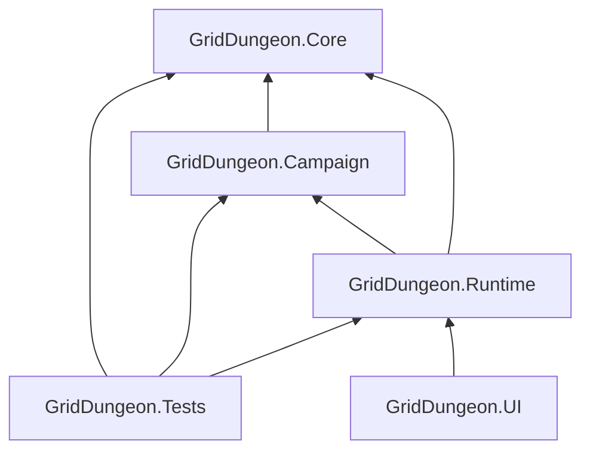

---
tags:
  - path/docs
  - type/dev
  - scope/required
  - status/accepted
  - domain/phase
---
# Class Design

Type catalog and assembly map for the launch implementation. **Authoritative C#** lives in [griddungeon-game](https://github.com/miramocha/griddungeon-game) under `Assets/Scripts/` and `Assets/Content/`. Behavior, flows, and acceptance criteria live in [system docs](02-systems/) and [ADRs](../decisions/).

Derived from [tech notes](04-tech-notes.md), [release scope](00-release-scope.md), [ADR 014–016](../decisions/), and locked system docs.

> **Status:** structure locked for required slice; **game phase flow locked** ([ADR 017](../decisions/017-game-phase-controller.md), [game phase](02-systems/game-phase.md)). Naming bikesheds resolve in the game repo, not here.

---

## Architecture — design goals

| Goal | How architecture supports it |
|------|--------------------------------|
| **Test damage + AGI without Unity** | `GridDungeon.Core` simulators + `GridDungeon.Tests` (mostly Core; Runtime when wiring needs it) |
| **Hub → explore → combat loop** | `GamePhaseController` + three `IPhaseController`s ([game phase](02-systems/game-phase.md)) |
| **Spec-locked combat** | `CombatController` + `TurnQueue` + `EndOfRoundPipeline`; combat sub-phases not on `GamePhase` |
| **Content in data, not code** | ScriptableObjects in Runtime; **Core DTOs** (`SkillData`, `StatusData`, …) at simulator boundaries |
| **FOE + map + flee rules** | `ExplorationPhaseController` wires explorer events; `RetreatCellCalculator` + `FoeFleeRetreatPlacement` in Core |
| **Phase vs presentation** | C# owns transitions; optional UVS later listens to `PhaseChanged` only ([ADR 017](../decisions/017-game-phase-controller.md)) |

Phase diagrams, exploration/combat sequences, and Enter/Exit checklists: **[game phase](02-systems/game-phase.md)**.

**Cursor rules:** Shared Unity principles from `griddungeon-game` (hard-linked under [`.cursor/rules/`](../.cursor/rules/)); architecture-specific mapping in [`architecture-design-principles.mdc`](../.cursor/rules/architecture-design-principles.mdc). **Type suffix patterns** (`*View`, `*Presenter`, `*Coordinator`, Core simulators): [class naming patterns](04-dev/class-naming-patterns.md) + [`unity-csharp-class-suffix-patterns.mdc`](../.cursor/rules/unity-csharp-class-suffix-patterns.mdc).

---

## Assembly structure

Four assemblies with a strict dependency direction:



```
GridDungeon.Core       (pure C#, no UnityEngine)
    ^
GridDungeon.Campaign   (S1 policy + story behavior; references Core)
    ^
GridDungeon.Runtime    (MonoBehaviours, ScriptableObjects)
    ^
GridDungeon.UI         (UI Toolkit views, input handlers)

GridDungeon.Tests      (NUnit, references Core + Runtime; domain folders — game repo Assets/Tests/README.md)
```

| Assembly | `asmdef` path | Notes |
|----------|---------------|-------|
| `GridDungeon.Core` | `Assets/Scripts/Core/GridDungeon.Core.asmdef` | No `UnityEngine` refs; simulators + DTOs ([improvement plan](plans/core-assembly-improvement-plan.md)) |
| `GridDungeon.Campaign` | `Assets/Scripts/Campaign/GridDungeon.Campaign.asmdef` | S1 campaign + story behavior; references Core only |
| `GridDungeon.Runtime` | `Assets/Scripts/Runtime/GridDungeon.Runtime.asmdef` | References Core + Campaign |
| `GridDungeon.UI` | `Assets/Scripts/UI/GridDungeon.UI.asmdef` | References Runtime; UI Toolkit bindings |
| `GridDungeon.Tests` | `Assets/Tests/GridDungeon.Tests.asmdef` | References Core + Campaign + Runtime; Edit Mode layout in game repo [Assets/Tests/README.md](https://github.com/miramocha/griddungeon-game/blob/main/Assets/Tests/README.md) |

**Do not put campaign/story behavior in Core** — stratum resolvers, story executors, trigger catalogs, and S1 flag policy live in `GridDungeon.Campaign`. Core keeps DTOs and neutral models only. Enforced in PR review: [unity-core-campaign-assembly.mdc](../.cursor/rules/unity-core-campaign-assembly.mdc).

---

## Enums & value types (Core)

Defined in `GridDungeon.Core/Enums/` (and related Core folders). Shared across all layers.

| Enum | Values |
|------|--------|
| `GamePhase` | `Hub`, `Exploration`, `Combat` |
| `FacingDirection` | `North`, `East`, `South`, `West` |
| `CombatantKind` | `Core`, `Summon`, `Guest`, `Enemy` |
| `FormationRow` | `Front`, `Back` |
| `SkillType` | `Physical`, `Elemental`, `Heal`, `Buff`, `Debuff`, `Deploy`, `Passive` |
| `DamageElement` | `None`, `Slash`, `Pierce`, `Fire`, `Ice`, `Volt` |
| `BodyPart` | `None`, `Head`, `Arm`, `Leg` |
| `BattleResult` | `Victory`, `Wipe`, `Flee` |
| `StatusCategory` | `Control`, `BindLimb`, `DoT`, `StatBuff`, `StatDebuff`, `BattleMod` |
| `SkillPresentation` | `Fixed`, `Cinematic`, `CinematicQTE` (launch uses `Fixed` only for class skills) |
| `EquipSlot` | `Weapon`, `Head`, `Body`, `Legs`, `Accessory` |
| `ItemEffectType` | `HealHp`, `HealMp`, `CureAilment`, `ReviveAlly`, `Identify` |
| `LootResolveMode` | `IndependentEntries`, `PickOneWeighted` |
| `ProtocolEffectType` | `DamageAllEnemies`, `HealAllAllies` |
| `FloorExitDirection` | `Up`, `Down` |
| `FloorExitTargetKind` | `Hub`, `Floor` |
| `FeatureType` | `StairsDown`, `StairsUp`, `Door`, `Chest`, `GatherNode`, `JumpPad`, `HeightStairs` |
| `CombatPhase` | `Idle`, `CommandPlanning`, `TurnPhase`, `EndOfRound` |
| `CombatCommand` | `Attack`, `Guard`, `Skill`, `Item`, `Protocol`, `Flee` |
| `ExplorationAnimationSpeed` | `Slow`, `Normal`, `Fast`, `VeryFast` |
| `ExplorationMapKind` | `Stratum`, `SideDungeon` (optional side dungeons — [ADR 022](../decisions/022-side-dungeons-mvp3.md)) |

**Value structs:** `GridPosition` (X, Y, Level — [ADR 019](../decisions/019-floor-verticality.md)), `CellEdge`, `CharacterBaseStats`, `TargetingRule`, `StatusInflict`, `ElementResistances`, `FloorExitLink`, `FloorTileData`, `FoeSpawnConfig`, `StoryEventTriggerConfig` (floor-authored exploration story trigger: cell + `storyEventId` + optional `RequiredFlagsTrue` / `RequiredFlagsFalse`), and other small DTOs in Core — see game repo `Assets/Scripts/Core/`.

---

## Content definitions (Runtime ScriptableObjects)

All read-only at runtime. Created in the Unity editor and referenced by `ContentDatabase`. Field-level authority: linked system and content docs; asset instances under `Assets/Content/`.

| Type | Asset folder | Authority |
|------|--------------|-----------|
| `ClassDefinition`, `SkillNodeDefinition` | `Assets/Content/Classes/` | [party & classes](02-systems/party-and-classes.md), [class skills](03-content/class-skills.md) |
| `SkillDefinition` | `Assets/Content/Skills/` | [class skills](03-content/class-skills.md), [ADR 035](../decisions/035-skill-use-picker.md), [combat presentation](02-systems/combat-presentation.md) |
| `StatusDefinition` | `Assets/Content/Status/` | [combat status & buffs](02-systems/combat-status-and-buffs.md) |
| `EquipmentDefinition` | `Assets/Content/Equipment/` | [character progression](02-systems/character-progression.md), [ADR 036](../decisions/036-party-inventory-model.md) |
| `ItemDefinition` | `Assets/Content/Items/` | [items & inventory](02-systems/items-and-inventory.md) |
| `EnemyDefinition` | `Assets/Content/Enemies/` | [enemy roster](03-content/enemy-roster.md) |
| `LootTableDefinition` | `Assets/Content/LootTables/` | [items & inventory](02-systems/items-and-inventory.md) |
| `RandomEncounterTableDefinition` | `Assets/Content/RandomEncounterTables/` | [dungeons & encounters](03-content/dungeons-and-encounters.md#random-encounter-table), [enemy-roster](03-content/enemy-roster.md#foe-vs-random-placement-per-floor); floor assigns `randomEncounterTableId` only |
| `EncounterGroup` | `Assets/Content/EncounterGroups/` | [enemy roster](03-content/enemy-roster.md), [FOE encounters](02-systems/foe-encounters.md); optional `Events[]` combat→story rows ([combat § Encounter events](02-systems/combat.md#encounter-events-combat--story)) |
| `StoryEventDefinition` | `Assets/Content/StoryEvents/` | [story events](02-systems/story-events.md), [ADR 028](../decisions/028-story-visual-novel-events.md) |
| `NavigatorDefinition` | `Assets/Content/Navigators/` | [navigator](02-systems/navigator.md) |
| `ProtocolSkillDefinition` | `Assets/Content/ProtocolSkills/` | [synchro protocol](02-systems/synchro-protocol.md) |
| `SummonDefinition` | `Assets/Content/Summons/` | [summons & guests](02-systems/summons-and-guests.md), [ADR 016](../decisions/016-summon-control-mvp1.md) |
| `ExplorationFloor` | `Assets/Content/Floors/` | [mapping](02-systems/mapping.md), [floor painter](02-systems/floor-editor.md), [ADR 040](../decisions/040-floor-exit-topology-graph.md); `randomEncounterTableId` → shared table SO |
| `StratumDefinition` | `ContentDatabase` | [dungeons & encounters](03-content/dungeons-and-encounters.md), [campaign S1 intro](03-content/campaign/s1-intro.md) |
| `CampaignStartConfig` | `ContentDatabase` | Cold start: `CampaignStartType` Hub vs Spawn, `LocationId` / `FloorId` / `HubExitId` — `GameBootstrapPhase` picks initial macro phase |
| `NewGameDefaults` | `ContentDatabase` | `DefaultNavigatorId` seeded by `NewGameBootstrap` on first save |

**Authoring rules:** [dungeons — warp gates](03-content/dungeons-and-encounters.md#stratum-entry--warp-gates-locked), [campaign S1 intro](03-content/campaign/s1-intro.md), [ADR 040 — exit links](../decisions/040-floor-exit-topology-graph.md). At launch: only `s1` uses `partyEntryPoint` (spawn start) + blockers; `s2+` adds `hasWarpGate`.

**Chest / gather:** `IsWalkable=false` + `HasChest` + `ChestConfig[]` on floor asset (orthogonally adjacent interact while **facing** chest — [#105](https://github.com/miramocha/griddungeon-game/issues/105)); opened state in `CampaignSaveData.OpenedChestIds` (fixed item + quantity, not loot table); `HasGatherNode` + `lootTableId` on walkable gather cells.

---

## Core — models & simulators

No `UnityEngine` dependency. Lives in `GridDungeon.Core`.

### Models

| Type | Role |
|------|------|
| `Combatant`, `CombatantStats`, `StatusInstance`, `BattleModifier`, `EquipmentLoadout` | Runtime combatant state |
| `BattleState`, `RoundSnapshot` | Combat-only state owned by `CombatController` |
| `FloorMapState`, `FeatureState`, `WallMask`, `JumpPadData` | Map reveal and features |
| `FoeInstance` | Map FOE entity instance |
| `SaveGame`, `HubSaveData`, `ExplorationStateSave`, related save structs | Persisted game state ([ADR 036](../decisions/036-party-inventory-model.md)) |
| `CombatEntryContext`, `CombatAction`, `CombatActionResult`, `PartyCommandBatch` | Combat entry and queued commands |
| `TurnQueue` | AGI-ordered turn list (Core type; driven by `CombatController`) |

### Content DTOs (no Unity)

Runtime `ScriptableObject` types stay in `GridDungeon.Runtime`. `ContentDatabase` maps SO → DTO when loading content or starting battle. **Simulators and tests use only DTOs.**

| DTO | Source SO |
|-----|-----------|
| `SkillData` | `SkillDefinition` |
| `StatusData` | `StatusDefinition` |
| `NavigatorData` | `NavigatorDefinition` |
| `ProtocolSkillData` | `ProtocolSkillDefinition` |
| `EnemyData` | `EnemyDefinition` |
| `SummonData` | `SummonDefinition` |

### Simulators (stateless, testable)

| Type | Responsibility |
|------|----------------|
| `DamageCalculator` | Physical, elemental, heal formulas |
| `HitChanceCalculator` | Hit chance with blind mod |
| `TurnQueueBuilder` | AGI sort with status effects |
| `FloorExitResolver` | Hub-return / exit-link spawn and facing from `FloorExitLink[]` |
| `EncounterEventEvaluator` | Combat encounter event predicates |
| `StatusSystem` | Apply, refresh, tick, cleanse, skill block checks |
| `ValidTargetCalculator` | Living targets per `TargetingRule` |
| `CombatTargeting` | Player target requirement, resolve, stale check |
| `FleeCalculator` | Flee success percent and roll |
| `RetreatCellCalculator` | Retreat cell from party pose + walkability |
| `FoeFleeRetreatPlacement` | Post-flee grid placement (FOE contact only — [ADR 011](../decisions/011-foe-flee-retreat.md)) |
| `MapRevealCalculator` | Reveal on enter cell and bump |
| `SummonScriptRunner` | Summon action script resolution |
| `InventoryRules`, `InventoryBagCatalog`, `EquipmentStatAggregator` | Bag and equip rules ([ADR 036](../decisions/036-party-inventory-model.md)) |
| `CombatSimulator` | Full round simulation (tests) |
| `GuildPartyRules` | Generic party formation slot rules (no campaign flag writes) |
| `StoryEventTriggerLookup` | Floor trigger cell match + flag gates |

Edit Mode fixtures: [Assets/Tests/README.md](https://github.com/miramocha/griddungeon-game/blob/main/Assets/Tests/README.md).

---

## Runtime — MonoBehaviours & managers

Lives in `GridDungeon.Runtime`. One primary type per system responsibility unless noted.

### Game phase ([ADR 017](../decisions/017-game-phase-controller.md))

Pure C# phase orchestration. **Not** Unity Visual Scripting. Diagrams and Enter/Exit rules: [game phase](02-systems/game-phase.md).

| Type | Role |
|------|------|
| `GamePhaseController` | `TryTransitionTo`, `PhaseChanged` event |
| `IPhaseController` | `OnEnter(from)`, `OnExit(to)` |
| `HubPhaseController` | Hub UI; FOE reset on return from exploration ([ADR 008](../decisions/008-campaign-defaults.md)) |
| `ExplorationPhaseController` | Floor load, explorer/FOE wiring, FPV visibility |
| `CombatPhaseController` | Hide exploration, `StartBattle` / arena teardown |
| `GameState` | Composition root; `RequestTransition`, subsystem refs |

**Transition callers (examples):** `HubController.LeaveHub` → Exploration; FOE contact / `EncounterTrigger` → Combat; `CombatController.OnBattleEnded` → Exploration; wipe → Hub + load save.

### Exploration & map

| Type | Role |
|------|------|
| `DungeonExplorer` | Grid step, facing, interact; `OnPartyStep`, `OnPartyEnteredCell`, `OnBumpWall` |
| `ExplorationAnimationDurations` | Step/turn/bump durations per preset ([ADR 018](../decisions/018-exploration-animation-speed.md)) |
| `DungeonView` | FPV mount visibility |
| `MapSystem` | `FloorMapState` load/snapshot; reveal on explorer events |
| `FoeSystem` | Spawn, patrol, snapshot, hub reset; `CanRetreatFromFoe` |
| `EncounterTrigger` | Random encounter roll on party step |
| `GatherInteractor` | Gather node interact (instant loot at launch) |

### Party, navigator, protocol

| Type | Role |
|------|------|
| `PartyRuntime` | Six core + two aux slots, Synchro bar mirror |
| `NavigatorRuntime` | Active navigator, unlock roster |
| `AuraSystem` | Passive aura apply/remove |
| `ProtocolSystem` | Synchro gain on core act; Protocol spend at 100% |

### Combat

| Type | Role |
|------|------|
| `CombatController` | Battle lifecycle, command planning, AGI turns, flee |
| `EncounterEventScheduler` | Combat→story rows from `EncounterGroup.Events[]` ([combat § Encounter events](02-systems/combat.md#encounter-events-combat--story)) |
| `CombatScenePresenter` | Arena rig and enemy slot anchors ([combat scene](02-systems/combat-scene.md)) |
| `CombatPresentationGate` | Presentation lock for reactive HUD |
| `EndOfRoundPipeline` | Status ticks and end-of-round log lines |
| `CombatantFactory` | Build `Combatant` from save or `EnemyData` |

S1 tutorial FOE: `EncounterGroupId` `grp_alley_stalker_tutorial` from story `start_combat` or floor FOE spawn; `NoFlee` on `CombatEntryContext` or encounter/enemy defs. Mid-fight unlock VN: `EncounterGroup.Events[]` → `EncounterEventScheduler` ([combat § Encounter events](02-systems/combat.md#encounter-events-combat--story)). Floor spawn metadata: `FoeSpawnConfig.TutorialFirstFoe`, `NoFlee`.

### Hub, codex, content, save

| Type | Role |
|------|------|
| `HubController` | Inn, hospital, shop, guild, navigator office |
| `InnService`, `HospitalService`, `ShopService`, `GuildService`, `NavigatorOffice` | Hub service rules |
| `CodexSystem` | Enemy encounter / weakness / status knowledge |
| `ContentDatabase` | SO lookup + `To*Data` DTO mapping; `CampaignStart`, `NewGameDefaults` |
| `SaveSystem` | Inn save, incremental map/foe/exploration commits |
| `GameBootstrapPhase` | Maps save load result + `CampaignStartConfig` → initial `GamePhase` |
| `FloorPartyEntryBuilder` | Resolves hub-return spawn/facing from `FloorExitResolver` + floor `exitLinks[]` |

---

## Campaign (S1 policy)

Lives in `GridDungeon.Campaign`. References Core only.

| Type | Role |
|------|------|
| `S1CampaignResolver` | S1 floor keys, spawn cells, encounter suppress |
| `HubStratumEntryRules` | Hub stratum entry eligibility (`GuildPartyRules`) |
| `NewGameBootstrap` | Seeds `NewGameDefaults` on empty save (`SaveGameFactory` shell) |
| `StoryEventIds`, `StoryEventTriggerCatalog` | Content IDs and trigger catalog (catalog fallback until floor rows migrated) |
| `ExplorationStoryEventTriggers` | Floor-first resolver with `StoryEventTriggerCatalog` fallback |

**Core (not Campaign):** `StoryEventEffectExecutor`, `StoryEventPlayOnceRules` — effect dispatch + play-once checks. **Runtime:** `StoryEventRunner`, `StoryEventPlayback`.

Authority: [story events](02-systems/story-events.md), [unity-core-campaign-assembly.mdc](../.cursor/rules/unity-core-campaign-assembly.mdc).

---

## UI layer

Lives in `GridDungeon.UI`. UI Toolkit documents + C# presenters. **Reactive HUD at launch:** combat — `CombatHudReactivePresenter` + `CombatPresentationGate` ([#35](https://github.com/miramocha/griddungeon-game/pull/35)); exploration — map marker overlay presenters + `MapGridMarkerAnimator` ([#90](https://github.com/miramocha/griddungeon-game/pull/90)). See [tech notes — UI reactivity](04-tech-notes.md#ui-reactivity), [UI event contract](04-dev/ui-event-contract.md).

### Input routing

| Type | Role |
|------|------|
| `InputRouter` | Binds to `GameState.PhaseChanged`; enables Exploration / Combat / Map / UI action maps |
| `ExplorationInputHandler` | Movement, turn, interact, map toggle |
| `CombatInputHandler` | Commands, protocol menu, target select, confirm/cancel |
| `MapInputHandler` | Pan, zoom, close |

### Shipped views (game repo)

| Concern | Types / assets |
|---------|----------------|
| Exploration HUD | `ExplorationHudView`, `ExplorationMapCoordinator`, `MinimapPanelView`, `ExpandedMapOverlayView` |
| Map markers | `MapPartyMarkerPresenter`, `MapFoeMarkersPresenter`, `MapGatherMarkersPresenter`, `MapGridMarkerAnimator` |
| Combat HUD | `CombatHudView`, `CombatHudReactivePresenter`, `CombatRosterView`, `CombatHudLogView` |
| Party menu | `PartyMenuOverlayView`, `PartyFormationFloaterPresenter`, `PartyFormationGridView` |
| Shared services | `ItemListInventoryPresenter`, `InputHintPresenter`, `CommandRailPresenter` — [centralized UI services](04-dev/centralized-ui-services.md) |
| Global input hints | `InputHints`, `TabbedPickerRailHints` |

**Exploration UI authority:** [exploration UI](02-systems/exploration-ui.md). **Combat UI authority:** [combat](02-systems/combat.md). **Custom pickers:** [custom party UI](04-dev/custom-party-ui.md), [custom skill picker UI](04-dev/custom-skill-picker-ui.md).

### Dev bootstrap HUD

| Asset / type | Path |
|--------------|------|
| `GamePhaseDevHud.uxml`, `GamePhaseDevHud.uss` | `Assets/UI/Screens/Dev/` |
| `GamePhaseDevHudView` | `Assets/Scripts/UI/Dev/` |

Scene menu: **GridDungeon → Scenes → Create Dev Bootstrap** (`DevBootstrap.unity`, not in git).

### Editor tools

| Type | Role |
|------|------|
| `GridDungeonSaveEditorWindow` | Save / campaign flag dev tooling ([PR #84](https://github.com/miramocha/griddungeon-game/pull/84)) |
| `FloorEditorWindow` | Floor Editor → `ExplorationFloor` asset ([ADR 002](../decisions/002-mapping-model.md), [#107](https://github.com/miramocha/griddungeon-game/issues/107)) |
| `FloorEditorFoeSpawnStore`, `FloorEditorStoryEventStore` | Floor Editor parallel stores for FOE spawns and story-event triggers (mode-gated grid overlays) |
| `FloorEditorFoeInspector`, `FloorEditorStoryEventInspector`, `FloorEditorRandomEncountersInspector` | Side-panel editors for FOE / Events / Random Encounters modes |
| `EncounterGroupEditor`, `RandomEncounterTableEditor`, `StoryEventEditor` | UITK `CreateInspectorGUI` content SO inspectors ([unity-editor-ui-toolkit](../.cursor/rules/unity-editor-ui-toolkit.mdc)) |

---

## Key interfaces

| Interface | Role |
|-----------|------|
| `IPhaseController` | Macro phase Enter/Exit hooks |
| `IReadOnlyFloorMapState` | Read-only map state for UI without leaking `MapSystem` internals |
| `ICentralizedUiSurface` | Shared overlay lifecycle vocabulary — [centralized UI services](04-dev/centralized-ui-services.md) |

---

## Folder structure (Unity Assets)

```
Assets/
├── Scripts/
│   ├── Core/                     GridDungeon.Core.asmdef
│   │   ├── Models/               Combatant, BattleState, FoeInstance, FloorMapState, …
│   │   ├── Content/              SkillData, StatusData, EnemyData, NavigatorData, …
│   │   ├── Simulators/           DamageCalculator, ValidTargetCalculator, RetreatCellCalculator, …
│   │   ├── SaveData/             SaveGame, FloorMapStateSave, …
│   │   └── Enums/                GamePhase, CombatantKind, …
│   ├── Campaign/                 GridDungeon.Campaign.asmdef
│   │   └── …                     S1CampaignResolver, StoryEventEffectExecutor, …
│   ├── Runtime/                  GridDungeon.Runtime.asmdef
│   │   ├── Game/                 GameState, GamePhaseController, *PhaseController
│   │   ├── Exploration/          DungeonExplorer, FoeSystem, EncounterTrigger, …
│   │   ├── Map/                  MapSystem
│   │   ├── Combat/               CombatController, CombatScenePresenter, …
│   │   ├── Party/                PartyRuntime, CombatantFactory, NavigatorRuntime
│   │   ├── Protocol/             ProtocolSystem
│   │   ├── Hub/                  HubController, *Service
│   │   ├── Codex/                CodexSystem
│   │   ├── Content/              ContentDatabase
│   │   └── Save/                 SaveSystem
│   └── UI/                       GridDungeon.UI.asmdef
│       ├── Dev/                  GamePhaseDevHudView
│       ├── Game/                 GameBootstrap
│       ├── Input/                InputRouter, *InputHandler
│       └── Views/                Phase HUDs, map presenters, shared overlays
├── UI/
│   ├── Settings/                 GamePanelSettings.asset
│   ├── Themes/
│   └── Screens/                  UXML/USS per screen + Shared/
├── Content/
│   ├── Classes/, Skills/, Status/, Equipment/, Items/
│   ├── Enemies/, EncounterGroups/, LootTables/, RandomEncounterTables/
│   ├── StoryEvents/, Floors/
│   ├── Navigators/, ProtocolSkills/, Summons/
├── Tests/                        GridDungeon.Tests.asmdef (see game repo README)
└── Plugins/Demigiant/DOTween/    required (see tech notes)
```

---

## Content IDs (locked)

These string IDs must be stable across code and SO assets.

**Full skill kit (targeting, effects, stubs):** [launch class skills](03-content/class-skills.md).

| Type | ID | Notes |
|------|----|-------|
| Class | `vanguard`, `breaker`, `medic`, `summoner`, `marksman`, `tactician` | Day-one roster |
| Navigator | `guild_handler` | Sortie Lead; day one; aura: `synchroGainBonus = 0.05` — [navigator](02-systems/navigator.md) |
| Protocol skill | `protocol_strike`, `protocol_mend` | Damage all enemies / heal all living core — [synchro-protocol](02-systems/synchro-protocol.md) |
| Summon | `scout_drone` | Summoner-only; 3 rounds; **player-controlled** kit |
| Summon deploy skill | `deploy_scout_drone` | Summoner tree only; `SkillType.Deploy` → `scout_drone`, aux back ([ADR 016](../decisions/016-summon-control-mvp1.md)) |
| Summon skill | `volt_burst` | On `scout_drone` summon kit only — not on Summoner class tree |
| Stratum | `s1` | Stratum 1 |
| Floors | `s1_B1F`, `s1_B2F`, `s1_B3F` | Save/map keys |
| Items | `patch_kit`, `stim_draft`, `trauma_kit`, `return_thread`, `analysis_glass` | Starter consumables |
| Equipment | `guild_shortsword`, `leather_coif`, `leather_jacket`, `leather_boots`, `scout_charm` | Launch shop slice — [progression — launch equipment](02-systems/character-progression.md#launch-equipment-locked) |
| Status | `poison`, `sleep`, `panic`, `bind_head`, `bind_arm` | Launch subset |
| Stat mods | `offense_up`, `offense_down`, `defense_up`, `defense_down`, `magic_up`, `magic_down`, `speed_up`, `speed_down`, `blind`, `regen` | |
| Enemy | `stray_hound`, `rust_mite`, `gutter_crow`, `scrapling`, `shackle_rat`, `venom_slime`, `alley_thug`, `rubble_guard`, `s1_warden` | [enemy-roster](03-content/enemy-roster.md) |
| Enemy skill | `enemy_attack`, `atk_peck_volt`, `atk_bind_arm`, `atk_poison_spit`, `atk_heavy_swing`, `atk_guard_slam`, `atk_warden_bind`, `atk_warden_venom` | Enemy pool only |
| Encounter group | `grp_alley_stalker`, `grp_alley_stalker_tutorial`, `grp_s1_warden`, `grp_b1_chaff_hound`, `grp_b1_chaff_mite`, `grp_b2_chaff`, `grp_b2_shackle_rat`, `grp_b2_venom_slime`, `grp_b3_mix_hounds`, `grp_b3_rubble_pair`, `grp_b3_control` | Slot layouts in roster doc |
| Random encounter table | `enc_s1_none`, `enc_s1_b1_chaff`, `enc_s1_act2_mid`, `enc_s1_act3_deep`, `enc_s1_stub` | Shared table SOs; floors reference by id ([dungeons § random encounter table](03-content/dungeons-and-encounters.md#random-encounter-table)) |
| FOE entity | `foe_alley_stalker`, `foe_s1_warden` | Map keys; not `EnemyDefinition` ids |

### Class skills (3 per class — locked)

| Class | `skill_id` | `skill_id` | `skill_id` |
|-------|------------|------------|------------|
| Vanguard | `vanguard_guard` | `vanguard_shield_bash` | `vanguard_protect` |
| Breaker | `breaker_power_slash` | `breaker_cleave` | `breaker_pierce_drive` |
| Medic | `medic_heal` | `medic_purify` | `medic_revive` |
| Summoner | `summoner_volt_bolt` | `deploy_scout_drone` | `summoner_focus` |
| Marksman | `marksman_aimed_shot` | `marksman_bind_shot` | `marksman_volley` |
| Tactician | `tactician_rally` | `tactician_weaken` | `tactician_field_mend` |

All class skills: **`presentation: Fixed`** ([combat presentation](02-systems/combat-presentation.md)).

**Optional side dungeon IDs (draft, optional — not required slice):** `sd01`, floors `sd01_F1`, `sd01_F2` — [side dungeons](02-systems/side-dungeons.md).

---

## Side dungeons (sketch)

**Authority:** [side dungeons](02-systems/side-dungeons.md), [ADR 022](../decisions/022-side-dungeons-mvp3.md). Does **not** change required-slice locked content IDs above.

| Concern | Notes |
|---------|-------|
| `ExplorationStateSave.MapKind` | `Stratum` or `SideDungeon` |
| `ExplorationStateSave.LocationId` | Stratum id (`s1`) or side location (`sd01`) |
| `SaveGame.UnlockedSideDungeonIds` | Optional draft field |
| Map / FOE dictionary keys | Stratum: `s1_B1F`; side: `sd01_F1` |

| API | Caller | Phase |
|-----|--------|-------|
| `LeaveHub(stratumId, floorId)` | Hub **Enter Stratum** | → Exploration (stratum rules) |
| `EnterSideDungeon(locationId, floorId)` | Hub **Side expedition** | → Exploration (side rules; exit → hub only) |

---

## Related docs

- [Stratum 1 enemy roster](03-content/enemy-roster.md) — locked S1 enemies, groups, skill stubs
- [04 — Tech notes](04-tech-notes.md) — engine stack, high-level module map, save format
- [Release scope](00-release-scope.md) — systems checklist
- [ADR 014 — launch exploration & map](../decisions/014-mvp1-exploration-map.md)
- [ADR 015 — launch combat](../decisions/015-mvp1-combat.md)
- [ADR 016 — Summon control](../decisions/016-summon-control-mvp1.md)
- [ADR 017 — Game phase controller](../decisions/017-game-phase-controller.md)
- [Game phase](02-systems/game-phase.md)
- [Combat](02-systems/combat.md)
- [Combat status & buffs](02-systems/combat-status-and-buffs.md)
- [Party & classes](02-systems/party-and-classes.md)
- [Launch class skills](03-content/class-skills.md)
- [Character progression](02-systems/character-progression.md)
- [FOE encounters](02-systems/foe-encounters.md)
- [Side dungeons](02-systems/side-dungeons.md)
- [ADR 022 — Side dungeons MVP3](../decisions/022-side-dungeons-mvp3.md)
- [Navigator](02-systems/navigator.md)
- [Synchro Protocol](02-systems/synchro-protocol.md)
