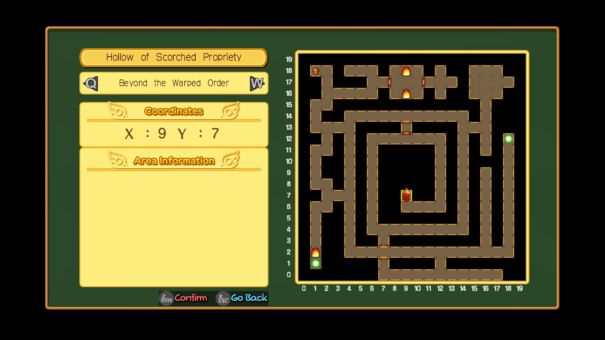
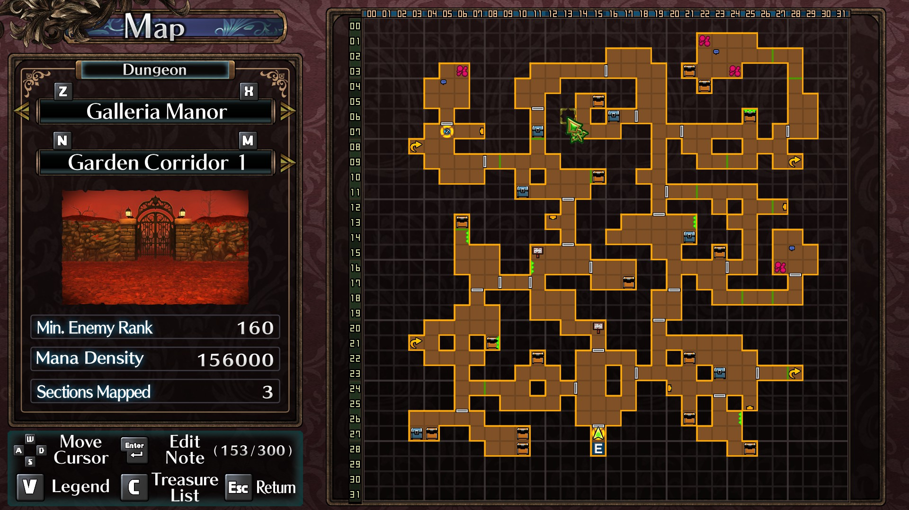
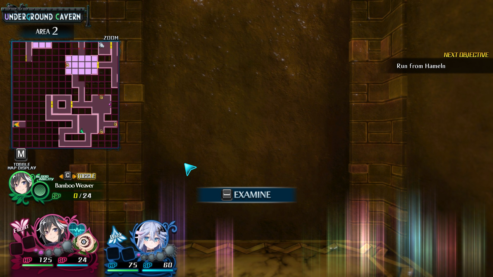
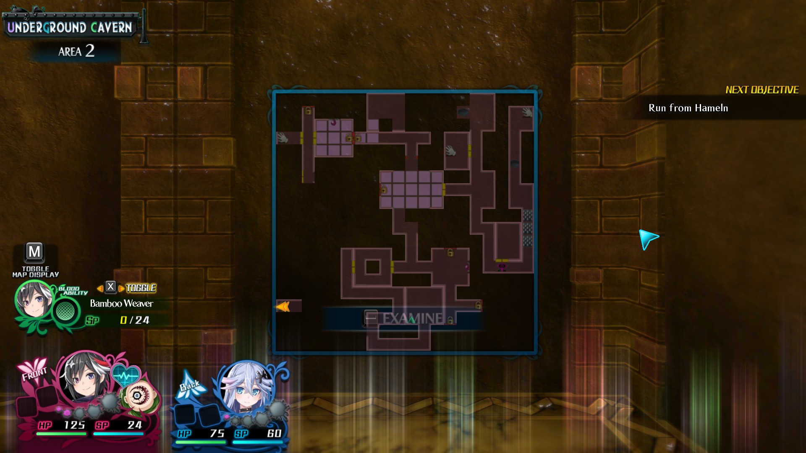

# Map UI — inspiration (other games)

**Scratchpad only** — screenshots and notes from other titles for map UI ideas. Does **not** override [mapping](../02-systems/mapping.md), [map-cell-art](../02-systems/map-cell-art.md), or ADRs.

**Mechanics / tone refs:** [00 — Game references](../00-game-references.md) (EO, Mary Skelter, etc.).

**Our locked map rules (when comparing):** [mapping](../02-systems/mapping.md) · [map-cell-art](../02-systems/map-cell-art.md)

---

## Screenshots

Upload PNG/JPG/WebP to [`assets/map-ui/`](assets/map-ui/) and add a row below (or copy the [entry template](#entry-template)).

| # | Game | Tags | Borrow? | Notes |
|---|------|------|---------|-------|
| 1 | [Class of Heroes 3 Remaster](https://store.steampowered.com/app/3301820/Class_of_Heroes_3_Remaster/) | side-panel, coordinates, floor-picker, grid-20×20, hazard-icons, POI-glow, door-segments | maybe | ACQUIRE school DRPG (2025). Split UI: location + **X/Y** left, schematic right; dungeon/floor pills with Q/W. Brown corridors on black; red crystal = party; fire / green POI / orange exit arrow. Empty **Area Information** panel — room for legend later. |
| 2 | [Labyrinth of Galleria: The Moon Society](https://store.steampowered.com/app/1998340/Labyrinth_of_Galleria_The_Moon_Society/) | side-panel, floor-picker, grid-32×32, treasure-icons, map-notes, legend, area-preview | maybe | NIS **Coven and Labyrinth** (2023); sequel lineage to *Refrain*. Ornate chrome; **Galleria Manor → Garden Corridor 1** with Z/X and N/M floor cycling; stats (enemy rank, mana density, sections mapped). Dense icon set: chests, events, stairs, doors, note pins. **Player map notes** (Enter, 153/300) — **out of scope** for us ([mapping](../02-systems/mapping.md)); study layout/icons only. |
| 3 | [Mary Skelter 2](https://store.steampowered.com/app/1496250/Mary_Skelter_2/) | exploration-minimap, always-on, area-label, toggle-M, zoom, lock-icons | maybe | IDEA FACTORY / COMPILE HEART FPV DRPG (2022). Top-left minimap during explore: **UNDERGROUND CAVERN / AREA 2**, pink explored fill, green facing triangle, yellow locks/POI; `[M] TOGGLE MAP DISPLAY`, zoom. Direct [MSK secondary ref](../00-game-references.md#mary-skelter--hub--base-secondary). |
| 4 | [Mary Skelter 2](https://store.steampowered.com/app/1496250/Mary_Skelter_2/) | expanded-map-overlay, toggle-M, pass-through, lock-icons, examine-on-map | maybe | **`[M]` expanded map** over live FPV — large centered grid (same **AREA 2** data as #3), orange party arrow, locks / hand interact icons; dungeon still visible behind; party HUD + **M** toggle remain. Overlay, not separate menu. |

---

### 1 · Class of Heroes 3 Remaster — floor map

| | |
|---|---|
| **Steam** | [Class of Heroes 3 Remaster](https://store.steampowered.com/app/3301820/Class_of_Heroes_3_Remaster/) |
| **Developer** | ACQUIRE Corp. · PQube |
| **Released** | 18 Sep 2025 |
| **Genre** | School-themed **3D dungeon-crawler** RPG; labyrinthine dungeons, party build (race/class/items) |
| **Tags** | side-panel, coordinates, floor-picker, grid-20×20, hazard-icons, POI-glow, door-segments |
| **Borrow?** | maybe |



**What to study:** Two-column fullscreen map — metadata column (dungeon name, floor name, **Coordinates X/Y**, **Area Information** stub) + numbered grid map (0–19). Floor switching on pills (Q/W). Corridor fill vs void; door segments across cells; distinct icons for party, hazards (fire), POI (green glow), exit (orange arrow).

**vs Grid Dungeon:** EO-adjacent auto-map discipline (no note toolbar in this shot); coordinate read is explicit — we use grid 1:1 but may not need X/Y labels MVP1. Good reference for **read-only schematic + context column**.

---

### 2 · Labyrinth of Galleria: The Moon Society — floor map

| | |
|---|---|
| **Steam** | [Labyrinth of Galleria: The Moon Society](https://store.steampowered.com/app/1998340/Labyrinth_of_Galleria_The_Moon_Society/) |
| **Developer** | Nippon Ichi Software · NIS America |
| **Released** | 14 Feb 2023 |
| **Franchise** | [Coven and Labyrinth](https://store.steampowered.com/franchise/coven) (*Refrain* → *Galleria*) |
| **Genre** | Dungeon-crawler; puppet army, underground labyrinth, ~50h exploration |
| **Tags** | side-panel, floor-picker, grid-32×32, treasure-icons, map-notes, legend, area-preview |
| **Borrow?** | maybe (chrome/icons only) |



**What to study:** Ornate **Map** screen — left stack: dungeon → manor → **floor name** (Z/X, N/M), small **area preview** image, floor stats (**Min. Enemy Rank**, **Mana Density**, **Sections Mapped**), control legend (WASD cursor, **V** legend, **C** treasure list). Right: large grid (00–31), orange explored fill, star **party facing**, chests, events (flowers), stairs, doors, note signposts, entrance marker.

**vs Grid Dungeon:** Same broad genre as our [Mary Skelter / NIS labyrinth](../00-game-references.md#secondary-references) lane — strong **icon vocabulary** and floor chrome. **Do not borrow** player-placed map notes or note quota ([ADR 002](../../decisions/002-mapping-model.md) — no drawing tools). **Treasure list** hotkey is a nice UX pattern to compare with our read-only feature reveals.

---

### 3 · Mary Skelter 2 — exploration minimap (HUD)

| | |
|---|---|
| **Steam** | [Mary Skelter 2](https://store.steampowered.com/app/1496250/Mary_Skelter_2/) |
| **Developer** | IDEA FACTORY · COMPILE HEART · Ghostlight |
| **Released** | 13 Jan 2022 |
| **Series** | Sequel to *Mary Skelter: Nightmares*; package includes MSK1 remake |
| **Genre** | **FPV** nightmare dungeon-crawler; living prison **The Jail**; **Nightmares** chase in real time; Blood Maidens, turn-based combat + transformation |
| **Tags** | exploration-minimap, always-on, area-label, toggle-M, zoom, lock-icons, explored-fill |
| **Borrow?** | maybe |



**What to study:** Map lives on the **exploration HUD** (not a separate menu in this shot) — top-left stack: location banner (**UNDERGROUND CAVERN**), sub-area (**AREA 2**), square grid minimap with purple grid lines, **pink/magenta** explored paths, **green triangle** party facing, **yellow lock** / POI squares, thick white wall edges; **ZOOM** above, **`[M] TOGGLE MAP DISPLAY`** below. High contrast on dark FPV view — map stays readable without covering center reticle.

**vs Grid Dungeon:** Closest fit to our [MSK secondary references](../00-game-references.md#secondary-references) — **auto-map**, FPV grid labyrinth, **strong threats on the map** (Nightmares / Marchens). Matches MVP1 **always-on side map in exploration** + **`M` fullscreen** ([mapping § Map UI](../02-systems/mapping.md#map-ui)). Study **compact minimap chrome** and icon read; not MSK hub/base presentation.

---

### 4 · Mary Skelter 2 — expanded map overlay (`[M]`)

| | |
|---|---|
| **Steam** | [Mary Skelter 2](https://store.steampowered.com/app/1496250/Mary_Skelter_2/) |
| **Tags** | expanded-map-overlay, toggle-M, pass-through, lock-icons, examine-on-map |
| **Borrow?** | maybe |



**What to study:** **`[M]` toggled** — large **centered** map panel (blue frame) over the **live FPV** dungeon (brown brick still visible). Same location chrome as #3 (**UNDERGROUND CAVERN / AREA 2**). Bigger grid read: dark purple corridors, pink rooms, **orange arrow** party facing (vs green triangle on minimap), **padlock** doors, **hand** interact icons, colored POI dots; **EXAMINE** prompt anchored on the map panel. Bottom HUD still shows party (FRONT/BACK), Blood Ability, and **`[M] TOGGLE MAP DISPLAY`** — map is an overlay, not a full-screen menu like CoH3/Galleria.

**vs Grid Dungeon:** Strong reference for MVP1 **`M` fullscreen** ([mapping § Map UI](../02-systems/mapping.md#map-ui), [ADR 014](../../decisions/014-mvp1-exploration-map.md)) — **pass-through** exploration (FPV + HUD remain) vs dedicated map screen. Pair with #3 for **minimap → expanded** on the same floor state. Keep our schematic **read-only** (auto icons only; MSK **EXAMINE** on map is interact routing, not drawing). No separate pan/zoom chrome visible in this shot.

---

## Entry template

Copy this block for each new screenshot. Bump **#** in the index table above.

```markdown
### N · Game name — short label

| Steam | |
| Developer | |
| Tags | |
| Borrow? | |


**What to study:**

**vs Grid Dungeon:**
```

---

## Ideas (no screenshot yet)

- 

---

## Related

- [Refs index](README.md)
- [02 — Mapping](../02-systems/mapping.md)
- [Map cell art](../02-systems/map-cell-art.md)
- [00 — Game references](../00-game-references.md)
