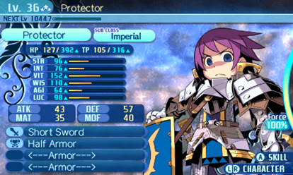

---
tags:
  - path/docs/refs
  - type/ref
  - scope/later
  - status/draft
  - domain/ui
  - domain/hub
---
# Party / character UI — inspiration (other games)

**Scratchpad only** — screenshots and notes from other titles for party menu, character inspect, and equipment layout ideas. Does **not** override [items & inventory § Equipment pane](../02-systems/items-and-inventory.md#equipment-pane), [custom party UI](../04-dev/custom-party-ui.md), or ADRs.

**Mechanics / tone refs:** [00 — Game references](../00-game-references.md) (Etrian Odyssey primary).

**Our locked party inspect rules (when comparing):** [items & inventory § Equipment pane](../02-systems/items-and-inventory.md#equipment-pane) · [custom party UI § Equipment menu](../04-dev/custom-party-ui.md#equipment-menu-party-pause) · shipped `CharacterDetailView` (`PartyEquipDisplay`)

---

## Screenshots

Upload PNG/JPG/WebP to [`assets/party-ui/`](assets/party-ui/) and add a row below.

| # | Game | Tags | Borrow? | Notes |
|---|------|------|---------|-------|
| 1 | *Etrian Odyssey IV* (3DS) | character-status, class-header, stat-bars, derived-combat-stats, equipment-icons, portrait, force-gauge, subclass-pills | maybe (layout chrome) | Full single-character status screen — Protector Lv 36. Study **information hierarchy** and **equipment row** affordance; not a pixel-copy target for UITK at launch. |

---

### 1 · Etrian Odyssey IV — character status (Protector)

| | |
|---|---|
| **Platform** | Nintendo 3DS (*Etrian Odyssey IV: Legends of the Titan*) |
| **Genre** | Guild-based dungeon-crawler; class + subclass; turn-based combat |
| **Tags** | character-status, class-header, stat-bars, derived-combat-stats, equipment-icons, portrait, force-gauge, subclass-pills |
| **Borrow?** | maybe — **layout hierarchy** and equipment **readability**; defer portrait / Force / subclass chrome |

#### Layout zones (top → bottom, left → right)

| Zone | EO content | Grid Dungeon today |
|------|------------|-------------------|
| **Header bar** | `Lv. 36` + stars, class name (**Protector**), thin **NEXT** XP bar (`NEXT Lv 10447`) | `CharacterDetail` header: class display name + `Lv N` only — no XP bar on inspect pane |
| **Class row** | Two pill capsules: main class + **SUB CLASS** (e.g. Imperial) | No subclass UI at launch |
| **Stats panel (left)** | Bordered box: **HP** / **TP** current÷max with buff ▲ arrows; six **attribute bars** (STR, INT, VIT, WIS, AGI, LUC); four **derived** boxes (ATK, DEF, MAT, MDF) | **Shipped** `CharacterDetailView`: HP/MP `ProgressBar` rows, STR/TEC/AGI/VIT/LUC bar rows, ATK/DEF/MAT/MDF grid, five icon equip rows |
| **Equipment (bottom-left)** | Four **horizontal** rounded slots with **item icons** + names (weapon + three armor lines) | Five vertical rows (`weapon` / `head` / `body` / `legs` / `accessory`) with icon + name on `CharacterDetail` |
| **Portrait (right)** | Large character illustration | **Shipped direction** — 3D hex stage behind party menu ([ADR 047](../decisions/047-party-menu-3d-stage.md)); not inside `CharacterDetail` modal |
| **Force gauge (far right)** | Circular **Force** meter at 100% | **Synchro Charge** lives on **combat HUD**, not character inspect ([Synchro Protocol](../02-systems/synchro-protocol.md)) |
| **Footer** | `(A) SKILL`, `(L R) CHARACTER` — switch character / open skills | Global `InputHints` + party floater for member switch; skills via hub guild / party menu **Skills** section |

#### What to study

- **Single-character focus:** one screen answers “who is this, how tough, what are they wearing” without crowding the formation grid.
- **Stat tiers:** resource gauges → base attributes (with visual bars) → **derived combat numbers** in a small grid — players scan HP/MP first, then gear impact.
- **Equipment affordance:** icon + short name per worn piece; empty armor slots still show slot chrome (`<---Armor--->`).
- **Class identity:** header color + portrait sell role fantasy; subclass pill is optional depth we do not ship at launch.

#### vs Grid Dungeon (launch)

| EO beat | Our call |
|---------|----------|
| Five worn slots (weapon + 3 armor + accessory semantics) | **Locked** — weapon / head / body / legs / accessory ([ADR 036](../decisions/036-party-inventory-model.md)); EO collapses head/body/legs into three “armor” rows |
| Text-only equipment list (minimal mock) | **Shipped** EO-inspired panel — bars, derived grid, icon rows; optional `EquipmentDefinition.Icon` |
| Member switch on same screen (L/R) | **Floater** 2×4 grid (sort **260**) + right-docked detail (sort **251**) — [custom party UI § Equipment](../04-dev/custom-party-ui.md#equipment-menu-party-pause) |
| INT / WIS / TP | We use **TEC** + **MP** ([character progression](../02-systems/character-progression.md#stats-at-launch)) |
| Force / Boost meter on status | **Out of scope** on inspect — Navigator + Synchro in combat only |
| Portrait on status pane | **3D stage** when Tab party menu open ([ADR 047](../decisions/047-party-menu-3d-stage.md)); EO-style 2D portrait on `CharacterDetail` still optional later |
| XP-to-next on inspect | **Optional later** — level shown; XP spend is hub/skills flow |

When a proposal cites this screen, link here and note whether it changes **CharacterDetail** only or needs a new ADR (subclass, derived stat panel, portrait layer).

---

## Related

- [00 — Game references § Etrian Odyssey](../00-game-references.md#primary-locked-at-launch)
- [Items & inventory § Equipment pane](../02-systems/items-and-inventory.md#equipment-pane)
- [Custom party UI](../04-dev/custom-party-ui.md)
- [ADR 047 — Party menu 3D stage](../decisions/047-party-menu-3d-stage.md)
- [Shared menu & picker UI — CharacterDetail](../04-dev/shared-menu-picker-ui.md)
